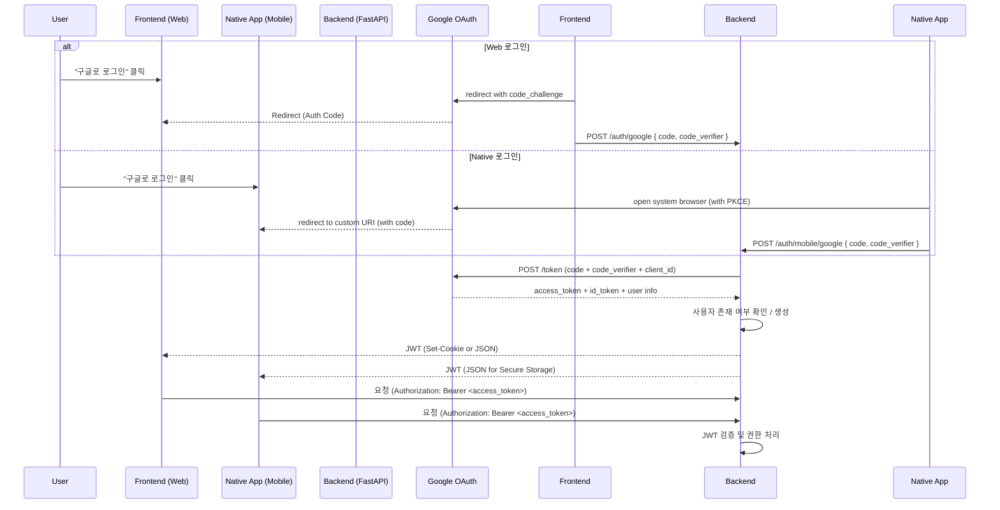
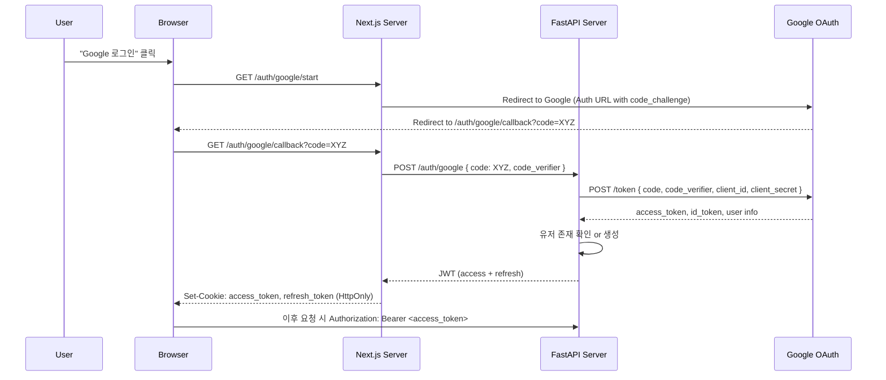
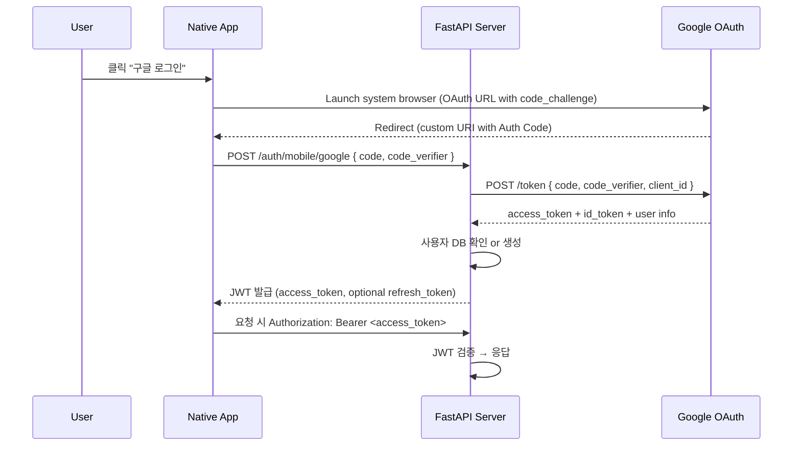

좋습니다. 아래는 요구하신 내용을 기반으로 구성한 **Markdown 문서**입니다:

---

# 🔐 Next.js (Frontend) + FastAPI (Backend) 인증 전략 문서

이 문서는 **ID/PW 인증 + Google OAuth2 인증 혼용** 시 **효율적인 인증 흐름**을
설명하며, **Mermaid 시퀀스 다이어그램**을 통해 전체 흐름과 **디바이스 유형별
최적의 로그인 UX 전략**을 정리합니다.

---

## 📌 시스템 구성

- **Frontend**: Next.js (App Router, SSR + CSR 혼용)
- **Backend**: FastAPI (OAuth2 / JWT 기반 인증 처리)
- **DB**: PostgreSQL (Users, Sessions, OAuth Accounts 테이블 구성)
- **Auth Provider**: Google OAuth 2.0
- **Token 방식**: JWT (Access + Refresh)

---

## 1️⃣ 공통 인증 로직 (ID/PW + Google 로그인 혼용)

### 🎯 목적

- 사용자에게 **다양한 인증 옵션** 제공
- **프론트/백 간 역할 명확 분리** (FastAPI는 인증 처리, Next.js는 UI 처리)

### ✅ 인증 시나리오

- 사용자는 로그인 페이지에서 ID/PW 또는 Google 로그인을 선택
- ID/PW는 FastAPI의 `/auth/login` 엔드포인트로 직접 전달
- Google 로그인은 Next.js에서 OAuth2 인증 플로우를 시작 → 백엔드로 auth code
  전달 → 토큰 발급

### 🔁 공통 시퀀스 다이어그램 (Mermaid)

---

## 2️⃣ 디바이스별 UX 최적화 전략

기기마다 인증 경험을 최적화하기 위해 **UI/UX와 인증 처리 전략을 분리
설계**합니다.

---

### 💻 MacOS / Windows (Desktop Browser)

**특징 & 전략**

- 팝업 또는 새 탭에서 Google 로그인 → 사용자 흐름 방해 최소화
- JWT는 **HttpOnly 쿠키**로 전달해 XSS 대응
- 로컬 스토리지 대신 쿠키 저장 권장

---

### 📱 모바일앱 (네이티브)

**특징 & 전략**

- iOS는 팝업 제한 → **리디렉션 기반 OAuth2 권장**
- **Universal Links or Deep Links** 사용 시 native 앱 연동 가능
- In-App Browser 제한 대응 위해 **Safari로 강제 리디렉션 고려**

---
