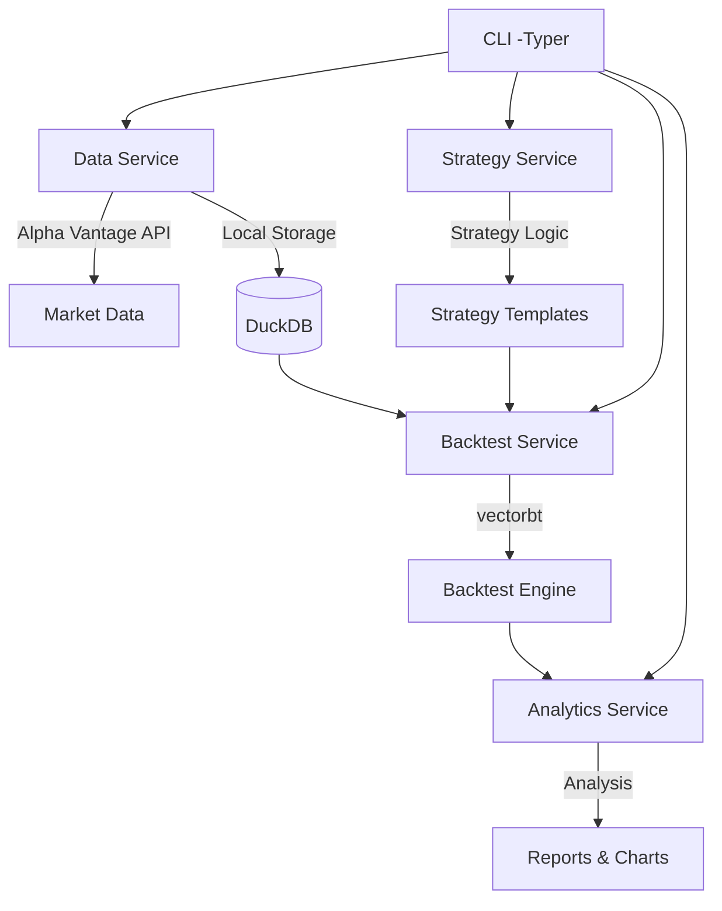

# Quant Backtest App (Alpha Vantage 기반)

단일 사용자용 **퀀트 전략 백테스트 앱**
실시간 트레이딩 없이 **전략 수립·검증**에 집중한 개인 퀀트 연구 도구

---

## 📌 핵심 기능

* **시장 데이터 수집**: Alpha Vantage API로 주식/ETF 시계열(OHLCV) 수집
* **데이터 캐싱**: DuckDB로 빠르고 안정적인 로컬 데이터 저장
* **전략 개발**: vectorbt 또는 backtrader 기반의 SMA, RSI, 모멘텀 등 전략 구현
* **백테스트 엔진**: 수수료, 슬리피지 반영 / 기간·자본금 설정 가능
* **성과 분석 & 리포트**: CAGR, Sharpe, Sortino, Max Drawdown 지표 및 시각화

---

## 🏗️ 아키텍처 개요



**마이크로서비스 구조**:
- **data-service**: Alpha Vantage API 연동 및 DuckDB 데이터 관리
- **strategy-service**: 전략 로직 및 파라미터 관리
- **backtest-service**: vectorbt 기반 백테스트 실행 엔진
- **analytics-service**: 성과 분석, 리포트, 시각화

---

## ⚡ 기술 스택

* **Python 3.12+**
* **UV** (패키지 관리)
* **vectorbt** 또는 **backtrader**
* **DuckDB** (시계열 DB)
* **Typer, Rich** (CLI)
* **ruff**, **mypy**, **pytest**

---

## 🚀 초기 설치 및 설정

### 1. 프로젝트 클론
```bash
git clone https://github.com/Br0therDan/quant.git
cd quant
```

### 2. UV를 통한 의존성 설치
```bash
# UV 설치 (없는 경우)
curl -LsSf https://astral.sh/uv/install.sh | sh

# 프로젝트 의존성 설치 (개발 의존성 포함)
uv sync --dev

# 개발 도구 설정
uv run pre-commit install
```

### 3. 환경 변수 설정
```bash
# .env 파일 생성 및 설정
cp .env.example .env

# Alpha Vantage API 키 설정 (https://www.alphavantage.co/support/#api-key)
# .env 파일에서 ALPHAVANTAGE_API_KEY 값을 실제 API 키로 변경
```

### 4. 데이터 디렉토리 생성
```bash
mkdir -p data logs
```

---

## ▶️ 사용 예시

```bash
# 데이터 수집
uv run quant data fetch --symbol AAPL --interval daily --period 2y

# 전략 생성 (템플릿 기반)
uv run quant strategy create --template sma_cross --symbol AAPL --params '{"fast": 10, "slow": 20}'

# 백테스트 실행
uv run quant backtest run --strategy my_sma_strategy --start 2022-01-01 --end 2023-12-31 --capital 100000

# 결과 리포트 생성
uv run quant report show --backtest-id bt_20240913_001 --format table
uv run quant report chart --backtest-id bt_20240913_001 --type equity_curve

# 전략 최적화 (Phase 4)
uv run quant optimize --strategy sma_cross --symbol AAPL --param-range '{"fast": [5,15], "slow": [20,30]}'
```

---

## 🔮 로드맵

* **단기**: 기본 전략 백테스트 완성 (Phase 1\~2)
* **중기**: 전략 자동 최적화, 다중 전략 포트폴리오 (Phase 3)
* **장기**: 실거래 API 연동 옵션 및 웹 대시보드 (Phase 4)

---

## 📝 라이선스

MIT License
