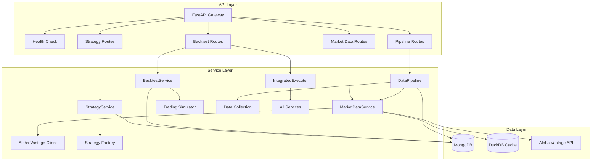
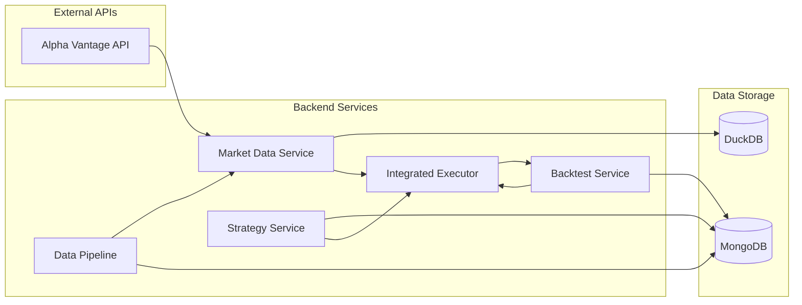
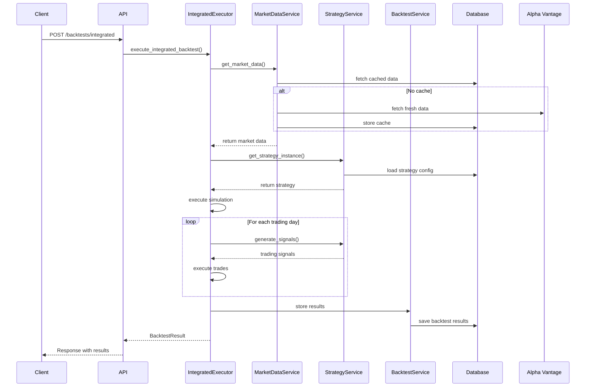
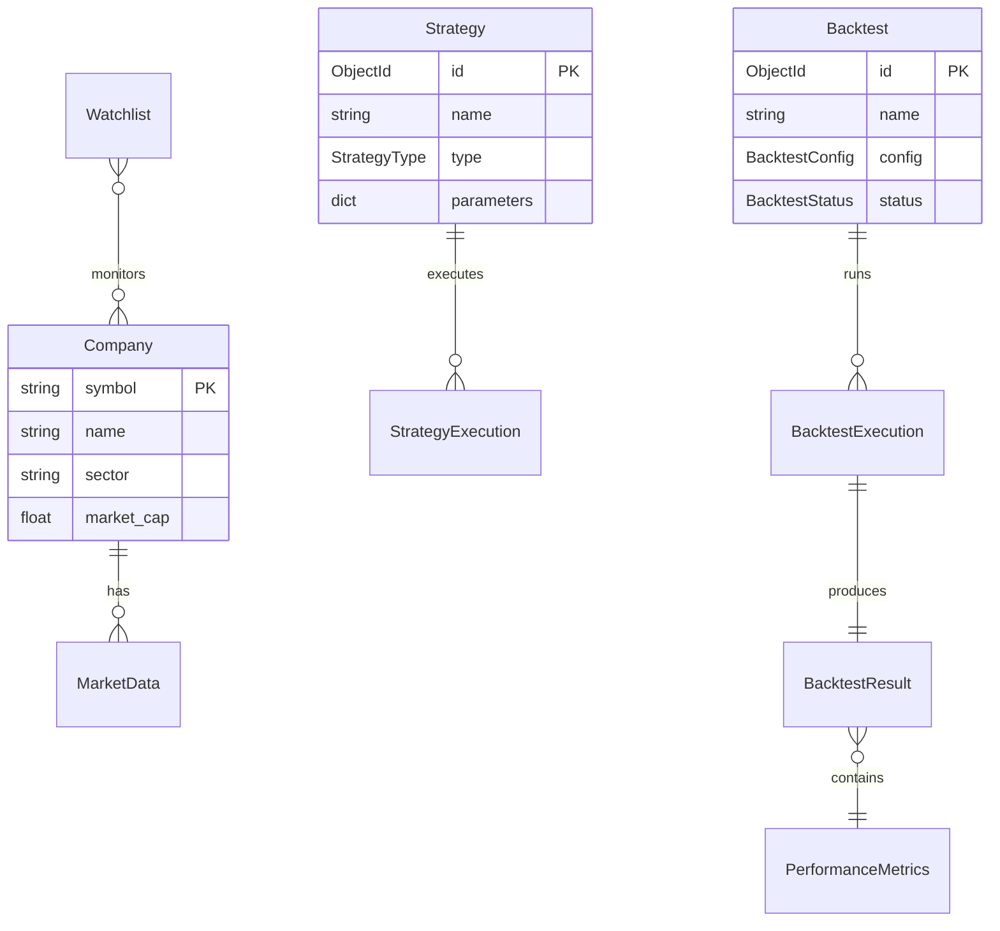

# 🎯 통합 퀀트 백테스트 플랫폼

Alpha Vantage 기반의 현대적인 마이크로서비스 아키텍처 퀀트 백테스트 플랫폼입니다. 데이터 수집, 전략 실행, 백테스트 분석, 포트폴리오 관리가 모두 통합된 엔터프라이즈급 백엔드 서비스입니다.

## 🏛️ **시스템 아키텍처**



## 🏗️ **프로젝트 구조**

```
quant/
├── backend/                    # 통합 백엔드 서비스 (FastAPI)
│   ├── app/
│   │   ├── api/               # FastAPI API Layer
│   │   │   └── routes/        # REST API 엔드포인트
│   │   │       ├── backtests.py      # 백테스트 API
│   │   │       ├── strategies.py     # 전략 관리 API
│   │   │       ├── market_data.py    # 시장 데이터 API
│   │   │       ├── pipeline.py       # 데이터 파이프라인 API
│   │   │       ├── companies.py      # 회사 정보 API
│   │   │       ├── watchlists.py     # 워치리스트 API
│   │   │       ├── templates.py      # 전략 템플릿 API
│   │   │       ├── status.py         # 상태 API
│   │   │       └── health.py         # 헬스 체크 API
│   │   ├── models/            # 데이터 모델 (Beanie ODM)
│   │   ├── schemas/           # API 스키마 (Pydantic)
│   │   ├── services/          # 비즈니스 로직 Layer
│   │   ├── strategies/        # 전략 구현체
│   │   ├── core/              # 핵심 설정
│   │   ├── utils/             # 유틸리티
│   │   └── main.py            # FastAPI 앱 진입점
│   ├── tests/                 # 백엔드 통합 테스트
│   └── pyproject.toml         # 백엔드 의존성
├── frontend/                   # Next.js 프론트엔드
│   ├── src/
│   │   ├── app/               # Next.js App Router
│   │   └── client/            # API 클라이언트
│   ├── public/                # 정적 파일
│   ├── package.json           # Frontend 의존성
│   └── tsconfig.json          # TypeScript 설정
├── services/                   # 마이크로서비스 모듈
│   ├── data_service/          # Alpha Vantage API, DuckDB
│   ├── strategy_service/      # 전략 로직 및 파라미터 관리
│   ├── backtest_service/      # vectorbt 백테스트 실행
│   └── analytics_service/     # 성과 분석 및 리포트
├── shared/                     # 공통 모듈
│   ├── cli/                   # CLI 도구
│   ├── config/                # 설정 관리
│   ├── models/                # 공유 데이터 모델
│   └── utils/                 # 공통 유틸리티
├── tests/                      # 전체 통합 테스트
├── docs/                       # 문서 & 전략 템플릿
├── scripts/                    # 개발/배포 스크립트
├── data/                       # DuckDB 데이터 파일
├── docker-compose.yml          # Docker 컨테이너 설정
├── run_server.py              # 서버 실행 스크립트
├── package.json               # 워크스페이스 설정 (pnpm)
└── pyproject.toml             # 프로젝트 설정 (UV)
```

## 📊 **핵심 기능**

### 🎯 **마이크로서비스 아키텍처**
- **MarketDataService**: Alpha Vantage API를 통한 실시간 시장 데이터 수집 및 캐싱
- **StrategyService**: 퀀트 전략 구현, 신호 생성, 성과 추적 및 관리
- **BacktestService**: 백테스트 실행, 거래 시뮬레이션, 성과 분석
- **DataPipeline**: 데이터 수집 자동화, 워치리스트 관리, 회사 정보 저장
- **IntegratedExecutor**: 모든 서비스를 연동한 원스톱 백테스트 실행

### 🧠 **지원 전략**
- **Buy & Hold**: 매수 후 보유 전략 (장기 투자)
- **SMA Crossover**: 단순이동평균선 교차 전략 (트렌드 추종)
- **RSI Mean Reversion**: RSI 기반 평균 회귀 전략 (역추세)
- **Momentum**: 모멘텀 기반 전략 (추세 연장)
- **Custom Strategies**: 사용자 정의 전략 지원

### 🚀 **백테스트 엔진**
- **실시간 데이터**: Alpha Vantage API 실시간 데이터 수집 및 검증
- **거래 시뮬레이션**: 수수료, 슬리피지 포함한 리얼리스틱 시뮬레이션
- **성과 분석**: 20+ 성과 지표 자동 계산 (샤프 비율, 최대 낙폭, VaR 등)
- **리스크 관리**: 포지션 크기, 리밸런싱 주기 등 위험 관리 기능

### 📈 **데이터 관리**
- **멀티 데이터베이스**: MongoDB (메타데이터) + DuckDB (시계열 캐시)
- **자동 데이터 수집**: 워치리스트 기반 자동 데이터 업데이트
- **데이터 품질**: 결측치 보간, 스플릿/배당 조정, 데이터 검증

## 🚀 **빠른 시작**

### 1. 환경 설정
```bash
# 저장소 클론
git clone <repository-url>
cd quant

# UV를 사용한 의존성 설치
uv sync

# 환경 변수 설정
cp .env.example .env
# .env 파일에서 ALPHA_VANTAGE_API_KEY 설정
```

### 2. 서버 실행
```bash
# 간단한 실행 (권장)
python run_server.py

# 또는 직접 실행
cd backend
uvicorn app.main:app --reload --port 8000

# Docker를 사용한 전체 스택 실행
pnpm run:docker
```

### 3. API 접속
- **백엔드 서버**: http://localhost:8000
- **프론트엔드**: http://localhost:3000 (개발 시)
- **API 문서**: http://localhost:8000/docs
- **서비스 테스트**: http://localhost:8000/api/v1/integrated/test-services

## 🔄 **서비스 연동 관계**

### **상위 레벨 아키텍처**


### **서비스별 의존성 매트릭스**

| 서비스 | Market Data | Strategy | Backtest | Pipeline | Database |
|--------|-------------|----------|----------|----------|----------|
| **MarketDataService** | - | ❌ | ❌ | ⬅️ Called by | MongoDB, DuckDB |
| **StrategyService** | ❌ | - | ❌ | ❌ | MongoDB |
| **BacktestService** | ❌ | ❌ | - | ❌ | MongoDB |
| **DataPipeline** | ✅ Uses | ❌ | ❌ | - | MongoDB |
| **IntegratedExecutor** | ✅ Uses | ✅ Uses | ✅ Uses | ❌ | All |

### **데이터 플로우 다이어그램**


## 🔧 **API 워크플로우**

### 📋 **1단계: 데이터 파이프라인 설정**

```bash
# 기본 워치리스트 설정
POST /api/v1/pipeline/setup-defaults

# 사용자 정의 워치리스트 생성
POST /api/v1/pipeline/watchlists
{
  "name": "my_portfolio",
  "symbols": ["AAPL", "MSFT", "GOOGL"],
  "description": "Tech portfolio watchlist"
}

# 데이터 수집 실행
POST /api/v1/pipeline/update
{
  "symbols": ["AAPL", "MSFT", "GOOGL"]
}
```

### 🧠 **2단계: 전략 생성 및 관리**

```bash
# 전략 템플릿 조회
GET /api/v1/strategies/templates

# 전략 생성
POST /api/v1/strategies
{
  "name": "AAPL SMA Strategy",
  "strategy_type": "SMA_CROSSOVER",
  "parameters": {
    "short_window": 20,
    "long_window": 50
  },
  "symbols": ["AAPL"]
}

# 전략 백테스트
POST /api/v1/strategies/{strategy_id}/backtest
```

### 🚀 **3단계: 통합 백테스트 실행**

```bash
# 원스톱 통합 백테스트
POST /api/v1/backtests/
Content-Type: application/json

{
  "name": "AAPL SMA Crossover Test",
  "description": "Testing SMA crossover on AAPL",
  "symbols": ["AAPL"],
  "start_date": "2023-01-01T00:00:00",
  "end_date": "2023-12-31T23:59:59",
  "strategy_type": "SMA_CROSSOVER",
  "strategy_params": {
    "short_window": 20,
    "long_window": 50
  },
  "initial_capital": 100000.0
}

# Response:
{
  "backtest_id": "60f7b1b3c4567890abcdef12",
  "execution_id": "exec_1234567890_60f7b1b3c4567890abcdef12",
  "result_id": "result_1234567890",
  "status": "COMPLETED",
  "message": "Integrated backtest completed successfully",
  "performance": {
    "total_return": 0.15,
    "annualized_return": 0.12,
    "volatility": 0.18,
    "sharpe_ratio": 0.67,
    "max_drawdown": 0.08,
    "total_trades": 24,
    "winning_trades": 15,
    "losing_trades": 9,
    "win_rate": 0.625
  },
  "start_time": "2024-01-01T09:30:00",
  "end_time": "2024-01-01T09:32:15"
}
```

### 📊 **4단계: 결과 분석 및 조회**

```bash
# 백테스트 결과 조회
GET /api/v1/backtests/{backtest_id}

# 실행 이력 조회
GET /api/v1/backtests/{backtest_id}/executions

# 모든 결과 조회
GET /api/v1/backtests/results/?backtest_id={backtest_id}

# 회사 정보 조회
GET /api/v1/pipeline/company/AAPL

# 데이터 커버리지 확인
GET /api/v1/pipeline/coverage/AAPL
```

### 🔍 **5단계: 시스템 모니터링**

```bash
# 헬스 체크
GET /api/v1/health

# 서비스 통합 테스트
GET /api/v1/backtests/test-services

# 파이프라인 상태 확인
GET /api/v1/pipeline/status
```

## 🛠️ **개발 환경**

### **기술 스택**

| 레이어 | 기술 | 용도 |
|--------|------|------|
| **Frontend** | Next.js 15+ (React 19) | 웹 애플리케이션 프론트엔드 |
| **UI** | Material-UI (MUI) | React 컴포넌트 라이브러리 |
| **API** | FastAPI 0.104+ | REST API, 자동 문서화, 비동기 처리 |
| **ORM/ODM** | Beanie 1.21+ | MongoDB ODM, Pydantic 기반 |
| **Database** | MongoDB 7.0+ | 메타데이터, 전략, 결과 저장 |
| **Cache** | DuckDB 0.6+ | 시계열 데이터 고속 캐시 |
| **Data** | Alpha Vantage API | 실시간 시장 데이터 |
| **Analysis** | pandas, numpy, vectorbt | 데이터 분석 및 백테스트 |
| **Package** | UV (Python), pnpm (Node.js) | 고속 패키지 관리 |
| **Container** | Docker Compose | 개발/배포 환경 통합 |
| **Runtime** | Python 3.12+, Node.js 20+ | 최신 타입 힌트, 성능 개선 |

### **개발 워크플로우**

```bash
# 전체 워크스페이스 설정
uv sync --dev                          # Python 의존성
pnpm install                          # Node.js 의존성

# 코드 품질 도구
## Backend (Python)
uv run ruff format backend/           # 코드 포맷팅
uv run ruff check backend/            # 린팅
uv run mypy backend/app/              # 타입 체크

## Frontend (TypeScript)
pnpm lint                             # Biome 린팅
pnpm format                          # 코드 포맷팅

# 테스트 실행
uv run pytest backend/tests/          # 백엔드 테스트
uv run pytest --cov=backend/app/      # 커버리지 포함
pnpm test                             # 프론트엔드 테스트

# 개발 서버 실행
python run_server.py                  # 백엔드만
pnpm run:dev:backend                  # 백엔드만
pnpm run:dev:frontend                 # 프론트엔드만
pnpm run:dev                          # 풀스택 개발

# 프로덕션 빌드
pnpm build                            # 프론트엔드 빌드
docker-compose up --build             # Docker 빌드

# 데이터베이스 관리
mongosh                               # MongoDB 콘솔
docker-compose logs q-mongodb         # MongoDB 로그
```

### **CI/CD 파이프라인**

```yaml
# .github/workflows/ci.yml 예시
name: CI/CD
on: [push, pull_request]
jobs:
  test:
    runs-on: ubuntu-latest
    steps:
      - uses: actions/checkout@v4
      - uses: astral-sh/setup-uv@v2
      - run: uv sync
      - run: uv run ruff check
      - run: uv run mypy backend/app
      - run: uv run pytest --cov=80%
```

## 📈 **성과 지표 & 분석**

### **핵심 성과 지표**
| 지표 | 설명 | 계산식 |
|------|------|--------|
| **총 수익률** | 전체 기간 수익률 | (최종가치 - 초기자본) / 초기자본 |
| **연환산 수익률** | 연간 환산 수익률 | (1 + 총수익률)^(365/일수) - 1 |
| **변동성** | 수익률 표준편차 | std(일일수익률) × √252 |
| **샤프 비율** | 위험 대비 수익률 | 연환산수익률 / 변동성 |
| **최대 낙폭** | 최고점 대비 최대 하락폭 | max((고점 - 저점) / 고점) |

### **거래 성과 지표**
| 지표 | 설명 | 범위 |
|------|------|------|
| **총 거래 수** | 실행된 전체 거래 횟수 | 0+ |
| **승률** | 수익 거래 비율 | 0-1 |
| **승리/패배 거래 수** | 수익/손실 거래 개수 | 0+ |

### **고급 리스크 지표**
- **VaR (95%, 99%)**: Value at Risk - 최대 예상 손실
- **칼마 비율**: 연환산수익률 / 최대낙폭
- **소르티노 비율**: 하방 위험만 고려한 샤프 비율
- **알파/베타**: 시장 대비 초과 수익 및 민감도

## 🔐 **환경 설정**

### **필수 환경 변수**
```bash
# .env 파일 설정
ALPHA_VANTAGE_API_KEY=your_api_key_here        # Alpha Vantage API 키
MONGODB_URL=mongodb://localhost:27017/quant    # MongoDB 연결 URL
DUCKDB_PATH=./data/quant.db                   # DuckDB 파일 경로
SERVICE_NAME=quant-backend                    # 서비스 명
LOG_LEVEL=INFO                               # 로그 레벨
ENVIRONMENT=development                       # 환경 (dev/prod)

# 선택적 설정
REDIS_URL=redis://localhost:6379              # Redis (캐시용, 선택)
SENTRY_DSN=https://...                       # Sentry (에러 트래킹, 선택)
```

### **API 키 및 보안**
- **Alpha Vantage**: 무료 계정 (5 calls/min, 500/day) 또는 프리미엄
- **Rate Limiting**: 자동 재시도, 지수 백오프 구현
- **API 보안**: API 키 로테이션, 환경별 분리 관리
- **데이터 보안**: MongoDB 인증, SSL/TLS 연결

### **서비스 상태 점검**

```bash
# 전체 시스템 헬스 체크
curl http://localhost:8501/api/v1/health

# 서비스별 연동성 확인
curl http://localhost:8501/api/v1/backtests/test-services

# 데이터베이스 연결 확인
curl http://localhost:8501/api/v1/pipeline/status

# Alpha Vantage API 연결 확인
curl http://localhost:8501/api/v1/market-data/symbols
```

## 🚨 **트러블슈팅**

### **자주 발생하는 문제**

| 문제 | 원인 | 해결법 |
|------|------|--------|
| **API 키 오류** | Alpha Vantage 키 누락 | `.env` 파일 확인 |
| **DB 연결 실패** | MongoDB 미실행 | `mongod` 서비스 시작 |
| **Rate Limit** | API 호출 과다 | 요청 간격 조정 |
| **메모리 부족** | 대용량 데이터 처리 | 청크 단위 처리로 변경 |
| **포트 충돌** | 8501 포트 사용 중 | 다른 포트 사용 또는 프로세스 종료 |

## 📝 **라이센스**

MIT License - 자세한 내용은 [LICENSE](LICENSE) 파일을 참조하세요.


## ✅ **서비스 연동성 검증**

### **의존성 매트릭스 (최종 확인됨)**

| 서비스 | 의존하는 서비스 | 사용되는 곳 | 상태 |
|--------|----------------|-------------|------|
| **ServiceFactory** | - | 모든 API 엔드포인트 | ✅ 정상 |
| **MarketDataService** | Alpha Vantage API | DataPipeline, IntegratedExecutor | ✅ 정상 |
| **StrategyService** | MongoDB | IntegratedExecutor, Strategy API | ✅ 정상 |
| **BacktestService** | MarketData + Strategy | Backtest API, IntegratedExecutor | ✅ 정상 |
| **DataPipeline** | MarketDataService, MongoDB | Pipeline API | ✅ 정상 |
| **IntegratedExecutor** | 모든 서비스 | Integrated Backtest API | ✅ 정상 |

### **API 엔드포인트 현황**

| 라우터 | 엔드포인트 수 | 주요 기능 | 연동 서비스 |
|--------|---------------|-----------|-------------|
| `/health` | 1 | 시스템 상태 체크 | - |
| `/status` | 3 | 서비스 상태 확인 | All Services |
| `/market-data` | 6 | 시장 데이터 관리 | MarketDataService |
| `/strategies` | 8 | 전략 관리 | StrategyService |
| `/backtests` | 10 | 백테스트 실행 | BacktestService |
| `/pipeline` | 8 | 데이터 파이프라인 | DataPipeline |
| `/companies` | 4 | 회사 정보 관리 | MarketDataService |
| `/watchlists` | 6 | 워치리스트 관리 | DataPipeline |
| `/templates` | 3 | 전략 템플릿 | StrategyService |

### **데이터 모델 관계**



---

## 📝 라이센스

MIT License
