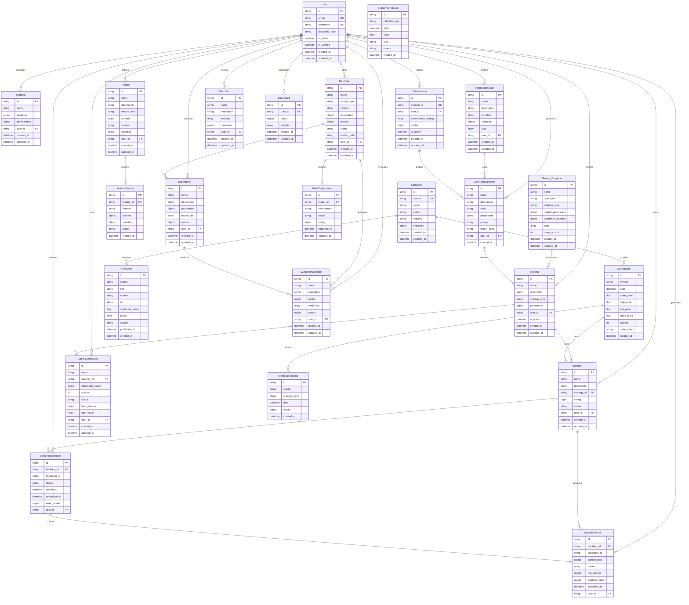
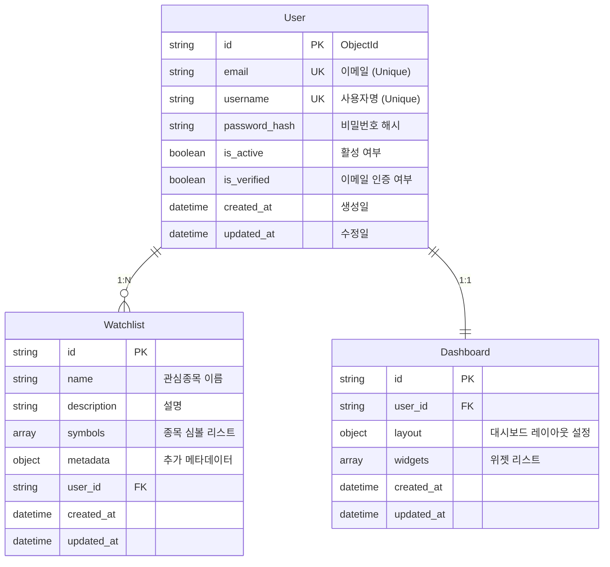
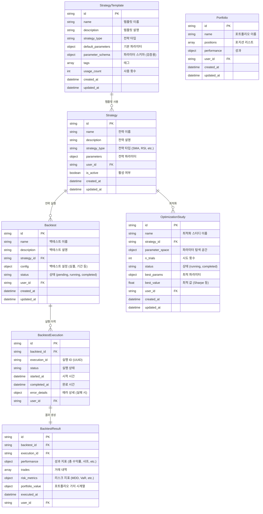
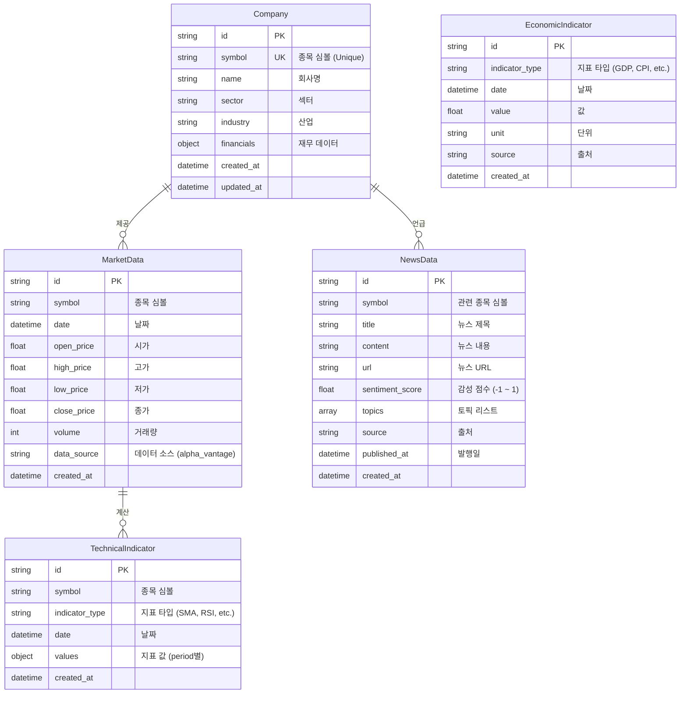
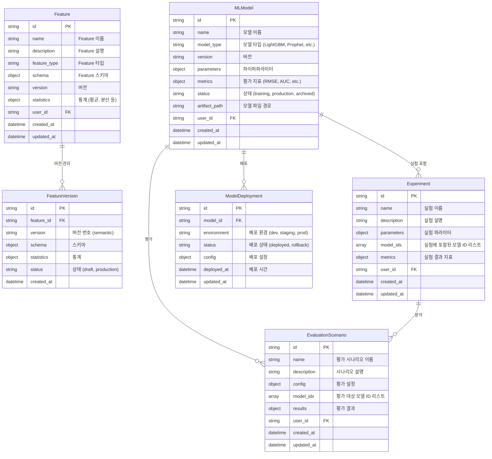
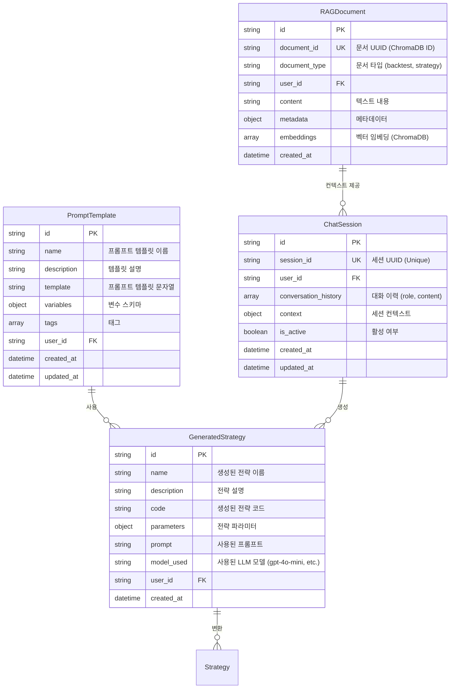

# Database Entity Relationship Diagram (ERD)

**업데이트**: 2025년 10월 15일  
**버전**: Phase 4 완료 (AI/ML 통합)

---

## 📋 목차

1. [개요](#-개요)
2. [전체 ERD](#-전체-erd)
3. [도메인별 상세 ERD](#-도메인별-상세-erd)
4. [주요 테이블 설명](#-주요-테이블-설명)
5. [인덱스 전략](#-인덱스-전략)

---

## 📊 개요

### 데이터베이스 구성

- **MongoDB**: 메타데이터, 사용자 데이터, 설정 (비동기)
- **DuckDB**: 시계열 데이터 고성능 캐시 (동기)
- **ChromaDB**: 벡터 데이터베이스 (GenAI RAG, 선택적)

### 주요 도메인

1. **User Domain**: 사용자, 인증, 권한
2. **Trading Domain**: 전략, 백테스트, 최적화
3. **Market Data Domain**: 주식, 재무, 경제 지표, 뉴스
4. **ML Platform Domain**: Feature, Model, Experiment, Evaluation
5. **GenAI Domain**: Chat Session, Prompt, Strategy Generation

---

## 🗺️ 전체 ERD



---

## 🎯 도메인별 상세 ERD

### 1. User Domain



### 2. Trading Domain



### 3. Market Data Domain



### 4. ML Platform Domain



### 5. GenAI Domain



---

## 📝 주요 테이블 설명

### User

**목적**: 사용자 인증 및 권한 관리

**주요 필드**:

- `email`: 로그인 ID (Unique Index)
- `is_verified`: 이메일 인증 여부 (회원가입 시 false)
- `is_active`: 계정 활성 여부 (탈퇴 시 false)

**인덱스**:

- Primary: `id`
- Unique: `email`, `username`

### Strategy

**목적**: 사용자 정의 거래 전략

**주요 필드**:

- `strategy_type`: 전략 타입 (SMA_CROSSOVER, RSI_MEAN_REVERSION, etc.)
- `parameters`: 전략별 파라미터 (JSON)
  ```json
  {
    "short_window": 20,
    "long_window": 50,
    "rsi_period": 14,
    "oversold": 30,
    "overbought": 70
  }
  ```

**인덱스**:

- Primary: `id`
- Composite: `(user_id, strategy_type)`
- Composite: `(user_id, is_active)`

### Backtest

**목적**: 백테스트 설정 및 메타데이터

**주요 필드**:

- `config`: 백테스트 설정
  ```json
  {
    "symbols": ["AAPL", "MSFT"],
    "start_date": "2020-01-01",
    "end_date": "2023-12-31",
    "initial_capital": 100000,
    "commission": 0.001
  }
  ```
- `status`: `pending` | `running` | `completed` | `failed`

**인덱스**:

- Primary: `id`
- Composite: `(user_id, status)`
- Composite: `(strategy_id, created_at)`

### BacktestResult

**목적**: 백테스트 실행 결과

**주요 필드**:

- `performance`: 성과 지표
  ```json
  {
    "total_return": 0.35,
    "sharpe_ratio": 1.8,
    "max_drawdown": -0.15,
    "win_rate": 0.62,
    "total_trades": 150
  }
  ```
- `trades`: 거래 내역 배열
  ```json
  [
    {
      "date": "2020-03-15",
      "symbol": "AAPL",
      "action": "BUY",
      "quantity": 10,
      "price": 250.5,
      "commission": 2.5
    }
  ]
  ```

**인덱스**:

- Primary: `id`
- Composite: `(backtest_id, executed_at)`
- Composite: `(user_id, executed_at)`

### OptimizationStudy

**목적**: Optuna 기반 하이퍼파라미터 최적화

**주요 필드**:

- `parameter_space`: 파라미터 탐색 공간
  ```json
  {
    "short_window": { "type": "int", "low": 5, "high": 50 },
    "long_window": { "type": "int", "low": 20, "high": 200 },
    "rsi_period": { "type": "int", "low": 7, "high": 21 }
  }
  ```
- `best_params`: 최적 파라미터
- `best_value`: 최적 값 (Sharpe Ratio 등)

**인덱스**:

- Primary: `id`
- Composite: `(strategy_id, status)`
- Composite: `(user_id, created_at)`

### MLModel

**목적**: 머신러닝 모델 메타데이터 및 버전 관리

**주요 필드**:

- `model_type`: `LightGBM` | `CatBoost` | `Prophet` | `LSTM`
- `metrics`: 평가 지표
  ```json
  {
    "rmse": 0.05,
    "mae": 0.03,
    "r2": 0.85,
    "auc": 0.92
  }
  ```
- `artifact_path`: 모델 파일 경로 (S3, local, etc.)

**인덱스**:

- Primary: `id`
- Composite: `(model_type, status)`
- Composite: `(user_id, created_at)`

### ChatSession

**목적**: GenAI 대화 세션 관리

**주요 필드**:

- `conversation_history`: 대화 이력
  ````json
  [
    {
      "role": "user",
      "content": "RSI 전략 만들어줘",
      "timestamp": "2025-10-15T10:00:00Z"
    },
    {
      "role": "assistant",
      "content": "RSI 전략 코드:\n```python\n...",
      "timestamp": "2025-10-15T10:00:05Z"
    }
  ]
  ````
- `context`: 세션 컨텍스트 (이전 백테스트 결과 등)

**인덱스**:

- Primary: `id`
- Unique: `session_id`
- Composite: `(user_id, is_active)`

### RAGDocument

**목적**: RAG용 벡터 문서 (ChromaDB 메타데이터)

**주요 필드**:

- `document_type`: `backtest` | `strategy` | `market_insight`
- `content`: 텍스트 내용 (벡터화 대상)
- `embeddings`: ChromaDB에 저장된 벡터 (참조용)
- `metadata`: 문서 메타데이터
  ```json
  {
    "backtest_id": "...",
    "total_return": 0.35,
    "sharpe_ratio": 1.8,
    "strategy_name": "RSI Mean Reversion"
  }
  ```

**인덱스**:

- Primary: `id`
- Unique: `document_id`
- Composite: `(user_id, document_type)`

---

## 🔍 인덱스 전략

### MongoDB 인덱스

#### User Collection

```javascript
// Unique Indexes
db.users.createIndex({ email: 1 }, { unique: true });
db.users.createIndex({ username: 1 }, { unique: true });

// Compound Index
db.users.createIndex({ is_active: 1, created_at: -1 });
```

#### Strategy Collection

```javascript
// Compound Indexes
db.strategies.createIndex({ user_id: 1, strategy_type: 1 });
db.strategies.createIndex({ user_id: 1, is_active: 1 });
db.strategies.createIndex({ strategy_type: 1, created_at: -1 });
```

#### Backtest Collection

```javascript
// Compound Indexes
db.backtests.createIndex({ user_id: 1, status: 1 });
db.backtests.createIndex({ strategy_id: 1, created_at: -1 });
db.backtests.createIndex({ user_id: 1, created_at: -1 });
```

#### BacktestResult Collection

```javascript
// Compound Indexes
db.backtest_results.createIndex({ backtest_id: 1, executed_at: -1 });
db.backtest_results.createIndex({ user_id: 1, executed_at: -1 });
db.backtest_results.createIndex({ execution_id: 1 }, { unique: true });
```

#### ChatSession Collection

```javascript
// Unique Index
db.chat_sessions.createIndex({ session_id: 1 }, { unique: true });

// Compound Indexes
db.chat_sessions.createIndex({ user_id: 1, is_active: 1 });
db.chat_sessions.createIndex({ user_id: 1, updated_at: -1 });
```

### DuckDB 인덱스

#### market_data 테이블

```sql
-- Primary Index
CREATE UNIQUE INDEX idx_market_data_pk ON market_data (symbol, date);

-- Query Optimization
CREATE INDEX idx_market_data_symbol_date ON market_data (symbol, date DESC);
CREATE INDEX idx_market_data_date ON market_data (date);
```

#### technical_indicators 테이블

```sql
-- Compound Index
CREATE INDEX idx_tech_indicators ON technical_indicators (symbol, indicator_type, date DESC);
```

### ChromaDB 컬렉션

#### user_backtests

**메타데이터 필터링**:

```python
collection.query(
    query_texts=["RSI 전략"],
    where={"user_id": "user123"},  # 사용자 필터
    n_results=5
)
```

#### user_strategies

**메타데이터 필터링**:

```python
collection.query(
    query_texts=["모멘텀 전략"],
    where={"strategy_type": "MOMENTUM"},  # 전략 타입 필터
    n_results=3
)
```

---

## 📈 성능 최적화 권장사항

### 1. MongoDB

- **TTL 인덱스**: BacktestExecution (실패한 실행은 30일 후 자동 삭제)

  ```javascript
  db.backtest_executions.createIndex(
    { completed_at: 1 },
    {
      expireAfterSeconds: 2592000,
      partialFilterExpression: { status: "failed" },
    }
  );
  ```

- **부분 인덱스**: 활성 전략만 인덱싱
  ```javascript
  db.strategies.createIndex(
    { user_id: 1, created_at: -1 },
    { partialFilterExpression: { is_active: true } }
  );
  ```

### 2. DuckDB

- **Parquet 저장**: 대용량 시계열 데이터

  ```sql
  COPY market_data TO 'market_data.parquet' (FORMAT PARQUET, COMPRESSION ZSTD);
  ```

- **파티셔닝**: 연도별 파티션
  ```sql
  CREATE TABLE market_data_2023 AS SELECT * FROM market_data WHERE YEAR(date) = 2023;
  ```

### 3. ChromaDB

- **배치 인덱싱**: 대량 문서 인덱싱 시

  ```python
  collection.add(
      documents=batch_documents,  # 100개씩 배치
      metadatas=batch_metadatas,
      ids=batch_ids
  )
  ```

- **임베딩 캐싱**: 동일 문서 재인덱싱 방지

---

## 🔗 관련 문서

- [Backend README](./README.md)
- [API Structure](../docs/backend/API_STRUCTURE.md)
- [GenAI OpenAI Client Design](../docs/backend/GENAI_OPENAI_CLIENT_DESIGN.md)

---

**마지막 업데이트**: 2025년 10월 15일  
**담당**: Backend Team
