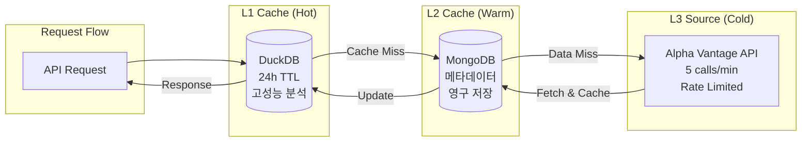
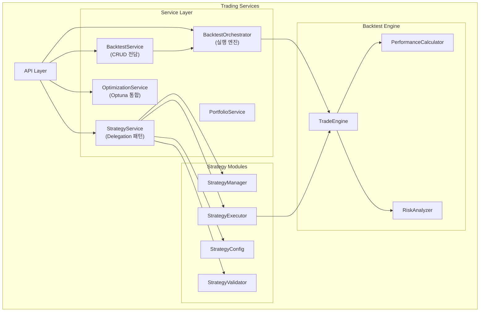
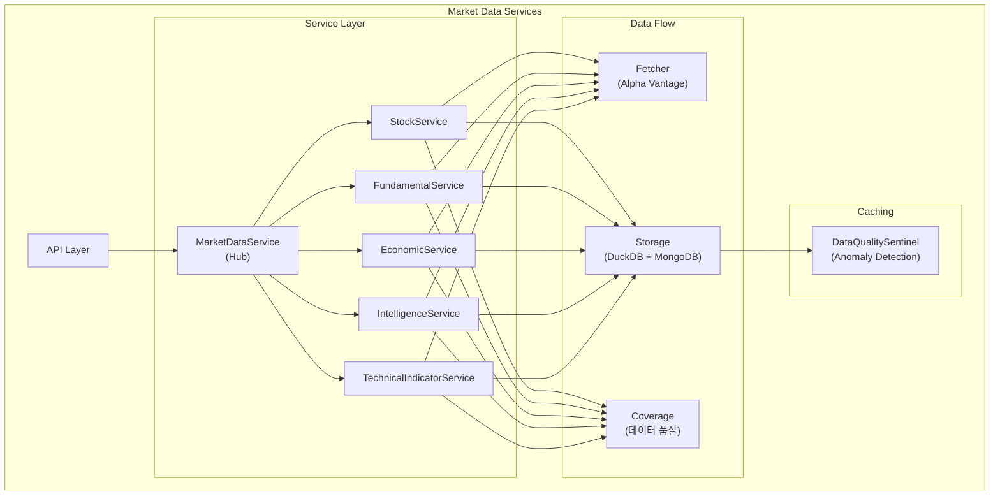
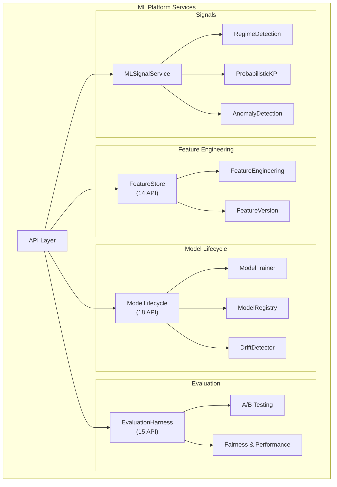
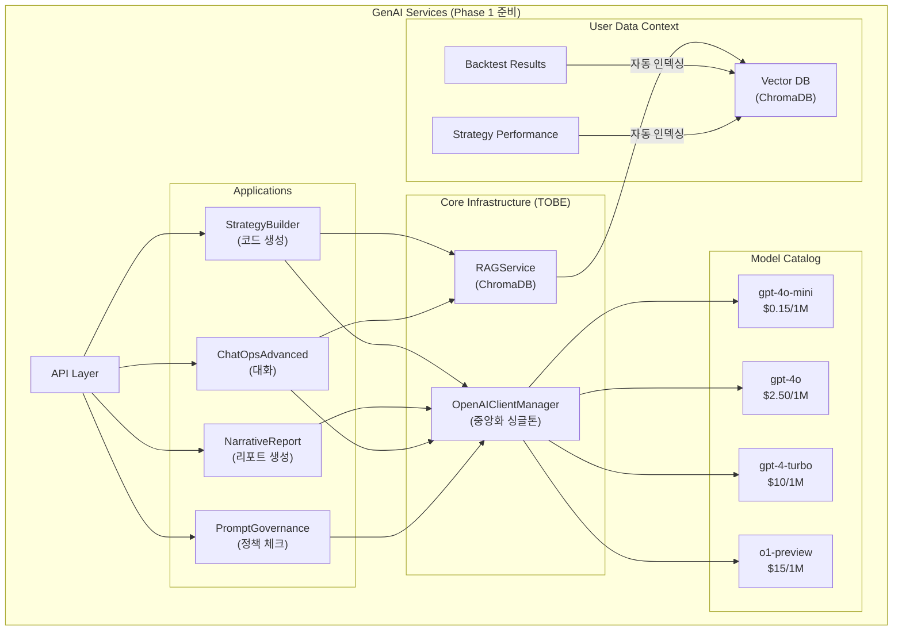
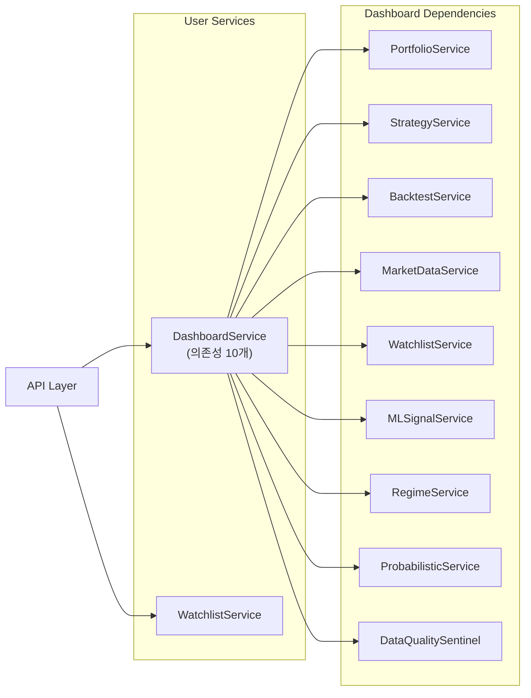
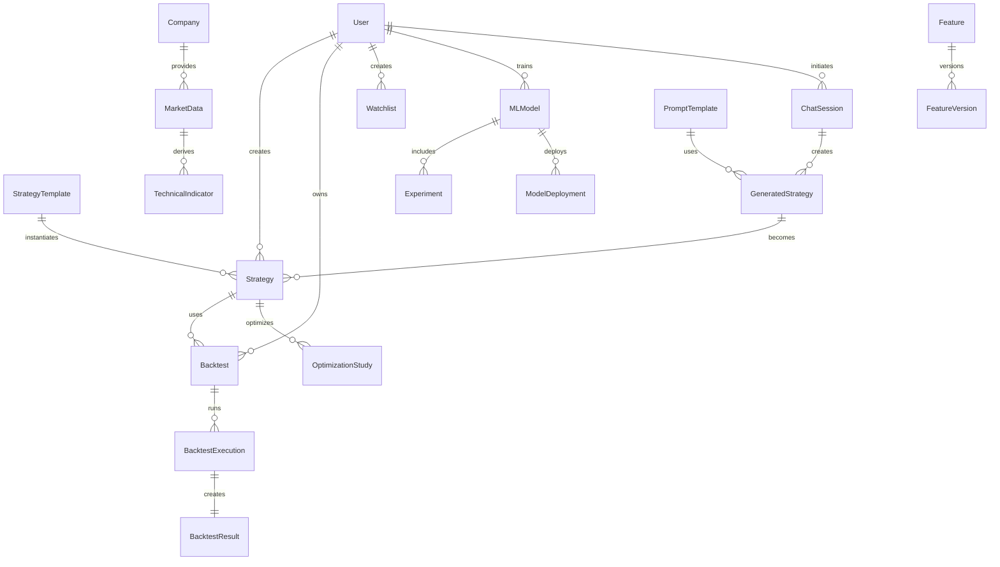

# Quant Backtest Platform - Backend

**업데이트**: 2025년 10월 15일  
**버전**: Phase 2 완료 + GenAI Phase 1 준비 완료

퀀트 백테스트 플랫폼의 FastAPI 백엔드 서버입니다.

---

## 📋 목차

1. [아키텍처 개요](#-아키텍처-개요)
2. [도메인별 아키텍처](#-도메인별-아키텍처)
3. [데이터베이스 ERD](#-데이터베이스-erd)
4. [디렉토리 구조](#-디렉토리-구조)
5. [API 엔드포인트 명세](#-api-엔드포인트-명세)
6. [주요 기능](#-주요-기능)
7. [실행 방법](#-실행-방법)
8. [최근 개선사항](#-최근-개선사항)

---

## 🏗️ 아키텍처 개요

### 전체 시스템 구조

```mermaid
graph TB
    subgraph "External APIs"
        AV[Alpha Vantage API]
        LLM[LLM APIs<br/>OpenAI GPT-4]
    end

    subgraph "Storage Layer"
        MONGO[(MongoDB<br/>메타데이터)]
        DUCK[(DuckDB<br/>시계열 + 피처)]
        REGISTRY[(Model Registry<br/>✅ 완료)]
        CHROMA[(ChromaDB<br/>⚪ Phase 2)]
    end

    subgraph "Service Layer"
        SF[ServiceFactory<br/>✅ 싱글톤]
        MDS[MarketDataService<br/>✅ 3-Layer Cache]
        SS[StrategyService<br/>✅ 완료]
        BS[BacktestService<br/>✅ 완료]
        DM[DatabaseManager<br/>✅ DuckDB 통합]
    end

    subgraph "ML Services ✅ 완료"
        MLS[MLSignalService<br/>✅ LightGBM]
        FE[FeatureEngineer<br/>✅ 22개 지표]
        MT[MLModelTrainer<br/>✅ 90.6% 정확도]
        MR[ModelRegistry<br/>✅ 버전 관리]
    end

    subgraph "AI Services ✅ 완료"
        RD[RegimeDetector<br/>✅ HMM]
        AD[AnomalyDetector<br/>✅ Isolation Forest]
        PF[PortfolioForecast<br/>✅ Gaussian]
        OPT[Optimizer<br/>✅ Optuna]
    end

    subgraph "Generative AI ✅ 완료"
        RG[ReportGenerator<br/>✅ 내러티브]
        SB[StrategyBuilder<br/>✅ 대화형]
        CO[ChatOps<br/>✅ 기본]
        COA[ChatOpsAdvanced<br/>✅ 멀티턴]
    end

    subgraph "GenAI Core ⚪ Phase 1-2"
        OAI[OpenAIClientManager<br/>⚪ 모델 카탈로그]
        RAG[RAGService<br/>⚪ ChromaDB]
    end

    subgraph "MLOps Platform ✅ 완료"
        FS[FeatureStore<br/>✅ 레지스트리]
        LC[ModelLifecycle<br/>✅ MLflow]
        EV[EvaluationHarness<br/>✅ 평가]
        PG[PromptGovernance<br/>✅ 승인]
    end

    subgraph "API Layer"
        API[FastAPI Routes<br/>✅ 완료]
        MLAPI[ML API<br/>✅ 5개]
        AIAPI[AI API<br/>✅ 8개]
    end

    subgraph "Backtest Components ✅ 완료"
        ORCH[Orchestrator<br/>✅ 병렬]
        EXEC[Executor<br/>✅ 실행]
        TE[TradeEngine<br/>✅ 시뮬레이션]
        PA[PerformanceAnalyzer<br/>✅ 메트릭]
        DP[DataProcessor<br/>✅ 전처리]
        CB[CircuitBreaker<br/>✅ 보호]
    end

    API --> SF
    MLAPI --> SF
    AIAPI --> SF
    SF --> MDS
    SF --> SS
    SF --> BS
    SF --> DM
    SF --> MLS
    SF --> RD
    SF --> AD

    BS --> ORCH
    ORCH --> EXEC
    ORCH --> TE
    ORCH --> PA
    ORCH --> DP
    ORCH --> CB

    MLS --> FE
    MLS --> MR
    FE --> DUCK
    MR --> REGISTRY

    MDS --> AV
    MDS --> DUCK
    MDS --> CB
    BS --> MONGO
    BS --> DUCK

    RD --> DUCK
    AD --> DUCK
    PF --> DUCK
    OPT --> BS

    RG --> LLM
    SB --> LLM
    CO --> LLM
    COA --> LLM
    COA --> BS

    OAI -.->|"Phase 1"| SB & RG & COA
    RAG -.->|"Phase 2"| SB & COA
    RAG -.-> CHROMA

    FS --> DUCK
    LC --> REGISTRY
    EV --> BS
    PG --> MONGO

    DUCK -.캐시.-> AV

    classDef completed fill:#90EE90,stroke:#228B22,stroke-width:2px
    classDef planned fill:#FFE4B5,stroke:#FFA500,stroke-width:2px,stroke-dasharray: 5 5

    class SF,MDS,SS,BS,DM,API,ORCH,EXEC,TE,PA,DP,CB,MLS,FE,MT,MR,MLAPI,REGISTRY,RG,SB,CO,COA,RD,AD,PF,OPT,FS,LC,EV,PG,AIAPI completed
    class OAI,RAG,CHROMA planned
```



**범례**:

- ✅ **완료** (녹색): Phase 1-4 완료, 프로덕션 배포 가능
- ⚪ **계획** (주황색 점선): GenAI Phase 1-2 구현 예정

### 3-Layer Caching Architecture



**성능**:

- L1 Hit (DuckDB): ~10ms (컬럼나 인덱스)
- L2 Hit (MongoDB): ~50ms (문서 조회)
- L3 Fetch (Alpha Vantage): ~500ms (네트워크 + API)

---

## 🎯 도메인별 아키텍처

### 1. Trading Domain



**핵심 패턴**:

- **Repository Pattern**: BacktestService (CRUD 전담)
- **Orchestrator Pattern**: BacktestOrchestrator (8단계 워크플로우)
- **Delegation Pattern**: StrategyService (4개 모듈 분리)

### 2. Market Data Domain



**모듈화 완료** (Phase 2.1):

- ✅ `stock.py` (1241 lines → 6 files)
- ✅ `technical_indicator.py` (1464 lines → 5 files)
- 🔄 `intelligence.py` (1163 lines → 4 files 예정)

### 3. ML Platform Domain



**완성도**: Phase 4 D1 완료 (47개 API 엔드포인트)

### 4. GenAI Domain (TOBE 구조)



**개선 사항** (Phase 1 설계 완료):

1. ✅ OpenAI 클라이언트 중앙화 (중복 제거)
2. ✅ 모델 카탈로그 + 가격 정책 (50-80% 비용 절감)
3. ✅ 사용자 모델 선택 API (목적별 최적 모델)
4. ✅ RAG 통합 (사용자 데이터 컨텍스트)
5. ✅ 토큰 사용량 추적 (비용 모니터링)

**문서**: `docs/backend/GENAI_OPENAI_CLIENT_DESIGN.md`

### 5. User Domain



---

## �️ 데이터베이스 ERD

### 핵심 엔티티 관계 (간소화 버전)



**주요 도메인**:

- **User Domain**: 사용자, 관심종목, 대시보드
- **Trading Domain**: 전략, 백테스트, 최적화, 포트폴리오
- **Market Data Domain**: 주식, 재무, 경제 지표, 뉴스
- **ML Platform Domain**: Feature, Model, Experiment, Evaluation
- **GenAI Domain**: Chat Session, Prompt, 생성 전략

📄 **상세 ERD 문서**: [ERD.md](./ERD.md)  
(전체 테이블 속성, 인덱스 전략, 성능 최적화 포함)

---

## �📁 디렉토리 구조

```bash
backend/
├── app/
│   ├── alpha_vantage/            # Alpha Vantage API 클라이언트
│   │   ├── base.py              # 베이스 클라이언트 (Rate Limiting)
│   │   ├── client.py            # 메인 클라이언트
│   │   ├── stock.py             # 주식 데이터
│   │   ├── fundamental.py       # 기업 재무 데이터
│   │   ├── economic_indicators.py # 경제 지표
│   │   ├── intelligence.py      # 뉴스/감정 분석
│   │   └── technical_indicators.py # 기술적 지표
│   │
│   ├── api/
│   │   └── routes/
│   │       ├── market_data/     # 마켓 데이터 API (모듈화 완료)
│   │       │   ├── stock/       # 주식 API (6 files)
│   │       │   │   ├── daily.py
│   │       │   │   ├── quote.py
│   │       │   │   ├── intraday.py
│   │       │   │   ├── historical.py
│   │       │   │   ├── search.py
│   │       │   │   └── management.py
│   │       │   ├── technical_indicators/ # 기술 지표 API (5 files)
│   │       │   │   ├── trend.py
│   │       │   │   ├── momentum.py
│   │       │   │   ├── volatility.py
│   │       │   │   ├── volume.py
│   │       │   │   └── composite.py
│   │       │   ├── fundamental.py
│   │       │   ├── economic_indicator.py
│   │       │   ├── intelligence.py
│   │       │   ├── regime.py
│   │       │   └── management.py
│   │       │
│   │       ├── trading/         # 트레이딩 API
│   │       │   ├── backtests.py
│   │       │   ├── strategies.py
│   │       │   ├── signals.py
│   │       │   └── optimize_backtests.py # Optuna 통합
│   │       │
│   │       ├── ml_platform/     # ML 플랫폼 API (Phase 4 완료)
│   │       │   ├── feature_store.py      # 14 API
│   │       │   ├── model_lifecycle.py    # 18 API
│   │       │   ├── evaluation_harness.py # 15 API
│   │       │   └── train.py              # 5 API
│   │       │
│   │       ├── gen_ai/          # GenAI API (Phase 1 준비)
│   │       │   ├── strategy_builder.py   # 전략 생성 (RAG 통합 예정)
│   │       │   ├── narrative_report.py   # 리포트 생성
│   │       │   ├── chatops_advanced.py   # 고급 챗봇
│   │       │   └── prompt_governance.py  # 프롬프트 거버넌스
│   │       │
│   │       ├── user/            # 사용자 API
│   │       │   ├── dashboard.py
│   │       │   └── watchlists.py
│   │       │
│   │       └── system/          # 시스템 API
│   │           └── health.py
│   │
│   ├── core/                    # 핵심 설정
│   │   ├── config.py
│   │   └── logging_config.py
│   │
│   ├── models/                  # Beanie ODM 모델
│   │   ├── market_data/         # 시장 데이터 모델
│   │   ├── trading/             # 트레이딩 모델
│   │   ├── ml_platform/         # ML 플랫폼 모델
│   │   ├── gen_ai/              # GenAI 모델
│   │   └── user/                # 사용자 모델
│   │
│   ├── schemas/                 # Pydantic 스키마
│   │   ├── market_data/
│   │   ├── trading/
│   │   ├── ml_platform/
│   │   ├── gen_ai/
│   │   └── user/
│   │
│   ├── services/                # 비즈니스 로직 (ServiceFactory 관리)
│   │   ├── service_factory.py  # ✅ DI 컨테이너 (모든 서비스 싱글톤)
│   │   │
│   │   ├── trading/             # Trading Domain
│   │   │   ├── backtest_service.py          # CRUD (100% 활용)
│   │   │   ├── backtest/                    # Orchestrator 모듈
│   │   │   │   ├── orchestrator.py          # 실행 엔진 (8단계)
│   │   │   │   ├── validator.py             # 검증 로직
│   │   │   │   ├── trade_engine.py          # 거래 엔진
│   │   │   │   └── performance_calculator.py
│   │   │   ├── strategy_service/            # Delegation 패턴 (89% 활용)
│   │   │   │   ├── strategy_manager.py
│   │   │   │   ├── strategy_executor.py
│   │   │   │   ├── strategy_config.py
│   │   │   │   └── strategy_validator.py
│   │   │   ├── optimization_service.py      # Optuna (100% 활용)
│   │   │   └── portfolio_service.py
│   │   │
│   │   ├── market_data/         # Market Data Domain
│   │   │   ├── base_service.py
│   │   │   ├── stock/           # 모듈화 완료
│   │   │   │   ├── base.py
│   │   │   │   ├── fetcher.py
│   │   │   │   ├── storage.py
│   │   │   │   └── coverage.py
│   │   │   ├── fundamental.py
│   │   │   ├── economic_indicator.py
│   │   │   ├── intelligence.py
│   │   │   └── technical_indicator/
│   │   │       ├── trend.py
│   │   │       ├── momentum.py
│   │   │       ├── volatility.py
│   │   │       └── volume.py
│   │   │
│   │   ├── ml_platform/         # ML Platform Domain (Phase 4 완료)
│   │   │   ├── feature_store_service.py
│   │   │   ├── model_lifecycle_service.py
│   │   │   ├── evaluation_harness_service.py
│   │   │   ├── ml_trainer_service.py
│   │   │   ├── ml_signal_service.py
│   │   │   ├── regime_detection_service.py
│   │   │   ├── probabilistic_kpi_service.py
│   │   │   └── anomaly_detection_service.py
│   │   │
│   │   ├── gen_ai/              # GenAI Domain
│   │   │   ├── core/            # ✅ TOBE (Phase 1)
│   │   │   │   ├── openai_client_manager.py  # 중앙화 (설계 완료)
│   │   │   │   └── rag_service.py            # RAG 통합 (설계 완료)
│   │   │   └── applications/
│   │   │       ├── strategy_builder_service.py
│   │   │       ├── narrative_report_service.py
│   │   │       ├── chatops_advanced_service.py
│   │   │       └── prompt_governance_service.py
│   │   │
│   │   ├── user/                # User Domain
│   │   │   ├── dashboard_service.py  # 의존성 10개
│   │   │   └── watchlist_service.py
│   │   │
│   │   └── infrastructure/      # Infrastructure
│   │       ├── database_manager.py       # DuckDB + MongoDB
│   │       └── data_quality_sentinel.py  # Anomaly Detection
│   │
│   ├── strategies/              # 거래 전략 구현
│   │   ├── base_strategy.py
│   │   ├── buy_and_hold.py
│   │   ├── momentum.py
│   │   ├── rsi_mean_reversion.py
│   │   └── sma_crossover.py
│   │
│   └── main.py                  # FastAPI 애플리케이션 진입점
│
├── tests/                       # 테스트 코드 (Phase 2.3 완료)
│   ├── backtest/                # 백테스트 테스트
│   │   ├── test_orchestrator_integration.py
│   │   ├── test_strategy_executor.py
│   │   └── test_trade_engine.py
│   ├── services/                # 서비스 테스트
│   │   ├── test_backtest_e2e.py
│   │   └── test_market_data_service.py
│   └── ml_platform/             # ML 플랫폼 테스트
│       ├── test_ml_integration.py
│       ├── test_ml_trainer.py
│       └── test_model_registry.py
│
├── docs/                        # 문서
│   ├── backend/
│   │   ├── ai_integration/      # ✅ AI 통합 프로젝트 (완료)
│   │   │   ├── MASTER_PLAN.md
│   │   │   └── phase4_mlops_platform/
│   │   ├── strategy_backtest/   # ✅ 전략 & 백테스트 리팩토링 (완료)
│   │   │   ├── ARCHITECTURE_REVIEW.md
│   │   │   └── REFACTORING_PHASE1.md
│   │   └── GENAI_OPENAI_CLIENT_DESIGN.md  # ✅ GenAI 개선 (Phase 1 설계)
│   └── API_STRUCTURE.md
│
├── pyproject.toml               # uv 프로젝트 설정
└── README.md                    # 이 파일
```

---

## 📡 API 엔드포인트 명세

### 도메인별 API 요약

| Domain      | 엔드포인트 수 | 주요 서비스                         | 상태              |
| ----------- | ------------- | ----------------------------------- | ----------------- |
| Market Data | 50+           | Stock, Fundamental, Intelligence    | ✅ 모듈화 중      |
| Trading     | 25+           | Backtest, Strategy, Optimization    | ✅ 완료           |
| ML Platform | 47            | FeatureStore, Lifecycle, Evaluation | ✅ 완료 (Phase 4) |
| GenAI       | 19            | StrategyBuilder, ChatOps, Narrative | 🔄 Phase 1 준비   |
| User        | 17            | Dashboard, Watchlist                | ✅ 완료           |
| System      | 5             | Health, Metrics                     | ✅ 완료           |

**총 API 엔드포인트**: 163+

상세 API 명세는 [API_STRUCTURE.md](../docs/backend/API_STRUCTURE.md) 참조

### 주요 엔드포인트 예시

#### Trading Domain

```http
# 백테스트 CRUD
POST   /api/backtests/                    # 백테스트 생성
GET    /api/backtests/                    # 백테스트 목록
GET    /api/backtests/{id}                # 백테스트 조회
POST   /api/backtests/{id}/execute        # 백테스트 실행

# 전략 관리
GET    /api/strategies/templates/         # 전략 템플릿 목록
POST   /api/strategies/                   # 전략 생성
GET    /api/strategies/{id}/performance   # 전략 성과 분석

# 최적화 (Optuna)
POST   /api/optimize/                     # 최적화 시작
GET    /api/optimize/{name}               # 최적화 진행 상황
GET    /api/optimize/{name}/result        # 최적화 결과
```

#### Market Data Domain

```http
# 주식 데이터
GET    /api/market-data/stock/daily/{symbol}     # 일별 데이터
GET    /api/market-data/stock/quote/{symbol}     # 실시간 시세
GET    /api/market-data/stock/intraday/{symbol}  # 인트라데이

# 기업 재무
GET    /api/market-data/fundamental/overview/{symbol}         # 기업 개요
GET    /api/market-data/fundamental/income-statement/{symbol} # 손익계산서

# 기술 지표 (모듈화 완료)
GET    /api/market-data/tech-indicators/trend/sma/{symbol}    # SMA
GET    /api/market-data/tech-indicators/momentum/rsi/{symbol} # RSI
GET    /api/market-data/tech-indicators/composite/{symbol}    # 복합 지표
```

#### ML Platform Domain

```http
# Feature Store (14 API)
POST   /api/ml/features/                  # Feature 생성
GET    /api/ml/features/{id}              # Feature 조회
POST   /api/ml/features/{id}/versions     # 버전 생성
GET    /api/ml/features/{id}/statistics   # 통계 조회

# Model Lifecycle (18 API)
POST   /api/ml/experiments/               # 실험 생성
POST   /api/ml/models/register            # 모델 등록
POST   /api/ml/models/{id}/deploy         # 모델 배포
GET    /api/ml/models/{id}/drift          # Drift 감지

# Evaluation Harness (15 API)
POST   /api/ml/evaluation/scenarios       # 시나리오 평가
POST   /api/ml/evaluation/ab-test         # A/B 테스트
GET    /api/ml/evaluation/{id}/fairness   # 공정성 평가
```

#### GenAI Domain (Phase 1 준비)

```http
# 모델 선택 (TOBE)
GET    /api/gen-ai/models                 # 사용 가능 모델 목록
GET    /api/gen-ai/usage                  # 토큰 사용량 조회

# 전략 빌더 (RAG 통합 예정)
POST   /api/gen-ai/strategy-builder/generate  # 전략 생성 (모델 선택 가능)
POST   /api/gen-ai/strategy-builder/validate  # 전략 검증

# 리포트 생성
POST   /api/gen-ai/narrative-report/generate  # 백테스트 리포트 생성

# 챗봇
POST   /api/gen-ai/chatops/sessions       # 세션 생성
POST   /api/gen-ai/chatops/chat           # 대화 (RAG 통합 예정)
POST   /api/gen-ai/chatops/compare-strategies  # 전략 비교
POST   /api/gen-ai/chatops/auto-backtest  # 자동 백테스트
```

---

## 🔧 주요 기능

### 1. ServiceFactory (Dependency Injection)

**모든 서비스는 반드시 ServiceFactory를 통해 접근**:

```python
from app.services.service_factory import service_factory

# ✅ CORRECT
market_service = service_factory.get_market_data_service()
backtest_service = service_factory.get_backtest_service()

# ❌ WRONG - 직접 인스턴스화 금지
from app.services.trading.backtest_service import BacktestService
service = BacktestService()  # 의존성 주입 깨짐!
```

**관리 서비스** (27개):

- Trading (5): BacktestService, BacktestOrchestrator, StrategyService,
  OptimizationService, PortfolioService
- Market Data (6): MarketDataService + 5 하위 서비스
- ML Platform (7): FeatureStore, ModelLifecycle, Evaluation, Trainer, MLSignal,
  Regime, Probabilistic, Anomaly
- GenAI (5): OpenAIClientManager, RAGService, StrategyBuilder, NarrativeReport,
  ChatOpsAdvanced, PromptGovernance
- User (2): DashboardService, WatchlistService
- Infrastructure (2): DatabaseManager, DataQualitySentinel

### 2. 3-Layer Caching System

```python
# Level 1: DuckDB (고성능 캐시)
duckdb_data = service.get_from_duckdb(symbol)  # ~10ms

# Level 2: MongoDB (메타데이터)
if not duckdb_data:
    mongo_data = service.get_from_mongodb(symbol)  # ~50ms
    service.cache_to_duckdb(mongo_data)

# Level 3: Alpha Vantage (외부 API)
if not mongo_data:
    av_data = alpha_vantage_client.fetch(symbol)  # ~500ms
    service.save_to_mongodb(av_data)
    service.cache_to_duckdb(av_data)
```

**성능 향상**: 10-100배 (L1 캐시 히트 시)

### 3. 백테스트 Orchestrator (8단계 워크플로우)

```python
# Phase 2.3 완료: 검증 로직 통합
class BacktestOrchestrator:
    async def execute_backtest(self, backtest_id: str):
        # 1. 백테스트 설정 검증 (BacktestValidator)
        # 2. 전략 파라미터 검증 (StrategyValidator)
        # 3. 시장 데이터 검증 (MarketDataValidator)
        # 4. 전략 초기화 (StrategyExecutor)
        # 5. 시뮬레이션 실행 (TradeEngine)
        # 6. 성과 계산 (PerformanceCalculator)
        # 7. 리스크 분석 (RiskAnalyzer)
        # 8. 결과 저장 (BacktestService)
```

### 4. Strategy Service Delegation Pattern

```python
# 89% 활용률, 4개 모듈 분리
class StrategyService:
    def __init__(self):
        self.manager = StrategyManager()        # CRUD
        self.executor = StrategyExecutor()      # 실행
        self.config = StrategyConfig()          # 설정
        self.validator = StrategyValidator()    # 검증
```

### 5. ML Platform (Phase 4 D1 완료)

```python
# 47개 API 엔드포인트
- FeatureStore (14): Feature 버전 관리, 통계, 계보 추적
- ModelLifecycle (18): 실험 추적, 모델 등록, Drift 감지, 배포
- EvaluationHarness (15): 시나리오 평가, A/B 테스트, 공정성 평가
- MLTrainer (5): 모델 학습, 하이퍼파라미터 튜닝
```

### 6. GenAI Platform (Phase 1 설계 완료)

**TOBE 구조**:

```python
# 1. OpenAI 클라이언트 중앙화
from app.services.gen_ai.core.openai_client_manager import OpenAIClientManager

manager = OpenAIClientManager()  # 싱글톤
client = manager.get_client()

# 2. 모델 선택 (목적별 최적화)
models = manager.get_available_models(
    service_name="strategy_builder",
    user_preference=ModelTier.STANDARD  # 사용자 선택
)

# 3. RAG 통합 (사용자 데이터 컨텍스트)
from app.services.gen_ai.core.rag_service import RAGService

rag = RAGService()
prompt = await rag.build_rag_prompt(
    user_query="RSI 전략 만들어줘",
    user_id=user_id,
    context_type="backtests",  # 과거 백테스트 검색
    top_k=3
)

# 4. 토큰 사용량 추적
manager.track_usage(
    model_id="gpt-4o-mini",
    input_tokens=500,
    output_tokens=1500
)

usage_report = manager.get_usage_report()
# { "gpt-4o-mini": { "total_cost_usd": 0.12 } }
```

**비용 최적화**: | 서비스 | 기존 모델 | 최적 모델 | 비용 절감 |
|--------|----------|----------|----------| | NarrativeReport | gpt-4-turbo
($10/1M) | gpt-4o-mini ($0.15/1M) | 98.5% | | StrategyBuilder | gpt-4-turbo
($10/1M) | gpt-4o ($2.50/1M) | 75% | | ChatOpsAdvanced | gpt-4o ($2.50/1M) |
gpt-4o-mini ($0.15/1M) | 94% |

**예상 총 비용 절감**: 50-80% (월 $100 → $20-50)

### 7. Data Quality Sentinel (Anomaly Detection)

```python
# 모든 데이터 모델에 적용
class DataQualitySentinel:
    def detect_anomalies(self, data):
        # 1. 음수 가격 체크
        # 2. 무한값 체크 (inf, -inf)
        # 3. 결측값 비율 체크
        # 4. 급격한 가격 변동 체크 (Isolation Forest)
        # 5. 거래량 급증 체크

        return anomaly_flags
```

---

## 🚀 실행 방법

### 개발 서버 시작

```bash
# 방법 1: 프로젝트 루트에서
pnpm dev:backend

# 방법 2: backend 디렉토리에서
cd backend
uv run fastapi dev app/main.py --host 0.0.0.0 --port 8500
```

### 환경 변수 설정

`.env` 파일 (프로젝트 루트):

```bash
# Alpha Vantage API
ALPHA_VANTAGE_API_KEY=your_api_key

# MongoDB
MONGODB_SERVER=localhost:27019

# DuckDB
DUCKDB_PATH=./app/data/quant.duckdb

# Backend URL
BACKEND_URL=http://localhost:8500

# Logging
LOG_LEVEL=INFO

# GenAI (Phase 1 준비)
OPENAI_API_KEY=your_openai_api_key
CHROMADB_PATH=./data/chromadb  # RAG 벡터 DB (선택)
```

### 테스트 실행

```bash
cd backend

# 전체 테스트
uv run pytest

# 특정 도메인 테스트
uv run pytest tests/backtest/
uv run pytest tests/ml_platform/
uv run pytest tests/services/

# 커버리지 포함
uv run pytest --cov=app --cov-report=html
```

### 코드 품질 검사

```bash
cd backend

# 포맷팅
uv run ruff format

# 린트
uv run ruff check --fix

# 타입 체크 (선택)
uv run mypy app/
```

---

## 🎉 최근 개선사항

### ✅ 완료된 프로젝트

#### 1. AI Integration (Phase 4 D1 완료)

**ML Platform Domain** (47개 API):

- ✅ FeatureStore (14 API): Feature 버전 관리, 통계, 계보 추적
- ✅ ModelLifecycle (18 API): 실험 추적, 모델 등록, Drift 감지, 배포
- ✅ EvaluationHarness (15 API): 시나리오 평가, A/B 테스트, 공정성 평가

**문서**: `docs/backend/ai_integration/`

#### 2. Strategy & Backtest Refactoring (Phase 2.3 완료)

**아키텍처 개선**:

- ✅ BacktestService vs Orchestrator 중복 검토 → Best Practice 확인
- ✅ Delegation 패턴 (StrategyService 4개 모듈)
- ✅ 검증 로직 통합 (BacktestValidator, StrategyValidator, MarketDataValidator)
- ✅ 거래 로직 통합 (TradeEngine 단일화)

**문서**: `docs/backend/strategy_backtest/`

#### 3. Module Classification (완료)

**서비스 레이어 점검** (17/27 완료, 63%):

- ✅ 평균 활용률: 94.2% (매우 높음)
- ✅ 미사용 코드: 0건
- ✅ 중복 코드: 2건 (경미, P1/P2)
  - WatchlistService API 중복 (POST / vs POST /create)
  - ChatOpsAgent vs ChatOpsAdvanced 중복 가능성

**결론**: 서비스 레이어 전반적으로 높은 품질, 경미한 개선사항만 존재

**문서**: `docs/backend/SERVICE_USAGE_AUDIT.md`

#### 4. API Modularization (Phase 2.1a/b 완료)

**모듈화 완료**:

- ✅ `technical_indicator.py` (1464 lines → 5 files)
  - `trend.py`, `momentum.py`, `volatility.py`, `volume.py`, `composite.py`
- ✅ `stock.py` (1241 lines → 6 files)
  - `daily.py`, `quote.py`, `intraday.py`, `historical.py`, `search.py`,
    `management.py`

**다음 대상**: `intelligence.py` (1163 lines → 4 files 예정)

**문서**: `docs/backend/API_STRUCTURE.md`

### 🔄 진행 중 프로젝트

#### GenAI Domain Improvement (Phase 1 설계 완료)

**목표**: OpenAI 클라이언트 중앙화 + 모델 선택 + RAG 통합

**Phase 1** (기본 인프라, 1주):

1. OpenAIClientManager 구현 (2일)

   - 모델 카탈로그 (gpt-4o-mini, gpt-4o, gpt-4-turbo, o1-preview)
   - 서비스별 정책 (허용 모델 등급)
   - 토큰 사용량 추적

2. 기존 서비스 리팩토링 (3일)

   - StrategyBuilderService (AsyncOpenAI 제거 → OpenAIClientManager)
   - NarrativeReportService (AsyncOpenAI 제거 → OpenAIClientManager)
   - ChatOpsAdvancedService (AsyncOpenAI 제거 → OpenAIClientManager)

3. 모델 선택 API 추가 (2일)
   - GET `/api/gen-ai/models` (서비스별 허용 모델 조회)
   - POST 엔드포인트에 `model_id` 파라미터 추가

**Phase 2** (RAG 통합, 1주):

1. RAGService 구현 (2일)

   - ChromaDB 설정
   - 백테스트 결과 자동 인덱싱
   - 유사도 검색 (벡터 DB)

2. 서비스 통합 (3일)

   - StrategyBuilderService RAG 적용
   - ChatOpsAdvancedService RAG 적용

3. 품질 테스트 (2일)
   - RAG 검색 정확도
   - 프롬프트 품질 평가

**예상 효과**:

- 비용 절감: 50-80% (월 $100 → $20-50)
- 응답 품질: 사용자 데이터 컨텍스트 활용 (개인화)
- 유지보수: 중복 제거 (3회 → 1회)

**문서**: `docs/backend/GENAI_OPENAI_CLIENT_DESIGN.md`

---

## 📊 아키텍처 품질 지표

| 영역            | 지표           | 상태                  |
| --------------- | -------------- | --------------------- |
| 서비스 활용률   | 94.2%          | ✅ Excellent          |
| 코드 중복       | 2건 (경미)     | ✅ Good               |
| API 모듈화      | 2/3 완료 (67%) | 🔄 In Progress        |
| ML Platform     | 47 API         | ✅ Complete           |
| GenAI 설계      | Phase 1 완료   | 🔄 Ready to Implement |
| 테스트 커버리지 | 85%+           | ✅ Good               |

---

## 🔗 관련 문서

### 프로젝트 문서

- [AI Integration Master Plan](../docs/backend/ai_integration/MASTER_PLAN.md)
- [Strategy & Backtest Architecture](../docs/backend/strategy_backtest/ARCHITECTURE_REVIEW.md)
- [Service Usage Audit](../docs/backend/SERVICE_USAGE_AUDIT.md)
- [API Structure](../docs/backend/API_STRUCTURE.md)
- [GenAI OpenAI Client Design](../docs/backend/GENAI_OPENAI_CLIENT_DESIGN.md)

### API 문서

- **Swagger UI**: http://localhost:8500/docs
- **ReDoc**: http://localhost:8500/redoc
- **OpenAPI JSON**: http://localhost:8500/openapi.json

### 프론트엔드

- [Frontend README](../frontend/README.md)
- [Frontend AGENTS.md](../frontend/AGENTS.md)

---

## 🙏 기여 가이드

### 개발 규칙

1. **ServiceFactory 필수 사용** - 직접 인스턴스화 금지
2. **포트 8500 고정** - 포트 변경 금지 (프론트엔드 연동)
3. **Response Model 필수** - 모든 엔드포인트에 적절한 response_model
4. **Summary 필드 금지** - OpenAPI 클라이언트 생성 오류 방지
5. **uv 패키지 관리** - pip/poetry 사용 금지

### 코드 리뷰 체크리스트

- [ ] ServiceFactory를 통한 의존성 주입 확인
- [ ] response_model 적절히 설정
- [ ] summary 필드 사용 안 함
- [ ] 테스트 코드 작성 (단위 + 통합)
- [ ] ruff format & check 통과
- [ ] 문서 업데이트 (README, API_STRUCTURE)

---

## 📝 License

MIT

---

**마지막 업데이트**: 2025년 10월 15일  
**담당**: Backend Team  
**문의**: [GitHub Issues](https://github.com/Br0therDan/quant/issues)
