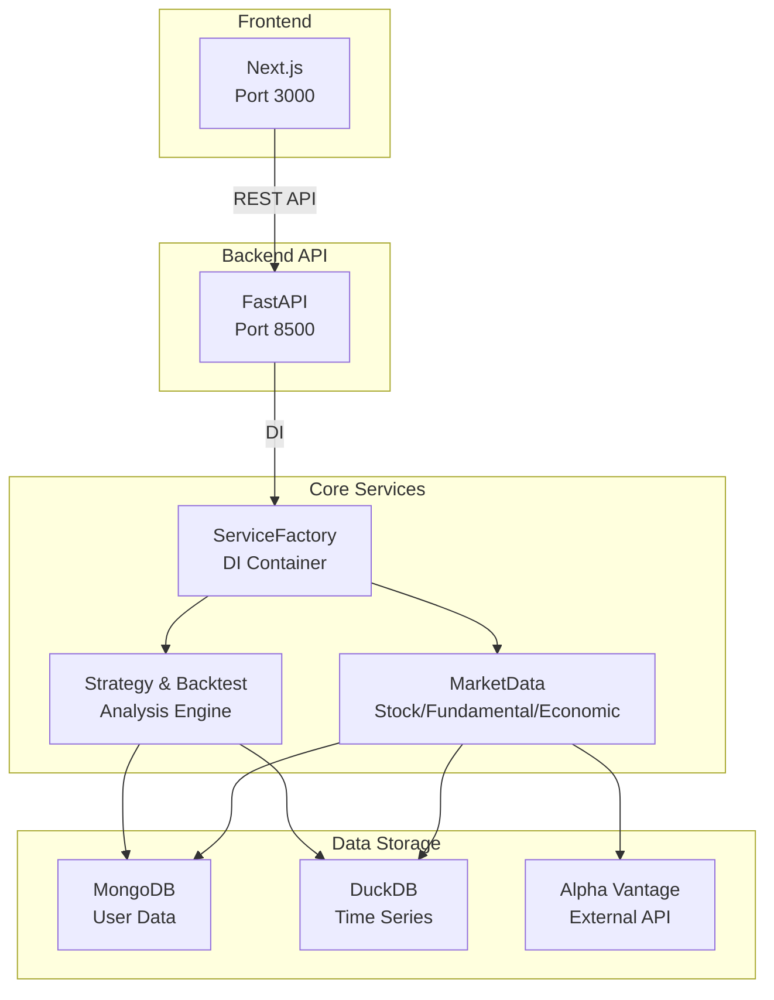
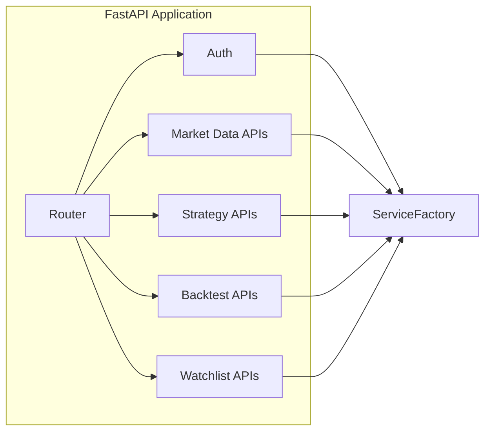
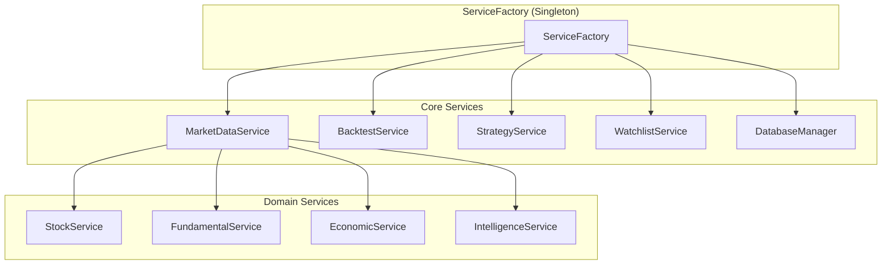
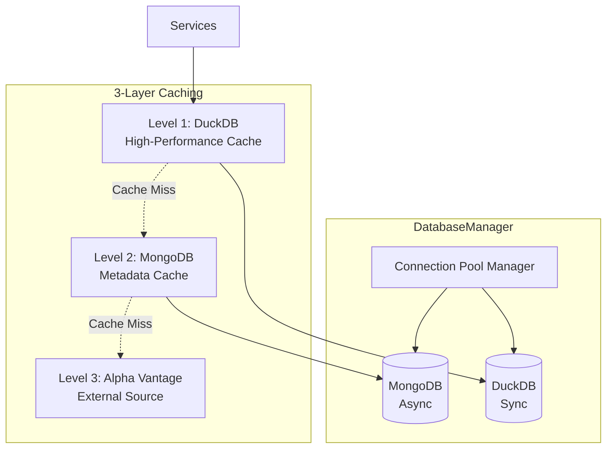
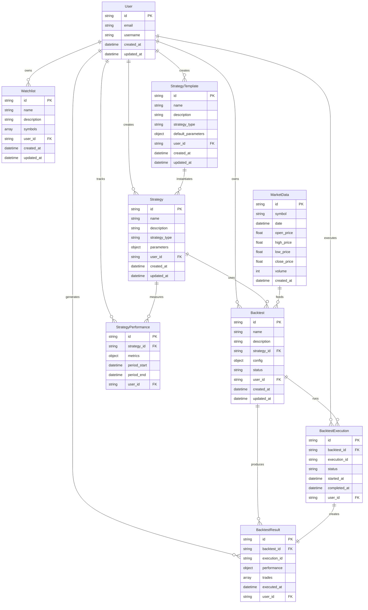
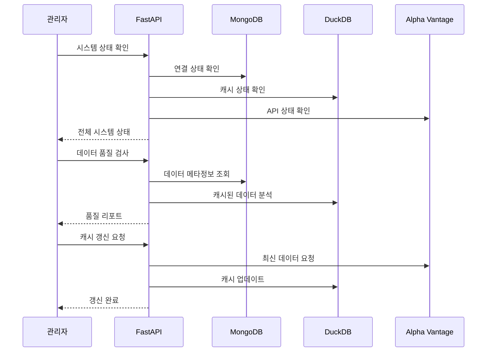
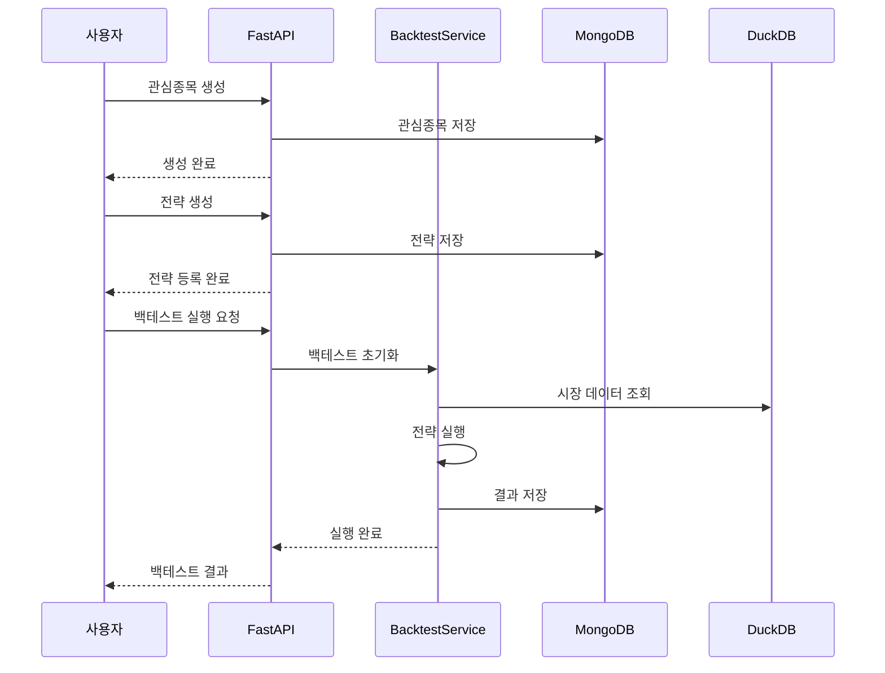

# Quant Backtest Platform - Backend

퀀트 백테스트 플랫폼의 FastAPI 백엔드 서버입니다.

## 🏗️ 아키텍처 개요

### 전체 시스템 구조



### API Layer 구조



### Service Layer 구조



### Data Layer 구조



### 🔧 핵심 아키텍처 컴포넌트

#### ServiceFactory (Singleton Pattern)

- **역할**: 전역 의존성 주입 컨테이너
- **특징**: 애플리케이션 전체에서 단일 인스턴스 보장
- **관리 대상**: 모든 서비스 인스턴스와 DatabaseManager

#### DatabaseManager

- **역할**: 데이터베이스 연결 풀 관리
- **지원 DB**: MongoDB (비동기), DuckDB (동기)
- **특징**: 연결 재사용 및 자동 재연결

#### 3-Layer Caching System

- **Level 1**: DuckDB (컬럼나 고성능 캐시)
- **Level 2**: MongoDB (메타데이터 캐시)
- **Level 3**: Alpha Vantage API (외부 데이터 소스)

## 📁 디렉토리 구조

```bash
backend/
├── app/
│   ├── alpha_vantage/            # Alpha Vantage API 클라이언트
│   │   ├── base.py              # 베이스 클라이언트
│   │   ├── client.py            # 메인 클라이언트
│   │   ├── commodities.py       # 원자재 데이터
│   │   ├── crypto.py            # 암호화폐 데이터
│   │   ├── economic_indicators.py # 경제 지표
│   │   ├── forex.py             # 외환 데이터
│   │   ├── fundamental.py       # 기업 재무 데이터
│   │   ├── intelligence.py      # 뉴스/감정 분석
│   │   ├── options.py           # 옵션 데이터
│   │   ├── stock.py             # 주식 데이터
│   │   └── technical_indicators.py # 기술적 지표
│   ├── api/
│   │   └── routes/
│   │       ├── market_data/     # 시장 데이터 엔드포인트
│   │       │   ├── crypto.py    # 암호화폐 API
│   │       │   ├── economic_indicator.py # 경제 지표 API
│   │       │   ├── fundamental.py # 기업 재무 API
│   │       │   ├── intelligence.py # 뉴스/감정 분석 API
│   │       │   ├── management.py # 데이터 수집 관리 API
│   │       │   ├── stock.py     # 주식 데이터 API
│   │       │   └── technical_indicators.py # 기술적 지표 API
│   │       ├── strategies/      # 전략 엔드포인트
│   │       │   ├── strategy.py  # 전략 CRUD API
│   │       │   └── template.py  # 전략 템플릿 API
│   │       ├── backtests.py     # 백테스트 관리 API
│   │       ├── dashboard.py     # 대시보드 API
│   │       ├── health.py        # 헬스체크 API
│   │       ├── tasks.py         # 비동기 작업 API
│   │       └── watchlists.py    # 관심종목 API
│   ├── core/                    # 핵심 설정
│   │   ├── config.py            # 환경 설정
│   │   └── logging_config.py    # 로깅 설정
│   ├── data/                    # 데이터 저장소
│   │   └── quant.duckdb         # DuckDB 데이터베이스
│   ├── models/                  # Beanie ODM 모델
│   │   ├── market_data/         # 시장 데이터 모델
│   │   │   ├── base.py          # 베이스 모델
│   │   │   ├── crypto.py        # 암호화폐 모델
│   │   │   ├── economic_indicator.py # 경제 지표 모델
│   │   │   ├── fundamental.py   # 재무 데이터 모델
│   │   │   ├── intelligence.py  # 뉴스/감정 모델
│   │   │   ├── stock.py         # 주식 모델
│   │   │   └── technical_indicator.py # 기술적 지표 모델
│   │   ├── backtest.py          # 백테스트 모델
│   │   ├── base_model.py        # 베이스 모델 (공통 필드)
│   │   ├── performance.py       # 성과 분석 모델
│   │   ├── strategy.py          # 전략 모델
│   │   └── watchlist.py         # 관심종목 모델
│   ├── schemas/                 # Pydantic 스키마
│   │   ├── market_data/         # 시장 데이터 스키마
│   │   │   ├── base.py          # 베이스 스키마
│   │   │   ├── crypto.py        # 암호화폐 스키마
│   │   │   ├── economic_indicator.py # 경제 지표 스키마
│   │   │   ├── fundamental.py   # 재무 데이터 스키마
│   │   │   ├── intelligence.py  # 뉴스/감정 스키마
│   │   │   ├── stock.py         # 주식 스키마
│   │   │   └── technical_indicator.py # 기술적 지표 스키마
│   │   ├── backtest.py          # 백테스트 스키마
│   │   ├── base_schema.py       # 베이스 스키마
│   │   ├── dashboard.py         # 대시보드 스키마
│   │   ├── strategy.py          # 전략 스키마
│   │   └── watchlist.py         # 관심종목 스키마
│   ├── seed_templates/          # 초기 데이터 템플릿
│   ├── services/                # 비즈니스 로직
│   │   ├── market_data_service/ # 시장 데이터 서비스
│   │   │   ├── base_service.py  # 베이스 서비스
│   │   │   ├── crypto.py        # 암호화폐 서비스
│   │   │   ├── economic_indicator.py # 경제 지표 서비스
│   │   │   ├── fundamental.py   # 재무 데이터 서비스
│   │   │   ├── intelligence.py  # 뉴스/감정 분석 서비스
│   │   │   ├── stock.py         # 주식 서비스
│   │   │   └── technical_indicator.py # 기술적 지표 서비스
│   │   ├── backtest_service.py  # 백테스트 서비스
│   │   ├── dashboard_service.py # 대시보드 서비스
│   │   ├── database_manager.py  # 데이터베이스 관리자
│   │   ├── integrated_backtest_executor.py # 통합 백테스트 실행
│   │   ├── portfolio_service.py # 포트폴리오 서비스
│   │   ├── service_factory.py   # 서비스 팩토리 (DI 컨테이너)
│   │   ├── strategy_service.py  # 전략 서비스
│   │   └── watchlist_service.py # 관심종목 서비스
│   ├── strategies/              # 거래 전략 구현
│   │   ├── base_strategy.py     # 전략 베이스 클래스
│   │   ├── buy_and_hold.py      # Buy & Hold 전략
│   │   ├── momentum.py          # Momentum 전략
│   │   ├── rsi_mean_reversion.py # RSI Mean Reversion 전략
│   │   └── sma_crossover.py     # SMA Crossover 전략
│   ├── tasks/                   # 비동기 작업 (Celery 등)
│   ├── utils/                   # 유틸리티
│   │   └── template_seeder.py   # 템플릿 시드 유틸리티
│   └── main.py                  # FastAPI 애플리케이션 진입점
├── tests/                       # 테스트 코드
│   ├── test_api_routes.py       # API 라우트 테스트
│   └── test_market_data_service.py # 마켓 데이터 서비스 테스트
├── logs/                        # 로그 파일
│   ├── app.log                  # 애플리케이션 로그
│   └── error.log                # 에러 로그
├── Dockerfile                   # Docker 이미지 빌드
├── pyproject.toml               # Python 프로젝트 설정 (uv)
├── uv.lock                      # Python 의존성 락 파일
└── README.md                    # 백엔드 문서
```

## 🗄️ 데이터베이스 ERD



## 🔄 워크플로우

### 관리자 관점 - 시스템 관리



### 사용자 관점 - 백테스트 실행



## 📡 API 엔드포인트 명세

### Market Data - Stock

| Path                                     | Method | 목적              | 인가등급 | 모델       | 요청스키마                     | 응답스키마             | 서비스레이어 |
| ---------------------------------------- | ------ | ----------------- | -------- | ---------- | ------------------------------ | ---------------------- | ------------ |
| `/market-data/stock/daily/{symbol}`      | GET    | 일별 주가 데이터  | Public   | MarketData | -                              | DailyDataResponse      | StockService |
| `/market-data/stock/quote/{symbol}`      | GET    | 실시간 시세 조회  | Public   | MarketData | -                              | QuoteResponse          | StockService |
| `/market-data/stock/intraday/{symbol}`   | GET    | 인트라데이 데이터 | Public   | MarketData | interval, outputsize           | IntradayDataResponse   | StockService |
| `/market-data/stock/historical/{symbol}` | GET    | 과거 데이터 조회  | Public   | MarketData | start_date, end_date, interval | HistoricalDataResponse | StockService |

### Market Data - Fundamental

| Path                                                 | Method | 목적       | 인가등급 | 모델               | 요청스키마 | 응답스키마              | 서비스레이어       |
| ---------------------------------------------------- | ------ | ---------- | -------- | ------------------ | ---------- | ----------------------- | ------------------ |
| `/market-data/fundamental/overview/{symbol}`         | GET    | 기업 개요  | Public   | Company            | -          | CompanyOverviewResponse | FundamentalService |
| `/market-data/fundamental/income-statement/{symbol}` | GET    | 손익계산서 | Public   | FinancialStatement | period     | IncomeStatementResponse | FundamentalService |
| `/market-data/fundamental/balance-sheet/{symbol}`    | GET    | 대차대조표 | Public   | FinancialStatement | period     | BalanceSheetResponse    | FundamentalService |
| `/market-data/fundamental/cash-flow/{symbol}`        | GET    | 현금흐름표 | Public   | FinancialStatement | period     | CashFlowResponse        | FundamentalService |
| `/market-data/fundamental/earnings/{symbol}`         | GET    | 수익 정보  | Public   | EarningsData       | -          | EarningsResponse        | FundamentalService |

### Market Data - Economic Indicators

| Path                                       | Method | 목적             | 인가등급 | 모델              | 요청스키마         | 응답스키마           | 서비스레이어             |
| ------------------------------------------ | ------ | ---------------- | -------- | ----------------- | ------------------ | -------------------- | ------------------------ |
| `/market-data/economic/gdp`                | GET    | GDP 지표         | Public   | EconomicIndicator | interval           | EconomicDataResponse | EconomicIndicatorService |
| `/market-data/economic/inflation`          | GET    | 인플레이션 지표  | Public   | EconomicIndicator | interval           | EconomicDataResponse | EconomicIndicatorService |
| `/market-data/economic/interest-rates`     | GET    | 금리 데이터      | Public   | EconomicIndicator | interval, maturity | EconomicDataResponse | EconomicIndicatorService |
| `/market-data/economic/employment`         | GET    | 고용 지표        | Public   | EconomicIndicator | -                  | EconomicDataResponse | EconomicIndicatorService |
| `/market-data/economic/consumer-sentiment` | GET    | 소비자 심리 지수 | Public   | EconomicIndicator | -                  | EconomicDataResponse | EconomicIndicatorService |

### Market Data - Intelligence

| Path                                                         | Method | 목적            | 인가등급 | 모델            | 요청스키마                      | 응답스키마                    | 서비스레이어        |
| ------------------------------------------------------------ | ------ | --------------- | -------- | --------------- | ------------------------------- | ----------------------------- | ------------------- |
| `/market-data/intelligence/news/{symbol}`                    | GET    | 뉴스 데이터     | Public   | NewsData        | time_from, time_to, sort, limit | NewsResponse                  | IntelligenceService |
| `/market-data/intelligence/sentiment/{symbol}`               | GET    | 감정 분석       | Public   | SentimentData   | time_from, time_to, sort, limit | SentimentAnalysisResponse     | IntelligenceService |
| `/market-data/intelligence/analyst-recommendations/{symbol}` | GET    | 애널리스트 추천 | Public   | AnalystData     | -                               | AnalystRecommendationResponse | IntelligenceService |
| `/market-data/intelligence/social-sentiment/{symbol}`        | GET    | 소셜 감정 분석  | Public   | SocialSentiment | -                               | SocialSentimentResponse       | IntelligenceService |

### Market Data - Management

| Path                                                    | Method | 목적                 | 인가등급     | 모델       | 요청스키마                       | 응답스키마               | 서비스레이어      |
| ------------------------------------------------------- | ------ | -------------------- | ------------ | ---------- | -------------------------------- | ------------------------ | ----------------- |
| `/market-data/management/collect/company-info/{symbol}` | POST   | 기업 정보 수집       | VerifiedUser | Company    | -                                | Dict                     | MarketDataService |
| `/market-data/management/collect/market-data/{symbol}`  | POST   | 시장 데이터 수집     | VerifiedUser | MarketData | data_types, start_date, end_date | Dict                     | MarketDataService |
| `/market-data/management/collect/bulk`                  | POST   | 벌크 데이터 수집     | VerifiedUser | MarketData | BulkCollectionRequest            | Dict                     | MarketDataService |
| `/market-data/management/coverage/{symbol}`             | GET    | 데이터 커버리지 조회 | VerifiedUser | -          | -                                | DataCoverageResponse     | MarketDataService |
| `/market-data/management/status`                        | GET    | 수집 상태 조회       | VerifiedUser | -          | -                                | CollectionStatusResponse | MarketDataService |
| `/market-data/`                                         | GET    | 시장 데이터 목록     | Public       | MarketData | -                                | MarketDataListResponse   | MarketDataService |
| `/market-data/health`                                   | GET    | 마켓 데이터 헬스체크 | Public       | -          | -                                | Dict                     | MarketDataService |

### Strategies

| Path                                    | Method | 목적           | 인가등급     | 모델              | 요청스키마               | 응답스키마                    | 서비스레이어    |
| --------------------------------------- | ------ | -------------- | ------------ | ----------------- | ------------------------ | ----------------------------- | --------------- |
| `/strategies/`                          | POST   | 전략 생성      | VerifiedUser | Strategy          | StrategyCreate           | StrategyResponse              | StrategyService |
| `/strategies/`                          | GET    | 전략 목록 조회 | VerifiedUser | Strategy          | -                        | StrategyListResponse          | StrategyService |
| `/strategies/{strategy_id}`             | GET    | 전략 상세 조회 | VerifiedUser | Strategy          | -                        | StrategyResponse              | StrategyService |
| `/strategies/{strategy_id}`             | PUT    | 전략 수정      | VerifiedUser | Strategy          | StrategyUpdate           | StrategyResponse              | StrategyService |
| `/strategies/{strategy_id}`             | DELETE | 전략 삭제      | VerifiedUser | Strategy          | -                        | Dict                          | StrategyService |
| `/strategies/{strategy_id}/execute`     | POST   | 전략 실행      | VerifiedUser | StrategyExecution | StrategyExecutionRequest | Dict                          | StrategyService |
| `/strategies/{strategy_id}/executions`  | GET    | 전략 실행 이력 | VerifiedUser | StrategyExecution | -                        | StrategyExecutionListResponse | StrategyService |
| `/strategies/{strategy_id}/performance` | GET    | 전략 성과 분석 | VerifiedUser | -                 | -                        | StrategyPerformanceResponse   | StrategyService |

### Strategy Templates

| Path                                                  | Method | 목적                 | 인가등급     | 모델             | 요청스키마                  | 응답스키마                   | 서비스레이어    |
| ----------------------------------------------------- | ------ | -------------------- | ------------ | ---------------- | --------------------------- | ---------------------------- | --------------- |
| `/strategies/templates/`                              | GET    | 전략 템플릿 목록     | Public       | StrategyTemplate | -                           | StrategyTemplateListResponse | StrategyService |
| `/strategies/templates/{template_id}`                 | GET    | 전략 템플릿 조회     | Public       | StrategyTemplate | -                           | StrategyTemplateResponse     | StrategyService |
| `/strategies/templates/{template_id}/create-strategy` | POST   | 템플릿으로 전략 생성 | VerifiedUser | Strategy         | StrategyFromTemplateRequest | StrategyResponse             | StrategyService |
| `/strategies/templates/analytics/usage-stats`         | GET    | 템플릿 사용 통계     | Public       | -                | -                           | TemplateUsageStatsResponse   | StrategyService |

### Backtests

| Path                                  | Method | 목적               | 인가등급     | 모델              | 요청스키마                | 응답스키마                    | 서비스레이어    |
| ------------------------------------- | ------ | ------------------ | ------------ | ----------------- | ------------------------- | ----------------------------- | --------------- |
| `/backtests/`                         | POST   | 백테스트 생성      | VerifiedUser | Backtest          | BacktestCreate            | BacktestResponse              | BacktestService |
| `/backtests/`                         | GET    | 백테스트 목록 조회 | VerifiedUser | Backtest          | -                         | BacktestListResponse          | BacktestService |
| `/backtests/{backtest_id}`            | GET    | 백테스트 상세 조회 | VerifiedUser | Backtest          | -                         | BacktestResponse              | BacktestService |
| `/backtests/{backtest_id}`            | PUT    | 백테스트 수정      | VerifiedUser | Backtest          | BacktestUpdate            | BacktestResponse              | BacktestService |
| `/backtests/{backtest_id}`            | DELETE | 백테스트 삭제      | VerifiedUser | Backtest          | -                         | Dict                          | BacktestService |
| `/backtests/{backtest_id}/execute`    | POST   | 백테스트 실행      | VerifiedUser | BacktestResult    | -                         | BacktestExecutionResponse     | BacktestService |
| `/backtests/{backtest_id}/executions` | GET    | 백테스트 실행 이력 | VerifiedUser | BacktestExecution | -                         | BacktestExecutionListResponse | BacktestService |
| `/backtests/results/`                 | GET    | 백테스트 결과 목록 | VerifiedUser | BacktestResult    | -                         | BacktestResultListResponse    | BacktestService |
| `/backtests/integrated`               | POST   | 통합 백테스트 실행 | VerifiedUser | Backtest          | IntegratedBacktestRequest | IntegratedBacktestResponse    | BacktestService |
| `/backtests/health`                   | GET    | 백테스트 헬스체크  | Public       | -                 | -                         | Dict                          | BacktestService |

### Backtest Analytics

| Path                                     | Method | 목적           | 인가등급     | 모델 | 요청스키마  | 응답스키마               | 서비스레이어    |
| ---------------------------------------- | ------ | -------------- | ------------ | ---- | ----------- | ------------------------ | --------------- |
| `/backtests/analytics/performance-stats` | GET    | 성과 통계 조회 | VerifiedUser | -    | -           | PerformanceStatsResponse | BacktestService |
| `/backtests/analytics/trades`            | GET    | 거래 분석      | VerifiedUser | -    | backtest_id | TradeAnalysisResponse    | BacktestService |
| `/backtests/analytics/summary`           | GET    | 분석 요약      | VerifiedUser | -    | -           | AnalyticsSummaryResponse | BacktestService |

### Watchlists

| Path                          | Method | 목적                   | 인가등급     | 모델      | 요청스키마      | 응답스키마                | 서비스레이어     |
| ----------------------------- | ------ | ---------------------- | ------------ | --------- | --------------- | ------------------------- | ---------------- |
| `/watchlists/`                | GET    | 관심종목 목록 조회     | VerifiedUser | Watchlist | -               | WatchlistListResponse     | WatchlistService |
| `/watchlists/create`          | POST   | 관심종목 생성          | VerifiedUser | Watchlist | WatchlistCreate | WatchlistResponse         | WatchlistService |
| `/watchlists/{name}`          | GET    | 관심종목 상세 조회     | VerifiedUser | Watchlist | -               | WatchlistResponse         | WatchlistService |
| `/watchlists/{name}`          | PUT    | 관심종목 수정          | VerifiedUser | Watchlist | WatchlistUpdate | WatchlistResponse         | WatchlistService |
| `/watchlists/{name}`          | DELETE | 관심종목 삭제          | VerifiedUser | Watchlist | -               | Dict                      | WatchlistService |
| `/watchlists/{name}/coverage` | GET    | 관심종목 커버리지 조회 | VerifiedUser | -         | -               | WatchlistCoverageResponse | WatchlistService |
| `/watchlists/setup-default`   | POST   | 기본 관심종목 설정     | VerifiedUser | Watchlist | -               | Dict                      | WatchlistService |

## 🔧 주요 기능

### 3-Layer 캐싱 시스템

- **Level 1**: DuckDB (고성능 컬럼나 캐시)
- **Level 2**: MongoDB (메타데이터 캐시)
- **Level 3**: Alpha Vantage API (외부 데이터)

### 서비스 팩토리 패턴

```python
from app.services.service_factory import service_factory

# 의존성 주입을 통한 서비스 인스턴스 획득
market_service = service_factory.get_market_data_service()
backtest_service = service_factory.get_backtest_service()
```

### 도메인별 마이크로서비스

- **Stock Service**: 주식 데이터 처리
- **Fundamental Service**: 기업 재무 분석
- **Economic Service**: 경제 지표 관리
- **Intelligence Service**: 뉴스/감정 분석

## 🚀 실행 방법

```bash
# 개발 서버 실행 (포트 8500)
cd backend
uv run fastapi dev app/main.py --host 0.0.0.0 --port 8500

# 또는 프로젝트 루트에서
pnpm run:dev:backend
```

## 🔑 환경 변수

```bash
ALPHA_VANTAGE_API_KEY=your_api_key
MONGODB_SERVER=localhost:27019
DUCKDB_PATH=./app/data/quant.duckdb
BACKEND_URL=http://localhost:8500
LOG_LEVEL=INFO
```

## 📊 참고사항

### 중요한 설계 결정

- **포트 8500 사용**: 기본 FastAPI 포트(8000) 대신 8500 사용
- **Rate Limiting**: Alpha Vantage API 5 calls/min 자동 제한
- **Response Model 필수**: 모든 엔드포인트에 적절한 response_model 적용
- **Summary 필드 금지**: OpenAPI 클라이언트 생성을 위해 summary 필드 사용 금지

### 데이터 품질 관리

- **DataQualityMixin**: 모든 데이터 모델에 품질 검증 메서드 제공
- **Anomaly Detection**: 음수 가격, 무한값 등 이상치 자동 탐지
- **Cache TTL**: DuckDB 캐시 24시간 TTL 적용

## 📝 License

MIT
