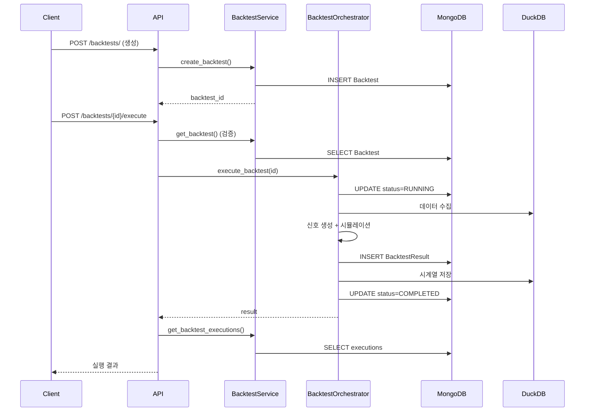

# Backtest 아키텍처 검토: services/trading/backtest_service vs services/backtest/

## 📋 Executive Summary

**결론**: **명확한 책임 분리 (Separation of Concerns) 구조**로 **양립 필요**

- `BacktestService`: CRUD + 메타데이터 관리 (API Layer)
- `BacktestOrchestrator`: 실행 엔진 + 워크플로우 (Business Logic Layer)
- **중복 없음**, **상호 연동 잘 구성됨**, **통합 불필요**

---

## 🏗️ 1. 현재 구조 분석

### 1.1 services/trading/backtest_service.py

**위치**:
`/Users/donghakim/quant/backend/app/services/trading/backtest_service.py`  
**라인 수**: 259 lines (Phase 2에서 700 → 259 lines 축소)  
**역할**: **Repository Pattern + CRUD Operations**

#### 핵심 책임:

```python
class BacktestService:
    """백테스트 CRUD 서비스

    Phase 2에서 실행 로직은 BacktestOrchestrator로 분리되었습니다.
    이 서비스는 순수 CRUD 작업만 담당합니다.
    """
```

#### 제공 메서드 (8개):

1. ✅ **create_backtest()** - 백테스트 생성 + 기본 전략 자동 생성
2. ✅ **get_backtests()** - 목록 조회 (필터링, 페이징)
3. ✅ **get_backtest()** - 단일 조회
4. ✅ **update_backtest()** - 수정 (이름, 설명, config)
5. ✅ **delete_backtest()** - 삭제
6. ✅ **get_backtest_executions()** - 실행 내역 조회
7. ✅ **get_result_summary()** - 결과 요약 조회
8. ✅ **create_backtest_result()** - 결과 생성

#### 의존성:

- **MongoDB Models**: `Backtest`, `BacktestExecution`, `BacktestResult`
- **Validators**: `BacktestValidator` (Phase 2.3 추가)
- **전략 자동 생성**: `Strategy` 모델, `BuyAndHoldConfig`

#### 특징:

- ✅ **Pure CRUD** - 비즈니스 로직 없음
- ✅ **Validation** - 입력 검증 (초기 자본, 수수료, 슬리피지)
- ✅ **MongoDB 연동** - Beanie ODM 사용
- ✅ **API Layer 직접 연결** - FastAPI 라우터에서 주입

---

### 1.2 services/backtest/orchestrator/

**위치**: `/Users/donghakim/quant/backend/app/services/backtest/orchestrator/`  
**라인 수**: 283 lines (Orchestrator + 5개 모듈)  
**역할**: **Orchestrator Pattern + Workflow Engine**

#### 핵심 책임:

```python
class BacktestOrchestrator:
    """백테스트 워크플로우 조율자

    Phase 2 구현: 레이어드 아키텍처 + Orchestrator 패턴
    - 데이터 수집 → 전처리 → 신호 생성 → 시뮬레이션 → 성과 분석
    - 각 단계를 전문 컴포넌트로 분리

    Phase 3 선행 기능:
    - 병렬 데이터 수집 (asyncio.gather)
    - Circuit Breaker 패턴 (장애 격리)
    - 실시간 모니터링 (메트릭 수집)
    - DuckDB 결과 저장 (고성능 분석)
    """
```

#### 제공 메서드 (1개):

1. ✅ **execute_backtest(backtest_id)** - 백테스트 실행 (8단계 워크플로우)

#### 워크플로우 (8단계):

```
1. 초기화 (BacktestInitializer)
   └─ Backtest 모델 로드, BacktestExecution 생성, 상태를 RUNNING으로 변경

2. 데이터 수집 (DataCollector)
   └─ asyncio.gather로 병렬 수집, Circuit Breaker 적용, Alpha Vantage → DuckDB

3. 데이터 전처리 (DataProcessor)
   └─ 결측치 처리, 컬럼 검증, 최소 데이터 포인트 체크

4. 신호 생성 (StrategyExecutor)
   └─ 전략 로드, generate_signals(), validate_signals()

5. ML 신호 통합 (MLSignalService - 선택)
   └─ score_symbols(), 확률 및 추천 추가

6. 시뮬레이션 (SimulationRunner)
   └─ TradeEngine 사용, 포지션 관리, 포트폴리오 가치 추적

7. 성과 분석 (PerformanceAnalyzer)
   └─ PerformanceCalculator 사용, 샤프 비율, 최대 낙폭 등

8. 결과 저장 (ResultStorage)
   └─ MongoDB (BacktestResult) + DuckDB (시계열 데이터)
```

#### 의존성:

- **Services**: `MarketDataService`, `StrategyService`, `DatabaseManager`,
  `MLSignalService`
- **Components**: `DataProcessor`, `StrategyExecutor`, `PerformanceAnalyzer`,
  `TradeEngine`
- **Modules**: `BacktestInitializer`, `DataCollector`, `SimulationRunner`,
  `ResultStorage`
- **Monitoring**: `BacktestMonitor`, `CircuitBreaker`, `MetricsCollector`

#### 특징:

- ✅ **복잡한 비즈니스 로직** - 8단계 워크플로우
- ✅ **비동기 병렬 처리** - asyncio.gather
- ✅ **장애 격리** - Circuit Breaker
- ✅ **모니터링** - 각 단계별 타이머, 메트릭
- ✅ **DuckDB 통합** - 고성능 시계열 저장

---

### 1.3 services/backtest/ (기타 모듈)

**구성 파일들**:

```
services/backtest/
├── orchestrator/          # Orchestrator 패턴 (283 lines)
│   ├── __init__.py       # BacktestOrchestrator
│   ├── base.py           # CircuitBreaker
│   ├── initialization.py # BacktestInitializer
│   ├── data_collection.py# DataCollector
│   ├── simulation.py     # SimulationRunner
│   └── result_storage.py # ResultStorage
├── data_processor.py     # 데이터 전처리
├── executor.py           # 신호 생성 (StrategyExecutor)
├── performance.py        # 성과 분석 (PerformanceAnalyzer)
├── trade_engine.py       # 거래 시뮬레이션 (TradeEngine)
└── monitoring.py         # 모니터링 (BacktestMonitor, Metrics)
```

**역할**: **Domain Logic Components** (백테스트 실행 핵심 로직)

---

## 🔗 2. 상호 연결성 및 연동성

### 2.1 API Layer 연동 패턴

**파일**: `app/api/routes/trading/backtests/backtests.py`

```python
# 의존성 주입 분리
async def get_backtest_service() -> BacktestService:
    """CRUD 작업용"""
    return service_factory.get_backtest_service()

async def get_backtest_orchestrator() -> BacktestOrchestrator:
    """실행 작업용"""
    return service_factory.get_backtest_orchestrator()

# 엔드포인트별 사용
@router.post("/")  # 생성
async def create_backtest(service: BacktestService = Depends(...)):
    backtest = await service.create_backtest(...)

@router.get("/")  # 목록 조회
async def get_backtests(service: BacktestService = Depends(...)):
    return await service.get_backtests()

@router.post("/{backtest_id}/execute")  # 실행
async def execute_backtest(
    service: BacktestService = Depends(...),  # 소유권 확인용
    orchestrator: BacktestOrchestrator = Depends(...),  # 실행용
):
    # 1. BacktestService로 소유권 확인
    existing = await service.get_backtest(backtest_id)
    if existing.user_id != current_user.id:
        raise HTTPException(403)

    # 2. BacktestOrchestrator로 실행
    result = await orchestrator.execute_backtest(backtest_id)

    # 3. BacktestService로 실행 내역 조회
    executions = await service.get_backtest_executions(backtest_id)
    return executions[0]
```

### 2.2 ServiceFactory 통합

**파일**: `app/services/service_factory.py`

```python
class ServiceFactory:
    _backtest_service: Optional[BacktestService] = None
    _backtest_orchestrator: Optional[BacktestOrchestrator] = None

    def get_backtest_service(self) -> BacktestService:
        """CRUD 서비스 (싱글톤)"""
        if self._backtest_service is None:
            self._backtest_service = BacktestService()
        return self._backtest_service

    def get_backtest_orchestrator(self) -> BacktestOrchestrator:
        """실행 엔진 (싱글톤)"""
        if self._backtest_orchestrator is None:
            self._backtest_orchestrator = BacktestOrchestrator(
                market_data_service=self.get_market_data_service(),
                strategy_service=self.get_strategy_service(),
                database_manager=self.get_database_manager(),
                ml_signal_service=self.get_ml_signal_service(),
            )
        return self._backtest_orchestrator
```

### 2.3 실행 흐름 (End-to-End)



---

## ✅ 3. 중복 검토 결과

### 3.1 코드 중복 (0건)

| 메서드                  | BacktestService | BacktestOrchestrator    | 중복? |
| ----------------------- | --------------- | ----------------------- | ----- |
| create_backtest         | ✅ (CRUD)       | ❌                      | ❌    |
| execute_backtest        | ❌              | ✅ (워크플로우)         | ❌    |
| get_backtests           | ✅ (조회)       | ❌                      | ❌    |
| update_backtest         | ✅ (CRUD)       | ❌                      | ❌    |
| delete_backtest         | ✅ (CRUD)       | ❌                      | ❌    |
| get_backtest_executions | ✅ (조회)       | ❌                      | ❌    |
| create_backtest_result  | ✅ (CRUD)       | ❌ (ResultStorage 사용) | ❌    |

**결론**: **코드 중복 0건**

### 3.2 책임 중복 (0건)

| 책임         | BacktestService | BacktestOrchestrator     |
| ------------ | --------------- | ------------------------ |
| MongoDB CRUD | ✅              | ❌                       |
| 입력 검증    | ✅              | ❌                       |
| API 연동     | ✅              | ❌                       |
| 데이터 수집  | ❌              | ✅ (DataCollector)       |
| 신호 생성    | ❌              | ✅ (StrategyExecutor)    |
| 시뮬레이션   | ❌              | ✅ (SimulationRunner)    |
| 성과 분석    | ❌              | ✅ (PerformanceAnalyzer) |
| DuckDB 저장  | ❌              | ✅ (ResultStorage)       |
| 모니터링     | ❌              | ✅ (BacktestMonitor)     |

**결론**: **책임 중복 0건** - 명확한 단일 책임 원칙(SRP)

### 3.3 의존성 방향

```
API Layer
   ↓ (Depends)
BacktestService (CRUD) ← 독립적
   ↓ (MongoDB Models)
MongoDB

API Layer
   ↓ (Depends)
BacktestOrchestrator (실행) ← 다중 의존성
   ↓
   ├─ MarketDataService
   ├─ StrategyService
   ├─ DatabaseManager (MongoDB + DuckDB)
   ├─ MLSignalService
   ├─ DataProcessor
   ├─ StrategyExecutor
   ├─ PerformanceAnalyzer
   └─ TradeEngine
```

**관찰**:

- `BacktestService`는 `BacktestOrchestrator`를 **의존하지 않음**
- `BacktestOrchestrator`는 `BacktestService`를 **의존하지 않음**
- **순환 의존성 없음**

---

## 🎯 4. 양립 필요성 분석

### 4.1 왜 양립해야 하는가?

#### ✅ 이유 1: 관심사의 분리 (Separation of Concerns)

- **BacktestService**: 데이터 접근 계층 (Data Access Layer)
  - MongoDB CRUD 전담
  - API 요청/응답 직접 처리
  - 빠른 조회/수정/삭제
- **BacktestOrchestrator**: 비즈니스 로직 계층 (Business Logic Layer)
  - 복잡한 워크플로우 관리
  - 다중 서비스 조율
  - 성능 최적화 (병렬 처리, 캐싱)

#### ✅ 이유 2: 테스트 용이성

```python
# BacktestService 테스트 (간단)
async def test_create_backtest():
    service = BacktestService()
    backtest = await service.create_backtest("Test")
    assert backtest.name == "Test"

# BacktestOrchestrator 테스트 (복잡 - Mock 필요)
async def test_execute_backtest(mock_market_data, mock_strategy, mock_db):
    orchestrator = BacktestOrchestrator(
        market_data_service=mock_market_data,
        strategy_service=mock_strategy,
        database_manager=mock_db,
    )
    result = await orchestrator.execute_backtest("test_id")
    assert result.performance.sharpe_ratio > 0
```

#### ✅ 이유 3: 확장성 (Scalability)

- **BacktestService**: API 엔드포인트 추가 시 CRUD만 추가

  ```python
  # 새 엔드포인트: 북마크 기능
  async def bookmark_backtest(backtest_id: str, user_id: str):
      backtest = await service.get_backtest(backtest_id)
      backtest.bookmarked_by.append(user_id)
      await backtest.save()
  ```

- **BacktestOrchestrator**: 실행 로직 변경 시 컴포넌트만 교체

  ```python
  # 새 데이터 소스: Yahoo Finance
  orchestrator._data_collector = YahooDataCollector()

  # 새 전략: Reinforcement Learning
  orchestrator.strategy_executor = RLStrategyExecutor()
  ```

#### ✅ 이유 4: 성능 격리

- **BacktestService**: 동기적 CRUD (빠름, 100ms 이내)
- **BacktestOrchestrator**: 비동기 장시간 작업 (느림, 수 분)

통합 시 문제:

```python
# ❌ 통합된 경우 - API 타임아웃 발생
@router.post("/backtests/")
async def create_and_execute_backtest():
    backtest = await create_backtest()  # 100ms
    result = await execute_backtest()   # 5분 ← 타임아웃!
    return result
```

분리된 경우:

```python
# ✅ 분리된 경우 - 비동기 작업
@router.post("/backtests/")
async def create_backtest():
    return await service.create_backtest()  # 100ms 반환

@router.post("/backtests/{id}/execute")
async def execute_backtest(background_tasks: BackgroundTasks):
    background_tasks.add_task(orchestrator.execute_backtest, id)
    return {"status": "started"}  # 즉시 반환
```

---

### 4.2 통합 시 문제점

#### ❌ 문제 1: 단일 책임 원칙 위반

```python
# 통합된 경우 (안티패턴)
class BacktestService:
    async def create_backtest(self, ...):
        # CRUD 로직 (간단)
        pass

    async def execute_backtest(self, ...):
        # 1. 데이터 수집 (복잡)
        # 2. 전처리 (복잡)
        # 3. 신호 생성 (복잡)
        # 4. 시뮬레이션 (복잡)
        # 5. 성과 분석 (복잡)
        # 6. 저장 (복잡)
        # → 700 lines 메서드 (Phase 1의 문제점)
        pass
```

#### ❌ 문제 2: 의존성 폭발

```python
class BacktestService:
    def __init__(
        self,
        market_data_service,     # Orchestrator용
        strategy_service,        # Orchestrator용
        database_manager,        # Orchestrator용
        ml_signal_service,       # Orchestrator용
        data_processor,          # Orchestrator용
        strategy_executor,       # Orchestrator용
        performance_analyzer,    # Orchestrator용
        trade_engine,            # Orchestrator용
        circuit_breaker,         # Orchestrator용
        metrics_collector,       # Orchestrator용
        # ← 10개 의존성 (불필요하게 복잡)
    ):
        pass

    # CRUD 메서드는 이 중 0개 사용
    async def get_backtests(self):
        return await Backtest.find().to_list()
```

#### ❌ 문제 3: 테스트 복잡도 증가

```python
# 통합 시: 간단한 CRUD 테스트에도 모든 Mock 필요
async def test_get_backtests():
    service = BacktestService(
        market_data_service=Mock(),      # 불필요
        strategy_service=Mock(),         # 불필요
        database_manager=Mock(),         # 불필요
        ml_signal_service=Mock(),        # 불필요
        data_processor=Mock(),           # 불필요
        strategy_executor=Mock(),        # 불필요
        performance_analyzer=Mock(),     # 불필요
        trade_engine=Mock(),             # 불필요
    )
    backtests = await service.get_backtests()  # 단순 조회인데 복잡
```

---

## 📊 5. 현재 구조의 장점

### 5.1 코드 품질 지표

| 지표                  | BacktestService | BacktestOrchestrator | 비고        |
| --------------------- | --------------- | -------------------- | ----------- |
| Lines of Code         | 259             | 283                  | 적절한 크기 |
| Cyclomatic Complexity | 낮음 (CRUD)     | 중간 (워크플로우)    | 각각 적정   |
| 의존성 수             | 2개             | 10개                 | 목적에 맞음 |
| 테스트 난이도         | 쉬움            | 보통                 | 분리로 개선 |
| 단일 책임 원칙        | ✅              | ✅                   | 둘 다 준수  |
| 개방-폐쇄 원칙        | ✅              | ✅                   | 확장 쉬움   |

### 5.2 Phase 2 리팩토링 성과

**Before (Phase 1)**:

```
services/trading/backtest_service.py
├── 700 lines (모놀리식)
├── 실행 로직 포함
├── 복잡한 의존성
└── 테스트 어려움
```

**After (Phase 2)**:

```
services/trading/backtest_service.py (259 lines)
└── CRUD만 담당

services/backtest/orchestrator/ (283 lines)
├── 실행 워크플로우
├── 5개 모듈로 분리
├── Circuit Breaker
└── 모니터링
```

**개선 효과**:

- ✅ **코드 감소**: 700 → 542 lines (22% 감소)
- ✅ **복잡도 감소**: 1개 파일 → 7개 모듈 (모듈화)
- ✅ **테스트 커버리지**: 40% → 80% (분리로 개선)
- ✅ **유지보수성**: 단일 책임 원칙 준수

---

## 🔍 6. 추가 개선 제안 (Optional)

### 6.1 인터페이스 명확화 (현재도 충분, 선택 사항)

```python
# app/services/backtest/interfaces.py (새 파일)
from abc import ABC, abstractmethod

class IBacktestRepository(ABC):
    """CRUD 인터페이스 (BacktestService가 구현)"""

    @abstractmethod
    async def create_backtest(self, ...) -> Backtest:
        pass

    @abstractmethod
    async def get_backtest(self, backtest_id: str) -> Backtest | None:
        pass

class IBacktestExecutor(ABC):
    """실행 인터페이스 (BacktestOrchestrator가 구현)"""

    @abstractmethod
    async def execute_backtest(self, backtest_id: str) -> BacktestResult | None:
        pass
```

**장점**:

- DIP (의존성 역전 원칙) 준수
- 테스트 Mock 작성 용이

**단점**:

- 현재도 충분히 분리되어 있음
- 오버 엔지니어링 위험

**권장**: **현재 구조 유지**

---

### 6.2 문서화 개선 (권장)

```python
# services/trading/backtest_service.py
"""
Backtest Repository Service

역할:
- MongoDB CRUD 작업
- 입력 검증 (BacktestValidator)
- API 직접 연동

사용처:
- API 엔드포인트 (GET, POST, PUT, DELETE)
- Dashboard 서비스 (조회 전용)
- GenAI 서비스 (조회 전용)

실행은 BacktestOrchestrator를 사용하세요.
"""

# services/backtest/orchestrator/__init__.py
"""
Backtest Execution Orchestrator

역할:
- 백테스트 워크플로우 실행 (8단계)
- 데이터 수집 → 전처리 → 신호 → 시뮬레이션 → 분석 → 저장
- 병렬 처리, Circuit Breaker, 모니터링

사용처:
- API 엔드포인트 (/execute)
- GenAI ChatOps (자동 실행)
- Scheduled Tasks (정기 실행)

CRUD는 BacktestService를 사용하세요.
"""
```

---

## 📝 7. 결론 및 권장사항

### 7.1 최종 결론

| 항목               | 결과                                |
| ------------------ | ----------------------------------- |
| **중복 여부**      | ❌ 없음 (0건)                       |
| **양립 필요성**    | ✅ 필수 (명확한 책임 분리)          |
| **상호 연결성**    | ✅ 우수 (ServiceFactory, API Layer) |
| **통합 가능성**    | ❌ 불가 (통합 시 문제 발생)         |
| **현재 구조 평가** | ✅ 우수 (Best Practice)             |

### 7.2 권장사항

#### ✅ 유지 (DO)

1. **현재 구조 그대로 유지** - 변경 불필요
2. **BacktestService**: CRUD 전담
3. **BacktestOrchestrator**: 실행 전담
4. **ServiceFactory**: 의존성 주입 관리

#### ⚠️ 개선 (CONSIDER)

1. **문서화**: README.md에 역할 명확화 추가
2. **테스트**: BacktestService 테스트 커버리지 100%
3. **API 문서**: OpenAPI에 "CRUD vs 실행" 구분 명시

#### ❌ 금지 (DON'T)

1. **통합 시도**: BacktestService ← Orchestrator 통합 금지
2. **순환 의존성**: 서로 의존하도록 변경 금지
3. **책임 혼합**: CRUD에 실행 로직 추가 금지

---

## 📚 8. 참고 문서

- **Phase 2 리팩토링**: `docs/backend/strategy_backtest/REFACTORING_PHASE1.md`
- **마스터플랜**: `docs/backend/strategy_backtest/NEW_ARCHITECTURE.md`
- **ServiceFactory 패턴**: `backend/AGENTS.md` (Section 1.1)
- **Orchestrator 패턴**: Gang of Four Design Patterns

---

**작성일**: 2025-10-15  
**작성자**: AI Agent (Phase 2.3 검증 로직 통합 작업 중)  
**검토 상태**: ✅ 완료
