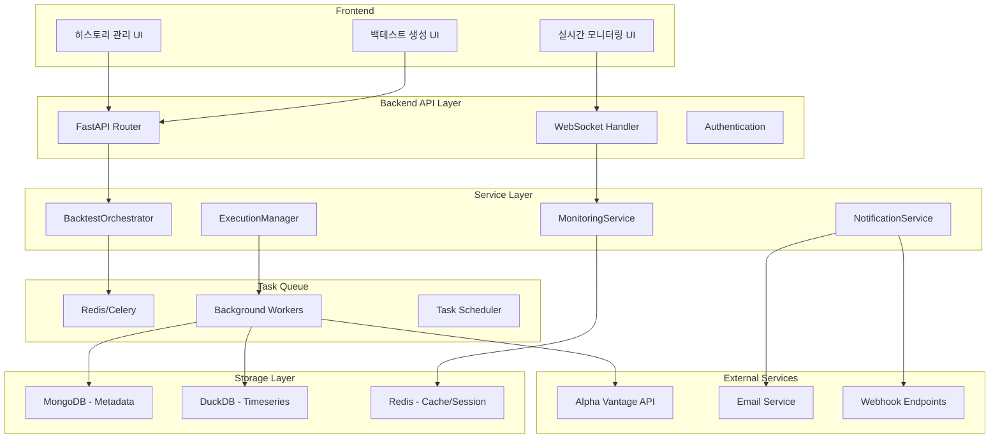

# 🚀 백테스트 서비스 고도화 전략 및 세부 계획

## 📋 개요

퀀트 백테스트 플랫폼의 백엔드 서비스를 Epic 4 요구사항과 프론트엔드 TODO
항목들을 기반으로 고도화하여, 실시간 백테스트 실행 및 모니터링 시스템을 구축하는
전략 문서입니다.

## 🎯 현재 상황 분석

### 기존 아키텍처

- FastAPI + Beanie ODM + MongoDB (메타데이터)
- DuckDB (시계열 데이터 캐싱)
- ServiceFactory 패턴으로 의존성 주입
- Alpha Vantage API 연동

### 식별된 한계점

1. **실시간 모니터링 부재**: 백테스트 실행 상태 추적 시스템 없음
2. **백그라운드 처리 미지원**: 장시간 실행되는 백테스트 처리 불가
3. **큐잉 시스템 부재**: 다중 백테스트 요청 처리 메커니즘 없음
4. **웹소켓 지원 부재**: 실시간 업데이트 전송 불가
5. **중간 결과 저장**: 백테스트 진행 과정의 중간 결과 추적 부재

---

## 🏗️ 고도화 아키텍처 설계

### 전체 시스템 구조



### 핵심 컴포넌트 설계

#### 1. BacktestOrchestrator (백테스트 오케스트레이터)

```python
from typing import Dict, Any, Optional
from app.models.backtest import Backtest, BacktestStatus
from app.services.execution_manager import ExecutionManager
from app.services.monitoring_service import MonitoringService

class BacktestOrchestrator:
    """백테스트 전체 생명주기 관리"""

    def __init__(self, execution_manager: ExecutionManager, monitoring: MonitoringService):
        self.execution_manager = execution_manager
        self.monitoring = monitoring

    async def create_backtest(self, config: Dict[str, Any]) -> str:
        """통합 백테스트 생성 및 검증"""
        # 1. 설정 검증
        # 2. 리소스 예상 계산
        # 3. 백테스트 엔티티 생성
        # 4. 큐에 작업 등록
        pass

    async def execute_backtest(self, backtest_id: str) -> None:
        """백테스트 실행 오케스트레이션"""
        # 1. 실행 전 검증
        # 2. 데이터 수집 작업 스케줄링
        # 3. 전략 실행 작업 스케줄링
        # 4. 결과 저장 작업 스케줄링
        pass

    async def stop_backtest(self, backtest_id: str) -> bool:
        """실행 중인 백테스트 중단"""
        pass

    async def get_execution_status(self, backtest_id: str) -> Dict[str, Any]:
        """실행 상태 조회"""
        pass
```

#### 2. ExecutionManager (실행 관리자)

```python
from celery import Celery
from app.core.config import settings

class ExecutionManager:
    """백테스트 실행 작업 관리"""

    def __init__(self):
        self.celery = Celery(
            'backtest_worker',
            broker=settings.REDIS_URL,
            backend=settings.REDIS_URL
        )

    async def submit_backtest_job(self, backtest_id: str, config: Dict[str, Any]) -> str:
        """백테스트 작업을 큐에 제출"""
        task = self.celery.send_task(
            'execute_backtest',
            args=[backtest_id, config],
            kwargs={},
            queue='backtest_execution'
        )
        return task.id

    async def get_job_status(self, task_id: str) -> Dict[str, Any]:
        """작업 상태 조회"""
        result = self.celery.AsyncResult(task_id)
        return {
            'status': result.status,
            'progress': result.info.get('progress', 0) if result.info else 0,
            'current_step': result.info.get('current_step') if result.info else None,
            'error': str(result.info) if result.failed() else None
        }

    async def cancel_job(self, task_id: str) -> bool:
        """작업 취소"""
        self.celery.control.revoke(task_id, terminate=True)
        return True
```

#### 3. MonitoringService (모니터링 서비스)

```python
import asyncio
from typing import List, Dict, Any
from fastapi import WebSocket
from app.services.database_manager import DatabaseManager

class MonitoringService:
    """실시간 모니터링 및 WebSocket 관리"""

    def __init__(self, db_manager: DatabaseManager):
        self.db_manager = db_manager
        self.active_connections: Dict[str, List[WebSocket]] = {}

    async def connect_client(self, websocket: WebSocket, backtest_id: str):
        """클라이언트 WebSocket 연결"""
        await websocket.accept()
        if backtest_id not in self.active_connections:
            self.active_connections[backtest_id] = []
        self.active_connections[backtest_id].append(websocket)

    async def disconnect_client(self, websocket: WebSocket, backtest_id: str):
        """클라이언트 연결 해제"""
        if backtest_id in self.active_connections:
            self.active_connections[backtest_id].remove(websocket)

    async def broadcast_update(self, backtest_id: str, update: Dict[str, Any]):
        """백테스트 업데이트를 모든 연결된 클라이언트에 전송"""
        if backtest_id in self.active_connections:
            for websocket in self.active_connections[backtest_id]:
                try:
                    await websocket.send_json(update)
                except:
                    # 연결 끊긴 소켓 제거
                    self.active_connections[backtest_id].remove(websocket)

    async def log_execution_event(self, backtest_id: str, event: Dict[str, Any]):
        """실행 이벤트 로깅 및 브로드캐스트"""
        # DuckDB에 로그 저장
        await self.db_manager.store_execution_log(backtest_id, event)

        # 실시간 업데이트 전송
        await self.broadcast_update(backtest_id, {
            'type': 'log',
            'data': event
        })

    async def update_progress(self, backtest_id: str, progress: Dict[str, Any]):
        """진행률 업데이트"""
        # 진행률 상태 저장
        await self.db_manager.update_backtest_progress(backtest_id, progress)

        # 실시간 업데이트 전송
        await self.broadcast_update(backtest_id, {
            'type': 'progress',
            'data': progress
        })
```

---

## 🔧 세부 구현 계획

### Phase 1: 기본 인프라 구축 (2주)

#### 1.1 Task Queue 시스템 구축

**목표**: Celery + Redis 기반 백그라운드 작업 처리 시스템 구축

**구현 항목**:

```python
# app/core/celery_app.py
from celery import Celery
from app.core.config import settings

celery_app = Celery(
    "quant_backtest",
    broker=settings.REDIS_URL,
    backend=settings.REDIS_URL,
    include=['app.tasks.backtest_tasks']
)

celery_app.conf.update(
    task_serializer='json',
    accept_content=['json'],
    result_serializer='json',
    timezone='UTC',
    enable_utc=True,
    task_routes={
        'app.tasks.backtest_tasks.execute_backtest': {'queue': 'backtest_execution'},
        'app.tasks.backtest_tasks.collect_market_data': {'queue': 'data_collection'},
        'app.tasks.backtest_tasks.calculate_indicators': {'queue': 'calculation'},
    }
)

# app/tasks/backtest_tasks.py
from celery import current_task
from app.core.celery_app import celery_app
from app.services.service_factory import service_factory

@celery_app.task(bind=True)
def execute_backtest(self, backtest_id: str, config: dict):
    """백테스트 실행 작업"""
    try:
        # 진행률 0% 보고
        current_task.update_state(
            state='PROGRESS',
            meta={'progress': 0, 'current_step': 'Initializing'}
        )

        orchestrator = service_factory.get_backtest_orchestrator()

        # 1단계: 데이터 수집 (0-30%)
        current_task.update_state(
            state='PROGRESS',
            meta={'progress': 10, 'current_step': 'Collecting market data'}
        )

        # 2단계: 지표 계산 (30-60%)
        current_task.update_state(
            state='PROGRESS',
            meta={'progress': 40, 'current_step': 'Calculating indicators'}
        )

        # 3단계: 백테스트 실행 (60-90%)
        current_task.update_state(
            state='PROGRESS',
            meta={'progress': 70, 'current_step': 'Running simulation'}
        )

        # 4단계: 결과 저장 (90-100%)
        current_task.update_state(
            state='PROGRESS',
            meta={'progress': 95, 'current_step': 'Saving results'}
        )

        return {'status': 'completed', 'backtest_id': backtest_id}

    except Exception as exc:
        current_task.update_state(
            state='FAILURE',
            meta={'error': str(exc), 'backtest_id': backtest_id}
        )
        raise
```

#### 1.2 WebSocket 연결 관리

**목표**: 실시간 업데이트를 위한 WebSocket 인프라 구축

```python
# app/api/routes/websocket.py
from fastapi import APIRouter, WebSocket, WebSocketDisconnect
from app.services.service_factory import service_factory

router = APIRouter()

@router.websocket("/ws/backtest/{backtest_id}")
async def websocket_endpoint(websocket: WebSocket, backtest_id: str):
    monitoring_service = service_factory.get_monitoring_service()

    await monitoring_service.connect_client(websocket, backtest_id)

    try:
        # 초기 상태 전송
        initial_status = await monitoring_service.get_backtest_status(backtest_id)
        await websocket.send_json({
            'type': 'initial_status',
            'data': initial_status
        })

        # 연결 유지
        while True:
            await websocket.receive_text()

    except WebSocketDisconnect:
        await monitoring_service.disconnect_client(websocket, backtest_id)
```

#### 1.3 데이터베이스 스키마 확장

**목표**: 백테스트 실행 상태 및 로그 저장을 위한 스키마 확장

```python
# app/models/backtest_execution.py
from datetime import datetime
from typing import Optional, Dict, Any
from beanie import Document, Indexed
from pydantic import Field

class BacktestExecution(Document):
    """백테스트 실행 정보"""
    backtest_id: Indexed(str)
    task_id: Optional[str] = None
    status: str = "pending"  # pending, running, completed, failed, cancelled
    progress: float = 0.0
    current_step: Optional[str] = None
    started_at: Optional[datetime] = None
    completed_at: Optional[datetime] = None
    error_message: Optional[str] = None
    intermediate_results: Optional[Dict[str, Any]] = None

    class Settings:
        name = "backtest_executions"

class BacktestLog(Document):
    """백테스트 실행 로그"""
    backtest_id: Indexed(str)
    timestamp: datetime = Field(default_factory=datetime.utcnow)
    level: str  # info, warning, error
    message: str
    details: Optional[Dict[str, Any]] = None
    step: Optional[str] = None

    class Settings:
        name = "backtest_logs"
```

### Phase 2: 실시간 모니터링 구현 (2주)

#### 2.1 실행 상태 추적 시스템

**목표**: 백테스트 실행의 각 단계별 상태 추적 및 업데이트

```python
# app/services/backtest_orchestrator.py
from typing import Dict, Any, List
from app.models.backtest_execution import BacktestExecution, BacktestLog
from app.services.monitoring_service import MonitoringService

class BacktestOrchestrator:

    async def create_and_execute_backtest(self, config: Dict[str, Any]) -> str:
        """통합 백테스트 생성 및 실행"""

        # 1. 백테스트 엔티티 생성
        backtest = await self._create_backtest_entity(config)

        # 2. 실행 정보 초기화
        execution = BacktestExecution(
            backtest_id=str(backtest.id),
            status="queued"
        )
        await execution.save()

        # 3. 예상 시간 계산
        estimated_duration = await self._estimate_execution_time(config)

        # 4. 작업 큐에 제출
        task = await self.execution_manager.submit_backtest_job(
            str(backtest.id),
            config
        )

        # 5. 작업 ID 저장
        execution.task_id = task
        execution.status = "queued"
        await execution.save()

        # 6. 초기 상태 브로드캐스트
        await self.monitoring.broadcast_update(str(backtest.id), {
            'type': 'status_change',
            'data': {
                'status': 'queued',
                'estimated_duration': estimated_duration,
                'queue_position': await self._get_queue_position(task)
            }
        })

        return str(backtest.id)

    async def _estimate_execution_time(self, config: Dict[str, Any]) -> int:
        """실행 시간 예상 (초)"""
        base_time = 30  # 기본 30초

        # 기간에 따른 시간 증가
        days = (config['end_date'] - config['start_date']).days
        time_factor = max(1, days / 365)  # 1년 기준

        # 심볼 수에 따른 시간 증가
        symbol_factor = len(config.get('symbols', []))

        # 전략 복잡도에 따른 시간 증가
        strategy_factor = self._get_strategy_complexity(config.get('strategy_type'))

        estimated_time = int(base_time * time_factor * symbol_factor * strategy_factor)
        return min(estimated_time, 3600)  # 최대 1시간
```

#### 2.2 중간 결과 저장 시스템

**목표**: 백테스트 진행 과정의 중간 결과를 저장하여 장애 시 복구 지원

```python
# app/services/intermediate_storage.py
from typing import Dict, Any, Optional
from app.services.database_manager import DatabaseManager

class IntermediateStorageService:
    """중간 결과 저장 및 관리"""

    def __init__(self, db_manager: DatabaseManager):
        self.db_manager = db_manager

    async def save_checkpoint(self, backtest_id: str, checkpoint_data: Dict[str, Any]):
        """체크포인트 저장"""
        await self.db_manager.execute_query(
            """
            INSERT OR REPLACE INTO backtest_checkpoints
            (backtest_id, checkpoint_type, data, created_at)
            VALUES (?, ?, ?, ?)
            """,
            (backtest_id, checkpoint_data['type'],
             json.dumps(checkpoint_data), datetime.utcnow())
        )

    async def load_latest_checkpoint(self, backtest_id: str) -> Optional[Dict[str, Any]]:
        """최신 체크포인트 로드"""
        result = await self.db_manager.fetch_one(
            """
            SELECT data FROM backtest_checkpoints
            WHERE backtest_id = ?
            ORDER BY created_at DESC
            LIMIT 1
            """,
            (backtest_id,)
        )

        if result:
            return json.loads(result['data'])
        return None

    async def resume_from_checkpoint(self, backtest_id: str) -> bool:
        """체크포인트에서 백테스트 재개"""
        checkpoint = await self.load_latest_checkpoint(backtest_id)
        if not checkpoint:
            return False

        # 백테스트 재개 로직
        await self._resume_backtest_execution(backtest_id, checkpoint)
        return True
```

### Phase 3: 고급 기능 구현 (2주)

#### 3.1 백테스트 비교 및 분석

**목표**: 여러 백테스트 성과를 비교하고 분석하는 기능

```python
# app/api/routes/backtest_analysis.py
from fastapi import APIRouter, Query, HTTPException
from typing import List, Dict, Any
from app.services.backtest_analysis_service import BacktestAnalysisService

router = APIRouter()

@router.post("/backtests/compare")
async def compare_backtests(
    backtest_ids: List[str],
    analysis_service: BacktestAnalysisService = Depends(get_analysis_service)
):
    """백테스트 성과 비교"""
    if len(backtest_ids) < 2 or len(backtest_ids) > 5:
        raise HTTPException(
            status_code=400,
            detail="2-5개의 백테스트만 비교 가능합니다"
        )

    comparison_result = await analysis_service.compare_backtests(backtest_ids)

    return {
        "comparison_id": comparison_result.id,
        "backtests": comparison_result.backtests,
        "performance_metrics": comparison_result.metrics,
        "risk_metrics": comparison_result.risk_analysis,
        "correlation_matrix": comparison_result.correlations,
        "drawdown_analysis": comparison_result.drawdowns,
        "generated_at": comparison_result.created_at
    }

@router.get("/backtests/analytics/performance-stats")
async def get_performance_statistics(
    period: str = Query("1Y", description="분석 기간"),
    strategy_type: Optional[str] = Query(None, description="전략 유형 필터"),
    analysis_service: BacktestAnalysisService = Depends(get_analysis_service)
):
    """성과 통계 분석"""
    stats = await analysis_service.get_performance_statistics(
        period=period,
        strategy_type=strategy_type
    )

    return {
        "period": period,
        "total_backtests": stats.total_count,
        "success_rate": stats.success_rate,
        "average_return": stats.avg_return,
        "best_performing": stats.best_backtest,
        "worst_performing": stats.worst_backtest,
        "return_distribution": stats.return_histogram,
        "monthly_trends": stats.monthly_performance
    }
```

#### 3.2 알림 및 웹훅 시스템

**목표**: 백테스트 완료 시 다양한 채널로 알림 전송

```python
# app/services/notification_service.py
from typing import Dict, Any, List, Optional
from app.core.config import settings

class NotificationService:
    """알림 서비스"""

    async def send_backtest_completion_notification(
        self,
        backtest_id: str,
        user_id: str,
        result_summary: Dict[str, Any]
    ):
        """백테스트 완료 알림 전송"""

        # 사용자 알림 설정 조회
        user_preferences = await self._get_user_notification_preferences(user_id)

        notification_data = {
            "backtest_id": backtest_id,
            "status": result_summary.get("status"),
            "total_return": result_summary.get("total_return"),
            "execution_time": result_summary.get("duration"),
            "completed_at": datetime.utcnow().isoformat()
        }

        # 이메일 알림
        if user_preferences.email_enabled:
            await self._send_email_notification(
                user_preferences.email,
                "백테스트 완료",
                notification_data
            )

        # 웹훅 호출
        if user_preferences.webhook_url:
            await self._call_webhook(
                user_preferences.webhook_url,
                notification_data
            )

        # 인앱 알림
        await self._create_in_app_notification(user_id, notification_data)

    async def _send_email_notification(
        self,
        email: str,
        subject: str,
        data: Dict[str, Any]
    ):
        """이메일 알림 전송"""
        template = self._render_email_template("backtest_completion", data)

        # SendGrid, SES 등을 통한 이메일 전송
        # 구현 상세는 사용하는 이메일 서비스에 따라 달라짐
        pass

    async def _call_webhook(self, webhook_url: str, data: Dict[str, Any]):
        """웹훅 호출"""
        async with httpx.AsyncClient() as client:
            try:
                response = await client.post(
                    webhook_url,
                    json=data,
                    timeout=30.0
                )
                response.raise_for_status()
            except Exception as e:
                # 웹훅 실패 로깅
                logger.error(f"Webhook call failed: {e}")
```

### Phase 4: 성능 최적화 및 확장성 (1주)

#### 4.1 캐싱 전략 고도화

**목표**: Redis를 활용한 다층 캐싱으로 성능 최적화

```python
# app/services/enhanced_caching_service.py
import redis.asyncio as redis
from typing import Dict, Any, Optional, List
import json
import hashlib

class EnhancedCachingService:
    """고도화된 캐싱 서비스"""

    def __init__(self, redis_url: str):
        self.redis = redis.from_url(redis_url)

    async def cache_backtest_configuration(
        self,
        config: Dict[str, Any],
        ttl: int = 3600
    ) -> str:
        """백테스트 설정 캐싱"""
        config_hash = self._generate_config_hash(config)
        cache_key = f"backtest_config:{config_hash}"

        await self.redis.setex(
            cache_key,
            ttl,
            json.dumps(config)
        )

        return config_hash

    async def get_cached_results(self, config_hash: str) -> Optional[Dict[str, Any]]:
        """캐시된 백테스트 결과 조회"""
        cache_key = f"backtest_results:{config_hash}"
        cached_data = await self.redis.get(cache_key)

        if cached_data:
            return json.loads(cached_data)
        return None

    async def cache_intermediate_calculation(
        self,
        calculation_type: str,
        input_params: Dict[str, Any],
        result: Dict[str, Any],
        ttl: int = 7200
    ):
        """중간 계산 결과 캐싱 (지표 계산 등)"""
        params_hash = self._generate_params_hash(input_params)
        cache_key = f"calculation:{calculation_type}:{params_hash}"

        await self.redis.setex(cache_key, ttl, json.dumps(result))

    def _generate_config_hash(self, config: Dict[str, Any]) -> str:
        """설정 해시 생성"""
        # 재현 가능한 해시를 위해 키 정렬
        config_str = json.dumps(config, sort_keys=True)
        return hashlib.md5(config_str.encode()).hexdigest()
```

#### 4.2 병렬 처리 최적화

**목표**: 대용량 백테스트를 위한 병렬 처리 및 분산 실행

```python
# app/services/parallel_execution_service.py
import asyncio
from concurrent.futures import ProcessPoolExecutor, ThreadPoolExecutor
from typing import List, Dict, Any, Callable

class ParallelExecutionService:
    """병렬 실행 서비스"""

    def __init__(self, max_workers: int = 4):
        self.process_executor = ProcessPoolExecutor(max_workers=max_workers)
        self.thread_executor = ThreadPoolExecutor(max_workers=max_workers * 2)

    async def execute_multi_symbol_backtest(
        self,
        backtest_config: Dict[str, Any]
    ) -> Dict[str, Any]:
        """다중 심볼 백테스트 병렬 실행"""
        symbols = backtest_config['symbols']

        # 심볼별로 작업 분할
        symbol_tasks = []
        for symbol in symbols:
            symbol_config = {**backtest_config, 'symbols': [symbol]}
            symbol_tasks.append(
                self._execute_single_symbol_backtest(symbol, symbol_config)
            )

        # 병렬 실행
        results = await asyncio.gather(*symbol_tasks)

        # 결과 통합
        combined_result = await self._combine_backtest_results(results)

        return combined_result

    async def _execute_single_symbol_backtest(
        self,
        symbol: str,
        config: Dict[str, Any]
    ) -> Dict[str, Any]:
        """단일 심볼 백테스트 실행"""
        loop = asyncio.get_event_loop()

        # CPU 집약적 작업은 프로세스 풀에서 실행
        result = await loop.run_in_executor(
            self.process_executor,
            self._run_backtest_calculation,
            symbol,
            config
        )

        return result

    def _run_backtest_calculation(
        self,
        symbol: str,
        config: Dict[str, Any]
    ) -> Dict[str, Any]:
        """백테스트 계산 (별도 프로세스에서 실행)"""
        # 실제 백테스트 계산 로직
        # pandas, numpy 등을 사용한 무거운 계산
        pass
```

---

## 📊 모니터링 및 성능 지표

### 시스템 메트릭

```python
# app/services/metrics_service.py
from prometheus_client import Counter, Histogram, Gauge
import time

class MetricsService:
    """시스템 메트릭 수집"""

    def __init__(self):
        # 백테스트 관련 메트릭
        self.backtest_total = Counter(
            'backtest_total',
            'Total number of backtests',
            ['status', 'strategy_type']
        )

        self.backtest_duration = Histogram(
            'backtest_execution_seconds',
            'Backtest execution time in seconds',
            ['strategy_type']
        )

        self.active_backtests = Gauge(
            'active_backtests_count',
            'Number of currently running backtests'
        )

        self.queue_size = Gauge(
            'backtest_queue_size',
            'Number of backtests in queue'
        )

    def record_backtest_completion(
        self,
        status: str,
        strategy_type: str,
        duration: float
    ):
        """백테스트 완료 메트릭 기록"""
        self.backtest_total.labels(
            status=status,
            strategy_type=strategy_type
        ).inc()

        if status == 'completed':
            self.backtest_duration.labels(
                strategy_type=strategy_type
            ).observe(duration)

    def update_active_backtests(self, count: int):
        """활성 백테스트 수 업데이트"""
        self.active_backtests.set(count)

    def update_queue_size(self, size: int):
        """큐 크기 업데이트"""
        self.queue_size.set(size)
```

### 알림 임계값 설정

```yaml
# config/alerting.yaml
alerting:
  rules:
    - name: backtest_execution_time
      condition: backtest_execution_seconds > 1800 # 30분 초과
      severity: warning
      message: "백테스트 실행 시간이 30분을 초과했습니다"

    - name: backtest_failure_rate
      condition: rate(backtest_total{status="failed"}[5m]) > 0.1
      severity: critical
      message: "백테스트 실패율이 10%를 초과했습니다"

    - name: queue_size_high
      condition: backtest_queue_size > 10
      severity: warning
      message: "백테스트 대기열이 10개를 초과했습니다"
```

---

## 🚀 배포 및 운영 계획

### Docker 컨테이너 구성

```dockerfile
# Dockerfile.worker
FROM python:3.12-slim

WORKDIR /app

# 의존성 설치
COPY requirements.txt .
RUN pip install -r requirements.txt

# 애플리케이션 코드 복사
COPY . .

# Celery worker 실행
CMD ["celery", "-A", "app.core.celery_app", "worker", "-l", "info", "-Q", "backtest_execution"]
```

```yaml
# docker-compose.yml
version: "3.8"
services:
  api:
    build: .
    ports:
      - "8000:8000"
    environment:
      - REDIS_URL=redis://redis:6379
      - MONGODB_URL=mongodb://mongo:27017
    depends_on:
      - redis
      - mongo

  worker:
    build:
      dockerfile: Dockerfile.worker
    environment:
      - REDIS_URL=redis://redis:6379
      - MONGODB_URL=mongodb://mongo:27017
    depends_on:
      - redis
      - mongo
    scale: 3

  redis:
    image: redis:7-alpine
    ports:
      - "6379:6379"

  mongo:
    image: mongo:7
    ports:
      - "27017:27017"
```

### 환경별 설정

```python
# app/core/config.py
from pydantic_settings import BaseSettings
from typing import Optional

class Settings(BaseSettings):
    # 백테스트 실행 설정
    MAX_CONCURRENT_BACKTESTS: int = 5
    MAX_BACKTEST_DURATION: int = 3600  # 1시간
    BACKTEST_QUEUE_MAX_SIZE: int = 100

    # Redis 설정
    REDIS_URL: str = "redis://localhost:6379"
    REDIS_MAX_CONNECTIONS: int = 10

    # WebSocket 설정
    WS_MAX_CONNECTIONS_PER_BACKTEST: int = 10
    WS_HEARTBEAT_INTERVAL: int = 30

    # 알림 설정
    EMAIL_ENABLED: bool = False
    WEBHOOK_TIMEOUT: int = 30

    # 성능 설정
    PARALLEL_WORKERS: int = 4
    CACHE_TTL: int = 3600

    class Config:
        env_file = ".env"

settings = Settings()
```

---

## 📋 구현 체크리스트

### Phase 1: 기본 인프라 (2주)

- [ ] Celery + Redis 설정 및 구성
- [ ] 백테스트 작업 큐 구현
- [ ] 기본 WebSocket 연결 관리
- [ ] 데이터베이스 스키마 확장
- [ ] 기본 모니터링 서비스 구현

### Phase 2: 실시간 모니터링 (2주)

- [ ] 실행 상태 추적 시스템
- [ ] 진행률 업데이트 메커니즘
- [ ] 실시간 로그 스트리밍
- [ ] 중간 결과 저장 시스템
- [ ] 백테스트 취소 기능

### Phase 3: 고급 기능 (2주)

- [ ] 백테스트 비교 및 분석 API
- [ ] 성과 통계 분석 엔드포인트
- [ ] 알림 및 웹훅 시스템
- [ ] 사용자 알림 설정 관리
- [ ] 고급 필터링 및 검색

### Phase 4: 성능 최적화 (1주)

- [ ] 다층 캐싱 시스템
- [ ] 병렬 처리 최적화
- [ ] 메트릭 수집 및 모니터링
- [ ] 성능 프로파일링
- [ ] 확장성 테스트

---

## 🔍 품질 보증 계획

### 테스트 전략

```python
# tests/test_backtest_orchestrator.py
import pytest
from app.services.backtest_orchestrator import BacktestOrchestrator

class TestBacktestOrchestrator:

    @pytest.mark.asyncio
    async def test_create_and_execute_backtest(self):
        """백테스트 생성 및 실행 테스트"""
        config = {
            'name': 'Test Backtest',
            'strategy_type': 'sma_crossover',
            'symbols': ['AAPL', 'GOOGL'],
            'start_date': '2023-01-01',
            'end_date': '2023-12-31'
        }

        orchestrator = BacktestOrchestrator()
        backtest_id = await orchestrator.create_and_execute_backtest(config)

        assert backtest_id is not None

        # 실행 상태 확인
        status = await orchestrator.get_execution_status(backtest_id)
        assert status['status'] in ['queued', 'running']

    @pytest.mark.asyncio
    async def test_backtest_cancellation(self):
        """백테스트 취소 테스트"""
        # 백테스트 시작
        backtest_id = await self._create_test_backtest()

        # 취소 요청
        result = await orchestrator.stop_backtest(backtest_id)
        assert result is True

        # 상태 확인
        status = await orchestrator.get_execution_status(backtest_id)
        assert status['status'] == 'cancelled'
```

### 부하 테스트

```python
# tests/load_test.py
import asyncio
import aiohttp
from locust import HttpUser, task, between

class BacktestUser(HttpUser):
    wait_time = between(1, 3)

    @task(3)
    def create_backtest(self):
        """백테스트 생성 부하 테스트"""
        config = {
            'name': f'Load Test {self.client.user_id}',
            'strategy_type': 'sma_crossover',
            'symbols': ['AAPL'],
            'start_date': '2023-01-01',
            'end_date': '2023-12-31'
        }

        response = self.client.post("/api/v1/backtests", json=config)
        if response.status_code == 200:
            backtest_id = response.json()['backtest_id']
            self.monitor_backtest(backtest_id)

    def monitor_backtest(self, backtest_id: str):
        """백테스트 모니터링 시뮬레이션"""
        # WebSocket 연결 시뮬레이션
        pass
```

---

## 📈 마이그레이션 계획

### 단계별 마이그레이션

1. **Phase 1**: 기존 시스템과 병행 운영

   - 새로운 백테스트는 신규 시스템 사용
   - 기존 백테스트는 레거시 시스템 유지

2. **Phase 2**: 점진적 마이그레이션

   - 기존 백테스트 데이터를 신규 스키마로 이전
   - 사용자별 순차 마이그레이션

3. **Phase 3**: 레거시 시스템 종료
   - 모든 기능을 신규 시스템으로 이전 완료
   - 레거시 코드 제거

### 데이터 마이그레이션 스크립트

```python
# scripts/migrate_backtest_data.py
import asyncio
from app.models.backtest import Backtest
from app.models.backtest_execution import BacktestExecution

async def migrate_legacy_backtests():
    """레거시 백테스트 데이터 마이그레이션"""

    # 1. 기존 백테스트 조회
    legacy_backtests = await Backtest.find_all().to_list()

    for backtest in legacy_backtests:
        # 2. 새로운 실행 정보 생성
        execution = BacktestExecution(
            backtest_id=str(backtest.id),
            status="completed" if backtest.results else "failed",
            progress=100.0 if backtest.results else 0.0,
            completed_at=backtest.updated_at
        )

        await execution.save()

        print(f"Migrated backtest {backtest.id}")

if __name__ == "__main__":
    asyncio.run(migrate_legacy_backtests())
```

---

## 🎯 성공 지표 및 KPI

### 기술적 KPI

1. **성능 지표**

   - 백테스트 실행 시간: 평균 < 5분 (1년 데이터 기준)
   - 동시 실행 백테스트: 최대 20개
   - WebSocket 연결 안정성: 99.9%

2. **신뢰성 지표**

   - 시스템 가동시간: 99.9%
   - 백테스트 실패율: < 1%
   - 데이터 일관성: 100%

3. **사용자 경험 지표**
   - 백테스트 생성 시간: < 30초
   - 실시간 업데이트 지연: < 2초
   - 사용자 만족도: > 4.5/5

### 비즈니스 KPI

1. **사용량 지표**

   - 일일 백테스트 실행 수: 목표 100개
   - 월간 활성 사용자: 목표 500명
   - 평균 세션 시간: 목표 30분

2. **품질 지표**
   - 백테스트 재실행률: < 10%
   - 사용자 지원 요청: < 5/일
   - 시스템 오류 보고: < 1/주

---

## 📚 참고 자료 및 확장 계획

### 기술 스택 참고 문서

- [Celery Documentation](https://docs.celeryproject.org/)
- [FastAPI WebSocket](https://fastapi.tiangolo.com/advanced/websockets/)
- [Redis Async Python](https://redis-py.readthedocs.io/)
- [MongoDB Motor](https://motor.readthedocs.io/)

### 향후 확장 계획

1. **AI/ML 통합**: 백테스트 성과 예측 모델
2. **클라우드 확장**: AWS/GCP 기반 무한 확장
3. **실시간 거래**: 백테스트에서 실거래로 자동 전환
4. **소셜 기능**: 백테스트 결과 공유 및 토론
5. **API 생태계**: 서드파티 개발자를 위한 공개 API

---

_이 문서는 Epic 4 요구사항과 프론트엔드 TODO 항목을 기반으로 작성되었으며, 실제
구현 과정에서 세부사항이 조정될 수 있습니다._
