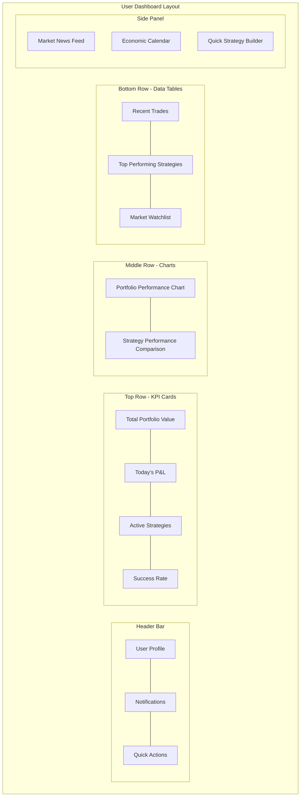

# User Dashboard Design Specification

## 📊 대시보드 개요

퀀트 백테스트 플랫폼의 유저 대시보드는 사용자의 투자 전략, 백테스트 결과,
포트폴리오 성과를 한눈에 볼 수 있는 통합 인터페이스입니다.

### 주요 목표

- **포트폴리오 성과 실시간 모니터링**
- **전략 및 백테스트 결과 요약**
- **시장 데이터 및 뉴스 피드 통합**
- **개인화된 투자 인사이트 제공**

## 🎨 대시보드 와이어프레임

### 메인 대시보드 레이아웃



### 상세 컴포넌트 구조

```
┌─────────────────────────────────────────────────────────────────────────────┐
│ 🏠 Dashboard Header                                      👤 User | 🔔 | ⚙️   │
├─────────────────────────────────────────────────────────────────────────────┤
│ 📊 KPI Cards Row                                                            │
│ ┌─────────────┐ ┌─────────────┐ ┌─────────────┐ ┌─────────────┐           │
│ │Portfolio    │ │Today's P&L  │ │Active       │ │Win Rate     │           │
│ │$125,340     │ │+$2,450 ↗️   │ │Strategies   │ │68.5%        │           │
│ │+12.5%       │ │(+1.98%)     │ │     7       │ │📈 +2.1%     │           │
│ └─────────────┘ └─────────────┘ └─────────────┘ └─────────────┘           │
├─────────────────────────────────────────────────────────────────────────────┤
│ 📈 Charts Section                                                           │
│ ┌───────────────────────────────────┐ ┌───────────────────────────────────┐ │
│ │ Portfolio Performance (6M)        │ │ Strategy Comparison               │ │
│ │                              📊   │ │                              📊   │ │
│ │   ╭─╮     ╭─╮                    │ │ Strategy A ████████░░ 78%        │ │
│ │  ╱   ╲   ╱   ╲                   │ │ Strategy B ██████░░░░ 62%        │ │
│ │ ╱     ╲ ╱     ╲                  │ │ Strategy C ███████░░░ 71%        │ │
│ └───────────────────────────────────┘ └───────────────────────────────────┘ │
├─────────────────────────────────────────────────────────────────────────────┤
│ 📋 Data Tables Section                                                      │
│ ┌─────────────────┐ ┌─────────────────┐ ┌─────────────────┐               │
│ │Recent Trades    │ │Top Strategies   │ │Watchlist        │               │
│ │AAPL +150 $23k   │ │RSI-MA   +15.2%  │ │AAPL    $180.50  │               │
│ │TSLA -50  $12k   │ │BB-RSI   +12.8%  │ │GOOGL   $145.30  │               │
│ │NVDA +75  $18k   │ │SMA-20   +8.9%   │ │MSFT    $380.75  │               │
│ └─────────────────┘ └─────────────────┘ └─────────────────┘               │
└─────────────────────────────────────────────────────────────────────────────┘
```

## 🛠️ API 엔드포인트 설계

### 대시보드 통합 API

#### 1. 대시보드 요약 데이터

```http
GET /api/v1/dashboard/summary
```

**응답 구조:**

```typescript
interface DashboardSummary {
  user_id: string;
  portfolio: {
    total_value: number;
    total_pnl: number;
    total_pnl_percentage: number;
    daily_pnl: number;
    daily_pnl_percentage: number;
  };
  strategies: {
    active_count: number;
    total_count: number;
    avg_success_rate: number;
    best_performing: StrategyPerformance;
  };
  recent_activity: {
    trades_count_today: number;
    backtests_count_week: number;
    last_login: string;
  };
}
```

#### 2. 포트폴리오 성과 차트 데이터

```http
GET /api/v1/dashboard/portfolio/performance
Query: period=[1D|1W|1M|3M|6M|1Y], granularity=[hour|day|week]
```

**응답 구조:**

```typescript
interface PortfolioPerformance {
  period: string;
  data_points: Array<{
    timestamp: string;
    portfolio_value: number;
    pnl: number;
    pnl_percentage: number;
    benchmark_value?: number;
  }>;
  summary: {
    total_return: number;
    volatility: number;
    sharpe_ratio: number;
    max_drawdown: number;
  };
}
```

#### 3. 전략 성과 비교

```http
GET /api/v1/dashboard/strategies/comparison
Query: limit=10, sort_by=[return|sharpe|win_rate]
```

**응답 구조:**

```typescript
interface StrategyComparison {
  strategies: Array<{
    strategy_id: string;
    name: string;
    type: string;
    total_return: number;
    win_rate: number;
    sharpe_ratio: number;
    trades_count: number;
    last_execution: string;
    status: "active" | "paused" | "stopped";
  }>;
}
```

#### 4. 최근 거래 내역

```http
GET /api/v1/dashboard/trades/recent
Query: limit=20, days=7
```

**응답 구조:**

```typescript
interface RecentTrades {
  trades: Array<{
    trade_id: string;
    symbol: string;
    side: "buy" | "sell";
    quantity: number;
    price: number;
    value: number;
    pnl: number;
    strategy_name: string;
    timestamp: string;
  }>;
  summary: {
    total_trades: number;
    winning_trades: number;
    total_pnl: number;
  };
}
```

#### 5. 관심종목 현재가

```http
GET /api/v1/dashboard/watchlist/quotes
```

**응답 구조:**

```typescript
interface WatchlistQuotes {
  symbols: Array<{
    symbol: string;
    name: string;
    current_price: number;
    change: number;
    change_percentage: number;
    volume: number;
    market_cap?: number;
  }>;
  last_updated: string;
}
```

#### 6. 시장 뉴스 피드

```http
GET /api/v1/dashboard/news/feed
Query: limit=10, symbols=[AAPL,GOOGL], categories=[earnings,market]
```

**응답 구조:**

```typescript
interface NewsFeed {
  articles: Array<{
    title: string;
    summary: string;
    source: string;
    url: string;
    published_at: string;
    sentiment: "positive" | "neutral" | "negative";
    relevance_score: number;
    symbols: string[];
  }>;
}
```

#### 7. 경제 캘린더

```http
GET /api/v1/dashboard/economic/calendar
Query: days=7, importance=[high|medium|low]
```

**응답 구조:**

```typescript
interface EconomicCalendar {
  events: Array<{
    event_name: string;
    country: string;
    importance: "high" | "medium" | "low";
    actual?: number;
    forecast?: number;
    previous?: number;
    release_time: string;
    currency: string;
  }>;
}
```

## 🔧 백엔드 구현 구조

### 대시보드 서비스 클래스

```python
# backend/app/services/dashboard_service.py
class DashboardService:
    def __init__(self,
                 portfolio_service: PortfolioService,
                 strategy_service: StrategyService,
                 market_data_service: MarketDataService,
                 backtest_service: BacktestService):
        self.portfolio_service = portfolio_service
        self.strategy_service = strategy_service
        self.market_data_service = market_data_service
        self.backtest_service = backtest_service

    async def get_dashboard_summary(self, user_id: str) -> DashboardSummary:
        """대시보드 요약 데이터 조회"""
        pass

    async def get_portfolio_performance(self,
                                      user_id: str,
                                      period: str = "1M") -> PortfolioPerformance:
        """포트폴리오 성과 차트 데이터"""
        pass

    async def get_strategy_comparison(self,
                                    user_id: str,
                                    limit: int = 10) -> StrategyComparison:
        """전략 성과 비교 데이터"""
        pass
```

### API 라우터

```python
# backend/app/api/routes/dashboard.py
from fastapi import APIRouter, Depends
from app.services.service_factory import service_factory

router = APIRouter(prefix="/dashboard", tags=["dashboard"])

@router.get("/summary", response_model=DashboardSummaryResponse)
async def get_dashboard_summary(user: VerifiedUser = Depends()):
    dashboard_service = service_factory.get_dashboard_service()
    return await dashboard_service.get_dashboard_summary(user.id)

@router.get("/portfolio/performance", response_model=PortfolioPerformanceResponse)
async def get_portfolio_performance(
    period: str = "1M",
    user: VerifiedUser = Depends()
):
    dashboard_service = service_factory.get_dashboard_service()
    return await dashboard_service.get_portfolio_performance(user.id, period)
```

## 📱 프론트엔드 컴포넌트 구조

### React 컴포넌트 아키텍처

```typescript
// frontend/src/components/Dashboard/
interface DashboardComponents {
  DashboardLayout: React.FC; // 전체 레이아웃
  KPICards: React.FC; // KPI 카드들
  PortfolioChart: React.FC; // 포트폴리오 성과 차트
  StrategyComparison: React.FC; // 전략 비교 차트
  RecentTrades: React.FC; // 최근 거래 테이블
  WatchlistTable: React.FC; // 관심종목 테이블
  NewsFeed: React.FC; // 뉴스 피드
  EconomicCalendar: React.FC; // 경제 캘린더
}
```

### 상태 관리 (Redux/Zustand)

```typescript
interface DashboardState {
  summary: DashboardSummary | null;
  portfolioPerformance: PortfolioPerformance | null;
  strategyComparison: StrategyComparison | null;
  recentTrades: RecentTrades | null;
  watchlistQuotes: WatchlistQuotes | null;
  newsFeed: NewsFeed | null;
  economicCalendar: EconomicCalendar | null;
  loading: boolean;
  error: string | null;
}
```

## 🚀 구현 우선순위

### Phase 1: 기본 대시보드 (2주)

1. ✅ 대시보드 API 엔드포인트 구현
2. ✅ KPI 카드 컴포넌트
3. ✅ 기본 레이아웃 및 라우팅

### Phase 2: 차트 및 시각화 (2주)

1. ✅ 포트폴리오 성과 차트 (Chart.js/Recharts)
2. ✅ 전략 비교 차트
3. ✅ 실시간 데이터 업데이트 (WebSocket)

### Phase 3: 고급 기능 (2주)

1. ✅ 뉴스 피드 통합
2. ✅ 경제 캘린더
3. ✅ 개인화 설정 (위젯 배치 등)

### Phase 4: 최적화 및 개선 (1주)

1. ✅ 성능 최적화 (캐싱, 메모이제이션)
2. ✅ 모바일 반응형 디자인
3. ✅ 사용자 경험 개선

## 📊 성능 고려사항

### 캐싱 전략

- **포트폴리오 데이터**: 5분 캐시
- **시장 데이터**: 1분 캐시
- **뉴스 데이터**: 15분 캐시
- **사용자별 데이터**: Redis 세션 캐시

### 실시간 업데이트

- **WebSocket**: 포트폴리오 가치, 시장 데이터
- **Server-Sent Events**: 뉴스 피드, 알림
- **Polling**: 경제 캘린더 (1시간 간격)

### 데이터 압축

- **API 응답**: Gzip 압축
- **차트 데이터**: 데이터 포인트 샘플링
- **이미지**: WebP 포맷 사용

## 🔐 보안 고려사항

### 데이터 접근 제어

- **사용자별 데이터 격리**: user_id 기반 필터링
- **API Rate Limiting**: 사용자당 100 requests/minute
- **민감 정보 마스킹**: 계좌 번호, 개인정보

### 인증 및 권한

- **JWT 토큰**: 모든 대시보드 API 인증 필요
- **세션 관리**: 30분 자동 로그아웃
- **권한 검증**: 데이터 접근 전 권한 확인

## 📈 모니터링 및 분석

### 성능 메트릭

- **API 응답 시간**: 평균 < 200ms
- **차트 렌더링**: < 1초
- **실시간 업데이트 지연**: < 5초

### 사용자 행동 분석

- **대시보드 방문 빈도**
- **가장 많이 사용되는 위젯**
- **차트 상호작용 패턴**
- **모바일 vs 데스크톱 사용률**

이 설계 문서를 기반으로 단계적으로 대시보드를 구현할 수 있으며, 각 컴포넌트는
독립적으로 개발 및 테스트가 가능합니다.
