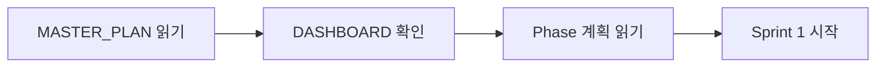
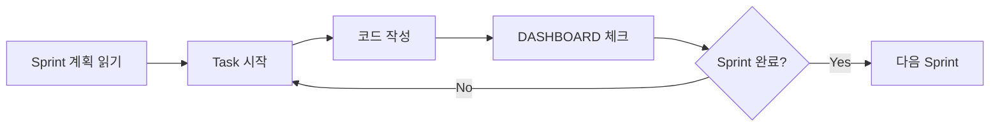
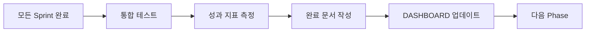

# GenAI Enhancement Project

**프로젝트**: OpenAI 클라이언트 중앙화 + RAG 통합  
**기간**: 2025-10-15 ~ 2025-11-15 (4주)  
**목표**: 비용 50-80% 절감 + 응답 품질 개선

---

## 📋 프로젝트 개요

### 목적

1. **비용 최적화**: OpenAI API 비용 50-80% 절감
2. **응답 품질**: RAG 기반 사용자 컨텍스트 활용
3. **유지보수성**: 중앙화된 클라이언트 관리
4. **확장성**: 모델 선택 API

### 주요 문서

- **[MASTER_PLAN.md](./MASTER_PLAN.md)** - Phase/Sprint 전체 계획
- **[DASHBOARD.md](./DASHBOARD.md)** - 프로젝트 진행 현황
- **[설계 문서](../GENAI_OPENAI_CLIENT_DESIGN.md)** - 기술 설계 상세
- **[Phase 1 계획](./phase1/PHASE1_PLAN.md)** - OpenAI Client Manager
- **[Phase 2 계획](./phase2/PHASE2_PLAN.md)** - RAG Integration

---

## 🚀 빠른 시작 (Quick Start)

### 1. 문서 읽기 순서

1. **README.md** (현재 파일) - 작업 지침
2. **MASTER_PLAN.md** - 전체 Phase/Sprint 구조 파악
3. **DASHBOARD.md** - 현재 진행 상황 확인
4. **해당 Phase 계획** - 상세 Task 확인

### 2. Sprint 시작 전 체크리스트

- [ ] DASHBOARD.md에서 Sprint 상태 확인
- [ ] 해당 Sprint Tasks 읽기
- [ ] 완료 조건 (Definition of Done) 확인
- [ ] 리스크 검토

### 3. Sprint 진행 중

- [ ] Task 완료 시 DASHBOARD.md 체크박스 업데이트
- [ ] 주요 이슈 발생 시 DASHBOARD.md "Issues & Blockers" 섹션에 기록
- [ ] ❌ **별도 문서 작성 안 함** (Phase 완료 시만 작성)

### 4. Sprint 완료 후

- [ ] DASHBOARD.md Sprint 진행률 업데이트
- [ ] 다음 Sprint 준비

### 5. Phase 완료 후

- [ ] **Phase 완료 문서 작성** (예: `phase1/PHASE1_COMPLETION_REPORT.md`)
- [ ] DASHBOARD.md Phase 상태 업데이트
- [ ] MASTER_PLAN.md 진행률 업데이트

---

## 📝 문서 작성 규칙 (CRITICAL)

### ✅ 작성해야 하는 문서

#### Phase 완료 시 (필수)

**파일명**: `phase{N}/PHASE{N}_COMPLETION_REPORT.md`

**포함 내용**:

1. **Phase 목표 달성 여부**
   - 완료 기준 (Definition of Done) 체크
   - 달성률 (%)
2. **주요 산출물 목록**
   - 생성/수정된 파일 목록
   - 코드 라인 수
3. **성과 지표**
   - 비용 절감 (Phase 1: 30%+, Phase 2: 50%+)
   - 응답 시간 (< 500ms)
   - 테스트 커버리지 (80%+)
4. **주요 이슈 및 해결 방법**
   - 발생한 문제 3가지 이내
   - 해결 방안
5. **다음 Phase 권장사항**
   - 개선 포인트
   - 주의사항

**예시 구조**:

```markdown
# Phase 1 Completion Report

**완료일**: 2025-10-29 **진행 기간**: 8일

## 목표 달성 여부

- ✅ OpenAIClientManager 구현 (100%)
- ✅ 3개 서비스 리팩토링 (100%)
- ✅ 모델 선택 API (100%)
- ✅ 비용 절감 35% 달성 (목표: 30%)

## 주요 산출물

- `openai_client_manager.py` (520 lines)
- API 5개 (2 GET, 3 POST 수정)
- 테스트 12개 (커버리지 85%)

## 성과 지표

- 비용 절감: 35% ($100 → $65)
- 응답 시간: +5ms (허용 범위 내)
- 테스트 커버리지: 85%

## 주요 이슈

1. **Rate Limit 초과**: Retry 로직 추가로 해결
2. **테스트 환경 설정**: Mock OpenAI API 구현

## 다음 Phase 권장사항

- ChromaDB 의존성 사전 테스트 필요
- RAG 프롬프트 템플릿 준비
```

### ❌ 작성하지 않는 문서

#### Sprint 완료 시 (작성 안 함)

- ❌ `SPRINT1_1_COMPLETION.md` (작성 안 함)
- ❌ `TASK1_1_1_REPORT.md` (작성 안 함)

**대신**:

- ✅ DASHBOARD.md 체크박스 업데이트
- ✅ 주요 이슈만 DASHBOARD.md에 기록

**이유**: 문서가 너무 많아지면 오히려 혼란

#### Task 완료 시 (작성 안 함)

- ❌ 개별 Task 완료 문서 (작성 안 함)

**대신**:

- ✅ DASHBOARD.md 체크박스 업데이트
- ✅ 코드 커밋 메시지에 Task ID 포함 (`T1.1.1: Add ModelTier enum`)

---

## 🎯 작업 흐름 (Workflow)

### Phase 시작



### Sprint 진행



### Phase 완료



---

## 📊 진행 상황 확인 방법

### 1. 전체 진행률

**위치**: `DASHBOARD.md` 상단 "프로젝트 요약" 테이블

```markdown
| 항목            | 목표 | 현재 상태 | 달성률 |
| --------------- | ---- | --------- | ------ |
| **전체 진행률** | 100% | -         | 35%    |
```

### 2. Phase 진행률

**위치**: `DASHBOARD.md` "Phase 진행 현황" 섹션

```markdown
### Phase 1: OpenAI Client Manager 🚀 **진행중**

**진행률**: 50% (2/4 sprints)
```

### 3. Sprint 진행률

**위치**: `DASHBOARD.md` Sprint 테이블

```markdown
| Sprint | 제목 | 상태      | 진행률 | Tasks     |
| ------ | ---- | --------- | ------ | --------- |
| 1.1    | ...  | ✅ 완료   | 100%   | 7/7 tasks |
| 1.2    | ...  | 🚀 진행중 | 60%    | 3/5 tasks |
```

### 4. 주요 이슈

**위치**: `DASHBOARD.md` "주요 이슈 및 차단 사항" 섹션

```markdown
### 활성 이슈

1. **OpenAI Rate Limit 초과** (Sprint 1.2)
   - 영향: API 테스트 지연
   - 해결 방안: Retry 로직 추가 중
   - 담당: Backend
```

---

## 🚨 주의사항 (CRITICAL)

### 1. 문서 작성 최소화

- ✅ **Phase 완료 시만 문서 작성**
- ❌ Sprint/Task 완료 시 문서 작성 안 함
- ✅ DASHBOARD.md만 업데이트

**이유**: 문서가 너무 많으면 유지보수 부담 증가

### 2. DASHBOARD.md 업데이트 규칙

#### 자주 업데이트 (매일)

- ✅ Task 체크박스
- ✅ Sprint 진행률 (%)
- ✅ 주요 이슈 (문제 발생 시)

#### 가끔 업데이트 (Sprint 완료 시)

- ✅ Sprint 상태 (대기중 → 진행중 → 완료)
- ✅ 성과 지표 (비용, 응답 시간 등)

#### 드물게 업데이트 (Phase 완료 시)

- ✅ Phase 진행률
- ✅ 전체 진행률

### 3. 개별 Task 상세 업데이트 금지

❌ **잘못된 예시** (너무 상세):

```markdown
### 활성 이슈

1. T1.1.1: ModelTier Enum 완료 (10:00)
2. T1.1.2: ModelConfig 작성 중 (10:30)
3. T1.1.3: 점심 식사 (12:00)
```

✅ **올바른 예시** (주요 이슈만):

```markdown
### 활성 이슈

1. **Pydantic 버전 충돌** (Sprint 1.1)
   - 영향: ModelConfig 생성 지연
   - 해결 방안: Pydantic v2로 업그레이드
```

### 4. 커밋 메시지 규칙

**포맷**: `[Task ID] 간단한 설명`

**예시**:

```bash
git commit -m "T1.1.1: Add ModelTier and ModelCapability enums"
git commit -m "T1.2.1: Refactor StrategyBuilderService to use OpenAIClientManager"
git commit -m "T2.3.2: Add RAG prompt quality evaluation tests"
```

---

## 🔗 외부 문서 업데이트

### AGENTS.md 업데이트

**위치**: `/Users/donghakim/quant/AGENTS.md`

**추가 내용** (Documentation Index 섹션):

```markdown
## Documentation Index

...

- **GenAI Enhancement**:
  [docs/backend/gen_ai_enhancement/](./docs/backend/gen_ai_enhancement/)
  - [Master Plan](./docs/backend/gen_ai_enhancement/MASTER_PLAN.md) -
    Phase/Sprint 계획
  - [Dashboard](./docs/backend/gen_ai_enhancement/DASHBOARD.md) - 진행 현황
  - [README](./docs/backend/gen_ai_enhancement/README.md) - 작업 지침

**문서 작성 규칙**:

- ✅ Phase 완료 시만 문서 작성
- ❌ Sprint/Task 완료 시 문서 작성 안 함
- ✅ DASHBOARD.md만 업데이트
```

### copilot-instructions.md 업데이트

**위치**: `/Users/donghakim/quant/.github/copilot-instructions.md`

**추가 내용** (주요 개선 프로젝트 문서 섹션):

```markdown
### GenAI Enhancement (진행 중)

- **Master Plan**: `docs/backend/gen_ai_enhancement/MASTER_PLAN.md`
  - Phase 1: OpenAI Client Manager (2주)
  - Phase 2: RAG Integration (2주)
- **Dashboard**: `docs/backend/gen_ai_enhancement/DASHBOARD.md`
  - 진행률, 주요 이슈, 성과 지표
- **README**: `docs/backend/gen_ai_enhancement/README.md`
  - 작업 지침, 문서 작성 규칙

**문서 작성 규칙 (CRITICAL)**:

- ✅ **Phase 완료 시만 문서 작성** (`PHASE{N}_COMPLETION_REPORT.md`)
- ❌ **Sprint/Task 완료 시 문서 작성 안 함**
- ✅ **DASHBOARD.md만 업데이트** (체크박스, 진행률, 주요 이슈)
- ❌ **개별 Task 상세 업데이트 금지** (주요 이슈만 기록)

상세 가이드: `docs/backend/gen_ai_enhancement/README.md`
```

---

## 📞 지원 및 문의

### 문서 관련

- **MASTER_PLAN.md**: Phase/Sprint 구조 확인
- **DASHBOARD.md**: 진행 현황 확인
- **README.md**: 작업 지침 (현재 파일)

### 기술 관련

- **설계 문서**: `../GENAI_OPENAI_CLIENT_DESIGN.md`
- **Phase 계획**: `phase1/PHASE1_PLAN.md`, `phase2/PHASE2_PLAN.md`

---

**마지막 업데이트**: 2025-10-15  
**다음 리뷰**: Sprint 1.1 완료 시
