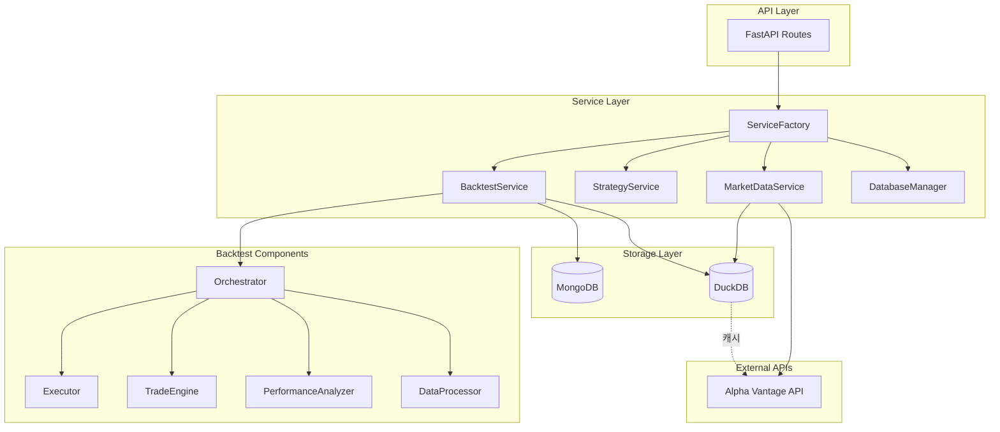
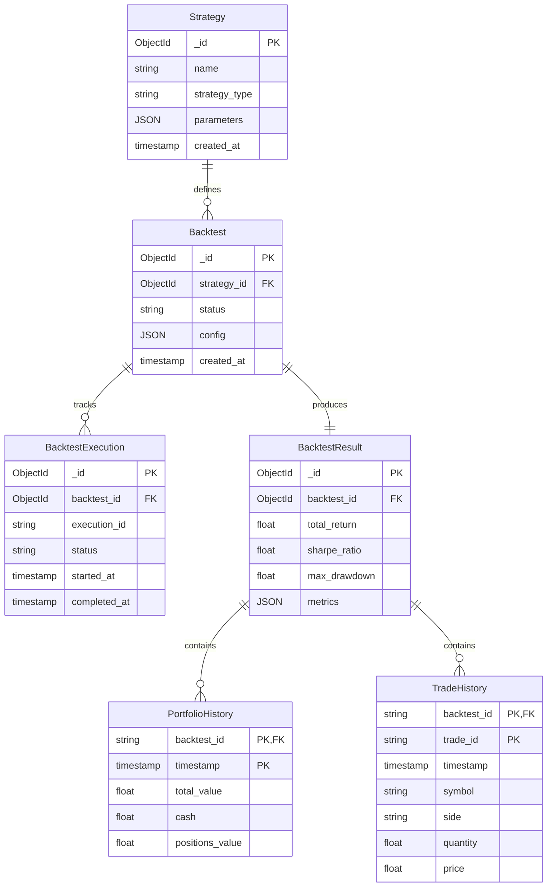
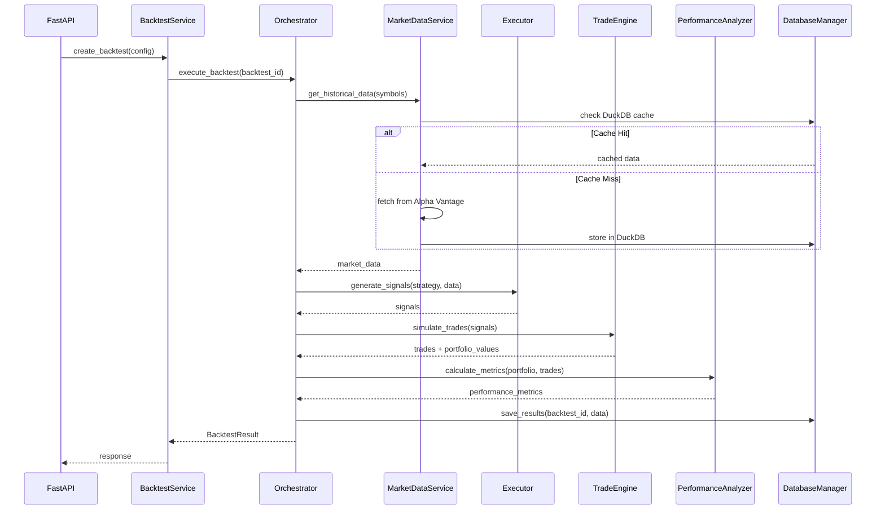
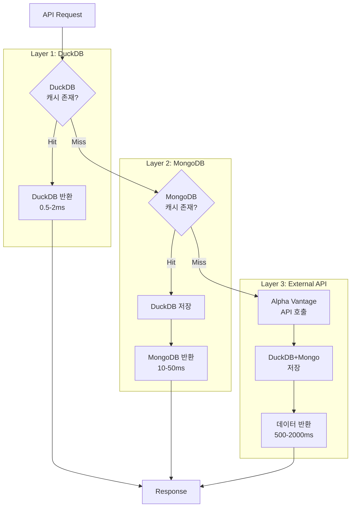
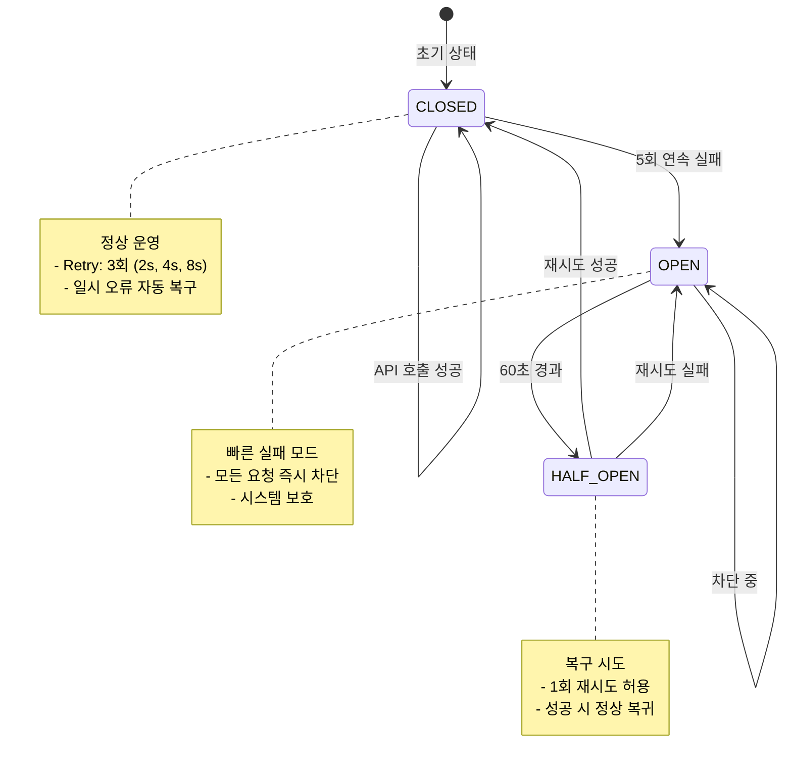

# Strategy & Backtest Architecture

## 개요

**목적**: 퀀트 트레이딩 전략 백테스트 시스템  
**핵심 기능**: 전략 관리, 시장 데이터 수집, 백테스트 실행, 성과 분석  
**기술 스택**: FastAPI, MongoDB, DuckDB, Alpha Vantage API

### 시스템 구성

## 기능 목록

| 기능                | 엔드포인트                              | 서비스 레이어                                                           | 설명                    | 참고사항         |
| ------------------- | --------------------------------------- | ----------------------------------------------------------------------- | ----------------------- | ---------------- |
| 전략 목록 조회      | `GET /strategies`                       | `StrategyService.get_strategies()`                                      | 저장된 전략 템플릿 목록 | MongoDB 조회     |
| 전략 생성           | `POST /strategies`                      | `StrategyService.create_strategy()`                                     | 새 전략 템플릿 생성     | 파라미터 검증    |
| 백테스트 생성       | `POST /backtests`                       | `BacktestService.create_backtest()` → `Orchestrator.execute_backtest()` | 백테스트 실행 요청      | 비동기 실행      |
| 백테스트 상태 조회  | `GET /backtests/{id}`                   | `BacktestService.get_backtest()`                                        | 실행 상태 및 결과       | MongoDB 조회     |
| 포트폴리오 히스토리 | `GET /backtests/{id}/portfolio-history` | `DatabaseManager.get_portfolio_history()`                               | 시계열 포트폴리오 변화  | DuckDB 고속 조회 |
| 거래 내역           | `GET /backtests/{id}/trades-history`    | `DatabaseManager.get_trades_history()`                                  | 실행된 거래 목록        | DuckDB 고속 조회 |
| 시장 데이터 조회    | `GET /market-data/{symbol}`             | `MarketDataService.stock.get_historical_data()`                         | 주가 데이터             | 3-Layer 캐시     |

## ERD

## 모듈 연동 구조

### 1. 백테스트 실행 플로우

### 2. 3-Layer 캐싱 시스템

### 3. 에러 처리 (Circuit Breaker + Retry)

### 4. 데이터 품질 모니터링 흐름

- MarketDataService의 일별 주가 적재가 `DataQualitySentinel`을 호출하여 Isolation
  Forest와 Prophet 기반 이상 점수, 거래량 Z-Score를 계산하고 `DailyPrice`
  다큐먼트의 `iso_anomaly_score`, `prophet_anomaly_score`, `volume_z_score`,
  `anomaly_severity`, `anomaly_reasons` 필드를 갱신한다.
- 이상이 감지되면 `DataQualityEvent` 컬렉션에 영속화되며, ServiceFactory에서
  공유하는 센티널 싱글톤이 심각도 HIGH 이상을 환경 변수(`DATA_QUALITY_WEBHOOK_URL`)
  기반 웹훅으로 전송한다.
- DashboardService는 `DataQualitySummary` 구조를 생성해 최근 24시간 경보, 심각도별
  집계, 상세 메시지를 사용자 대시보드에 노출하여 전략·백테스트 운영자가 데이터 품질을
  즉시 확인할 수 있다.

## 로드맵

### Phase 1 (완료): 의존성 주입 개선

- ✅ ServiceFactory 싱글톤 패턴
- ✅ 순환 참조 제거
- ✅ 타입 안전성 강화

### Phase 2 (완료): 레이어드 아키텍처

- ✅ Orchestrator 패턴
- ✅ StrategyExecutor 분리
- ✅ TradeEngine 독립화
- ✅ PerformanceAnalyzer 모듈화
- ✅ DataProcessor 생성

### Phase 3 (완료): 성능 최적화

- ✅ P3.0: API 중복 제거 (3개 엔드포인트)
- ✅ P3.1: 단위 테스트 (23개)
- ✅ P3.2: 병렬 데이터 수집 (3-10배 속도)
- ✅ P3.2: DuckDB 시계열 저장 (97% 성능 향상)
- ✅ P3.3: Circuit Breaker + Retry 로직
- ✅ P3.4: 구조화 로깅 (structlog)

### Phase 4 (계획): 고급 기능

- [ ] 실시간 백테스트
- [ ] 멀티 전략 포트폴리오
- [ ] 머신러닝 전략 지원
- [ ] 분산 처리 (Celery)
- [ ] 웹소켓 실시간 업데이트

## 핵심 설계 원칙

1. **단일 책임**: 각 컴포넌트는 하나의 명확한 역할
2. **의존성 역전**: ServiceFactory를 통한 주입
3. **캐싱 우선**: DuckDB → MongoDB → API 순서
4. **장애 격리**: Circuit Breaker로 연쇄 실패 방지
5. **성능 우선**: 병렬 처리 + DuckDB OLAP
