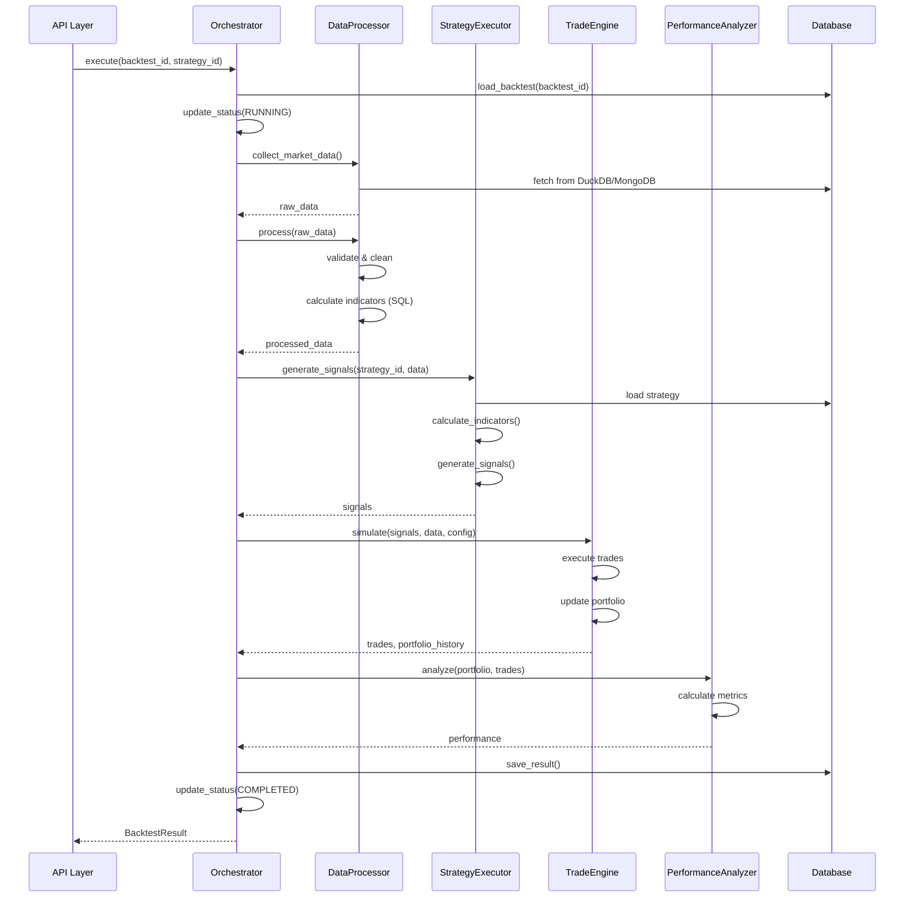

# 새로운 Strategy & Backtest 아키텍처 설계

> **설계 목표**: 확장 가능하고 유지보수하기 쉬운 백테스트 시스템  
> **적용 시기**: Phase 2-4 (3-12주)

## 📋 목차

1. [아키텍처 개요](#1-아키텍처-개요)
2. [레이어별 상세 설계](#2-레이어별-상세-설계)
3. [핵심 컴포넌트 설계](#3-핵심-컴포넌트-설계)
4. [데이터 흐름](#4-데이터-흐름)
5. [확장 포인트](#5-확장-포인트)
6. [성능 최적화 전략](#6-성능-최적화-전략)

---

## 1. 아키텍처 개요

### 1.1 전체 구조

```
┌────────────────────────────────────────────────────────────┐
│                      API Layer                             │
│  - FastAPI Routes (backtests.py, strategies.py)           │
│  - Request/Response Models (Pydantic Schemas)             │
└────────────────────────────────────────────────────────────┘
                            ↓
┌────────────────────────────────────────────────────────────┐
│                  Application Layer                         │
│                                                            │
│  ┌──────────────────┐  ┌──────────────────┐              │
│  │ BacktestOrchestrator│ StrategyManager   │              │
│  │ - Workflow 관리   │ │ - 전략 생성/조회  │              │
│  │ - 상태 추적       │ │ - 전략 검증      │              │
│  └──────────────────┘  └──────────────────┘              │
│                                                            │
│  ┌──────────────────┐  ┌──────────────────┐              │
│  │ StrategyExecutor │  │ PerformanceAnalyzer│            │
│  │ - 신호 생성       │ │ - 성과 계산       │              │
│  │ - 전략 실행       │ │ - 리스크 분석     │              │
│  └──────────────────┘  └──────────────────┘              │
│                                                            │
│  ┌──────────────────┐  ┌──────────────────┐              │
│  │   TradeEngine    │  │ DataProcessor    │              │
│  │ - 주문 실행       │ │ - 데이터 정제     │              │
│  │ - 포트폴리오 관리 │ │ - 지표 계산       │              │
│  └──────────────────┘  └──────────────────┘              │
└────────────────────────────────────────────────────────────┘
                            ↓
┌────────────────────────────────────────────────────────────┐
│                    Domain Layer                            │
│                                                            │
│  ┌──────────────┐  ┌──────────────┐  ┌──────────────┐    │
│  │  Strategy    │  │  Backtest    │  │    Trade     │    │
│  │  - 전략 정의  │  │  - 백테스트  │  │  - 거래 기록  │    │
│  │  - 파라미터   │  │  - 설정      │  │  - 실행 상태  │    │
│  └──────────────┘  └──────────────┘  └──────────────┘    │
│                                                            │
│  ┌──────────────┐  ┌──────────────┐  ┌──────────────┐    │
│  │  Portfolio   │  │ Performance  │  │    Signal    │    │
│  │  - 포지션     │  │  - 성과 지표  │  │  - 매매 신호  │    │
│  │  - 자산 배분  │  │  - 리스크     │  │  - 신호 강도  │    │
│  └──────────────┘  └──────────────┘  └──────────────┘    │
└────────────────────────────────────────────────────────────┘
                            ↓
┌────────────────────────────────────────────────────────────┐
│                Infrastructure Layer                        │
│                                                            │
│  ┌──────────────────┐  ┌──────────────────┐              │
│  │   MongoDB        │  │    DuckDB        │              │
│  │ - 메타데이터      │ │ - 시계열 데이터   │              │
│  │ - 사용자 정보     │ │ - 성과 분석       │              │
│  │ - 전략/백테스트   │ │ - 고속 쿼리       │              │
│  └──────────────────┘  └──────────────────┘              │
│                                                            │
│  ┌──────────────────┐  ┌──────────────────┐              │
│  │ MarketDataService│  │   CacheManager   │              │
│  │ - Alpha Vantage  │  │ - Redis (선택)    │              │
│  │ - 데이터 수집     │ │ - 메모리 캐시     │              │
│  └──────────────────┘  └──────────────────┘              │
└────────────────────────────────────────────────────────────┘
```

### 1.2 디렉토리 구조 (개선안)

```
backend/app/
├── api/
│   └── routes/
│       ├── backtests.py              # 백테스트 API
│       └── strategies/
│           ├── strategy.py           # 전략 CRUD
│           └── template.py           # 전략 템플릿
│
├── services/
│   ├── backtest/
│   │   ├── __init__.py
│   │   ├── orchestrator.py          # 백테스트 조율 (NEW)
│   │   ├── executor.py              # 전략 실행 (NEW)
│   │   ├── trade_engine.py          # 거래 엔진 (NEW)
│   │   ├── performance.py           # 성과 분석 (NEW)
│   │   └── data_processor.py        # 데이터 처리 (NEW)
│   │
│   ├── strategy/
│   │   ├── __init__.py
│   │   ├── manager.py               # 전략 관리 (REFACTOR)
│   │   └── factory.py               # 전략 팩토리 (NEW)
│   │
│   ├── backtest_service.py          # CRUD only (REFACTOR)
│   ├── strategy_service.py          # CRUD only (REFACTOR)
│   ├── market_data_service/
│   ├── database_manager.py
│   └── service_factory.py
│
├── strategies/
│   ├── __init__.py
│   ├── protocol.py                  # 전략 프로토콜 (NEW)
│   ├── base_strategy.py
│   ├── configs.py                   # 전략별 Config (NEW)
│   ├── sma_crossover.py
│   ├── rsi_mean_reversion.py
│   ├── momentum.py
│   └── buy_and_hold.py
│
├── models/
│   ├── backtest.py
│   ├── strategy.py
│   ├── performance.py
│   └── market_data/
│
├── schemas/
│   ├── backtest.py
│   └── strategy.py
│
└── utils/
    ├── indicators.py                # 기술적 지표 (NEW)
    └── validators.py                # 데이터 검증 (NEW)
```

---

## 2. 레이어별 상세 설계

### 2.1 Application Layer

#### BacktestOrchestrator (신규)

**책임**: 백테스트 전체 워크플로우 조율

```python
# services/backtest/orchestrator.py

from typing import Optional
from datetime import datetime
import logging

from app.models.backtest import Backtest, BacktestResult, BacktestStatus
from app.services.backtest.executor import StrategyExecutor
from app.services.backtest.trade_engine import TradeEngine
from app.services.backtest.performance import PerformanceAnalyzer
from app.services.backtest.data_processor import DataProcessor
from app.services.market_data_service import MarketDataService

logger = logging.getLogger(__name__)


class BacktestOrchestrator:
    """백테스트 워크플로우 조율자"""

    def __init__(
        self,
        market_data_service: MarketDataService,
        strategy_executor: StrategyExecutor,
        trade_engine: TradeEngine,
        performance_analyzer: PerformanceAnalyzer,
        data_processor: DataProcessor,
    ):
        self.market_data = market_data_service
        self.strategy_executor = strategy_executor
        self.trade_engine = trade_engine
        self.performance = performance_analyzer
        self.data_processor = data_processor

    async def execute(
        self,
        backtest_id: str,
        strategy_id: str,
    ) -> Optional[BacktestResult]:
        """백테스트 실행 파이프라인

        Workflow:
        1. 백테스트 조회 및 상태 업데이트
        2. 시장 데이터 수집 및 정제
        3. 데이터 검증 및 전처리
        4. 전략 신호 생성
        5. 거래 시뮬레이션
        6. 성과 분석
        7. 결과 저장 및 상태 업데이트
        """
        backtest = None

        try:
            # 1. 백테스트 조회
            backtest = await self._load_backtest(backtest_id)
            await self._update_status(backtest, BacktestStatus.RUNNING)

            logger.info(f"Starting backtest: {backtest.name}")

            # 2. 시장 데이터 수집
            market_data = await self._collect_market_data(backtest)

            # 3. 데이터 정제 및 검증
            processed_data = await self.data_processor.process(
                data=market_data,
                symbols=backtest.config.symbols,
                start_date=backtest.config.start_date,
                end_date=backtest.config.end_date,
            )

            # 4. 전략 신호 생성
            signals = await self.strategy_executor.generate_signals(
                strategy_id=strategy_id,
                data=processed_data,
            )

            # 5. 거래 시뮬레이션
            trades, portfolio_history = await self.trade_engine.simulate(
                signals=signals,
                market_data=processed_data,
                config=backtest.config,
            )

            # 6. 성과 분석
            performance = await self.performance.analyze(
                portfolio_history=portfolio_history,
                trades=trades,
                benchmark_data=None,  # TODO: 벤치마크 추가
            )

            # 7. 결과 저장
            result = await self._save_result(
                backtest=backtest,
                performance=performance,
                trades=trades,
                portfolio_history=portfolio_history,
            )

            # 8. 상태 업데이트
            await self._update_status(backtest, BacktestStatus.COMPLETED)

            logger.info(f"Backtest completed: {backtest.name}")
            return result

        except Exception as e:
            logger.error(f"Backtest failed: {e}", exc_info=True)

            if backtest:
                backtest.status = BacktestStatus.FAILED
                backtest.error_message = str(e)
                await backtest.save()

            raise

    async def _load_backtest(self, backtest_id: str) -> Backtest:
        """백테스트 조회"""
        backtest = await Backtest.get(backtest_id)
        if not backtest:
            raise ValueError(f"Backtest not found: {backtest_id}")
        return backtest

    async def _collect_market_data(self, backtest: Backtest) -> dict:
        """시장 데이터 수집"""
        data = {}

        for symbol in backtest.config.symbols:
            symbol_data = await self.market_data.stock.get_historical_data(
                symbol=symbol,
                start_date=backtest.config.start_date,
                end_date=backtest.config.end_date,
            )

            if symbol_data:
                data[symbol] = symbol_data
                logger.info(f"Collected data for {symbol}: {len(symbol_data)} records")

        if not data:
            raise ValueError("No market data collected")

        return data

    async def _update_status(
        self,
        backtest: Backtest,
        status: BacktestStatus,
    ) -> None:
        """백테스트 상태 업데이트"""
        backtest.status = status

        if status == BacktestStatus.RUNNING:
            backtest.start_time = datetime.now()
        elif status in [BacktestStatus.COMPLETED, BacktestStatus.FAILED]:
            backtest.end_time = datetime.now()
            if backtest.start_time:
                backtest.duration_seconds = (
                    backtest.end_time - backtest.start_time
                ).total_seconds()

        await backtest.save()

    async def _save_result(
        self,
        backtest: Backtest,
        performance,
        trades,
        portfolio_history,
    ) -> BacktestResult:
        """결과 저장"""
        result = BacktestResult(
            backtest_id=str(backtest.id),
            performance=performance,
            final_portfolio_value=portfolio_history[-1] if portfolio_history else 0,
            total_trades=len(trades),
        )

        await result.insert()

        # DuckDB에도 저장 (고속 쿼리용)
        await self._save_to_duckdb(result, trades, portfolio_history)

        return result

    async def _save_to_duckdb(self, result, trades, portfolio_history):
        """DuckDB에 결과 저장 (구현 필요)"""
        pass
```

#### StrategyExecutor (신규)

**책임**: 전략 실행 및 신호 생성

```python
# services/backtest/executor.py

from typing import List, Dict, Any
import pandas as pd

from app.strategies.protocol import TradingStrategy
from app.services.strategy.manager import StrategyManager


class StrategyExecutor:
    """전략 실행기"""

    def __init__(self, strategy_manager: StrategyManager):
        self.strategy_manager = strategy_manager

    async def generate_signals(
        self,
        strategy_id: str,
        data: pd.DataFrame,
    ) -> List[Dict[str, Any]]:
        """전략 신호 생성

        Args:
            strategy_id: 전략 ID
            data: 시장 데이터 (정제된 상태)

        Returns:
            신호 목록 [{'symbol': str, 'action': str, 'quantity': float, ...}]
        """
        # 1. 전략 인스턴스 가져오기
        strategy = await self.strategy_manager.get_instance(strategy_id)

        # 2. 전략 초기화
        strategy.initialize(data)

        # 3. 기술적 지표 계산
        data_with_indicators = strategy.calculate_indicators(data)

        # 4. 신호 생성
        raw_signals = strategy.generate_signals(data_with_indicators)

        # 5. 신호 변환 (StrategySignal -> dict)
        signals = self._convert_signals(raw_signals)

        return signals

    def _convert_signals(self, raw_signals) -> List[Dict[str, Any]]:
        """신호 변환"""
        return [
            {
                'symbol': signal.symbol,
                'action': signal.signal_type.value,
                'quantity': self._calculate_quantity(signal),
                'strength': signal.strength,
                'timestamp': signal.timestamp,
                'signal_id': str(id(signal)),
                'metadata': signal.metadata,
            }
            for signal in raw_signals
        ]

    def _calculate_quantity(self, signal) -> float:
        """신호 강도 기반 수량 계산"""
        # 기본 수량 * 신호 강도
        base_quantity = 10
        return base_quantity * signal.strength
```

### 2.2 Domain Layer

#### Strategy Protocol (신규)

**책임**: 전략 인터페이스 표준화

```python
# strategies/protocol.py

from typing import Protocol, runtime_checkable
import pandas as pd

from app.strategies.base_strategy import StrategySignal


@runtime_checkable
class TradingStrategy(Protocol):
    """거래 전략 프로토콜

    모든 전략은 이 프로토콜을 따라야 합니다.
    덕 타이핑을 통한 유연한 전략 확장을 지원합니다.
    """

    def initialize(self, data: pd.DataFrame) -> None:
        """전략 초기화

        Args:
            data: 초기 시장 데이터
        """
        ...

    def calculate_indicators(self, data: pd.DataFrame) -> pd.DataFrame:
        """기술적 지표 계산

        Args:
            data: 원본 시장 데이터

        Returns:
            지표가 추가된 데이터프레임
        """
        ...

    def generate_signals(self, data: pd.DataFrame) -> list[StrategySignal]:
        """매매 신호 생성

        Args:
            data: 지표가 계산된 시장 데이터

        Returns:
            생성된 신호 목록
        """
        ...

    def validate_parameters(self) -> bool:
        """파라미터 유효성 검증

        Returns:
            유효성 여부
        """
        ...
```

#### Portfolio 모델 (강화)

```python
# models/portfolio.py

from pydantic import BaseModel, Field
from datetime import datetime
from typing import Dict, Optional


class Position(BaseModel):
    """포지션 정보"""

    symbol: str
    quantity: float = Field(ge=0)
    avg_cost: float = Field(gt=0)
    current_price: float = Field(gt=0)

    @property
    def market_value(self) -> float:
        """시장 가치"""
        return self.quantity * self.current_price

    @property
    def unrealized_pnl(self) -> float:
        """미실현 손익"""
        return (self.current_price - self.avg_cost) * self.quantity

    @property
    def unrealized_pnl_pct(self) -> float:
        """미실현 손익률"""
        return (self.current_price - self.avg_cost) / self.avg_cost


class Portfolio(BaseModel):
    """포트폴리오"""

    cash: float = Field(ge=0)
    positions: Dict[str, Position] = Field(default_factory=dict)
    timestamp: datetime = Field(default_factory=datetime.now)

    @property
    def total_equity(self) -> float:
        """총 자산"""
        return self.cash + self.total_market_value

    @property
    def total_market_value(self) -> float:
        """총 시장 가치"""
        return sum(pos.market_value for pos in self.positions.values())

    @property
    def total_unrealized_pnl(self) -> float:
        """총 미실현 손익"""
        return sum(pos.unrealized_pnl for pos in self.positions.values())

    def update_prices(self, prices: Dict[str, float]) -> None:
        """가격 업데이트"""
        for symbol, price in prices.items():
            if symbol in self.positions:
                self.positions[symbol].current_price = price

    def add_position(
        self,
        symbol: str,
        quantity: float,
        price: float,
    ) -> None:
        """포지션 추가 (매수)"""
        if symbol in self.positions:
            # 평균 단가 계산
            pos = self.positions[symbol]
            total_cost = (pos.quantity * pos.avg_cost) + (quantity * price)
            new_quantity = pos.quantity + quantity
            pos.quantity = new_quantity
            pos.avg_cost = total_cost / new_quantity
        else:
            self.positions[symbol] = Position(
                symbol=symbol,
                quantity=quantity,
                avg_cost=price,
                current_price=price,
            )

    def reduce_position(
        self,
        symbol: str,
        quantity: float,
    ) -> Optional[float]:
        """포지션 감소 (매도)

        Returns:
            실현 손익 (realized P&L)
        """
        if symbol not in self.positions:
            return None

        pos = self.positions[symbol]

        if pos.quantity < quantity:
            return None

        # 실현 손익 계산
        realized_pnl = (pos.current_price - pos.avg_cost) * quantity

        pos.quantity -= quantity

        if pos.quantity == 0:
            del self.positions[symbol]

        return realized_pnl
```

---

## 3. 핵심 컴포넌트 설계

### 3.1 PerformanceAnalyzer (신규)

**책임**: 통합 성과 분석

```python
# services/backtest/performance.py

import numpy as np
from typing import List, Optional
from datetime import datetime

from app.models.performance import PerformanceMetrics
from app.models.backtest import Trade


class PerformanceAnalyzer:
    """통합 성과 분석기"""

    def __init__(self, risk_free_rate: float = 0.02):
        self.risk_free_rate = risk_free_rate

    async def analyze(
        self,
        portfolio_history: List[float],
        trades: List[Trade],
        benchmark_data: Optional[List[float]] = None,
    ) -> PerformanceMetrics:
        """종합 성과 분석"""

        if not portfolio_history or len(portfolio_history) < 2:
            return self._empty_metrics()

        initial_value = portfolio_history[0]

        # 기본 지표
        total_return = self._total_return(portfolio_history)
        annualized_return = self._annualized_return(portfolio_history)
        volatility = self._volatility(portfolio_history)

        # 리스크 조정 수익률
        sharpe = self._sharpe_ratio(annualized_return, volatility)
        sortino = self._sortino_ratio(portfolio_history)

        # 낙폭 분석
        max_dd = self._max_drawdown(portfolio_history)
        calmar = self._calmar_ratio(annualized_return, max_dd)

        # 거래 통계
        trade_stats = self._trade_statistics(trades)

        # 벤치마크 비교
        alpha = None
        beta = None
        if benchmark_data:
            alpha, beta = self._alpha_beta(portfolio_history, benchmark_data)

        return PerformanceMetrics(
            # 수익률
            total_return=total_return,
            annualized_return=annualized_return,

            # 리스크
            volatility=volatility,
            max_drawdown=max_dd,

            # 리스크 조정 수익률
            sharpe_ratio=sharpe,
            sortino_ratio=sortino,
            calmar_ratio=calmar,

            # 거래 통계
            total_trades=trade_stats['total'],
            win_rate=trade_stats['win_rate'],
            avg_profit=trade_stats['avg_profit'],
            avg_loss=trade_stats['avg_loss'],
            profit_factor=trade_stats['profit_factor'],

            # 벤치마크
            alpha=alpha,
            beta=beta,
        )

    def _total_return(self, values: List[float]) -> float:
        """총 수익률"""
        return (values[-1] - values[0]) / values[0]

    def _annualized_return(self, values: List[float]) -> float:
        """연환산 수익률"""
        total_return = self._total_return(values)
        days = len(values)
        return (1 + total_return) ** (365 / days) - 1 if days > 0 else 0.0

    def _volatility(self, values: List[float]) -> float:
        """변동성 (연환산)"""
        daily_returns = np.diff(values) / values[:-1]
        return np.std(daily_returns) * np.sqrt(252)

    def _sharpe_ratio(self, annual_return: float, volatility: float) -> float:
        """샤프 비율"""
        excess_return = annual_return - self.risk_free_rate
        return excess_return / volatility if volatility > 0 else 0.0

    def _sortino_ratio(self, values: List[float]) -> float:
        """소르티노 비율 (하방 리스크만 고려)"""
        daily_returns = np.diff(values) / values[:-1]
        annual_return = self._annualized_return(values)

        # 하방 변동성 (음수 수익률만)
        downside_returns = daily_returns[daily_returns < 0]
        downside_std = np.std(downside_returns) * np.sqrt(252) if len(downside_returns) > 0 else 0.0

        excess_return = annual_return - self.risk_free_rate
        return excess_return / downside_std if downside_std > 0 else 0.0

    def _max_drawdown(self, values: List[float]) -> float:
        """최대 낙폭"""
        peak = values[0]
        max_dd = 0.0

        for value in values:
            if value > peak:
                peak = value

            drawdown = (peak - value) / peak if peak > 0 else 0.0
            if drawdown > max_dd:
                max_dd = drawdown

        return max_dd

    def _calmar_ratio(self, annual_return: float, max_dd: float) -> float:
        """칼마 비율 (수익률 / 최대낙폭)"""
        return annual_return / max_dd if max_dd > 0 else 0.0

    def _trade_statistics(self, trades: List[Trade]) -> dict:
        """거래 통계"""
        if not trades:
            return {
                'total': 0,
                'win_rate': 0.0,
                'avg_profit': 0.0,
                'avg_loss': 0.0,
                'profit_factor': 0.0,
            }

        # 손익 계산 (간단한 예시)
        profits = []
        losses = []

        for i in range(1, len(trades)):
            prev_trade = trades[i-1]
            curr_trade = trades[i]

            if prev_trade.trade_type.value == 'BUY' and curr_trade.trade_type.value == 'SELL':
                pnl = (curr_trade.price - prev_trade.price) * prev_trade.quantity
                if pnl > 0:
                    profits.append(pnl)
                else:
                    losses.append(abs(pnl))

        total_trades = len(profits) + len(losses)
        win_rate = len(profits) / total_trades if total_trades > 0 else 0.0

        avg_profit = np.mean(profits) if profits else 0.0
        avg_loss = np.mean(losses) if losses else 0.0

        total_profit = sum(profits)
        total_loss = sum(losses)
        profit_factor = total_profit / total_loss if total_loss > 0 else 0.0

        return {
            'total': total_trades,
            'win_rate': win_rate,
            'avg_profit': avg_profit,
            'avg_loss': avg_loss,
            'profit_factor': profit_factor,
        }

    def _alpha_beta(
        self,
        portfolio_values: List[float],
        benchmark_values: List[float],
    ) -> tuple[float, float]:
        """알파, 베타 계산"""
        # 수익률 계산
        port_returns = np.diff(portfolio_values) / portfolio_values[:-1]
        bench_returns = np.diff(benchmark_values) / benchmark_values[:-1]

        # 베타 (공분산 / 벤치마크 분산)
        covariance = np.cov(port_returns, bench_returns)[0, 1]
        benchmark_var = np.var(bench_returns)
        beta = covariance / benchmark_var if benchmark_var > 0 else 0.0

        # 알파 (초과 수익률)
        port_annual_return = self._annualized_return(portfolio_values)
        bench_annual_return = (benchmark_values[-1] - benchmark_values[0]) / benchmark_values[0]
        bench_annual_return = (1 + bench_annual_return) ** (365 / len(benchmark_values)) - 1

        alpha = port_annual_return - (self.risk_free_rate + beta * (bench_annual_return - self.risk_free_rate))

        return alpha, beta

    def _empty_metrics(self) -> PerformanceMetrics:
        """빈 성과 지표"""
        return PerformanceMetrics(
            total_return=0.0,
            annualized_return=0.0,
            volatility=0.0,
            max_drawdown=0.0,
            sharpe_ratio=0.0,
            sortino_ratio=0.0,
            calmar_ratio=0.0,
            total_trades=0,
            win_rate=0.0,
        )
```

### 3.2 DataProcessor (신규)

**책임**: DuckDB 기반 고속 데이터 처리

```python
# services/backtest/data_processor.py

import pandas as pd
import duckdb
from typing import Dict, List
from datetime import datetime

from app.utils.validators import DataValidator


class DataProcessor:
    """DuckDB 기반 데이터 처리기"""

    def __init__(self, duckdb_conn: duckdb.DuckDBPyConnection):
        self.conn = duckdb_conn
        self.validator = DataValidator()

    async def process(
        self,
        data: Dict[str, List],
        symbols: List[str],
        start_date: datetime,
        end_date: datetime,
    ) -> pd.DataFrame:
        """데이터 정제 및 전처리 파이프라인"""

        # 1. 데이터 검증
        validation_result = self.validator.validate_completeness(data, symbols)
        if not validation_result.is_valid:
            raise ValueError(f"Data validation failed: {validation_result.issues}")

        # 2. DuckDB로 데이터 로드
        await self._load_to_duckdb(data)

        # 3. SQL 기반 정제 및 지표 계산
        processed_df = await self._process_with_sql(symbols, start_date, end_date)

        # 4. 결측치 처리
        processed_df = self.validator.handle_missing_data(
            processed_df,
            method='forward_fill',
        )

        return processed_df

    async def _load_to_duckdb(self, data: Dict[str, List]) -> None:
        """데이터를 DuckDB 임시 테이블로 로드"""

        # 모든 심볼 데이터를 단일 DataFrame으로 변환
        all_data = []

        for symbol, records in data.items():
            for record in records:
                all_data.append({
                    'symbol': symbol,
                    'date': record.get('date'),
                    'open': record.get('open'),
                    'high': record.get('high'),
                    'low': record.get('low'),
                    'close': record.get('close'),
                    'volume': record.get('volume'),
                })

        df = pd.DataFrame(all_data)

        # DuckDB 임시 테이블 생성
        self.conn.execute("DROP TABLE IF EXISTS temp_market_data")
        self.conn.execute("""
            CREATE TABLE temp_market_data AS
            SELECT * FROM df
        """)

    async def _process_with_sql(
        self,
        symbols: List[str],
        start_date: datetime,
        end_date: datetime,
    ) -> pd.DataFrame:
        """SQL 기반 데이터 처리 및 지표 계산"""

        query = """
        SELECT
            symbol,
            date,
            open,
            high,
            low,
            close,
            volume,

            -- 이동평균선 (윈도우 함수)
            AVG(close) OVER (
                PARTITION BY symbol
                ORDER BY date
                ROWS BETWEEN 9 PRECEDING AND CURRENT ROW
            ) as sma_10,

            AVG(close) OVER (
                PARTITION BY symbol
                ORDER BY date
                ROWS BETWEEN 29 PRECEDING AND CURRENT ROW
            ) as sma_30,

            AVG(close) OVER (
                PARTITION BY symbol
                ORDER BY date
                ROWS BETWEEN 49 PRECEDING AND CURRENT ROW
            ) as sma_50,

            -- 수익률
            (close - LAG(close) OVER (PARTITION BY symbol ORDER BY date))
                / LAG(close) OVER (PARTITION BY symbol ORDER BY date)
                as daily_return,

            -- 변동성 (20일 표준편차)
            STDDEV(close) OVER (
                PARTITION BY symbol
                ORDER BY date
                ROWS BETWEEN 19 PRECEDING AND CURRENT ROW
            ) as volatility_20d

        FROM temp_market_data
        WHERE symbol IN ({symbols_placeholder})
          AND date BETWEEN ? AND ?
        ORDER BY symbol, date
        """.format(
            symbols_placeholder=','.join(['?' for _ in symbols])
        )

        result = self.conn.execute(
            query,
            [*symbols, start_date, end_date]
        ).df()

        return result
```

---

## 4. 데이터 흐름

### 4.1 백테스트 실행 흐름



### 4.2 전략 신호 생성 흐름

```
1. 데이터 수집
   └─> MarketDataService.get_historical_data()
       └─> DuckDB (캐시 확인)
           └─> MongoDB (메타데이터)
               └─> Alpha Vantage (외부 API)

2. 데이터 처리
   └─> DataProcessor.process()
       ├─> validate_completeness()
       ├─> load_to_duckdb()
       ├─> process_with_sql() (지표 계산)
       └─> handle_missing_data()

3. 전략 실행
   └─> StrategyExecutor.generate_signals()
       ├─> get_strategy_instance()
       ├─> initialize()
       ├─> calculate_indicators()
       └─> generate_signals()

4. 거래 실행
   └─> TradeEngine.simulate()
       ├─> execute_signal()
       │   ├─> calculate_costs()
       │   ├─> validate_order()
       │   └─> update_portfolio()
       └─> track_portfolio_value()

5. 성과 분석
   └─> PerformanceAnalyzer.analyze()
       ├─> calculate_returns()
       ├─> calculate_risk_metrics()
       ├─> calculate_trade_stats()
       └─> calculate_alpha_beta()
```

---

## 5. 확장 포인트

### 5.1 전략 플러그인 시스템

```python
# strategies/plugin_loader.py

import importlib
import inspect
from pathlib import Path
from typing import Type, Dict

from app.strategies.protocol import TradingStrategy
from app.strategies.factory import StrategyFactory


class StrategyPluginLoader:
    """전략 플러그인 로더"""

    def __init__(self, plugin_dir: str = "plugins/strategies"):
        self.plugin_dir = Path(plugin_dir)
        self.loaded_plugins: Dict[str, Type[TradingStrategy]] = {}

    def load_all(self) -> None:
        """모든 플러그인 로드"""
        if not self.plugin_dir.exists():
            return

        for file_path in self.plugin_dir.glob("*.py"):
            if file_path.name.startswith("_"):
                continue

            self.load_plugin(file_path)

    def load_plugin(self, file_path: Path) -> None:
        """단일 플러그인 로드"""
        module_name = file_path.stem

        try:
            # 동적 import
            spec = importlib.util.spec_from_file_location(module_name, file_path)
            module = importlib.util.module_from_spec(spec)
            spec.loader.exec_module(module)

            # TradingStrategy 구현 클래스 찾기
            for name, obj in inspect.getmembers(module, inspect.isclass):
                if issubclass(obj, TradingStrategy) and obj is not TradingStrategy:
                    # StrategyFactory에 등록
                    strategy_type = getattr(obj, 'STRATEGY_TYPE', None)
                    if strategy_type:
                        StrategyFactory.register(strategy_type)(obj)
                        self.loaded_plugins[strategy_type] = obj
                        print(f"Loaded plugin: {name} ({strategy_type})")

        except Exception as e:
            print(f"Failed to load plugin {file_path}: {e}")
```

### 5.2 커스텀 주문 타입

```python
# services/backtest/order_executor.py

from abc import ABC, abstractmethod
from typing import Optional

from app.models.backtest import Order, Trade, Portfolio


class OrderExecutor(ABC):
    """주문 실행 인터페이스"""

    @abstractmethod
    def execute(
        self,
        order: Order,
        current_price: float,
        portfolio: Portfolio,
    ) -> Optional[Trade]:
        """주문 실행"""
        pass


class MarketOrderExecutor(OrderExecutor):
    """시장가 주문 실행기"""

    def execute(self, order, current_price, portfolio):
        # 즉시 체결
        ...


class LimitOrderExecutor(OrderExecutor):
    """지정가 주문 실행기"""

    def execute(self, order, current_price, portfolio):
        # 가격 조건 확인 후 체결
        if order.trade_type == 'BUY' and current_price <= order.limit_price:
            # 체결
            ...
        elif order.trade_type == 'SELL' and current_price >= order.limit_price:
            # 체결
            ...
        return None  # 미체결


class StopOrderExecutor(OrderExecutor):
    """스탑 주문 실행기"""

    def execute(self, order, current_price, portfolio):
        # 스탑 가격 도달 시 체결
        ...


# 사용 예시
class TradeEngine:
    def __init__(self):
        self.executors = {
            OrderType.MARKET: MarketOrderExecutor(),
            OrderType.LIMIT: LimitOrderExecutor(),
            OrderType.STOP: StopOrderExecutor(),
        }

    def execute_order(self, order, current_price, portfolio):
        executor = self.executors.get(order.order_type)
        if executor:
            return executor.execute(order, current_price, portfolio)
        return None
```

### 5.3 벤치마크 비교

```python
# services/backtest/benchmark.py

from typing import List, Dict
import pandas as pd

class BenchmarkService:
    """벤치마크 비교 서비스"""

    async def get_benchmark_data(
        self,
        benchmark_symbol: str,
        start_date: datetime,
        end_date: datetime,
    ) -> List[float]:
        """벤치마크 데이터 가져오기"""
        # S&P 500, KOSPI 등
        ...

    async def compare_to_benchmark(
        self,
        portfolio_values: List[float],
        benchmark_symbol: str = "SPY",
    ) -> Dict:
        """벤치마크 대비 성과 비교"""

        benchmark_data = await self.get_benchmark_data(...)

        # 정규화
        port_normalized = self._normalize(portfolio_values)
        bench_normalized = self._normalize(benchmark_data)

        # 비교 지표
        return {
            'relative_return': port_normalized[-1] - bench_normalized[-1],
            'tracking_error': self._tracking_error(port_normalized, bench_normalized),
            'information_ratio': self._information_ratio(...),
        }
```

---

## 6. 성능 최적화 전략

### 6.1 병렬 백테스트

```python
# services/backtest/parallel_executor.py

import asyncio
from typing import List
from concurrent.futures import ProcessPoolExecutor

class ParallelBacktestExecutor:
    """병렬 백테스트 실행기"""

    def __init__(self, max_workers: int = 4):
        self.max_workers = max_workers

    async def execute_parallel(
        self,
        backtest_configs: List[Dict],
    ) -> List[BacktestResult]:
        """여러 백테스트 병렬 실행"""

        with ProcessPoolExecutor(max_workers=self.max_workers) as executor:
            loop = asyncio.get_event_loop()

            tasks = [
                loop.run_in_executor(
                    executor,
                    self._execute_single,
                    config,
                )
                for config in backtest_configs
            ]

            results = await asyncio.gather(*tasks)

        return results

    def _execute_single(self, config: Dict) -> BacktestResult:
        """단일 백테스트 실행 (별도 프로세스)"""
        # ...
```

### 6.2 캐싱 전략

```python
# utils/cache.py

from functools import lru_cache
import hashlib
import json

class IndicatorCache:
    """지표 계산 캐시"""

    @staticmethod
    @lru_cache(maxsize=1000)
    def cached_sma(prices_hash: str, period: int) -> tuple:
        """캐시된 SMA 계산"""
        # prices_hash를 통해 캐시 키 생성
        ...

    @staticmethod
    def hash_prices(prices: List[float]) -> str:
        """가격 데이터 해시"""
        return hashlib.md5(
            json.dumps(prices).encode()
        ).hexdigest()
```

---

**다음 단계**: 이 설계를 바탕으로 Phase 2-4 구현 시작
