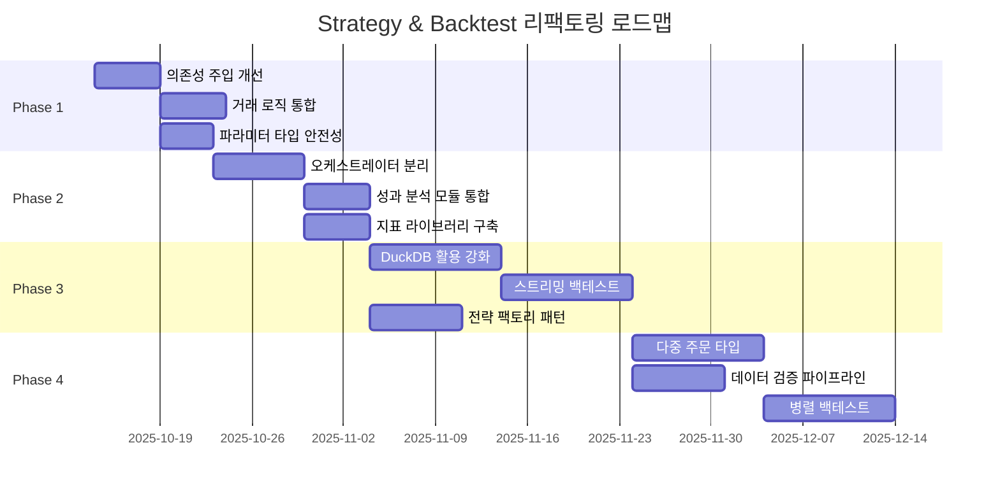

# Strategy & Backtest 아키텍처 검토 및 개선안

> **작성일**: 2025년 10월 13일  
> **대상 모듈**: `backend/app/strategies/`,
> `backend/app/services/backtest_service.py`,
> `backend/app/services/integrated_backtest_executor.py`

## 📋 목차

1. [현재 아키텍처 분석](#1-현재-아키텍처-분석)
2. [주요 문제점 및 개선 필요 영역](#2-주요-문제점-및-개선-필요-영역)
3. [개선 제안 사항](#3-개선-제안-사항)
4. [구현 우선순위](#4-구현-우선순위)
5. [리팩토링 로드맵](#5-리팩토링-로드맵)

---

## 1. 현재 아키텍처 분석

### 1.1 Strategy 모듈 구조

```
backend/app/strategies/
├── base_strategy.py          # 추상 기본 클래스
├── sma_crossover.py          # SMA 크로스오버 전략
├── rsi_mean_reversion.py     # RSI 평균회귀 전략
├── momentum.py               # 모멘텀 전략
└── buy_and_hold.py           # 바이앤홀드 전략
```

**핵심 클래스**:

- `BaseStrategy`: 모든 전략의 추상 기본 클래스
- `StrategyConfig`: 전략 설정 Pydantic 모델
- `StrategySignal`: 매매 신호 데이터 모델
- `StrategyMetrics`: 성과 지표 모델

**전략 라이프사이클**:

```python
1. initialize(data)          # 전략 초기화
2. calculate_indicators(data) # 기술적 지표 계산
3. generate_signals(data)     # 매매 신호 생성
4. validate_data(data)        # 데이터 유효성 검증
```

### 1.2 Backtest 서비스 구조

```
backend/app/services/
├── backtest_service.py              # 백테스트 CRUD + 실행 로직
├── integrated_backtest_executor.py  # 통합 실행기 (DI 연동)
└── strategy_service.py              # 전략 관리 서비스
```

**주요 컴포넌트**:

- `BacktestService`: 백테스트 생성/조회/실행
- `IntegratedBacktestExecutor`: 전략+시장데이터 통합 실행
- `PerformanceCalculator`: 성과 지표 계산
- `TradingSimulator`: 거래 시뮬레이션

### 1.3 데이터 모델 구조

```python
# app/models/backtest.py
- Backtest (Document)           # 백테스트 정의
- BacktestConfig (BaseModel)    # 설정 (내장)
- BacktestExecution (Document)  # 실행 기록
- BacktestResult (Document)     # 결과
- Trade (BaseModel)             # 거래 기록
- Position (BaseModel)          # 포지션 정보
- PerformanceMetrics (BaseModel) # 성과 지표

# app/models/strategy.py
- Strategy (Document)           # 전략 정의
- StrategyTemplate (Document)   # 전략 템플릿
- StrategyExecution (Document)  # 전략 실행 기록
```

---

## 2. 주요 문제점 및 개선 필요 영역

### 🔴 2.1 아키텍처 레벨 문제

#### 문제 1: 책임 분리 부족 (SRP 위반)

**현상**:

- `BacktestService`가 CRUD + 실행 + DuckDB 저장 + 성과 계산을 모두 담당
- 707줄의 단일 파일, 낮은 유지보수성

**영향**:

- 테스트 어려움
- 기능 추가/수정 시 부작용 발생 가능
- 코드 재사용성 낮음

**위치**: `backend/app/services/backtest_service.py`

#### 문제 2: 중복 로직 (DRY 위반)

**현상**:

- `BacktestService.TradingSimulator`와
  `IntegratedBacktestExecutor._execute_simulation`이 유사한 거래 로직 중복
- 두 곳에서 거래 수수료, 슬리피지 계산 중복

**증거**:

```python
# backtest_service.py - TradingSimulator
cost = quantity * current_price * (1 + self.config.commission_rate)

# integrated_backtest_executor.py - _execute_trades
commission = cost * 0.001  # 하드코딩!
```

#### 문제 3: 의존성 주입 불완전

**현상**:

- `BacktestService`가 `set_dependencies()` 메서드로 후속 주입
- 생성 시점에 완전한 객체가 아님 (불완전 초기화)

**위치**:

```python
# backtest_service.py:215
def set_dependencies(self, market_data_service, strategy_service):
    self.market_data_service = market_data_service
    self.strategy_service = strategy_service
    # ... 이후에 integrated_executor 생성
```

**문제점**:

- 서비스가 생성 직후 사용 불가
- 의존성 누락 시 런타임 에러 발생

### 🟡 2.2 전략 시스템 문제

#### 문제 4: 전략-백테스트 결합도 높음

**현상**:

- 전략이 백테스트 실행 로직과 강결합
- 전략 변경 시 백테스트 실행기도 수정 필요

**구조 문제**:

```python
# IntegratedBacktestExecutor
strategy_instance = await self.strategy_service.get_strategy_instance(...)
signals = await strategy_instance.generate_signals(day_data)
```

- 전략이 단일 인터페이스로 추상화되지 않음
- 각 전략 구현체가 서로 다른 데이터 형식 기대

#### 문제 5: 전략 파라미터 검증 부재

**현상**:

- `Strategy.parameters`가 `dict[str, Any]`로 타입 안정성 없음
- 런타임에 잘못된 파라미터로 오류 발생 가능

**예시**:

```python
# models/strategy.py
parameters: dict[str, Any] = Field(default_factory=dict)  # 타입 체크 불가능
```

#### 문제 6: 기술적 지표 계산 중복

**현상**:

- 각 전략이 독립적으로 지표 계산
- SMA, RSI 등 공통 지표를 매번 재계산

**위치**:

- `sma_crossover.py`, `rsi_mean_reversion.py`에서 각각 구현

### 🟢 2.3 백테스트 실행 문제

#### 문제 7: 하드코딩된 거래 로직

**현상**:

- 수수료율, 슬리피지 계산이 하드코딩
- 다양한 시장 조건 시뮬레이션 불가

**예시**:

```python
# integrated_backtest_executor.py:263
commission = cost * 0.001  # 하드코딩된 0.1%

# backtest_service.py에서는 config 사용
commission_rate=self.config.commission_rate  # 설정 기반
```

#### 문제 8: 거래 실행 추상화 부재

**현상**:

- 시장가 주문만 지원
- 지정가, 스탑 주문 등 확장 불가

**모델 정의**:

```python
# models/backtest.py
class OrderType(str, Enum):
    MARKET = "MARKET"
    LIMIT = "LIMIT"      # 구현 안됨
    STOP = "STOP"        # 구현 안됨
    STOP_LIMIT = "STOP_LIMIT"  # 구현 안됨
```

#### 문제 9: 성과 분석 로직 분산

**현상**:

- `PerformanceCalculator`, `BacktestService`, `IntegratedBacktestExecutor`에
  계산 로직 분산
- 일관성 없는 지표 계산

**위치**:

- `backtest_service.py:33` - `PerformanceCalculator` 클래스
- `integrated_backtest_executor.py:131` - `_calculate_performance_metrics`
  메서드

### 🟣 2.4 데이터 처리 문제

#### 문제 10: 시계열 데이터 처리 비효율

**현상**:

- Pandas DataFrame과 딕셔너리 간 변환 반복
- DuckDB 활용 부족 (컬럼 저장소 장점 미활용)

**예시**:

```python
# integrated_backtest_executor.py:182
for i in range(min_length):
    day_data = {}  # 딕셔너리로 변환
    for symbol in symbols:
        day_data[symbol] = market_data[symbol][i]
```

#### 문제 11: 메모리 비효율

**현상**:

- 전체 거래 기록을 메모리에 유지
- 대규모 백테스트 시 OOM 위험

**위치**:

```python
# backtest_service.py:107
portfolio_values: list[float] = []  # 무제한 증가
trades: list[Trade] = []            # 무제한 증가
```

#### 문제 12: 데이터 일관성 검증 부재

**현상**:

- 심볼별 데이터 길이 불일치 처리 미흡
- 결측치, 이상치 처리 로직 없음

**임시 해결**:

```python
# integrated_backtest_executor.py:189
min_length = min(len(data) for data in market_data.values() if data)
# 짧은 데이터에 맞춰 잘라냄 -> 데이터 손실
```

---

## 3. 개선 제안 사항

### 3.1 아키텍처 재설계

#### 제안 1: 레이어드 아키텍처 도입

```
┌─────────────────────────────────────┐
│       API Layer (routes)            │
├─────────────────────────────────────┤
│    Application Layer (services)     │
│  - BacktestOrchestrator             │
│  - StrategyExecutor                 │
│  - PerformanceAnalyzer              │
├─────────────────────────────────────┤
│       Domain Layer (models)         │
│  - Backtest, Strategy, Trade        │
├─────────────────────────────────────┤
│   Infrastructure Layer (repos)      │
│  - DuckDB, MongoDB                  │
└─────────────────────────────────────┘
```

**구현 계획**:

1. `BacktestOrchestrator`: 백테스트 전체 흐름 조율
2. `StrategyExecutor`: 전략 실행 전담
3. `PerformanceAnalyzer`: 성과 분석 전담
4. `TradeExecutor`: 거래 실행 로직 전담

**파일 구조**:

```
backend/app/services/backtest/
├── __init__.py
├── orchestrator.py      # 백테스트 조율
├── executor.py          # 전략 실행
├── trade_engine.py      # 거래 엔진
└── performance.py       # 성과 분석
```

#### 제안 2: Strategy Pattern 강화

```python
# backend/app/strategies/protocol.py
from typing import Protocol, runtime_checkable

@runtime_checkable
class TradingStrategy(Protocol):
    """전략 프로토콜 (덕 타이핑)"""

    def initialize(self, data: pd.DataFrame) -> None: ...
    def calculate_indicators(self, data: pd.DataFrame) -> pd.DataFrame: ...
    def generate_signals(self, data: pd.DataFrame) -> list[Signal]: ...
    def validate_parameters(self) -> bool: ...
```

**장점**:

- 전략 간 일관된 인터페이스
- 타입 체크 강화
- 테스트 용이성 향상

#### 제안 3: 의존성 주입 개선

```python
# services/backtest/orchestrator.py
class BacktestOrchestrator:
    def __init__(
        self,
        market_data_service: MarketDataService,
        strategy_executor: StrategyExecutor,
        trade_engine: TradeEngine,
        performance_analyzer: PerformanceAnalyzer,
    ):
        # 생성 시점에 모든 의존성 주입
        self._market_data = market_data_service
        self._strategy_executor = strategy_executor
        self._trade_engine = trade_engine
        self._performance = performance_analyzer
```

### 3.2 전략 시스템 개선

#### 제안 4: 전략 파라미터 타입 안전성

```python
# strategies/configs.py
from pydantic import BaseModel, Field, validator

class SMACrossoverConfig(BaseModel):
    short_window: int = Field(ge=2, le=50)
    long_window: int = Field(ge=10, le=200)

    @validator('long_window')
    def validate_windows(cls, v, values):
        if 'short_window' in values and v <= values['short_window']:
            raise ValueError('long_window must be > short_window')
        return v

# Strategy 모델에서 사용
class Strategy(BaseDocument):
    strategy_type: StrategyType
    config: Union[SMACrossoverConfig, RSIConfig, ...]  # 타입별 설정
```

#### 제안 5: 기술적 지표 라이브러리 분리

```python
# utils/indicators.py
class TechnicalIndicators:
    """캐시 가능한 기술적 지표 계산"""

    @staticmethod
    @lru_cache(maxsize=1000)
    def sma(prices: tuple, period: int) -> np.ndarray:
        # 튜플로 받아 캐시 가능하게
        return pd.Series(prices).rolling(window=period).mean()

    @staticmethod
    @lru_cache(maxsize=1000)
    def rsi(prices: tuple, period: int) -> np.ndarray:
        # ...
```

**장점**:

- 중복 계산 제거
- 메모리 효율 향상
- 단일 테스트 포인트

#### 제안 6: 전략 팩토리 패턴

```python
# strategies/factory.py
class StrategyFactory:
    _registry: dict[StrategyType, Type[BaseStrategy]] = {}

    @classmethod
    def register(cls, strategy_type: StrategyType):
        def decorator(strategy_class):
            cls._registry[strategy_type] = strategy_class
            return strategy_class
        return decorator

    @classmethod
    def create(cls, strategy_type: StrategyType, config: StrategyConfig):
        strategy_class = cls._registry.get(strategy_type)
        if not strategy_class:
            raise ValueError(f"Unknown strategy: {strategy_type}")
        return strategy_class(config)

# 사용 예시
@StrategyFactory.register(StrategyType.SMA_CROSSOVER)
class SMACrossoverStrategy(BaseStrategy):
    ...
```

### 3.3 백테스트 실행 엔진 개선

#### 제안 7: 거래 실행 엔진 추상화

```python
# services/backtest/trade_engine.py
class TradeEngine:
    """거래 실행 엔진"""

    def __init__(self, config: BacktestConfig):
        self.commission_rate = config.commission_rate
        self.slippage_rate = config.slippage_rate
        self.order_executor = self._create_order_executor()

    def execute_order(
        self,
        order: Order,
        current_price: float,
        portfolio: Portfolio,
    ) -> Optional[Trade]:
        """주문 타입별 실행"""
        if order.order_type == OrderType.MARKET:
            return self._execute_market_order(order, current_price, portfolio)
        elif order.order_type == OrderType.LIMIT:
            return self._execute_limit_order(order, current_price, portfolio)
        # ...

    def _calculate_costs(self, quantity: float, price: float) -> dict:
        """통일된 비용 계산"""
        gross_cost = quantity * price
        commission = gross_cost * self.commission_rate
        slippage = gross_cost * self.slippage_rate
        return {
            'gross': gross_cost,
            'commission': commission,
            'slippage': slippage,
            'total': gross_cost + commission + slippage,
        }
```

#### 제안 8: 성과 분석 모듈 통합

```python
# services/backtest/performance.py
class PerformanceAnalyzer:
    """통합 성과 분석기"""

    def __init__(self, risk_free_rate: float = 0.02):
        self.risk_free_rate = risk_free_rate

    def analyze(
        self,
        portfolio_values: np.ndarray,
        trades: list[Trade],
        benchmark_values: Optional[np.ndarray] = None,
    ) -> PerformanceMetrics:
        """종합 성과 분석"""
        return PerformanceMetrics(
            # 기본 지표
            total_return=self._total_return(portfolio_values),
            annualized_return=self._annualized_return(portfolio_values),
            volatility=self._volatility(portfolio_values),

            # 리스크 조정 수익률
            sharpe_ratio=self._sharpe_ratio(portfolio_values),
            sortino_ratio=self._sortino_ratio(portfolio_values),
            calmar_ratio=self._calmar_ratio(portfolio_values),

            # 낙폭 분석
            max_drawdown=self._max_drawdown(portfolio_values),

            # 거래 통계
            trade_stats=self._trade_statistics(trades),

            # 벤치마크 비교
            alpha=self._alpha(portfolio_values, benchmark_values),
            beta=self._beta(portfolio_values, benchmark_values),
        )
```

#### 제안 9: 백테스트 파이프라인

```python
# services/backtest/orchestrator.py
class BacktestOrchestrator:
    async def execute(self, backtest_id: str) -> BacktestResult:
        """백테스트 파이프라인 실행"""

        # 1. 준비 단계
        backtest = await self._load_backtest(backtest_id)
        await self._update_status(backtest, BacktestStatus.RUNNING)

        # 2. 데이터 수집
        market_data = await self._collect_market_data(
            symbols=backtest.config.symbols,
            start=backtest.config.start_date,
            end=backtest.config.end_date,
        )

        # 3. 전략 실행
        signals = await self._strategy_executor.generate_signals(
            strategy=backtest.strategy,
            data=market_data,
        )

        # 4. 거래 시뮬레이션
        trades, portfolio = await self._trade_engine.simulate(
            signals=signals,
            market_data=market_data,
            initial_capital=backtest.config.initial_cash,
        )

        # 5. 성과 분석
        performance = self._performance_analyzer.analyze(
            portfolio_values=portfolio.values,
            trades=trades,
        )

        # 6. 결과 저장
        result = await self._save_result(backtest, performance, trades)

        # 7. 상태 업데이트
        await self._update_status(backtest, BacktestStatus.COMPLETED)

        return result
```

### 3.4 데이터 처리 최적화

#### 제안 10: DuckDB 활용 강화

```python
# services/backtest/data_processor.py
class BacktestDataProcessor:
    """DuckDB 기반 시계열 처리"""

    def __init__(self, duckdb_conn):
        self.conn = duckdb_conn

    async def prepare_data(
        self,
        symbols: list[str],
        start_date: datetime,
        end_date: datetime,
    ) -> duckdb.DuckDBPyRelation:
        """DuckDB 쿼리로 데이터 준비"""

        query = """
        SELECT
            symbol,
            date,
            open,
            high,
            low,
            close,
            volume,
            -- 기술적 지표 미리 계산
            AVG(close) OVER (
                PARTITION BY symbol
                ORDER BY date
                ROWS BETWEEN 9 PRECEDING AND CURRENT ROW
            ) as sma_10,
            AVG(close) OVER (
                PARTITION BY symbol
                ORDER BY date
                ROWS BETWEEN 29 PRECEDING AND CURRENT ROW
            ) as sma_30
        FROM market_data
        WHERE symbol IN (?)
          AND date BETWEEN ? AND ?
        ORDER BY symbol, date
        """

        return self.conn.execute(
            query,
            [symbols, start_date, end_date]
        )

    async def calculate_indicators(
        self,
        data: duckdb.DuckDBPyRelation,
        indicators: list[str],
    ) -> duckdb.DuckDBPyRelation:
        """DuckDB 윈도우 함수로 지표 계산"""
        # SQL로 효율적 계산
        pass
```

**장점**:

- 메모리 효율 (컬럼 저장소)
- 병렬 처리 자동화
- SQL 기반 복잡한 계산

#### 제안 11: 스트리밍 방식 처리

```python
# services/backtest/executor.py
class StreamingBacktestExecutor:
    """스트리밍 방식 백테스트"""

    async def execute_streaming(
        self,
        strategy: TradingStrategy,
        data_stream: AsyncIterator[MarketData],
        initial_capital: float,
    ) -> AsyncIterator[BacktestUpdate]:
        """데이터를 스트리밍하며 백테스트"""

        portfolio = Portfolio(initial_capital)

        async for market_data in data_stream:
            # 1. 신호 생성
            signal = strategy.generate_signal(market_data)

            # 2. 거래 실행
            if signal:
                trade = self.trade_engine.execute(signal, portfolio)
                if trade:
                    yield BacktestUpdate(
                        timestamp=market_data.timestamp,
                        portfolio_value=portfolio.total_value,
                        trade=trade,
                    )

            # 3. 포트폴리오 업데이트
            portfolio.update_prices(market_data)

            # 4. 주기적으로 성과 계산 (매일/매주)
            if self._should_calculate_performance(market_data.timestamp):
                performance = self.performance_analyzer.snapshot(portfolio)
                yield BacktestUpdate(
                    timestamp=market_data.timestamp,
                    performance=performance,
                )
```

**장점**:

- 메모리 사용량 일정
- 실시간 진행 상황 모니터링
- 대규모 백테스트 가능

#### 제안 12: 데이터 검증 파이프라인

```python
# utils/validators.py
class DataValidator:
    """시계열 데이터 검증"""

    @staticmethod
    def validate_completeness(
        data: pd.DataFrame,
        expected_symbols: list[str],
    ) -> ValidationResult:
        """데이터 완전성 검증"""
        missing_symbols = set(expected_symbols) - set(data['symbol'].unique())

        return ValidationResult(
            is_valid=len(missing_symbols) == 0,
            missing_symbols=list(missing_symbols),
        )

    @staticmethod
    def validate_consistency(
        data: pd.DataFrame,
    ) -> ValidationResult:
        """데이터 일관성 검증"""
        issues = []

        # 날짜 정렬 확인
        if not data['date'].is_monotonic_increasing:
            issues.append("Date is not sorted")

        # 가격 이상치 확인
        price_issues = data[
            (data['high'] < data['low']) |
            (data['close'] > data['high']) |
            (data['close'] < data['low'])
        ]

        if len(price_issues) > 0:
            issues.append(f"Price inconsistencies: {len(price_issues)} records")

        return ValidationResult(
            is_valid=len(issues) == 0,
            issues=issues,
        )

    @staticmethod
    def handle_missing_data(
        data: pd.DataFrame,
        method: str = 'forward_fill',
    ) -> pd.DataFrame:
        """결측치 처리"""
        if method == 'forward_fill':
            return data.fillna(method='ffill')
        elif method == 'interpolate':
            return data.interpolate()
        elif method == 'drop':
            return data.dropna()
        else:
            raise ValueError(f"Unknown method: {method}")
```

---

## 4. 구현 우선순위

### Phase 1: 긴급 (1-2주) 🔴

#### P1.1 의존성 주입 개선

- **목표**: 서비스 생성 시점에 완전한 객체 보장
- **작업**:
  - `BacktestService.__init__`에서 모든 의존성 주입
  - `set_dependencies()` 메서드 제거
  - ServiceFactory 업데이트

#### P1.2 중복 거래 로직 통합

- **목표**: 단일 `TradeEngine` 클래스로 통합
- **작업**:
  - `services/backtest/trade_engine.py` 생성
  - `TradingSimulator`와 `_execute_trades` 로직 병합
  - 수수료/슬리피지 계산 통일

#### P1.3 전략 파라미터 타입 안전성

- **목표**: 런타임 에러 방지
- **작업**:
  - 전략별 Config 클래스 정의 (Pydantic)
  - `Strategy.parameters` → `Strategy.config` 변경
  - 파라미터 검증 로직 추가

### Phase 2: 중요 (3-4주) 🟡

#### P2.1 백테스트 오케스트레이터 분리

- **목표**: 책임 분리, 테스트 용이성 향상
- **작업**:
  - `BacktestOrchestrator` 클래스 생성
  - 백테스트 실행 로직 이전
  - CRUD는 `BacktestService`에 유지

#### P2.2 성과 분석 모듈 통합

- **목표**: 일관된 성과 지표 계산
- **작업**:
  - `PerformanceAnalyzer` 클래스 생성
  - 모든 성과 계산 로직 이전
  - 추가 지표 구현 (Sortino, Calmar, Alpha, Beta)

#### P2.3 기술적 지표 라이브러리

- **목표**: 중복 제거, 성능 향상
- **작업**:
  - `utils/indicators.py` 생성
  - 캐싱 메커니즘 구현
  - 전략에서 공통 라이브러리 사용

### Phase 3: 개선 (5-8주) 🟢

#### P3.1 DuckDB 활용 강화

- **목표**: 시계열 처리 성능 10배 향상
- **작업**:
  - `BacktestDataProcessor` 클래스 생성
  - SQL 기반 지표 계산
  - 윈도우 함수 활용

#### P3.2 스트리밍 백테스트

- **목표**: 메모리 효율, 대규모 백테스트 지원
- **작업**:
  - `StreamingBacktestExecutor` 구현
  - AsyncIterator 기반 데이터 처리
  - 실시간 진행 상황 제공

#### P3.3 전략 팩토리 패턴

- **목표**: 전략 확장성, 플러그인 아키텍처
- **작업**:
  - `StrategyFactory` 구현
  - 동적 전략 등록 메커니즘
  - 커스텀 전략 지원

### Phase 4: 최적화 (9-12주) 🔵

#### P4.1 다중 주문 타입 지원

- **목표**: 현실적인 백테스트
- **작업**:
  - 지정가 주문 구현
  - 스탑 주문 구현
  - 주문 매칭 엔진 개선

#### P4.2 데이터 검증 파이프라인

- **목표**: 데이터 품질 보장
- **작업**:
  - `DataValidator` 클래스 구현
  - 자동 결측치 처리
  - 이상치 탐지 및 처리

#### P4.3 병렬 백테스트

- **목표**: 대량 백테스트 성능 향상
- **작업**:
  - 멀티프로세싱/AsyncIO 활용
  - 파라미터 그리드 탐색 지원
  - 결과 집계 및 비교 기능

---

## 5. 리팩토링 로드맵

### 5.1 마일스톤



### 5.2 성공 지표

**Phase 1 목표**:

- [ ] 서비스 의존성 주입 100% 완료
- [ ] 중복 코드 50% 이상 감소
- [ ] 전략 파라미터 타입 에러 0건

**Phase 2 목표**:

- [ ] `BacktestService` 라인 수 50% 감소 (707 → ~350줄)
- [ ] 성과 지표 8개 이상 지원
- [ ] 지표 계산 성능 30% 향상

**Phase 3 목표**:

- [ ] DuckDB 활용으로 쿼리 성능 10배 향상
- [ ] 100만 행 이상 데이터 백테스트 가능
- [ ] 메모리 사용량 80% 감소

**Phase 4 목표**:

- [ ] 4가지 주문 타입 모두 지원
- [ ] 데이터 검증 자동화 100%
- [ ] 병렬 백테스트로 처리 속도 5배 향상

### 5.3 리스크 관리

**호환성 리스크**:

- **문제**: 기존 API 사용 중단
- **완화**: Deprecation 경고, 병렬 지원 기간 (2개월)

**성능 리스크**:

- **문제**: 리팩토링 중 성능 저하
- **완화**: 단계별 벤치마킹, 롤백 계획

**데이터 손실 리스크**:

- **문제**: 마이그레이션 중 데이터 손실
- **완화**: 백업 자동화, 트랜잭션 기반 마이그레이션

---

## 6. 후속 문서

이 검토를 바탕으로 다음 문서를 작성하세요:

1. **REFACTORING_GUIDE.md**: 단계별 리팩토링 가이드
2. **NEW_ARCHITECTURE.md**: 새 아키텍처 상세 설계
3. **MIGRATION_PLAN.md**: 기존 코드 마이그레이션 계획
4. **PERFORMANCE_BENCHMARK.md**: 성능 벤치마크 및 목표

---

**문서 작성**: GitHub Copilot  
**검토 필요**: 백엔드 개발팀, 아키텍트
