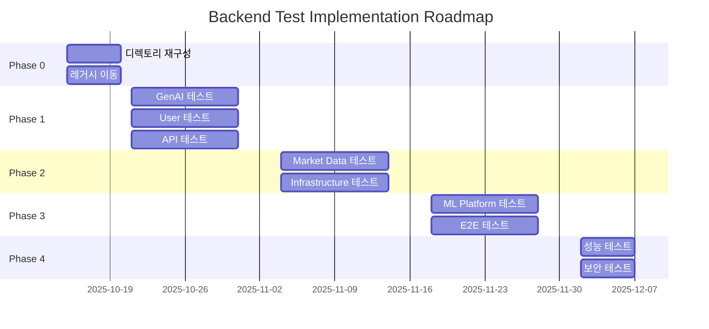
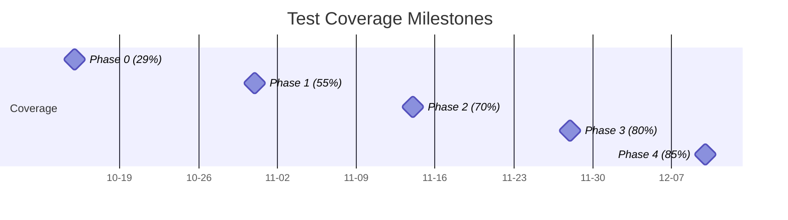

# Backend Test Implementation - Master Plan

**프로젝트 명**: 백엔드 전체 테스트 커버리지 구현  
**기간**: 8주 (2025-10-15 ~ 2025-12-10)  
**목표**: 테스트 커버리지 29% → 85% 달성  
**담당**: Backend Team

---

## 🎯 프로젝트 목표

### 비즈니스 목표

1. **품질 향상**: 프로덕션 버그 80% 감소
2. **배포 신뢰도**: CI/CD 자동화 가능
3. **리팩토링 안전성**: 코드 변경 시 회귀 테스트 자동화
4. **마이크로서비스 준비**: 도메인별 독립 테스트 체계 구축

### 기술 목표

| 지표                 | 현재       | 목표       | 개선율 |
| -------------------- | ---------- | ---------- | ------ |
| **테스트 커버리지**  | 29%        | 85%        | +193%  |
| **테스트 케이스 수** | 230개      | 800개      | +248%  |
| **테스트 파일 수**   | 39개       | 150개      | +285%  |
| **도메인 커버리지**  | 4/7 도메인 | 7/7 도메인 | 100%   |
| **CI 실행 시간**     | 측정 필요  | <5분       | -      |
| **테스트 안정성**    | 측정 필요  | 99%+       | -      |

---

## 📅 Phase Overview (5 Phases, 8주)



### Phase 요약

| Phase       | 기간       | 목표 커버리지 | 주요 작업                     | 우선순위    |
| ----------- | ---------- | ------------- | ----------------------------- | ----------- |
| **Phase 0** | 1주 (5일)  | -             | 디렉토리 재구성 + 레거시 이동 | 🔴 Critical |
| **Phase 1** | 2주 (10일) | 29% → 55%     | GenAI, User, API 테스트       | 🔴 High     |
| **Phase 2** | 2주 (10일) | 55% → 70%     | Market Data, Infrastructure   | 🟡 Medium   |
| **Phase 3** | 2주 (10일) | 70% → 80%     | ML Platform, E2E              | 🟡 Medium   |
| **Phase 4** | 1주 (5일)  | 80% → 85%     | 성능, 보안                    | 🟢 Low      |

---

## 🔧 Phase 0: 디렉토리 재구성 (5일)

**목표**: 마이크로서비스 전환 대비 도메인별 테스트 구조 구축

### Sprint 0.1: 디렉토리 설계 (2일)

**Task 0.1.1**: 새 디렉토리 구조 생성 (3h)

```bash
tests/
├── domains/                    # 도메인별 테스트 (NEW)
│   ├── trading/
│   │   ├── api/              # Trading API 테스트
│   │   ├── services/         # Trading 서비스 테스트
│   │   ├── strategies/       # 전략 테스트
│   │   └── test_trading_e2e.py
│   ├── market_data/
│   │   ├── api/
│   │   ├── services/
│   │   └── test_market_data_e2e.py
│   ├── ml_platform/
│   │   ├── api/
│   │   ├── services/
│   │   └── test_ml_e2e.py
│   ├── gen_ai/
│   │   ├── api/
│   │   ├── services/
│   │   └── test_gen_ai_e2e.py
│   └── user/
│       ├── api/
│       ├── services/
│       └── test_user_e2e.py
├── shared/                     # 공통 테스트 (NEW)
│   ├── test_service_factory.py
│   ├── test_database_manager.py
│   └── fixtures/
│       ├── conftest.py       # 전역 fixture
│       ├── db_fixtures.py
│       ├── api_fixtures.py
│       └── mock_fixtures.py
└── conftest.py                 # 루트 설정
```

**완료 조건**:

- ✅ 디렉토리 구조 생성
- ✅ conftest.py 파일 배치
- ✅ README.md 작성

---

**Task 0.1.2**: 레거시 파일 매핑 (2h)

**매핑 테이블**:

| 현재 위치                          | 새 위치                                                 | 비고       |
| ---------------------------------- | ------------------------------------------------------- | ---------- |
| `test_anomaly_detector.py`         | `domains/ml_platform/services/test_anomaly_detector.py` |            |
| `test_data_processor.py`           | `domains/market_data/services/test_data_processor.py`   | 중복 제거  |
| `test_feature_engineer.py`         | `domains/ml_platform/services/test_feature_engineer.py` |            |
| `test_ml_integration.py`           | `domains/ml_platform/test_ml_e2e.py`                    | E2E 테스트 |
| `test_ml_trainer.py`               | `domains/ml_platform/services/test_ml_trainer.py`       |            |
| `test_model_registry.py`           | `domains/ml_platform/services/test_model_registry.py`   |            |
| `test_orchestrator_integration.py` | `domains/trading/test_trading_e2e.py`                   | E2E 테스트 |
| `test_strategy_config.py`          | `domains/trading/strategies/test_strategy_config.py`    | 중복 제거  |
| `test_strategy_executor.py`        | `domains/trading/strategies/test_strategy_executor.py`  | 중복 제거  |
| `test_trade_engine.py`             | `domains/trading/services/test_trade_engine.py`         | 중복 제거  |

**완료 조건**:

- ✅ 매핑 테이블 완성
- ✅ 충돌 파일 식별

---

### Sprint 0.2: 파일 이동 + 중복 제거 (3일)

**Task 0.2.1**: 레거시 파일 이동 (1일)

```bash
# 자동화 스크립트 사용
./scripts/migrate-tests-phase0.sh
```

**완료 조건**:

- ✅ 13개 레거시 파일 이동
- ✅ import 경로 수정
- ✅ 모든 테스트 통과 (`pytest`)

---

**Task 0.2.2**: 중복 파일 제거 (1일)

**중복 파일**:

- `test_data_processor.py` (루트 vs. `market_data/`)
- `test_orchestrator_integration.py` (루트 vs. `backtest/`)
- `test_strategy_config.py` (루트 vs. `strategy/`)
- `test_strategy_executor.py` (루트 vs. `strategy/`)
- `test_trade_engine.py` (루트 vs. `backtest/`)

**전략**:

1. 테스트 케이스 비교 (diff)
2. 우수한 테스트 선택
3. 추가 케이스 병합
4. 중복 파일 삭제

**완료 조건**:

- ✅ 중복 제거 (5개 파일 → 0개)
- ✅ 테스트 커버리지 유지
- ✅ Git 이력 정리

---

**Task 0.2.3**: 공통 Fixture 구축 (1일)

**목표**: 코드 중복 제거 + 일관성 확보

**Fixture 종류**:

1. **DB Fixture** (`shared/fixtures/db_fixtures.py`):

   ```python
   @pytest.fixture
   async def mongodb_client():
       """MongoDB 테스트 클라이언트"""

   @pytest.fixture
   def duckdb_conn():
       """DuckDB 테스트 연결"""

   @pytest.fixture
   async def clean_db():
       """테스트 후 DB 정리"""
   ```

2. **API Fixture** (`shared/fixtures/api_fixtures.py`):

   ```python
   @pytest.fixture
   async def async_client():
       """FastAPI 테스트 클라이언트"""

   @pytest.fixture
   def auth_headers():
       """인증 헤더 (JWT 토큰)"""
   ```

3. **Mock Fixture** (`shared/fixtures/mock_fixtures.py`):

   ```python
   @pytest.fixture
   def mock_alpha_vantage():
       """Alpha Vantage API 모킹"""

   @pytest.fixture
   def mock_openai():
       """OpenAI API 모킹"""
   ```

**완료 조건**:

- ✅ 3개 Fixture 파일 생성
- ✅ 기존 테스트 리팩토링 (중복 제거)
- ✅ Fixture 문서화

---

**Phase 0 완료 조건**:

- ✅ 디렉토리 구조 완성
- ✅ 레거시 파일 이동 (13개)
- ✅ 중복 제거 (5개)
- ✅ 공통 Fixture 구축 (3개)
- ✅ 모든 기존 테스트 통과
- ✅ 커버리지 유지 (29%)

---

## 🚀 Phase 1: High Priority Domains (10일)

**목표**: 커버리지 29% → 55% (+26%p)  
**도메인**: GenAI, User, API

### Sprint 1.1: GenAI Domain 테스트 (5일)

**현재 커버리지**: 15% → **목표**: 60%

**Task 1.1.1**: NarrativeReportService 테스트 (1.5일)

**파일**: `domains/gen_ai/services/test_narrative_report_service.py`

**테스트 케이스** (20개):

- ✅ 백테스트 리포트 생성 (성공)
- ✅ 전략 리포트 생성 (성공)
- ✅ 시장 분석 리포트 생성 (성공)
- ✅ OpenAI API 에러 처리 (rate limit, timeout)
- ✅ 프롬프트 템플릿 검증
- ✅ 리포트 포맷 검증 (Markdown)
- ✅ 다국어 지원 (en, ko)
- ✅ 성능 테스트 (응답 시간 <10s)

**완료 조건**:

- ✅ 20개 테스트 통과
- ✅ OpenAI API 모킹
- ✅ 코드 커버리지 80%+

---

**Task 1.1.2**: ChatOpsAdvancedService 테스트 (1.5일)

**파일**: `domains/gen_ai/services/test_chatops_advanced_service.py`

**테스트 케이스** (25개):

- ✅ 질의응답 (백테스트 결과 조회)
- ✅ 전략 추천 (조건 기반)
- ✅ 시장 분석 (대화형)
- ✅ 컨텍스트 관리 (대화 이력)
- ✅ 멀티턴 대화
- ✅ 에러 복구 (재시도)
- ✅ 스트리밍 응답 (SSE)
- ✅ 비용 추적

**완료 조건**:

- ✅ 25개 테스트 통과
- ✅ SSE 스트리밍 테스트
- ✅ 대화 컨텍스트 검증

---

**Task 1.1.3**: PromptGovernanceService 테스트 (1일)

**파일**: `domains/gen_ai/services/test_prompt_governance_service.py`

**테스트 케이스** (15개):

- ✅ 프롬프트 템플릿 등록
- ✅ 템플릿 조회/수정/삭제
- ✅ 버전 관리 (v1, v2, ...)
- ✅ A/B 테스트 (성능 비교)
- ✅ 템플릿 검증 (변수, 포맷)
- ✅ 액세스 제어 (권한)

**완료 조건**:

- ✅ 15개 테스트 통과
- ✅ 버전 관리 로직 검증

---

**Task 1.1.4**: GenAI API 테스트 (1일)

**파일**: `domains/gen_ai/api/test_gen_ai_api.py`

**테스트 케이스** (20개):

- ✅ `/chatops/chat` (POST)
- ✅ `/chatops/stream` (SSE)
- ✅ `/strategy-builder/generate` (POST)
- ✅ `/narrative/backtest` (POST)
- ✅ `/narrative/strategy` (POST)
- ✅ `/prompts` (CRUD)
- ✅ 인증 검증 (JWT)
- ✅ Rate Limiting 검증

**완료 조건**:

- ✅ 20개 API 테스트 통과
- ✅ E2E 흐름 검증

---

### Sprint 1.2: User Domain 테스트 (3일)

**현재 커버리지**: 30% → **목표**: 60%

**Task 1.2.1**: DashboardService 테스트 (1일)

**파일**: `domains/user/services/test_dashboard_service.py`

**테스트 케이스** (15개):

- ✅ 대시보드 데이터 집계
- ✅ 성과 지표 계산
- ✅ 워치리스트 통합
- ✅ 캐시 전략 (Redis)
- ✅ 실시간 업데이트

**완료 조건**:

- ✅ 15개 테스트 통과
- ✅ 집계 로직 검증

---

**Task 1.2.2**: AuthService 테스트 (1일)

**파일**: `domains/user/services/test_auth_service.py`

**테스트 케이스** (20개):

- ✅ JWT 토큰 생성/검증
- ✅ 비밀번호 해싱 (bcrypt)
- ✅ 리프레시 토큰
- ✅ 권한 검증 (RBAC)
- ✅ 로그아웃 (토큰 무효화)

**완료 조건**:

- ✅ 20개 테스트 통과
- ✅ 보안 테스트 통과

---

**Task 1.2.3**: User API 테스트 (1일)

**파일**: `domains/user/api/test_user_api.py`

**테스트 케이스** (15개):

- ✅ `/auth/login` (POST)
- ✅ `/auth/refresh` (POST)
- ✅ `/dashboard` (GET)
- ✅ `/watchlists` (CRUD)
- ✅ 인증 미들웨어 테스트

**완료 조건**:

- ✅ 15개 API 테스트 통과

---

### Sprint 1.3: API Layer 테스트 (2일)

**현재 커버리지**: 20% → **목표**: 50%

**Task 1.3.1**: Backtest API 테스트 (1일)

**파일**: `domains/trading/api/test_backtest_api.py`

**테스트 케이스** (20개):

- ✅ `/backtests` (CRUD)
- ✅ `/backtests/{id}/run` (POST)
- ✅ `/backtests/{id}/results` (GET)
- ✅ `/backtests/{id}/optimize` (POST)
- ✅ 에러 처리 (400, 404, 500)

**완료 조건**:

- ✅ 20개 API 테스트 통과

---

**Task 1.3.2**: ML API 테스트 (1일)

**파일**: `domains/ml_platform/api/test_ml_api.py`

**테스트 케이스** (15개):

- ✅ `/ml/train` (POST)
- ✅ `/ml/predict` (POST)
- ✅ `/ml/models` (GET)
- ✅ `/ml/features` (GET)
- ✅ 비동기 작업 처리 (Celery)

**완료 조건**:

- ✅ 15개 API 테스트 통과

---

**Phase 1 완료 조건**:

- ✅ GenAI 커버리지 60% (15% → 60%)
- ✅ User 커버리지 60% (30% → 60%)
- ✅ API 커버리지 50% (20% → 50%)
- ✅ 전체 커버리지 55% (29% → 55%)
- ✅ 150개 신규 테스트 추가

---

## 📊 Phase 2: Medium Priority Domains (10일)

**목표**: 커버리지 55% → 70% (+15%p)  
**도메인**: Market Data, Infrastructure

### Sprint 2.1: Market Data Services 테스트 (5일)

**현재 커버리지**: 50% → **목표**: 70%

**Task 2.1.1**: StockService 테스트 (1일)

**파일**: `domains/market_data/services/test_stock_service.py`

**테스트 케이스** (20개):

- ✅ 주식 데이터 조회 (Alpha Vantage)
- ✅ 캐시 히트/미스 (DuckDB)
- ✅ Rate Limiting 처리
- ✅ 데이터 품질 검증

**완료 조건**:

- ✅ 20개 테스트 통과
- ✅ 3-Layer Caching 검증

---

**Task 2.1.2**: FundamentalService 테스트 (1일)

**파일**: `domains/market_data/services/test_fundamental_service.py`

**테스트 케이스** (15개):

- ✅ 재무제표 조회
- ✅ 기업 개요 조회
- ✅ 캐시 전략

**완료 조건**:

- ✅ 15개 테스트 통과

---

**Task 2.1.3**: EconomicService 테스트 (1일)

**파일**: `domains/market_data/services/test_economic_service.py`

**테스트 케이스** (15개):

- ✅ 경제 지표 조회
- ✅ 데이터 정규화
- ✅ 시계열 처리

**완료 조건**:

- ✅ 15개 테스트 통과

---

**Task 2.1.4**: DataQualitySentinel 테스트 (1일)

**파일**: `domains/market_data/services/test_data_quality_sentinel.py`

**테스트 케이스** (20개):

- ✅ 이상치 탐지
- ✅ 결측치 처리
- ✅ 데이터 검증 규칙
- ✅ 알림 시스템

**완료 조건**:

- ✅ 20개 테스트 통과

---

**Task 2.1.5**: Market Data API 테스트 보완 (1일)

**파일**: `domains/market_data/api/test_market_data_api.py`

**테스트 케이스** (25개):

- ✅ 기존 15개 보완
- ✅ 추가 10개 엔드포인트

**완료 조건**:

- ✅ 25개 API 테스트 통과

---

### Sprint 2.2: Infrastructure 테스트 (5일)

**현재 커버리지**: 50% → **목표**: 70%

**Task 2.2.1**: DatabaseManager 테스트 (2일)

**파일**: `shared/test_database_manager.py`

**테스트 케이스** (30개):

- ✅ MongoDB 연결/종료
- ✅ DuckDB 연결/종료
- ✅ 연결 풀 관리
- ✅ 트랜잭션 처리
- ✅ 에러 복구

**완료 조건**:

- ✅ 30개 테스트 통과
- ✅ 연결 풀 테스트

---

**Task 2.2.2**: CircuitBreaker 테스트 (1일)

**파일**: `shared/test_circuit_breaker.py`

**테스트 케이스** (15개):

- ✅ Open/Close 상태 전환
- ✅ 실패 카운팅
- ✅ Half-Open 재시도
- ✅ Alpha Vantage 보호

**완료 조건**:

- ✅ 15개 테스트 통과

---

**Task 2.2.3**: BacktestMonitor 테스트 (1일)

**파일**: `shared/test_backtest_monitor.py`

**테스트 케이스** (15개):

- ✅ 성능 메트릭 수집
- ✅ 로깅 (structlog)
- ✅ 알림 시스템
- ✅ 대시보드 통합

**완료 조건**:

- ✅ 15개 테스트 통과

---

**Task 2.2.4**: 로깅 시스템 테스트 (1일)

**파일**: `shared/test_logging.py`

**테스트 케이스** (10개):

- ✅ structlog 설정
- ✅ 로그 레벨
- ✅ 로그 포맷
- ✅ 파일/콘솔 출력

**완료 조건**:

- ✅ 10개 테스트 통과

---

**Phase 2 완료 조건**:

- ✅ Market Data 커버리지 70% (50% → 70%)
- ✅ Infrastructure 커버리지 70% (50% → 70%)
- ✅ 전체 커버리지 70% (55% → 70%)
- ✅ 150개 신규 테스트 추가

---

## 🧠 Phase 3: ML Platform + E2E (10일)

**목표**: 커버리지 70% → 80% (+10%p)  
**도메인**: ML Platform, E2E 통합

### Sprint 3.1: ML Platform 테스트 (7일)

**현재 커버리지**: 40% → **목표**: 80%

**Task 3.1.1**: FeatureStore 테스트 (2일)

**파일**: `domains/ml_platform/services/test_feature_store.py`

**테스트 케이스** (30개):

- ✅ 피처 등록/조회
- ✅ 피처 버전 관리
- ✅ 피처 엔지니어링 파이프라인
- ✅ 캐시 전략

**완료 조건**:

- ✅ 30개 테스트 통과

---

**Task 3.1.2**: ModelLifecycle 테스트 (2일)

**파일**: `domains/ml_platform/services/test_model_lifecycle.py`

**테스트 케이스** (25개):

- ✅ 모델 훈련/검증
- ✅ 모델 배포/롤백
- ✅ A/B 테스트
- ✅ 모델 모니터링

**완료 조건**:

- ✅ 25개 테스트 통과

---

**Task 3.1.3**: EvaluationHarness 테스트 (1일)

**파일**: `domains/ml_platform/services/test_evaluation_harness.py`

**테스트 케이스** (15개):

- ✅ 모델 평가 (정확도, 정밀도, 재현율)
- ✅ 백테스트 통합
- ✅ 리포트 생성

**완료 조건**:

- ✅ 15개 테스트 통과

---

**Task 3.1.4**: ML Platform API 테스트 보완 (1일)

**파일**: `domains/ml_platform/api/test_ml_api.py`

**테스트 케이스** (20개):

- ✅ 기존 15개 보완
- ✅ 추가 5개 엔드포인트

**완료 조건**:

- ✅ 20개 API 테스트 통과

---

**Task 3.1.5**: 레거시 ML 테스트 리팩토링 (1일)

**파일**: Phase 0에서 이동한 테스트 개선

**작업**:

- ✅ 코드 중복 제거
- ✅ Fixture 통합
- ✅ 테스트 명확화

**완료 조건**:

- ✅ 58개 레거시 테스트 리팩토링

---

### Sprint 3.2: E2E 통합 테스트 (3일)

**Task 3.2.1**: Trading E2E 테스트 (1일)

**파일**: `domains/trading/test_trading_e2e.py`

**테스트 케이스** (15개):

- ✅ 전략 생성 → 백테스트 → 결과 조회 (전체 흐름)
- ✅ 최적화 → 재백테스트
- ✅ 성과 분석 → 리포트 생성

**완료 조건**:

- ✅ 15개 E2E 테스트 통과
- ✅ 전체 흐름 검증

---

**Task 3.2.2**: Market Data E2E 테스트 (1일)

**파일**: `domains/market_data/test_market_data_e2e.py`

**테스트 케이스** (10개):

- ✅ 데이터 조회 → 캐시 → 품질 검증
- ✅ Alpha Vantage → DuckDB → MongoDB

**완료 조건**:

- ✅ 10개 E2E 테스트 통과

---

**Task 3.2.3**: GenAI E2E 테스트 (1일)

**파일**: `domains/gen_ai/test_gen_ai_e2e.py`

**테스트 케이스** (10개):

- ✅ ChatOps → 백테스트 → 리포트 생성
- ✅ 전략 빌더 → 코드 생성 → 검증

**완료 조건**:

- ✅ 10개 E2E 테스트 통과

---

**Phase 3 완료 조건**:

- ✅ ML Platform 커버리지 80% (40% → 80%)
- ✅ E2E 테스트 35개 추가
- ✅ 전체 커버리지 80% (70% → 80%)
- ✅ 125개 신규 테스트 추가

---

## 🔒 Phase 4: 성능 + 보안 테스트 (5일)

**목표**: 커버리지 80% → 85% (+5%p)  
**도메인**: 성능, 보안, 부하

### Sprint 4.1: 성능 테스트 (3일)

**Task 4.1.1**: API 성능 테스트 (1일)

**파일**: `performance/test_api_performance.py`

**테스트 케이스** (10개):

- ✅ 응답 시간 (<200ms)
- ✅ 동시 요청 처리 (100 concurrent)
- ✅ 처리량 (1000 req/s)
- ✅ 병목 지점 식별

**도구**: `locust` 또는 `pytest-benchmark`

**완료 조건**:

- ✅ 10개 성능 테스트 통과
- ✅ 성능 기준 설정

---

**Task 4.1.2**: 백테스트 성능 테스트 (1일)

**파일**: `performance/test_backtest_performance.py`

**테스트 케이스** (10개):

- ✅ 대용량 데이터 (10년, 1000개 종목)
- ✅ 병렬 처리 (멀티코어)
- ✅ 메모리 사용량
- ✅ DuckDB 쿼리 최적화

**완료 조건**:

- ✅ 10개 성능 테스트 통과

---

**Task 4.1.3**: ML 훈련 성능 테스트 (1일)

**파일**: `performance/test_ml_performance.py`

**테스트 케이스** (10개):

- ✅ 훈련 시간
- ✅ 추론 시간 (<100ms)
- ✅ 피처 엔지니어링 속도
- ✅ 모델 크기

**완료 조건**:

- ✅ 10개 성능 테스트 통과

---

### Sprint 4.2: 보안 테스트 (2일)

**Task 4.2.1**: API 보안 테스트 (1일)

**파일**: `security/test_api_security.py`

**테스트 케이스** (15개):

- ✅ SQL Injection 방어
- ✅ XSS 방어
- ✅ CSRF 방어
- ✅ JWT 토큰 검증
- ✅ Rate Limiting
- ✅ CORS 설정

**완료 조건**:

- ✅ 15개 보안 테스트 통과

---

**Task 4.2.2**: 데이터 보안 테스트 (1일)

**파일**: `security/test_data_security.py`

**테스트 케이스** (10개):

- ✅ 비밀번호 해싱 (bcrypt)
- ✅ 민감 데이터 암호화
- ✅ 권한 검증 (RBAC)
- ✅ API 키 관리

**완료 조건**:

- ✅ 10개 보안 테스트 통과

---

**Phase 4 완료 조건**:

- ✅ 성능 테스트 30개 추가
- ✅ 보안 테스트 25개 추가
- ✅ 전체 커버리지 85% (80% → 85%)
- ✅ 프로덕션 준비 완료

---

## 📈 KPI 추적

### 커버리지 마일스톤



### 테스트 케이스 증가

| Phase    | 신규 테스트 | 누적 테스트 | 증가율    |
| -------- | ----------- | ----------- | --------- |
| Phase 0  | 0           | 230         | -         |
| Phase 1  | +150        | 380         | +65%      |
| Phase 2  | +150        | 530         | +130%     |
| Phase 3  | +125        | 655         | +185%     |
| Phase 4  | +55         | 710         | +209%     |
| **합계** | **+480**    | **710**     | **+209%** |

---

## 🚨 리스크 관리

### 주요 리스크

| 리스크                   | 확률 | 영향      | 완화 전략                    |
| ------------------------ | ---- | --------- | ---------------------------- |
| **OpenAI API 비용 초과** | 중   | 높음      | 모킹 철저, 실제 API는 E2E만  |
| **Phase 0 지연** (기초)  | 중   | 매우 높음 | 자동화 스크립트, 2일 버퍼    |
| **테스트 안정성 문제**   | 높음 | 중        | Fixture 통합, 격리 테스트    |
| **CI 실행 시간 초과**    | 중   | 중        | 병렬 실행, 캐시 활용         |
| **레거시 테스트 충돌**   | 중   | 중        | 점진적 이동, Git 브랜치 전략 |

### 의존성

- **Phase 1-4 → Phase 0**: 디렉토리 구조 필수
- **E2E (Phase 3) → Phase 1-2**: 도메인 테스트 선행
- **성능/보안 (Phase 4) → Phase 3**: 기능 테스트 선행

---

## 📋 Sprint 체크리스트

각 Sprint 완료 시 확인:

- [ ] 모든 테스트 통과 (`pytest`)
- [ ] 커버리지 목표 달성 (`pytest --cov`)
- [ ] 코드 리뷰 완료 (2명 승인)
- [ ] 문서 업데이트 (DASHBOARD.md)
- [ ] CI/CD 통과 (GitHub Actions)
- [ ] 성능 기준 충족 (<5분)

---

## 🔗 관련 문서

- [Current Status](./CURRENT_STATUS.md) - 현황 분석
- [Dashboard](./DASHBOARD.md) - 진행 현황
- [Domain Plans](./domains/) - 도메인별 상세 계획

---

**마지막 업데이트**: 2025-10-15  
**다음 단계**: DASHBOARD.md 생성
