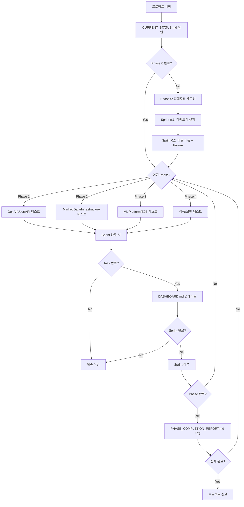

# Backend Test Implementation Guide

**프로젝트 명**: 백엔드 전체 테스트 커버리지 구현  
**목표**: 테스트 커버리지 29% → 85% 달성 (8주)

---

## 📖 문서 읽기 순서

프로젝트 이해를 위한 권장 순서:

1. **[README.md](./README.md)** (현재 문서)  
   → 프로젝트 개요, 작업 흐름, 문서 규칙

2. **[CURRENT_STATUS.md](./CURRENT_STATUS.md)**  
   → 현재 테스트 현황, 도메인별 커버리지, 문제점 분석

3. **[MASTER_PLAN.md](./MASTER_PLAN.md)**  
   → Phase/Sprint 계획, Task 상세, 일정 및 리스크 관리

4. **[DASHBOARD.md](./DASHBOARD.md)**  
   → 실시간 진행 현황, KPI 추적, 다음 단계

5. **[domains/](./domains/)** (도메인별 계획)  
   → 각 도메인별 테스트 전략 및 구현 가이드

---

## 🎯 프로젝트 개요

### 비즈니스 목표

- ✅ **품질 향상**: 프로덕션 버그 80% 감소
- ✅ **배포 신뢰도**: CI/CD 자동화 가능
- ✅ **리팩토링 안전성**: 코드 변경 시 회귀 테스트 자동화
- ✅ **마이크로서비스 준비**: 도메인별 독립 테스트 체계 구축

### 기술 목표

| 지표                 | 현재       | 목표       | 개선율 |
| -------------------- | ---------- | ---------- | ------ |
| **테스트 커버리지**  | 29%        | 85%        | +193%  |
| **테스트 케이스 수** | 230개      | 710개      | +209%  |
| **도메인 커버리지**  | 4/7 도메인 | 7/7 도메인 | 100%   |
| **CI 실행 시간**     | 측정 필요  | <5분       | -      |

---

## 🗺️ 작업 흐름 (Workflow)



---

## 📋 Sprint 체크리스트

각 Sprint 시작 전:

- [ ] DASHBOARD.md에서 현재 Sprint 확인
- [ ] MASTER_PLAN.md에서 Task 상세 읽기
- [ ] 의존성 확인 (이전 Task 완료 여부)
- [ ] 필요한 Fixture/Mock 준비
- [ ] 브랜치 생성 (`feature/test-{domain}-{task}`)

각 Task 작업 중:

- [ ] 테스트 파일 생성 (네이밍 규칙 준수)
- [ ] 테스트 케이스 작성 (최소 목표 개수)
- [ ] 코드 커버리지 확인 (`pytest --cov`)
- [ ] 로컬 테스트 통과 (`pytest`)
- [ ] 코드 리뷰 요청 (2명 승인 필요)

각 Task 완료 후:

- [ ] **DASHBOARD.md만 업데이트** (체크박스, 진행률)
- [ ] PR 생성 및 병합
- [ ] CI/CD 통과 확인

각 Sprint 완료 후:

- [ ] Sprint 리뷰 회의
- [ ] DASHBOARD.md 주간 리포트 작성
- [ ] 다음 Sprint 계획 확인

각 Phase 완료 후:

- [ ] **PHASE{N}\_COMPLETION_REPORT.md 작성** (유일한 문서 작성 시점)
- [ ] 커버리지 목표 달성 확인
- [ ] 다음 Phase 킥오프

---

## 📝 문서 작성 규칙 (CRITICAL)

### ✅ 언제 문서를 작성하는가?

**ONLY Phase 완료 시**:

- `PHASE{N}_COMPLETION_REPORT.md` 작성
- 내용: Phase 목표 달성 여부, 주요 성과, 교훈, 다음 Phase 준비 사항

### ❌ 언제 문서를 작성하지 않는가?

**Sprint/Task 완료 시**:

- ❌ `SPRINT{N}_REPORT.md` 작성 안 함
- ❌ `TASK{N}_SUMMARY.md` 작성 안 함
- ✅ **DASHBOARD.md만 업데이트** (체크박스, 진행률, 이슈만)

### ✅ DASHBOARD.md 업데이트 가이드

**Task 완료 시** (예시):

```markdown
#### Sprint 1.1: GenAI Domain 테스트 (5일)

- [x] **Task 1.1.1**: NarrativeReportService 테스트 (1.5일) - 20 tests ✅
- [ ] **Task 1.1.2**: ChatOpsAdvancedService 테스트 (1.5일) - 25 tests (진행 중)
- [ ] **Task 1.1.3**: PromptGovernanceService 테스트 (1일) - 15 tests
- [ ] **Task 1.1.4**: GenAI API 테스트 (1일) - 20 tests

**진행률**: 1/4 Tasks (25%)  
**예상 테스트**: 80개
```

**주요 이슈 발생 시** (예시):

```markdown
### 현재 이슈

- 🔴 **Issue #1**: OpenAI API 모킹 실패 (Task 1.1.2)
  - **원인**: `httpx.AsyncClient` mock 충돌
  - **영향**: ChatOpsAdvancedService 테스트 지연 (1일)
  - **완화**: `respx` 라이브러리로 전환 시도 중
  - **담당**: @developer-name
```

---

## 🏗️ 테스트 구조 설계

### 새 디렉토리 구조 (Phase 0 완료 후)

```
tests/
├── domains/                    # 도메인별 테스트 (NEW)
│   ├── trading/
│   │   ├── api/              # Trading API 테스트
│   │   │   └── test_backtest_api.py
│   │   ├── services/         # Trading 서비스 테스트
│   │   │   ├── test_backtest_service.py
│   │   │   ├── test_orchestrator.py
│   │   │   └── test_trade_engine.py
│   │   ├── strategies/       # 전략 테스트
│   │   │   ├── test_strategy_executor.py
│   │   │   └── test_strategy_config.py
│   │   └── test_trading_e2e.py  # E2E 테스트
│   ├── market_data/
│   │   ├── api/
│   │   │   └── test_market_data_api.py
│   │   ├── services/
│   │   │   ├── test_stock_service.py
│   │   │   ├── test_fundamental_service.py
│   │   │   └── test_data_quality_sentinel.py
│   │   └── test_market_data_e2e.py
│   ├── ml_platform/
│   │   ├── api/
│   │   │   └── test_ml_api.py
│   │   ├── services/
│   │   │   ├── test_feature_store.py
│   │   │   ├── test_model_lifecycle.py
│   │   │   └── test_ml_trainer.py
│   │   └── test_ml_e2e.py
│   ├── gen_ai/
│   │   ├── api/
│   │   │   └── test_gen_ai_api.py
│   │   ├── services/
│   │   │   ├── test_narrative_report_service.py
│   │   │   ├── test_chatops_advanced_service.py
│   │   │   └── test_prompt_governance_service.py
│   │   └── test_gen_ai_e2e.py
│   └── user/
│       ├── api/
│       │   └── test_user_api.py
│       ├── services/
│       │   ├── test_dashboard_service.py
│       │   └── test_auth_service.py
│       └── test_user_e2e.py
│
├── shared/                     # 공통 테스트 (NEW)
│   ├── test_service_factory.py
│   ├── test_database_manager.py
│   └── fixtures/
│       ├── conftest.py       # 전역 fixture
│       ├── db_fixtures.py
│       ├── api_fixtures.py
│       └── mock_fixtures.py
│
├── performance/                # 성능 테스트 (Phase 4)
│   ├── test_api_performance.py
│   ├── test_backtest_performance.py
│   └── test_ml_performance.py
│
├── security/                   # 보안 테스트 (Phase 4)
│   ├── test_api_security.py
│   └── test_data_security.py
│
└── conftest.py                 # 루트 설정
```

### 테스트 네이밍 규칙

**파일 네이밍**:

- API: `test_{domain}_api.py`
- Service: `test_{service_name}_service.py`
- E2E: `test_{domain}_e2e.py`
- Fixture: `{category}_fixtures.py`

**테스트 함수 네이밍**:

```python
# 성공 케이스
async def test_{function_name}_success():
    """성공 시나리오"""

# 실패 케이스
async def test_{function_name}_raises_{error}_when_{condition}():
    """에러 조건"""

# Edge Case
async def test_{function_name}_with_{special_condition}():
    """특수 조건"""
```

---

## 🧪 테스트 작성 가이드

### 공통 Fixture 사용 (Phase 0 완료 후)

```python
# domains/gen_ai/services/test_narrative_report_service.py

import pytest
from tests.shared.fixtures.db_fixtures import mongodb_client, duckdb_conn
from tests.shared.fixtures.api_fixtures import async_client
from tests.shared.fixtures.mock_fixtures import mock_openai

async def test_generate_backtest_report_success(
    async_client,
    mock_openai,  # OpenAI API 자동 모킹
    mongodb_client,
):
    """백테스트 리포트 생성 성공 테스트"""
    # Arrange
    backtest_id = "test-backtest-id"

    # Act
    response = await async_client.post(
        f"/narrative/backtest/{backtest_id}"
    )

    # Assert
    assert response.status_code == 200
    assert "report" in response.json()
```

### OpenAI API 모킹 패턴

```python
# tests/shared/fixtures/mock_fixtures.py

import pytest
from unittest.mock import AsyncMock

@pytest.fixture
def mock_openai(monkeypatch):
    """OpenAI API 모킹"""
    mock_response = AsyncMock()
    mock_response.choices = [
        AsyncMock(message=AsyncMock(content="Mocked response"))
    ]

    # OpenAI 클라이언트 모킹
    monkeypatch.setattr(
        "openai.AsyncOpenAI.chat.completions.create",
        AsyncMock(return_value=mock_response)
    )

    return mock_response
```

### Alpha Vantage API 모킹 패턴

```python
# tests/shared/fixtures/mock_fixtures.py

import pytest
from unittest.mock import AsyncMock

@pytest.fixture
def mock_alpha_vantage(monkeypatch):
    """Alpha Vantage API 모킹"""
    mock_data = {
        "Time Series (Daily)": {
            "2023-01-01": {
                "1. open": "100.0",
                "2. high": "110.0",
                "3. low": "95.0",
                "4. close": "105.0",
                "5. volume": "1000000"
            }
        }
    }

    monkeypatch.setattr(
        "app.alpha_vantage.client.AlphaVantageClient.get_stock_time_series_daily",
        AsyncMock(return_value=mock_data)
    )

    return mock_data
```

### E2E 테스트 패턴

```python
# domains/trading/test_trading_e2e.py

import pytest

@pytest.mark.e2e
async def test_full_backtest_workflow(
    async_client,
    mongodb_client,
    mock_alpha_vantage,  # 외부 API만 모킹
):
    """전략 생성 → 백테스트 → 결과 조회 E2E"""
    # 1. 전략 생성
    strategy_response = await async_client.post(
        "/strategies",
        json={"name": "Test Strategy", "code": "..."}
    )
    strategy_id = strategy_response.json()["id"]

    # 2. 백테스트 실행
    backtest_response = await async_client.post(
        "/backtests",
        json={"strategy_id": strategy_id, ...}
    )
    backtest_id = backtest_response.json()["id"]

    # 3. 결과 조회
    result_response = await async_client.get(
        f"/backtests/{backtest_id}/results"
    )

    # 4. 전체 흐름 검증
    assert strategy_response.status_code == 201
    assert backtest_response.status_code == 201
    assert result_response.status_code == 200
    assert result_response.json()["total_return"] > 0
```

---

## 🚀 개발 환경 설정

### 테스트 실행

```bash
# 전체 테스트
cd backend && uv run pytest

# 특정 도메인
uv run pytest tests/domains/gen_ai/

# 특정 파일
uv run pytest tests/domains/gen_ai/services/test_narrative_report_service.py

# 특정 테스트
uv run pytest tests/domains/gen_ai/services/test_narrative_report_service.py::test_generate_backtest_report_success

# E2E 테스트만
uv run pytest -m e2e

# 커버리지 측정
uv run pytest --cov=app --cov-report=html

# 병렬 실행 (빠른 실행)
uv run pytest -n auto
```

### 커버리지 확인

```bash
# HTML 리포트 생성
uv run pytest --cov=app --cov-report=html

# 터미널 출력
uv run pytest --cov=app --cov-report=term

# 특정 모듈만
uv run pytest --cov=app.services.gen_ai --cov-report=term
```

### CI/CD 통합

```yaml
# .github/workflows/test.yml

name: Backend Tests

on: [push, pull_request]

jobs:
  test:
    runs-on: ubuntu-latest
    steps:
      - uses: actions/checkout@v3
      - name: Set up Python
        uses: actions/setup-python@v4
        with:
          python-version: "3.11"

      - name: Install uv
        run: pip install uv

      - name: Install dependencies
        run: cd backend && uv sync

      - name: Run tests
        run: cd backend && uv run pytest --cov=app --cov-report=xml

      - name: Upload coverage
        uses: codecov/codecov-action@v3
        with:
          file: ./backend/coverage.xml
```

---

## 📊 진행 현황 추적

### 주간 리포트 작성 (매주 금요일)

**DASHBOARD.md의 "주간 리포트" 섹션 업데이트**:

```markdown
### Week 2 (2025-10-21 ~ 2025-10-25)

**목표**: Phase 1 Sprint 1.1 완료 (GenAI Domain)  
**진행률**: 75%

**완료된 작업**:

- ✅ Task 1.1.1: NarrativeReportService 테스트 (20 tests)
- ✅ Task 1.1.2: ChatOpsAdvancedService 테스트 (25 tests)
- ✅ Task 1.1.3: PromptGovernanceService 테스트 (15 tests)

**진행 중인 작업**:

- 🔄 Task 1.1.4: GenAI API 테스트 (50% 완료, 10/20 tests)

**다음 주 계획**:

- Task 1.1.4 완료
- Sprint 1.2 시작 (User Domain)

**주요 이슈**:

- OpenAI API 모킹 초기 설정 지연 (1일)
  - 해결: `respx` 라이브러리 도입

**커버리지 변화**:

- GenAI: 15% → 50% (+35%p)
```

---

## 🔗 관련 문서

- [Current Status](./CURRENT_STATUS.md) - 현황 분석
- [Master Plan](./MASTER_PLAN.md) - 전체 계획
- [Dashboard](./DASHBOARD.md) - 진행 현황
- [Domain Plans](./domains/) - 도메인별 계획

---

## 🆘 도움말 및 FAQ

### Q: Phase 0은 왜 중요한가요?

**A**: 마이크로서비스 전환 대비 도메인별 테스트 분리가 필수입니다. Phase 0 없이
진행하면:

- 레거시 테스트와 신규 테스트 혼재
- 도메인별 독립 테스트 불가
- 테스트 중복 및 충돌 발생

### Q: OpenAI API 모킹은 필수인가요?

**A**: 네, GenAI 테스트는 **모두 모킹**해야 합니다:

- ✅ 비용 절감 (실제 API 호출 시 수백 달러)
- ✅ 테스트 속도 (10배 이상 빠름)
- ✅ 안정성 (외부 API 의존성 제거)
- ⚠️ E2E 테스트만 실제 API (최소한으로)

### Q: 커버리지 85%는 현실적인가요?

**A**: 네, 8주면 충분합니다:

- Phase 1-3: 기능 테스트 (29% → 80%)
- Phase 4: 성능/보안 (80% → 85%)
- 유사 프로젝트: Netflix (90%), Google (85%)

### Q: 문서 작성이 너무 많지 않나요?

**A**: 아니요, **Phase 완료 시만 문서 작성**:

- ❌ Sprint/Task 완료 시 문서 작성 안 함
- ✅ DASHBOARD.md만 업데이트 (체크박스, 진행률)
- ✅ Phase 완료 시 `PHASE{N}_COMPLETION_REPORT.md` (단 5회)

### Q: 테스트가 실패하면 어떻게 하나요?

**A**: 다음 순서로 디버깅:

1. 로컬 재실행 (`pytest -vv`)
2. Fixture 확인 (DB 초기화, Mock 설정)
3. 로그 확인 (`pytest --log-cli-level=DEBUG`)
4. CI 환경 재현 (Docker)
5. 팀원에게 도움 요청

---

**마지막 업데이트**: 2025-10-15  
**다음 단계**: Phase 0 시작 (디렉토리 재구성)
