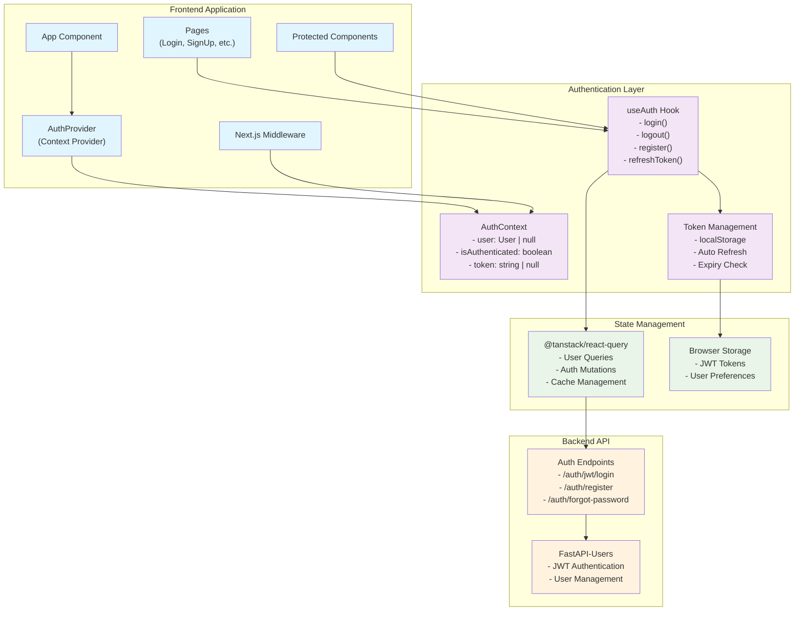
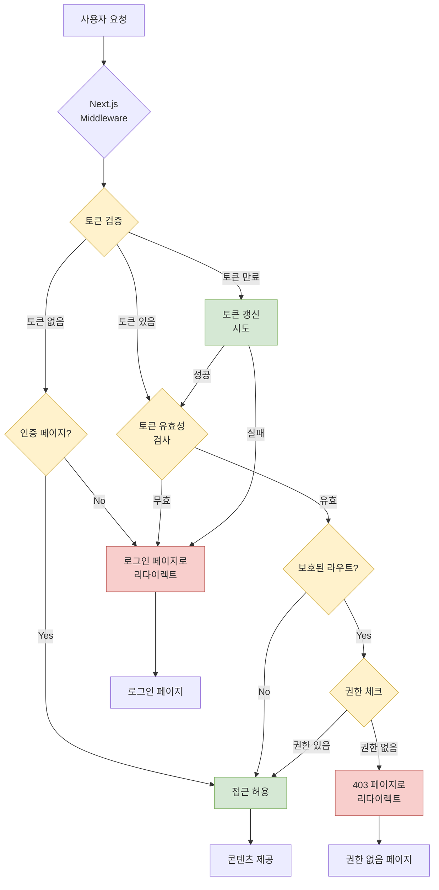
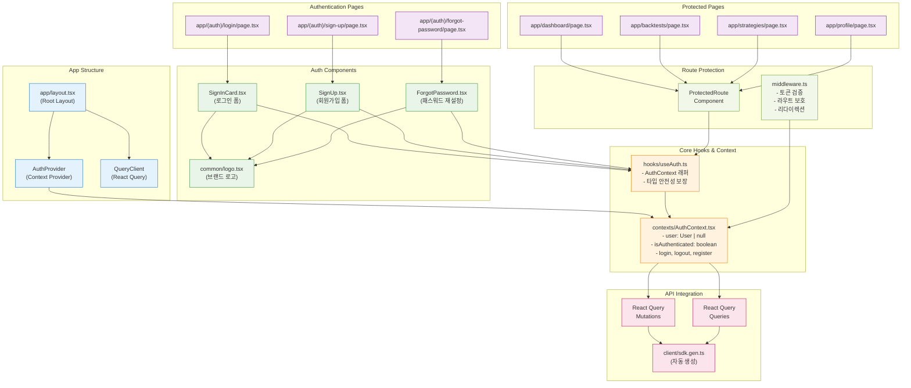
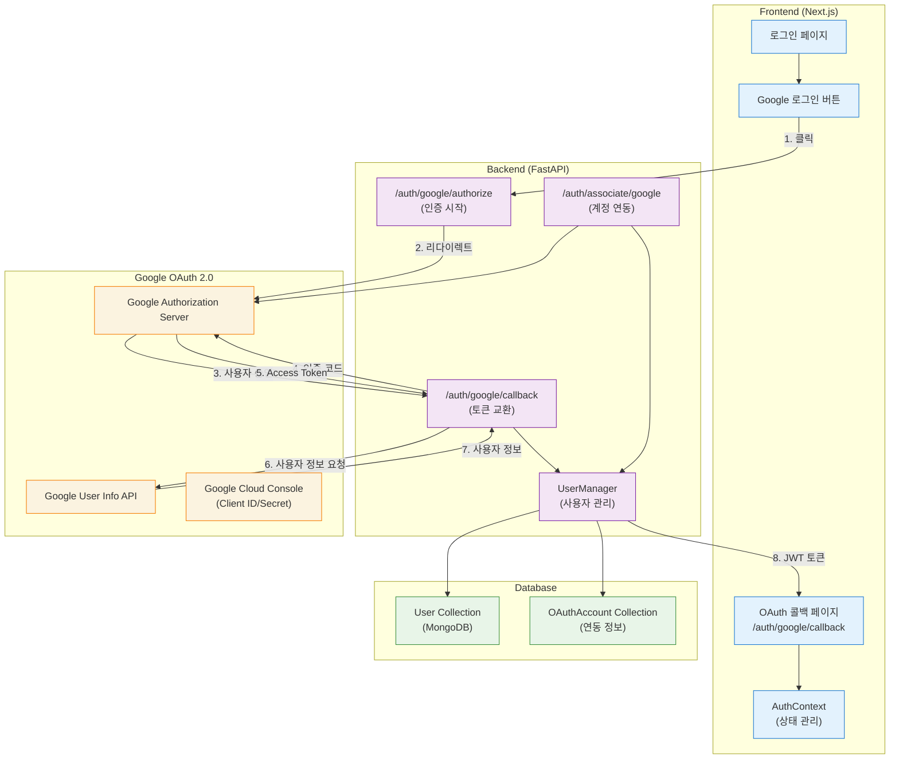
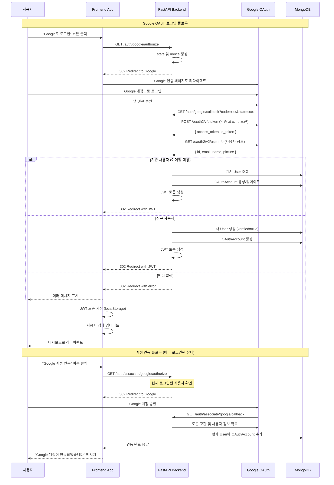

# Frontend Authentication System - 분석 설계 및 작업 계획

## 📋 목차

1. [현재 상황 분석](#현재-상황-분석)
2. [시스템 아키텍처 설계](#시스템-아키텍처-설계)
3. [상세 작업 계획](#상세-작업-계획)
4. [구현 우선순위](#구현-우선순위)
5. [기술 스택 및 의존성](#기술-스택-및-의존성)

## 🔍 현재 상황 분석

### 백엔드 API 현황

- **인증 시스템**: FastAPI-users 기반
- **토큰 방식**: Bearer JWT
- **엔드포인트 구성**:
  - `POST /auth/jwt/login` - 로그인
  - `POST /auth/jwt/logout` - 로그아웃
  - `POST /auth/register` - 회원가입
  - `POST /auth/forgot-password` - 패스워드 재설정 요청
  - `POST /auth/reset-password` - 패스워드 재설정
  - `GET /auth/verify` - 이메일 인증
  - `POST /auth/request-verify-token` - 이메일 인증 토큰 재요청

### 프론트엔드 현황

- **API 클라이언트**: @hey-api/openapi-ts로 자동 생성 완료
- **UI 컴포넌트**: MUI 기반 인증 템플릿 구성
- **페이지 구조**: app/(auth)/ 라우트 그룹 준비
- **상태 관리**: @tanstack/react-query 설치됨
- **로고 컴포넌트**: @/components/common/logo.tsx 사용 가능

## 🏗️ 시스템 아키텍처 설계

### 1. 인증 컨텍스트 아키텍처



### 2. 상태 관리 전략

#### AuthContext State Structure

```typescript
interface AuthContextType {
  // 사용자 상태 (토큰은 제외 - httpOnly 쿠키로 관리)
  user: User | null;
  isAuthenticated: boolean;
  isLoading: boolean;

  // 인증 액션 (토큰 관리는 백엔드에서 처리)
  login: (email: string, password: string) => Promise<void>;
  logout: () => Promise<void>;
  register: (data: RegisterData) => Promise<void>;

  // 패스워드 관리
  forgotPassword: (email: string) => Promise<void>;
  resetPassword: (token: string, password: string) => Promise<void>;

  // 인증 상태 갱신
  refreshAuthStatus: () => Promise<void>;
}
```

#### React Query Integration with httpOnly Cookies

- **쿼리 키 네임스페이스**: `['auth', ...]`
- **Mutation 설정**: `credentials: 'include'` 필수
- **에러 핸들링**: 401/403 에러시 자동 로그아웃
- **자동 재인증**: 쿠키 기반 상태 복원

```mermaid
sequenceDiagram
    participant User as 사용자
    participant UI as React Component
    participant Auth as useAuth Hook
    participant RQ as React Query
    participant API as Backend API
    participant Cookie as httpOnly Cookie

    Note over User, Cookie: httpOnly Cookie 기반 로그인 플로우

    User->>UI: 이메일/패스워드 입력
    UI->>Auth: login(email, password)
    Auth->>RQ: loginMutation.mutate()
    RQ->>API: POST /auth/jwt/login (credentials: 'include')

    alt 로그인 성공
        API-->>Cookie: Set-Cookie: auth_token=jwt; HttpOnly; Secure
        API-->>RQ: { user, success: true }
        RQ-->>Auth: 성공 응답
        Auth->>RQ: 사용자 정보 쿼리 무효화
        Auth-->>UI: 인증 완료
        UI-->>User: 대시보드로 리다이렉트
    else 로그인 실패
        API-->>RQ: 에러 응답
        RQ-->>Auth: 에러 전달
        Auth-->>UI: 에러 상태
        UI-->>User: 에러 메시지 표시
    end

    Note over User, Cookie: API 요청시 자동 인증

    loop 보호된 API 요청
        UI->>API: API 요청 (credentials: 'include')
        Cookie->>API: 쿠키 자동 전송
        API->>API: 토큰 검증
        alt 토큰 유효
            API-->>UI: 데이터 응답
        else 토큰 만료
            API-->>Cookie: Set-Cookie: auth_token=; expired
            API-->>UI: 401 Unauthorized
            UI->>Auth: 인증 상태 무효화
            Auth-->>UI: 로그인 페이지로 리다이렉트
        end
    end

    Note over User, Cookie: 로그아웃 플로우

    User->>Auth: logout()
    Auth->>API: POST /auth/logout (credentials: 'include')
    API-->>Cookie: Set-Cookie: auth_token=; expired; HttpOnly
    API-->>Auth: 로그아웃 성공
    Auth->>RQ: 모든 쿼리 캐시 정리
    Auth-->>UI: 로그인 페이지로 리다이렉트
```

### 3. 토큰 관리 전략

#### httpOnly Cookie 기반 저장 (보안 강화)

```typescript
// 백엔드에서 httpOnly 쿠키로 토큰 관리
// 프론트엔드에서는 직접 토큰에 접근할 수 없음
const AuthTokenStrategy = {
  // 백엔드 로그인 응답시 Set-Cookie 헤더로 토큰 설정
  login: async (credentials) => {
    const response = await fetch("/api/auth/login", {
      method: "POST",
      credentials: "include", // 쿠키 포함
      body: JSON.stringify(credentials),
    });
    // Set-Cookie: auth_token=jwt_token; HttpOnly; Secure; SameSite=Strict
  },

  // API 요청시 자동으로 쿠키 포함
  apiRequest: async (url, options) => {
    return fetch(url, {
      ...options,
      credentials: "include", // 쿠키 자동 포함
    });
  },

  // 로그아웃시 백엔드에서 쿠키 삭제
  logout: async () => {
    await fetch("/api/auth/logout", {
      method: "POST",
      credentials: "include",
    });
    // Set-Cookie: auth_token=; expires=Thu, 01 Jan 1970 00:00:00 UTC; HttpOnly
  },
};
```

#### 보안 설정

```typescript
// 백엔드 쿠키 설정 (FastAPI)
cookie_config = {
  "httponly": True,        # XSS 공격 방지 (JavaScript 접근 불가)
  "secure": True,          # HTTPS에서만 전송
  "samesite": "strict",    # CSRF 공격 방지
  "max_age": 30 * 24 * 3600, # 30일 만료
  "path": "/",             # 전체 도메인에서 사용
  "domain": None           # 현재 도메인에서만 사용
}
```

#### 클라이언트 인증 상태 관리

```typescript
// 프론트엔드에서는 토큰에 직접 접근하지 않고
// API 호출을 통해 인증 상태 확인
const useAuthStatus = () => {
  return useQuery({
    queryKey: ["auth", "status"],
    queryFn: async () => {
      const response = await fetch("/api/auth/me", {
        credentials: "include",
      });
      if (!response.ok) throw new Error("Not authenticated");
      return response.json();
    },
    retry: false,
    staleTime: 5 * 60 * 1000, // 5분
    refetchOnWindowFocus: true,
  });
};
```

### 4. 라우팅 보안 설계

#### Middleware 구조

```typescript
// src/middleware.ts
export function middleware(request: NextRequest) {
  // httpOnly 쿠키에서 토큰 자동 추출
  const token = request.cookies.get("auth_token")?.value;

  // 토큰 유효성 검사
  const isAuthenticated = token ? isTokenValid(token) : false;

  // 보호된 라우트 체크 및 리다이렉션
  if (isProtectedRoute(request.nextUrl.pathname)) {
    if (!isAuthenticated) {
      const loginUrl = new URL("/login", request.url);
      loginUrl.searchParams.set("redirect", request.nextUrl.pathname);
      return NextResponse.redirect(loginUrl);
    }
  }

  // 인증된 사용자의 auth 페이지 접근 방지
  if (isAuthRoute(request.nextUrl.pathname) && isAuthenticated) {
    const redirectTo =
      request.nextUrl.searchParams.get("redirect") || "/dashboard";
    return NextResponse.redirect(new URL(redirectTo, request.url));
  }

  return NextResponse.next();
}

export const config = {
  matcher: ["/((?!api|_next/static|_next/image|favicon.ico).*)"],
};
```

#### 보호된 라우트 정의

```typescript
const PROTECTED_ROUTES = [
  "/dashboard",
  "/backtests",
  "/strategies",
  "/profile",
];

const AUTH_ROUTES = ["/login", "/sign-up", "/forgot-password"];
```



## 📝 상세 작업 계획

### Phase 1: Core Authentication Infrastructure

#### 1.1 AuthContext 구현 (`@/contexts/AuthContext.tsx`)

```typescript
// 주요 기능
- httpOnly 쿠키 기반 인증 상태 관리
- 사용자 정보 관리 (React Query 기반)
- 로그인/로그아웃 플로우 (백엔드 쿠키 관리)
- API 요청 자동 인증 (credentials: 'include')
- 401/403 에러 자동 처리
```

**구현 세부사항:**

- `@tanstack/react-query`의 `useQuery`, `useMutation` 활용
- 모든 API 요청에 `credentials: 'include'` 설정
- 401 에러시 자동 로그아웃 및 리다이렉트
- 쿠키 기반 상태 복원 (새로고침시)

#### 1.2 useAuth Hook 구현 (`@/hooks/useAuth.ts`)

```typescript
// 주요 기능
- AuthContext 래퍼 훅
- 타입 안전성 보장
- httpOnly 쿠키 기반 인증 상태 확인
- 자동 에러 처리 및 리다이렉트
```

**구현 세부사항:**

- Context 사용 검증
- 쿠키 기반 인증 상태 관리
- 401/403 에러 자동 처리
- TypeScript 타입 가드

### Phase 2: Authentication Pages

#### 2.1 로그인 페이지 (`app/(auth)/login/page.tsx`)

```typescript
// 주요 기능
- 이메일/패스워드 로그인
- 폼 검증 (react-hook-form 고려)
- 로딩 상태 표시
- 에러 메시지 표시
- "Remember Me" 기능 (쿠키 만료 시간 연장)
```

**httpOnly Cookie 특화 기능:**

- 백엔드에서 쿠키 설정 처리
- 클라이언트는 로그인 성공/실패만 확인
- 자동 인증 상태 갱신
- 보안 강화된 토큰 관리

**UI/UX 요구사항:**

- Material-UI 디자인 시스템 준수
- 반응형 디자인
- 접근성 고려 (ARIA 라벨, 키보드 네비게이션)
- 로고 교체 (SitemarkIcon → MyLogo)

#### 2.2 회원가입 페이지 (`app/(auth)/sign-up/page.tsx`)

```typescript
// 주요 기능
- 사용자 정보 입력 폼
- 실시간 유효성 검사
- 패스워드 확인
- 이메일 인증 플로우
- 약관 동의
```

**검증 규칙:**

- 이메일 형식 검증
- 패스워드 강도 체크 (최소 8자, 특수문자 포함)
- 패스워드 확인 일치 검증
- 실시간 피드백

#### 2.3 패스워드 재설정 페이지 (`app/(auth)/forgot-password/page.tsx`)

```typescript
// 주요 기능
- 이메일 입력 폼
- 재설정 요청 전송
- 성공/실패 피드백
- 이메일 재전송 기능
```

### Phase 3: Middleware and Route Protection

#### 3.1 Middleware 구현 (`src/middleware.ts`)

```typescript
// 주요 기능
- httpOnly 쿠키에서 JWT 토큰 자동 추출
- 토큰 유효성 서버사이드 검증
- 보호된 라우트 접근 제어
- 인증되지 않은 사용자 자동 리다이렉션
- 인증된 사용자의 auth 페이지 접근 방지
```

**httpOnly Cookie 장점:**

- XSS 공격으로부터 토큰 보호
- 서버사이드 렌더링에서 인증 상태 확인 가능
- CSRF 공격 방지 (SameSite 설정)
- 자동 토큰 전송 (브라우저가 처리)

**보안 고려사항:**

- **httpOnly 쿠키**: XSS 공격으로부터 토큰 보호
- **Secure 플래그**: HTTPS에서만 쿠키 전송
- **SameSite 설정**: CSRF 공격 방지
- **토큰 만료**: 적절한 만료 시간 설정 (30일)
- **도메인 제한**: 현재 도메인에서만 쿠키 사용

#### 3.2 Route Guards

```typescript
// HOC 또는 래퍼 컴포넌트
- ProtectedRoute: 인증 필요 페이지
- PublicRoute: 비인증 전용 페이지 (로그인 등)
- ConditionalRoute: 조건부 접근
```

### Phase 4: Component Integration and Enhancement

#### 4.1 로고 컴포넌트 교체

```typescript
// 작업 대상 파일들
- @/components/auth/SignInCard.tsx
- @/components/auth/SignUp.tsx
- @/components/auth/Content.tsx

// 변경사항
- SitemarkIcon → MyLogo 컴포넌트 사용
- 테마별 로고 자동 변경 (다크/라이트 모드)
- 적절한 크기 및 간격 조정
```

#### 4.2 인증 컴포넌트 개선

```typescript
// 기존 템플릿 컴포넌트 개선
- httpOnly 쿠키 기반 API 연동
- credentials: 'include' 설정 일관 적용
- 상태 관리 통합 (AuthContext 사용)
- 401/403 에러 자동 처리
- 로딩 상태 추가
- 폼 검증 강화
```

**API 요청 표준화:**

```typescript
// 모든 인증 관련 API 요청
const apiClient = {
  login: (credentials) =>
    fetch("/api/auth/login", {
      method: "POST",
      credentials: "include", // 필수!
      headers: { "Content-Type": "application/json" },
      body: JSON.stringify(credentials),
    }),

  logout: () =>
    fetch("/api/auth/logout", {
      method: "POST",
      credentials: "include", // 필수!
    }),

  getCurrentUser: () =>
    fetch("/api/auth/me", {
      credentials: "include", // 필수!
    }),
};
```

## 🧩 컴포넌트 구조 다이어그램



## 🔗 Google OAuth 통합 설계

### Google OAuth 아키텍처 개요



### Google OAuth 플로우 상세



### Frontend Google OAuth 구현 전략

#### 1. Google 로그인 버튼 컴포넌트

```typescript
// components/auth/GoogleLoginButton.tsx
interface GoogleLoginButtonProps {
  mode: 'login' | 'signup' | 'associate';
  onSuccess?: () => void;
  onError?: (error: string) => void;
}

const GoogleLoginButton: React.FC<GoogleLoginButtonProps> = ({ mode, onSuccess, onError }) => {
  const handleGoogleLogin = () => {
    const endpoint = mode === 'associate'
      ? '/api/v1/auth/associate/google/authorize'
      : '/api/v1/auth/google/authorize';

    // 현재 페이지를 state로 전달하여 콜백 후 리다이렉트
    const currentUrl = window.location.pathname;
    const redirectUrl = `${endpoint}?redirect_url=${encodeURIComponent(currentUrl)}`;

    window.location.href = redirectUrl;
  };

  return (
    <Button
      variant="outlined"
      startIcon={<GoogleIcon />}
      onClick={handleGoogleLogin}
      fullWidth
    >
      {mode === 'associate' ? 'Google 계정 연동' : 'Google로 로그인'}
    </Button>
  );
};
```

#### 2. OAuth 콜백 처리

```typescript
// app/(auth)/google/callback/page.tsx
'use client';

import { useEffect } from 'react';
import { useRouter, useSearchParams } from 'next/navigation';
import { useAuth } from '@/hooks/useAuth';

export default function GoogleCallbackPage() {
  const router = useRouter();
  const searchParams = useSearchParams();
  const { handleOAuthCallback } = useAuth();

  useEffect(() => {
    const token = searchParams.get('token');
    const error = searchParams.get('error');
    const redirectUrl = searchParams.get('redirect_url') || '/dashboard';

    if (token) {
      handleOAuthCallback(token)
        .then(() => router.push(redirectUrl))
        .catch(() => router.push('/login?error=oauth_failed'));
    } else if (error) {
      router.push(`/login?error=${error}`);
    } else {
      router.push('/login?error=invalid_callback');
    }
  }, [searchParams, router, handleOAuthCallback]);

  return (
    <Box display="flex" justifyContent="center" alignItems="center" minHeight="100vh">
      <CircularProgress />
      <Typography variant="h6" sx={{ ml: 2 }}>Google 로그인 처리 중...</Typography>
    </Box>
  );
}
```

#### 3. AuthContext OAuth 메소드 확장

```typescript
// contexts/AuthContext.tsx
interface AuthContextType {
  // ... 기존 메소드들

  // Google OAuth 관련
  loginWithGoogle: () => void;
  associateGoogleAccount: () => Promise<void>;
  handleOAuthCallback: (token: string) => Promise<void>;
  disconnectGoogleAccount: () => Promise<void>;

  // OAuth 상태
  hasGoogleAccount: boolean;
  googleAccountInfo?: {
    email: string;
    name: string;
    picture?: string;
  };
}
```

### Backend Google OAuth 설정

#### 1. 환경 변수 설정

```bash
# .env
GOOGLE_OAUTH_CLIENT_ID=your_google_client_id
GOOGLE_OAUTH_CLIENT_SECRET=your_google_client_secret
GOOGLE_OAUTH_REDIRECT_URI=http://localhost:8000/auth/google/callback
```

#### 2. OAuth 클라이언트 구성

```python
# services/oauth2_client.py
from httpx_oauth.clients.google import GoogleOAuth2
from app.core.config import settings

google_oauth_client = GoogleOAuth2(
    client_id=settings.GOOGLE_OAUTH_CLIENT_ID,
    client_secret=settings.GOOGLE_OAUTH_CLIENT_SECRET,
    scopes=["openid", "email", "profile"]
)
```

#### 3. 사용자 모델 확장

```python
# models/user.py
class OAuthAccount(Document):
    oauth_name: str  # "google"
    access_token: str
    refresh_token: Optional[str] = None
    account_id: str  # Google user ID
    account_email: str
    expires_at: Optional[int] = None

    class Settings:
        name = "oauth_accounts"

class User(BaseModel):
    # ... 기존 필드들
    oauth_accounts: List[str] = []  # OAuthAccount IDs
    is_oauth_user: bool = False
```

### 보안 고려사항

#### 1. CSRF 보호

- **State 매개변수**: 각 OAuth 요청에 고유한 state 값 사용
- **Nonce 검증**: ID 토큰의 nonce 클레임 검증
- **Redirect URI 검증**: 허용된 리다이렉트 URL만 사용

#### 2. 토큰 관리

- **Access Token**: 단기간 사용 후 폐기
- **Refresh Token**: 안전한 저장소에 암호화하여 보관
- **ID Token**: JWT 서명 검증 필수

#### 3. 사용자 정보 보호

- **최소 권한 원칙**: 필요한 스코프만 요청
- **데이터 최소화**: 필요한 사용자 정보만 저장
- **암호화**: 민감한 OAuth 정보 암호화 저장

### 에러 처리 전략

#### 1. Frontend 에러 처리

```typescript
const OAUTH_ERRORS = {
  access_denied: "사용자가 권한을 거부했습니다.",
  invalid_request: "잘못된 요청입니다.",
  server_error: "서버 오류가 발생했습니다.",
  temporarily_unavailable: "서비스가 일시적으로 사용할 수 없습니다.",
} as const;

const handleOAuthError = (error: string) => {
  const message = OAUTH_ERRORS[error] || "알 수 없는 오류가 발생했습니다.";
  toast.error(message);
};
```

#### 2. Backend 에러 처리

```python
# API 라우터에서 OAuth 에러 처리
@router.get("/google/callback")
async def google_callback(request: Request, error: str = None):
    if error:
        error_messages = {
            "access_denied": "사용자가 권한을 거부했습니다",
            "invalid_request": "잘못된 OAuth 요청입니다",
        }
        message = error_messages.get(error, "OAuth 인증 실패")
        return RedirectResponse(f"/login?error={error}")

    # 정상 OAuth 처리 로직
    # ...
```

### 테스트 전략

#### 1. 단위 테스트

- OAuth 클라이언트 구성 테스트
- 토큰 검증 로직 테스트
- 사용자 계정 연동/해제 테스트

#### 2. 통합 테스트

- Google OAuth 플로우 E2E 테스트
- 에러 시나리오 테스트
- 보안 검증 테스트

#### 3. 모의 객체 활용

```python
# tests/test_google_oauth.py
from unittest.mock import Mock, patch

@patch('app.services.oauth2_client.google_oauth_client')
def test_google_oauth_callback(mock_client):
    # Google API 응답 모의
    mock_client.get_access_token.return_value = {
        "access_token": "mock_token",
        "id_token": "mock_id_token"
    }

    # 테스트 실행
    # ...
```

## 🎯 구현 우선순위

### High Priority (Week 1)

1. **httpOnly Cookie 기반 AuthContext + useAuth 구현** - 보안 강화된 인증 인프라
2. **백엔드 쿠키 설정 구현** - FastAPI 쿠키 관리 로직
3. **로그인 페이지 쿠키 연동** - credentials: 'include' 적용
4. **Middleware 쿠키 검증 구현** - 서버사이드 토큰 체크

### Medium Priority (Week 2)

5. **회원가입 페이지 쿠키 연동** - 일관된 인증 플로우
6. **API 클라이언트 표준화** - 모든 요청에 credentials 설정
7. **에러 핸들링 개선** - 401/403 자동 처리
8. **로고 컴포넌트 교체** - 브랜딩 일관성

### Low Priority (Week 3)

9. **고급 보안 기능** - 추가 보안 레이어
10. **성능 최적화** - 코드 스플리팅, 메모이제이션
11. **접근성 개선** - ARIA, 키보드 네비게이션
12. **테스트 코드 작성** - 품질 보증

### Google OAuth Implementation (Week 4+)

13. **Google OAuth 클라이언트 구성** - 환경 설정 및 클라이언트 초기화
14. **Google 로그인 버튼 컴포넌트** - UI 컴포넌트 개발
15. **OAuth 콜백 페이지 구현** - 토큰 처리 및 리다이렉션
16. **계정 연동 기능** - 기존 계정에 Google 연동
17. **OAuth 에러 처리** - 다양한 에러 시나리오 대응
18. **OAuth 보안 강화** - CSRF, state 검증 등
19. **OAuth 테스트 코드** - 단위/통합 테스트

## 🛠️ 기술 스택 및 의존성

### 현재 설치된 패키지

- `@tanstack/react-query` - 서버 상태 관리
- `@mui/material` - UI 컴포넌트
- `next` - 프레임워크
- `react` v19 - UI 라이브러리
- `typescript` - 타입 안전성

### 추가 설치 고려사항

```bash
# 폼 관리 (선택적)
pnpm add react-hook-form @hookform/resolvers zod

# 날짜 관리
pnpm add date-fns

# 쿠키 관리 (필요시)
pnpm add js-cookie @types/js-cookie
```

### API 클라이언트 설정

```typescript
// 자동 생성된 클라이언트 사용
import {
  authAuthJwtLogin,
  authRegisterRegister,
  authResetForgotPassword,
  // ... 기타 인증 관련 함수들
} from "@/client";
```

## 🔐 보안 고려사항

### httpOnly Cookie 보안 강화

- **XSS 방지**: JavaScript로 쿠키 접근 불가
- **CSRF 방지**: SameSite=Strict 설정
- **중간자 공격 방지**: Secure 플래그로 HTTPS 전용
- **도메인 제한**: 현재 도메인에서만 사용

### 쿠키 설정 상세

```typescript
// 백엔드 쿠키 보안 설정
const COOKIE_CONFIG = {
  httpOnly: true, // XSS 공격 방지
  secure: true, // HTTPS에서만 전송
  sameSite: "strict", // CSRF 공격 방지
  maxAge: 30 * 24 * 3600, // 30일 만료
  path: "/", // 전체 경로에서 사용
  domain: undefined, // 현재 도메인만
};
```

### 라우트 보안

- **서버사이드 검증**: Middleware에서 쿠키 토큰 검증
- **클라이언트 검증**: React Query로 사용자 상태 확인
- **자동 로그아웃**: 토큰 만료시 즉시 처리
- **리다이렉션**: 인증 실패시 안전한 페이지로 이동

### API 보안

- **credentials 필수**: 모든 API 요청에 'include' 설정
- **CORS 설정**: 특정 도메인에서만 쿠키 전송 허용
- **토큰 검증**: 백엔드에서 모든 요청 토큰 확인

## 📋 성능 최적화 전략

### React Query 최적화

```typescript
// httpOnly 쿠키 기반 쿼리 키 구조화
const queryKeys = {
  auth: ["auth"] as const,
  user: () => [...queryKeys.auth, "user"] as const,
  profile: (id: string) => [...queryKeys.auth, "profile", id] as const,
};

// 쿠키 기반 API 요청 설정
const defaultQueryOptions = {
  staleTime: 5 * 60 * 1000, // 5분
  cacheTime: 10 * 60 * 1000, // 10분
  retry: (failureCount: number, error: any) => {
    // 401/403 에러는 재시도하지 않음 (인증 문제)
    if (error?.status === 401 || error?.status === 403) {
      return false;
    }
    return failureCount < 3;
  },
};

// 모든 API 요청에 credentials 포함
const apiClient = {
  get: (url: string) => fetch(url, { credentials: "include" }),
  post: (url: string, data: any) =>
    fetch(url, {
      method: "POST",
      credentials: "include",
      headers: { "Content-Type": "application/json" },
      body: JSON.stringify(data),
    }),
};
```

### 컴포넌트 최적화

- **React.memo**: 불필요한 리렌더링 방지
- **useMemo/useCallback**: 값/함수 메모이제이션
- **코드 스플리팅**: 라우트별 동적 임포트

### 번들 최적화

- **Tree shaking**: 사용하지 않는 코드 제거
- **Dynamic imports**: 필요시 로드
- **이미지 최적화**: Next.js Image 컴포넌트 활용

## 🧪 테스트 전략

### 단위 테스트

- **AuthContext**: 상태 변화 테스트
- **useAuth**: 훅 동작 테스트
- **유틸리티 함수**: 토큰 관리 로직 테스트

### 통합 테스트

- **로그인 플로우**: E2E 시나리오
- **회원가입 플로우**: 폼 제출 및 검증
- **인증 가드**: 라우트 보호 테스트

### 접근성 테스트

- **ARIA 라벨**: 스크린 리더 호환성
- **키보드 네비게이션**: 마우스 없이 사용 가능
- **색상 대비**: WCAG 기준 준수

## 📚 참고 자료

### 문서

- [FastAPI Users Documentation](https://fastapi-users.github.io/fastapi-users/)
- [React Query Documentation](https://tanstack.com/query/latest)
- [Next.js Middleware](https://nextjs.org/docs/advanced-features/middleware)
- [MUI Authentication Examples](https://mui.com/templates/)

### 보안 가이드

- [OWASP Top 10](https://owasp.org/www-project-top-ten/)
- [JWT Best Practices](https://auth0.com/blog/a-look-at-the-latest-draft-for-jwt-bcp/)
- [Next.js Security](https://nextjs.org/docs/basic-features/security-headers)

## 🔑 httpOnly Cookie vs localStorage 비교

### httpOnly Cookie 장점

✅ **XSS 공격 방지**: JavaScript로 접근 불가  
✅ **자동 전송**: 브라우저가 쿠키를 자동으로 포함  
✅ **SSR 호환**: 서버사이드에서 인증 상태 확인 가능  
✅ **CSRF 방지**: SameSite 설정으로 보호  
✅ **보안 설정**: Secure, HttpOnly 플래그 지원

### httpOnly Cookie 단점

❌ **개발 복잡성**: 모든 API 요청에 credentials 설정 필요  
❌ **디버깅 어려움**: 개발자 도구에서 토큰 직접 확인 불가  
❌ **CORS 복잡성**: 크로스 도메인 요청시 추가 설정 필요

### localStorage 방식 (이전)

❌ **XSS 취약**: JavaScript로 토큰 접근 가능  
❌ **수동 관리**: 모든 API 요청에 Authorization 헤더 추가 필요  
✅ **간단한 개발**: 토큰 직접 조작 가능  
✅ **디버깅 용이**: 개발자 도구에서 토큰 확인 가능

### 결론: httpOnly Cookie 채택

보안성을 최우선으로 고려하여 **httpOnly Cookie 방식을 채택**합니다.  
개발 복잡성은 증가하지만, XSS 공격으로부터 토큰을 보호하는 것이 더 중요합니다.
