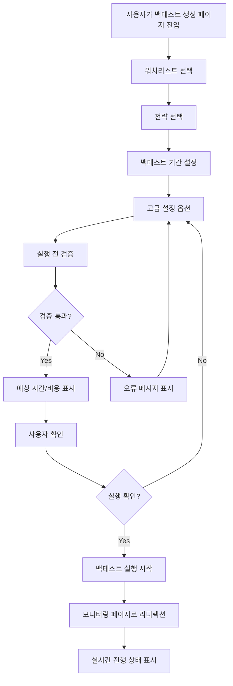
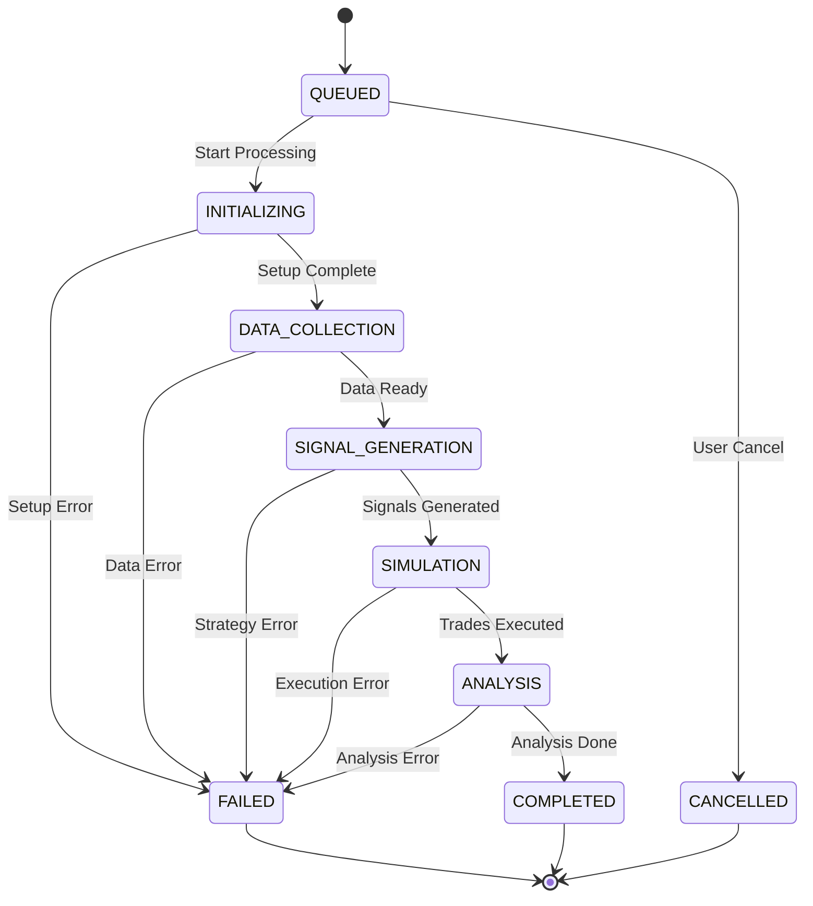
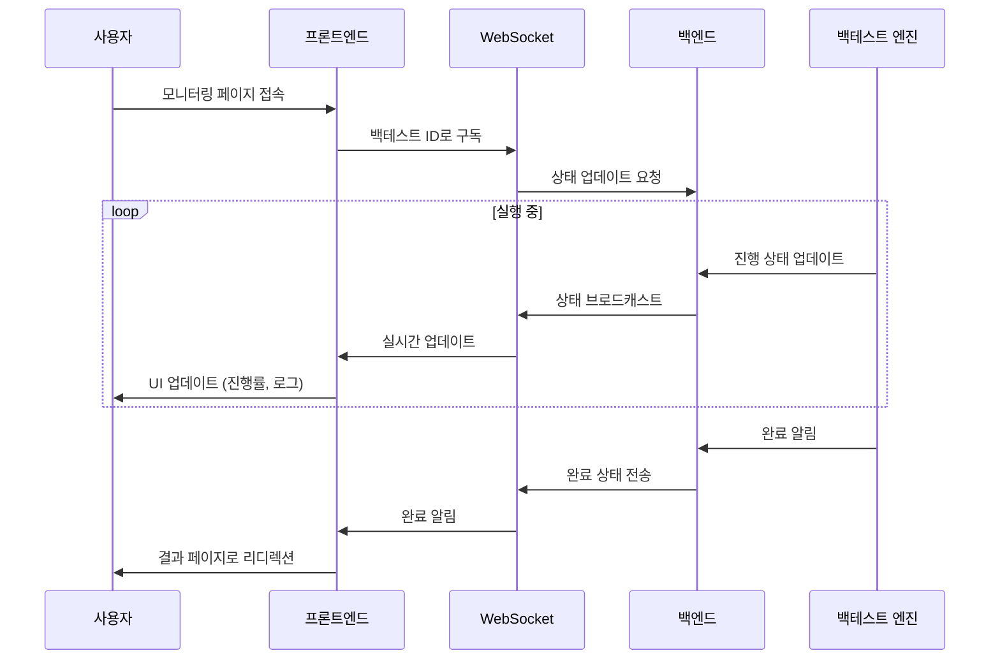
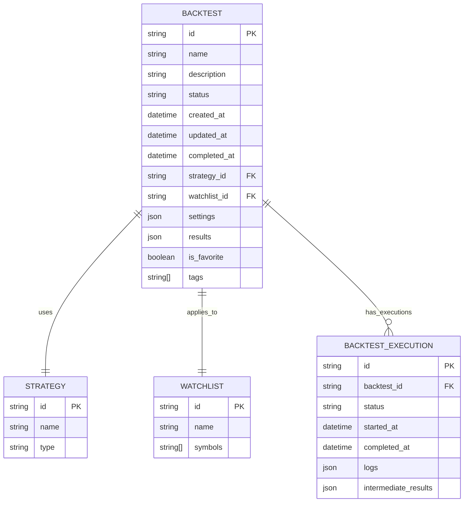
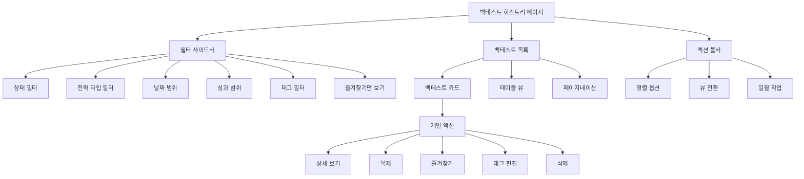
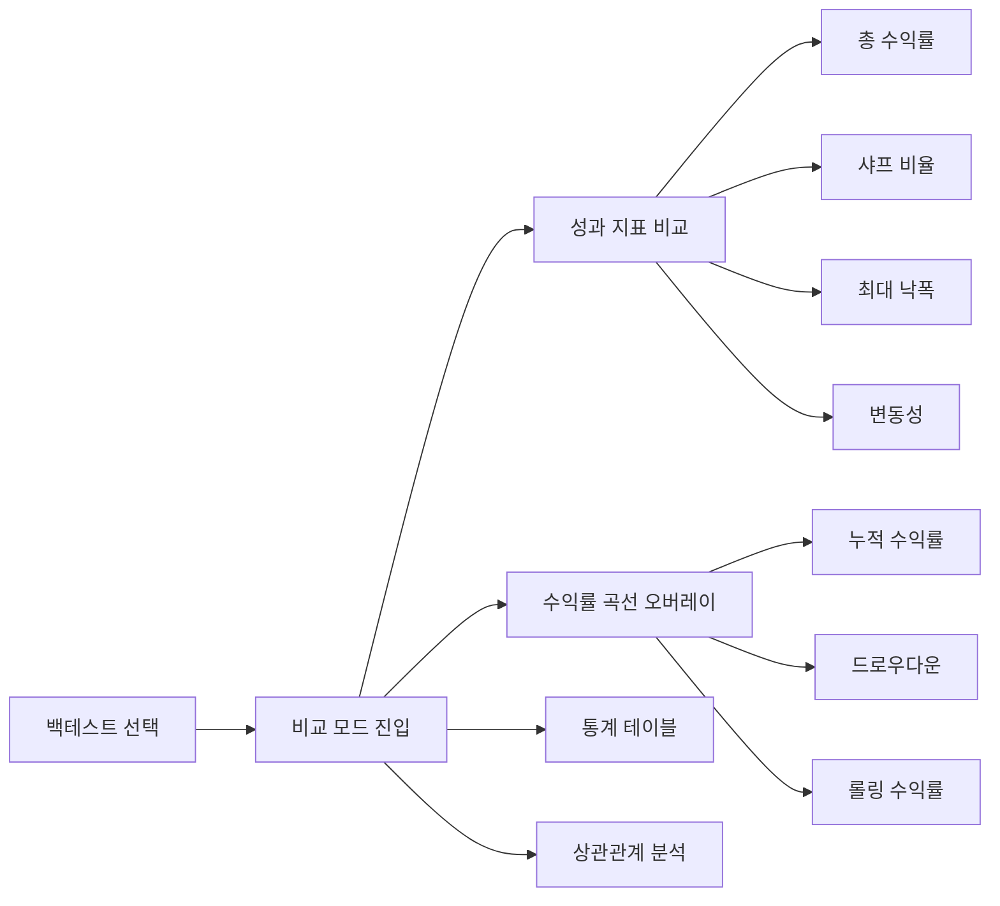
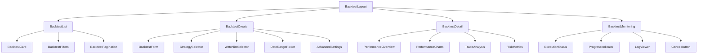
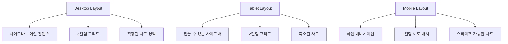

# 🎯 백테스트 시스템 - 프론트엔드 상세 설계

## 📋 개요

백테스트 시스템은 사용자가 설정한 전략을 과거 데이터에 적용하여 성과를 검증하는
핵심 기능입니다. 이 문서는 Epic 4의 유저 스토리를 기반으로 한 상세한 프론트엔드
설계를 다룹니다.

## 🎯 Epic 4: 백테스트 실행 및 모니터링

### Epic Goal

사용자가 백테스트를 쉽게 실행하고 진행 상태를 실시간으로 확인할 수 있도록 함

---

## 📱 페이지 구조 및 라우팅

### 라우팅 설계

```
/backtests/
├── page.tsx                    # 백테스트 목록 (히스토리) [*]
├── create/
│   └── page.tsx               # 백테스트 생성/설정 [*]
├── [id]/
│   ├── page.tsx               # 백테스트 상세 (결과 분석) [*]
│   ├── monitoring/
│   │   └── page.tsx           # 실행 상태 모니터링 [*]
│   └── report/
│       └── page.tsx           # 상세 분석 리포트
└── components/
    ├── BacktestCard.tsx       # 백테스트 카드 컴포넌트
    ├── BacktestForm.tsx       # 백테스ト 설정 폼
    ├── ExecutionStatus.tsx    # 실행 상태 표시
    ├── PerformanceChart.tsx   # 성과 차트
    └── TradeDetails.tsx       # 거래 내역
```

---

## 🚀 Story 4.1: 통합 백테스트 실행

### 사용자 스토리

**As** 사용자  
**I want** 원클릭으로 전체 백테스트를 실행  
**So that** 복잡한 설정 과정 없이 빠르게 결과를 확인할 수 있다

### Acceptance Criteria

- [*] 워치리스트, 전략, 기간을 선택하여 원클릭 실행
- [ ] 실행 전 예상 소요 시간 및 비용 표시
- [*] 빠른 실행을 위한 프리셋 제공 (1개월, 1년, 5년)
- [ ] 백그라운드 실행 지원
- [ ] 실행 대기열 및 우선순위 관리

### 플로우차트



### 컴포넌트 설계

#### BacktestForm.tsx

```typescript
interface BacktestFormProps {
  onSubmit: (config: BacktestConfig) => void;
  initialData?: Partial<BacktestConfig>;
  isLoading?: boolean;
}

interface BacktestConfig {
  name: string;
  description?: string;
  watchlist_id: string;
  strategy_id: string;
  start_date: string;
  end_date: string;
  initial_capital: number;
  commission: number;
  slippage: number;
  position_sizing: "equal_weight" | "market_cap" | "volatility_adjusted";
  rebalancing_frequency: "daily" | "weekly" | "monthly" | "quarterly";
  risk_management?: RiskManagementConfig;
}

interface RiskManagementConfig {
  max_position_size: number;
  stop_loss?: number;
  take_profit?: number;
  max_drawdown_limit?: number;
}
```

#### 주요 기능

1. **프리셋 템플릿**: 빠른 시작을 위한 사전 정의된 설정
2. **실시간 검증**: 설정 변경 시 즉시 유효성 검사
3. **예상 계산**: 실행 전 소요 시간 및 리소스 사용량 예측
4. **저장/불러오기**: 자주 사용하는 설정 저장

### API 연동

```typescript
// 백테스트 생성
POST /api/v1/backtests/integrated
{
  "name": "Tech Stock Momentum Strategy",
  "watchlist": ["AAPL", "MSFT", "GOOGL"],
  "strategy_id": "momentum_v1",
  "start_date": "2020-01-01",
  "end_date": "2024-01-01",
  "initial_capital": 100000,
  "settings": {
    "commission": 0.001,
    "slippage": 0.0005
  }
}

// 응답
{
  "backtest_id": "bt_12345",
  "status": "QUEUED",
  "estimated_duration": 120, // seconds
  "queue_position": 2
}
```

---

## 📊 Story 4.2: 실행 상태 모니터링

### 사용자 스토리

**As** 사용자  
**I want** 백테스트 진행 상황을 실시간으로 확인  
**So that** 언제 완료될지 예상하고 다른 작업을 계획할 수 있다

### Acceptance Criteria

- [*] 실시간 진행률 표시 (데이터 수집, 신호 생성, 시뮬레이션 단계별)
- [*] 예상 완료 시간 및 남은 시간
- [*] 중간 결과 미리보기 (처리된 데이터 포인트 수 등)
- [*] 실행 중 취소 기능
- [*] 오류 발생 시 상세한 에러 메시지

### 백테스트 실행 단계



### 실시간 모니터링 구조



### 컴포넌트 설계

#### ExecutionStatus.tsx

```typescript
interface ExecutionStatusProps {
  backtestId: string;
  onComplete?: (result: BacktestResult) => void;
  onError?: (error: Error) => void;
}

interface ExecutionState {
  status: BacktestStatus;
  progress: {
    current_step: string;
    total_steps: number;
    completed_steps: number;
    percentage: number;
  };
  logs: ExecutionLog[];
  estimated_completion: string;
  intermediate_results?: IntermediateResults;
}

interface ExecutionLog {
  timestamp: string;
  level: "INFO" | "WARNING" | "ERROR";
  message: string;
  details?: Record<string, any>;
}
```

#### 주요 기능

1. **실시간 프로그레스바**: 단계별 진행률 시각화
2. **로그 스트리밍**: 실행 과정의 상세 로그 실시간 표시
3. **취소 기능**: 사용자가 언제든 실행 중단 가능
4. **에러 핸들링**: 오류 발생 시 상세 정보 제공
5. **중간 결과**: 부분 완료된 데이터 미리보기

### WebSocket 연동

```typescript
// WebSocket 연결 및 상태 구독
const useBacktestMonitoring = (backtestId: string) => {
  const [status, setStatus] = useState<ExecutionState>();
  const [isConnected, setIsConnected] = useState(false);

  useEffect(() => {
    const ws = new WebSocket(`ws://localhost:8000/ws/backtests/${backtestId}`);

    ws.onopen = () => setIsConnected(true);
    ws.onmessage = (event) => {
      const update = JSON.parse(event.data);
      setStatus(update);
    };
    ws.onclose = () => setIsConnected(false);

    return () => ws.close();
  }, [backtestId]);

  const cancelBacktest = () => {
    // 취소 API 호출
    fetch(`/api/v1/backtests/${backtestId}/cancel`, { method: "POST" });
  };

  return { status, isConnected, cancelBacktest };
};
```

---

## 📚 Story 4.3: 백테스트 히스토리 관리

### 사용자 스토리

**As** 파워 유저  
**I want** 과거 실행한 모든 백테스트를 체계적으로 관리  
**So that** 이전 실험을 참조하고 재실행할 수 있다

### Acceptance Criteria

- [*] 백테스트 목록 필터링 (날짜, 전략, 성과 등)
- [*] 즐겨찾기 및 태그 기능
- [*] 백테스트 복제 및 수정 실행
- [ ] 실행 설정 및 결과 비교 뷰
- [*] 백테스트 삭제 및 아카이브

### 데이터 구조



### 컴포넌트 설계

#### BacktestHistory.tsx

```typescript
interface BacktestHistoryProps {
  filters?: BacktestFilters;
  onFilterChange?: (filters: BacktestFilters) => void;
}

interface BacktestFilters {
  status?: BacktestStatus[];
  strategy_types?: string[];
  date_range?: {
    start: string;
    end: string;
  };
  performance_range?: {
    min_return?: number;
    max_return?: number;
  };
  tags?: string[];
  favorites_only?: boolean;
}

interface BacktestSummary {
  id: string;
  name: string;
  status: BacktestStatus;
  strategy_name: string;
  total_return?: number;
  sharpe_ratio?: number;
  max_drawdown?: number;
  created_at: string;
  duration: number;
  is_favorite: boolean;
  tags: string[];
}
```

### 필터링 및 검색 UI



#### 주요 기능

1. **고급 필터링**: 다중 조건 필터링 및 저장된 필터 프리셋
2. **정렬 옵션**: 날짜, 성과, 이름 등 다양한 기준으로 정렬
3. **뷰 모드**: 카드 뷰, 테이블 뷰, 상세 뷰 전환
4. **일괄 작업**: 다중 선택하여 태그 추가, 삭제 등
5. **성과 비교**: 여러 백테스트 성과 비교 차트

### 백테스트 비교 기능



---

## 🏗️ 아키텍처 설계

### 컴포넌트 계층 구조



### 상태 관리 구조

```typescript
// 백테스트 관련 상태 관리
interface BacktestState {
  // 목록 관리
  backtests: BacktestSummary[];
  filters: BacktestFilters;
  pagination: PaginationState;
  loading: boolean;

  // 실행 상태
  activeExecutions: Record<string, ExecutionState>;

  // 선택된 백테스트
  selectedBacktest?: BacktestDetail;

  // 비교 모드
  comparisonMode: boolean;
  selectedForComparison: string[];
}

// 액션 타입
interface BacktestActions {
  // 목록 관리
  fetchBacktests: (filters?: BacktestFilters) => Promise<void>;
  updateFilters: (filters: Partial<BacktestFilters>) => void;

  // 백테스트 실행
  createBacktest: (config: BacktestConfig) => Promise<string>;
  cancelBacktest: (id: string) => Promise<void>;

  // 관리 기능
  toggleFavorite: (id: string) => Promise<void>;
  updateTags: (id: string, tags: string[]) => Promise<void>;
  deleteBacktest: (id: string) => Promise<void>;
  cloneBacktest: (id: string) => Promise<string>;

  // 비교 기능
  toggleComparison: (id: string) => void;
  clearComparison: () => void;
}
```

### API 인터페이스 설계

```typescript
// 백테스트 API 서비스
class BacktestService {
  // 목록 조회
  async getBacktests(
    params: BacktestListParams
  ): Promise<BacktestListResponse> {
    return this.client.get("/api/v1/backtests", { params });
  }

  // 상세 조회
  async getBacktest(id: string): Promise<BacktestDetail> {
    return this.client.get(`/api/v1/backtests/${id}`);
  }

  // 생성
  async createBacktest(
    config: BacktestConfig
  ): Promise<CreateBacktestResponse> {
    return this.client.post("/api/v1/backtests/integrated", config);
  }

  // 실행 상태 조회
  async getExecutionStatus(id: string): Promise<ExecutionState> {
    return this.client.get(`/api/v1/backtests/${id}/status`);
  }

  // 취소
  async cancelBacktest(id: string): Promise<void> {
    return this.client.post(`/api/v1/backtests/${id}/cancel`);
  }

  // 관리 기능
  async updateBacktest(
    id: string,
    updates: Partial<BacktestUpdate>
  ): Promise<void> {
    return this.client.patch(`/api/v1/backtests/${id}`, updates);
  }

  async deleteBacktest(id: string): Promise<void> {
    return this.client.delete(`/api/v1/backtests/${id}`);
  }

  async cloneBacktest(id: string): Promise<CreateBacktestResponse> {
    return this.client.post(`/api/v1/backtests/${id}/clone`);
  }
}
```

---

## 🎨 UI/UX 상세 설계

### 디자인 시스템

#### 색상 팔레트

```typescript
const backtestColors = {
  status: {
    queued: "#FFA726", // 주황
    running: "#42A5F5", // 파랑
    completed: "#66BB6A", // 초록
    failed: "#EF5350", // 빨강
    cancelled: "#9E9E9E", // 회색
  },
  performance: {
    positive: "#00C853", // 수익
    negative: "#F44336", // 손실
    neutral: "#9E9E9E", // 중립
  },
  charts: {
    primary: "#1976D2",
    secondary: "#7B1FA2",
    accent: "#F57C00",
  },
};
```

#### 타이포그래피

```typescript
const typography = {
  backtestTitle: {
    fontSize: "1.5rem",
    fontWeight: 600,
  },
  metricValue: {
    fontSize: "2rem",
    fontWeight: 700,
  },
  metricLabel: {
    fontSize: "0.875rem",
    fontWeight: 500,
    color: "text.secondary",
  },
};
```

### 반응형 레이아웃



### 접근성 고려사항

1. **키보드 네비게이션**: 모든 인터랙티브 요소 키보드 접근 가능
2. **스크린 리더**: ARIA 라벨 및 역할 정의
3. **색상 의존성**: 색상 외에도 아이콘, 패턴으로 정보 전달
4. **고대비 모드**: 다크/라이트 테마 지원
5. **텍스트 크기**: 사용자 브라우저 설정 존중

---

## ⚡ 성능 최적화

### 렌더링 최적화

```typescript
// 백테스트 목록 가상화
const VirtualizedBacktestList = React.memo(({ backtests }: Props) => {
  const rowRenderer = useCallback(({ index, key, style }) => (
    <div key={key} style={style}>
      <BacktestCard backtest={backtests[index]} />
    </div>
  ), [backtests]);

  return (
    <AutoSizer>
      {({ height, width }) => (
        <List
          height={height}
          width={width}
          rowCount={backtests.length}
          rowHeight={120}
          rowRenderer={rowRenderer}
        />
      )}
    </AutoSizer>
  );
});
```

### 데이터 로딩 최적화

```typescript
// 백테스트 목록 페이지네이션 및 캐싱
const useBacktestList = (filters: BacktestFilters) => {
  return useInfiniteQuery({
    queryKey: ["backtests", filters],
    queryFn: ({ pageParam = 1 }) =>
      backtestService.getBacktests({ ...filters, page: pageParam }),
    getNextPageParam: (lastPage) =>
      lastPage.hasNext ? lastPage.page + 1 : undefined,
    staleTime: 5 * 60 * 1000, // 5분
  });
};

// 실행 상태 실시간 업데이트 (WebSocket)
const useBacktestMonitoring = (backtestId: string) => {
  const queryClient = useQueryClient();

  useEffect(() => {
    const ws = new WebSocket(`/ws/backtests/${backtestId}`);

    ws.onmessage = (event) => {
      const update = JSON.parse(event.data);
      queryClient.setQueryData(["backtest", backtestId, "status"], update);
    };

    return () => ws.close();
  }, [backtestId, queryClient]);
};
```

---

## 🧪 테스트 전략

### 단위 테스트

```typescript
// 백테스트 폼 컴포넌트 테스트
describe('BacktestForm', () => {
  it('should validate required fields', () => {
    render(<BacktestForm onSubmit={jest.fn()} />);

    fireEvent.click(screen.getByText('실행'));

    expect(screen.getByText('전략을 선택해주세요')).toBeInTheDocument();
    expect(screen.getByText('워치리스트를 선택해주세요')).toBeInTheDocument();
  });

  it('should calculate estimated duration', async () => {
    const mockEstimate = jest.fn().mockResolvedValue({ duration: 120 });
    render(<BacktestForm onSubmit={jest.fn()} estimateDuration={mockEstimate} />);

    // 폼 입력...

    await waitFor(() => {
      expect(screen.getByText('예상 소요시간: 2분')).toBeInTheDocument();
    });
  });
});
```

### 통합 테스트

```typescript
// 백테스트 실행 플로우 테스트
describe('Backtest Execution Flow', () => {
  it('should complete full backtest workflow', async () => {
    const { history } = renderWithRouter(<App />);

    // 1. 백테스트 생성 페이지로 이동
    history.push('/backtests/create');

    // 2. 폼 작성
    await fillBacktestForm();

    // 3. 실행 시작
    fireEvent.click(screen.getByText('백테스트 실행'));

    // 4. 모니터링 페이지로 리디렉션 확인
    await waitFor(() => {
      expect(history.location.pathname).toMatch(/\/backtests\/.*\/monitoring/);
    });

    // 5. 완료 후 결과 페이지로 이동
    mockWebSocket.send({ status: 'COMPLETED' });

    await waitFor(() => {
      expect(history.location.pathname).toMatch(/\/backtests\/.*\/$/);
    });
  });
});
```

### E2E 테스트

```typescript
// Cypress 테스트 시나리오
describe("Backtest Management", () => {
  it("should create, monitor, and analyze backtest", () => {
    cy.visit("/backtests/create");

    // 백테스트 생성
    cy.selectStrategy("Momentum Strategy");
    cy.selectWatchlist("Tech Stocks");
    cy.setDateRange("2023-01-01", "2023-12-31");
    cy.click('[data-testid="execute-backtest"]');

    // 실행 모니터링
    cy.url().should("include", "/monitoring");
    cy.get('[data-testid="progress-bar"]').should("be.visible");

    // 완료 대기 및 결과 확인
    cy.wait("@backtestComplete");
    cy.url().should("match", /\/backtests\/\w+$/);
    cy.get('[data-testid="total-return"]').should("contain", "%");
  });
});
```

---

## 📊 모니터링 및 분석

### 사용자 행동 분석

```typescript
// 백테스트 사용 패턴 추적
const trackBacktestEvent = (event: string, properties: Record<string, any>) => {
  analytics.track(`Backtest ${event}`, {
    ...properties,
    timestamp: new Date().toISOString(),
    user_id: getCurrentUser().id,
  });
};

// 주요 이벤트
trackBacktestEvent("Created", {
  strategy_type: config.strategy_type,
  date_range_days: getDateRangeDays(config.start_date, config.end_date),
  watchlist_size: config.symbols.length,
});

trackBacktestEvent("Completed", {
  duration_seconds: execution.duration,
  total_return: results.total_return,
  success: true,
});
```

### 성능 메트릭

```typescript
// Core Web Vitals 모니터링
const monitorPerformance = () => {
  // Largest Contentful Paint
  new PerformanceObserver((list) => {
    list.getEntries().forEach((entry) => {
      if (entry.entryType === "largest-contentful-paint") {
        analytics.track("Performance LCP", {
          value: entry.startTime,
          page: "backtests",
        });
      }
    });
  }).observe({ entryTypes: ["largest-contentful-paint"] });

  // First Input Delay
  new PerformanceObserver((list) => {
    list.getEntries().forEach((entry) => {
      analytics.track("Performance FID", {
        value: entry.processingStart - entry.startTime,
        page: "backtests",
      });
    });
  }).observe({ entryTypes: ["first-input"] });
};
```

---

## 🚀 배포 및 릴리즈 계획

### Phase 1: MVP (2주)

- [*] 기본 백테스트 생성 및 실행
- [*] 간단한 모니터링 인터페이스
- [*] 기본 결과 표시

### Phase 2: Enhanced (2주)

- [*] 실시간 모니터링 고도화
- [*] 백테스트 히스토리 관리
- [*] 고급 필터링 및 검색

### Phase 3: Advanced (2주)

- [ ] 성과 비교 기능
- [ ] 고급 분석 차트
- [*] 위험 관리 설정

### Phase 4: Pro (1주)

- [*] 일괄 작업 기능
- [*] 고급 사용자 설정
- [ ] 성능 최적화

---

## 📝 개발 가이드라인

### 코딩 컨벤션

```typescript
// 파일 명명 규칙
BacktestCard.tsx          // 컴포넌트
useBacktestList.ts        // 커스텀 훅
backtestService.ts        // 서비스
backtestTypes.ts          // 타입 정의

// 컴포넌트 구조
export default function BacktestCard({ backtest, onAction }: Props) {
  // 1. 상태 정의
  const [isExpanded, setIsExpanded] = useState(false);

  // 2. 계산된 값
  const performance = useMemo(() =>
    calculatePerformanceMetrics(backtest.results), [backtest]);

  // 3. 이벤트 핸들러
  const handleToggleExpand = useCallback(() => {
    setIsExpanded(prev => !prev);
  }, []);

  // 4. 렌더링
  return (
    <Card>
      {/* JSX */}
    </Card>
  );
}
```

### 에러 핸들링

```typescript
// 백테스트 에러 경계
class BacktestErrorBoundary extends React.Component {
  constructor(props) {
    super(props);
    this.state = { hasError: false, error: null };
  }

  static getDerivedStateFromError(error) {
    return { hasError: true, error };
  }

  componentDidCatch(error, errorInfo) {
    // 에러 로깅
    logger.error('Backtest Error', { error, errorInfo });
  }

  render() {
    if (this.state.hasError) {
      return <BacktestErrorFallback error={this.state.error} />;
    }

    return this.props.children;
  }
}
```

이 설계문서는 백테스트 시스템의 프론트엔드 개발에 필요한 모든 상세사항을 다루고
있으며, 개발팀이 효율적으로 구현할 수 있도록 구체적인 가이드라인을 제공합니다.
