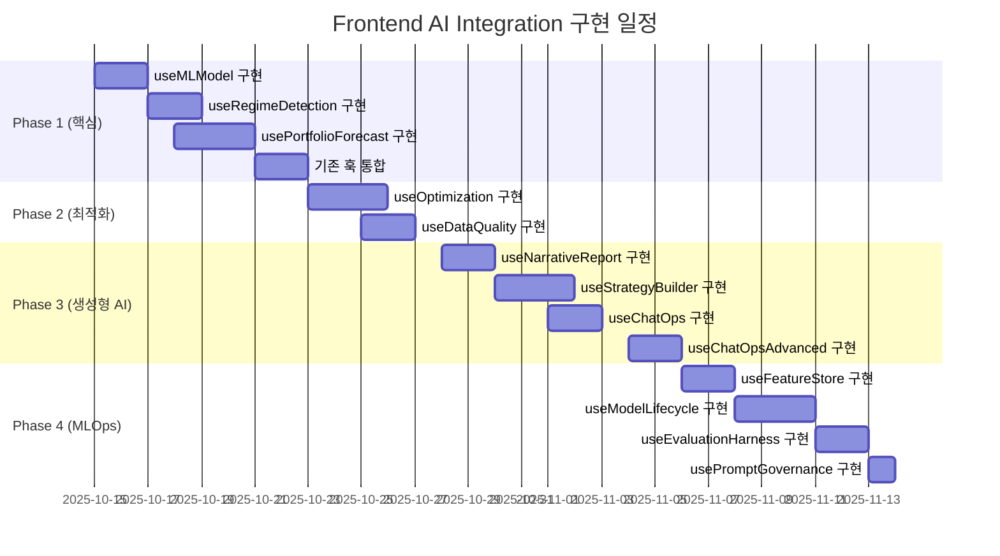

# Frontend Implementation Plan - AI Integration

> **생성일**: 2025년 10월 14일  
> **Backend 완료율**: 100% (Phase 1-4)  
> **Frontend 완료율**: 0% (착수 대기)  
> **예상 기간**: 7주 (1인 기준)

## 📊 현황 요약

### Backend API 준비 상태 ✅

| Phase    | 기능                 | API 엔드포인트 수   | 상태     | 문서                                     |
| -------- | -------------------- | ------------------- | -------- | ---------------------------------------- |
| 1        | ML 시그널 & 예측     | 8개                 | ✅ 완료  | ARCHITECTURE.md                          |
| 2        | 최적화 & 데이터 품질 | 5개                 | ✅ 완료  | PHASE2_D1_IMPLEMENTATION_REPORT.md       |
| 3        | 생성형 AI & ChatOps  | 7개                 | ✅ 완료  | PHASE3_D1/D2/D3_IMPLEMENTATION_REPORT.md |
| 4        | MLOps 플랫폼         | 12개                | ✅ 완료  | (문서 대기)                              |
| **총계** | **4개 Phase 완료**   | **32개 엔드포인트** | **100%** | **AI_INTEGRATION_USER_STORIES.md**       |

### Frontend 작업 범위

- **신규 Custom Hooks**: 13개
- **업데이트 Hooks**: 3개 (useBacktest, useStrategy, useMarketData)
- **신규 UI 컴포넌트**: 60+ 개
- **신규 페이지**: 8개

---

## 🎯 작업 우선순위

### 🔴 Phase 1: 핵심 AI 기능 (2주) - **즉시 착수**

**목표**: ML 시그널, 시장 국면, 포트폴리오 예측 UI 구축

| 순위 | 훅 이름                | 예상 공수 | API 엔드포인트                         | 컴포넌트 수 |
| ---- | ---------------------- | --------- | -------------------------------------- | ----------- |
| 1    | `useMLModel`           | 2일       | `/api/v1/ml/models/*` (5개)            | 4개         |
| 2    | `useRegimeDetection`   | 1.5일     | `/api/v1/market-data/regime/*` (2개)   | 4개         |
| 3    | `usePortfolioForecast` | 2.5일     | `/api/v1/dashboard/portfolio/forecast` | 4개         |
| 4    | 기존 훅 통합           | 2일       | N/A                                    | N/A         |

**Sprint 1 Deliverables**:

- ✅ `useMLModel` 완성 + MLModelList/Detail/Comparison/TrainingDialog
- ✅ `useRegimeDetection` 완성 + RegimeIndicator/HistoryChart/Comparison
- ✅ `usePortfolioForecast` 완성 +
  ForecastChart/ScenarioAnalysis/RiskMetricsPanel
- ✅ `useBacktest` 확장: ML 신호, 국면, 예측 데이터 통합

---

### 🟠 Phase 2: 최적화 & 모니터링 (1주) - **순차 진행**

**목표**: 백테스트 자동 최적화 + 데이터 품질 대시보드

| 순위 | 훅 이름           | 예상 공수 | API 엔드포인트                           | 컴포넌트 수 |
| ---- | ----------------- | --------- | ---------------------------------------- | ----------- |
| 5    | `useOptimization` | 2.5일     | `/api/v1/backtests/optimize/*` (4개)     | 4개         |
| 6    | `useDataQuality`  | 1.5일     | `/api/v1/dashboard/data-quality-summary` | 4개         |

**Sprint 2 Deliverables**:

- ✅ `useOptimization` 완성 +
  OptimizationWizard/Progress/TrialHistoryChart/BestParamsPanel
- ✅ `useDataQuality` 완성 + DataQualityDashboard/AlertTimeline/SeverityPieChart

---

### 🟡 Phase 3: 생성형 AI (2주) - **중간 우선순위**

**목표**: 내러티브 리포트 + 대화형 전략 빌더 + ChatOps

| 순위 | 훅 이름              | 예상 공수 | API 엔드포인트                         | 컴포넌트 수 |
| ---- | -------------------- | --------- | -------------------------------------- | ----------- |
| 7    | `useNarrativeReport` | 2일       | `/api/v1/narrative/backtests/*/report` | 5개         |
| 8    | `useStrategyBuilder` | 2.5일     | `/api/v1/strategy-builder/*` (3개)     | 5개         |
| 9    | `useChatOps`         | 1.5일     | `/api/v1/chatops`                      | 4개         |
| 10   | `useChatOpsAdvanced` | 2일       | `/api/v1/chatops-advanced/*` (4개)     | 4개         |

**Sprint 3-4 Deliverables**:

- ✅ `useNarrativeReport` 완성 + 리포트 뷰어 컴포넌트
- ✅ `useStrategyBuilder` 완성 + 대화형 전략 빌더 UI
- ✅ `useChatOps` + `useChatOpsAdvanced` 완성 + 통합 채팅 인터페이스

---

### 🟢 Phase 4: MLOps 플랫폼 (2주) - **장기 계획**

**목표**: 피처 스토어 + 모델 라이프사이클 + 평가 + 프롬프트 관리

| 순위 | 훅 이름                | 예상 공수 | API 엔드포인트                      | 컴포넌트 수 |
| ---- | ---------------------- | --------- | ----------------------------------- | ----------- |
| 11   | `useFeatureStore`      | 2일       | `/api/v1/features/*` (2개)          | 4개         |
| 12   | `useModelLifecycle`    | 2.5일     | `/api/v1/ml/*` (4개)                | 4개         |
| 13   | `useEvaluationHarness` | 1.5일     | `/api/v1/evaluation/*` (3개)        | 4개         |
| 14   | `usePromptGovernance`  | 1일       | `/api/v1/prompt-governance/*` (4개) | 4개         |

**Sprint 5-6 Deliverables**:

- ✅ `useFeatureStore` 완성 + 피처 탐색 UI
- ✅ `useModelLifecycle` 완성 + 실험 대시보드
- ✅ `useEvaluationHarness` 완성 + 평가 결과 뷰어
- ✅ `usePromptGovernance` 완성 + 프롬프트 에디터

---

## 📅 상세 타임라인 (7주)



**주요 마일스톤**:

- **M1** (2주차): Phase 1 완료 - ML 기반 백테스트 가능
- **M2** (3주차): Phase 2 완료 - 최적화 + 모니터링 가능
- **M3** (5주차): Phase 3 완료 - 생성형 AI 기능 사용 가능
- **M4** (7주차): Phase 4 완료 - 전체 MLOps 플랫폼 가동

---

## 🛠️ 기술 스택 & 의존성

### 필수 라이브러리 설치

```bash
# 차트 라이브러리
pnpm add recharts d3

# Markdown/PDF
pnpm add react-markdown jspdf

# 유틸리티
pnpm add lodash date-fns

# 타입 정의
pnpm add -D @types/lodash @types/d3
```

### 선택적 라이브러리

```bash
# WebSocket (ChatOps 실시간)
pnpm add socket.io-client

# 코드 에디터 (프롬프트 관리)
pnpm add @monaco-editor/react

# 폼 관리 (전략 빌더)
pnpm add react-hook-form @hookform/resolvers zod

# 전역 상태 (선택)
pnpm add zustand
```

---

## 📋 작업 체크리스트

### Sprint 1: Phase 1 핵심 기능 (Week 1-2)

#### Week 1: ML 모델 & 시장 국면

- [ ] OpenAPI 클라이언트 재생성 (`pnpm gen:client`)
- [ ] `useMLModel` 훅 구현
  - [ ] 모델 목록 조회 (useQuery)
  - [ ] 모델 상세 조회 (useQuery with caching)
  - [ ] 모델 비교 (useQuery with multiple keys)
  - [ ] 모델 학습 트리거 (useMutation background)
  - [ ] 모델 삭제 (useMutation with invalidation)
- [ ] `useMLModel` 컴포넌트 구현
  - [ ] MLModelList (모델 카드 그리드)
  - [ ] MLModelDetail (성능 메트릭 차트)
  - [ ] MLModelComparison (비교 테이블)
  - [ ] MLTrainingDialog (학습 폼)
- [ ] `useRegimeDetection` 훅 구현
  - [ ] 현재 국면 조회
  - [ ] 국면 히스토리 조회
  - [ ] 심볼별 국면 비교
- [ ] `useRegimeDetection` 컴포넌트 구현
  - [ ] RegimeIndicator (배지)
  - [ ] RegimeHistoryChart (시계열)
  - [ ] RegimeComparison (비교)
  - [ ] RegimeStrategyRecommendation

#### Week 2: 포트폴리오 예측 & 기존 훅 통합

- [ ] `usePortfolioForecast` 훅 구현
  - [ ] 예측 데이터 조회
  - [ ] 시나리오 분석
  - [ ] VaR, CVaR 계산
  - [ ] 예측 기간 변경
- [ ] `usePortfolioForecast` 컴포넌트 구현
  - [ ] ForecastChart (퍼센타일 밴드)
  - [ ] ScenarioAnalysis
  - [ ] RiskMetricsPanel
  - [ ] ForecastControls (슬라이더)
- [ ] 기존 훅 통합
  - [ ] `useBacktest` 확장 (ML 신호, 국면, 예측)
  - [ ] `useStrategy` 확장 (전략 빌더 연동 준비)
  - [ ] `useMarketData` 확장 (데이터 품질 정보)

---

### Sprint 2: Phase 2 최적화 (Week 3)

- [ ] `useOptimization` 훅 구현
  - [ ] 최적화 스터디 생성
  - [ ] 진행 상황 폴링
  - [ ] 트라이얼 히스토리 조회
  - [ ] 최적 파라미터 적용
- [ ] `useOptimization` 컴포넌트 구현
  - [ ] OptimizationWizard
  - [ ] OptimizationProgress
  - [ ] TrialHistoryChart
  - [ ] BestParamsPanel
- [ ] `useDataQuality` 훅 구현
  - [ ] 품질 요약 조회 (auto-refresh)
  - [ ] 최근 알림 목록
  - [ ] 심각도별 통계
- [ ] `useDataQuality` 컴포넌트 구현
  - [ ] DataQualityDashboard
  - [ ] AlertTimeline
  - [ ] SeverityPieChart
  - [ ] AnomalyDetailTable

---

### Sprint 3-4: Phase 3 생성형 AI (Week 4-5)

#### Week 4: 내러티브 리포트 & 전략 빌더

- [ ] `useNarrativeReport` 훅 구현
- [ ] `useNarrativeReport` 컴포넌트 구현 (5개)
- [ ] `useStrategyBuilder` 훅 구현
- [ ] `useStrategyBuilder` 컴포넌트 구현 (5개)

#### Week 5: ChatOps

- [ ] `useChatOps` 훅 구현
- [ ] `useChatOps` 컴포넌트 구현 (4개)
- [ ] `useChatOpsAdvanced` 훅 구현
- [ ] `useChatOpsAdvanced` 컴포넌트 구현 (4개)

---

### Sprint 5-6: Phase 4 MLOps (Week 6-7)

#### Week 6: 피처 스토어 & 모델 라이프사이클

- [ ] `useFeatureStore` 훅 구현
- [ ] `useFeatureStore` 컴포넌트 구현 (4개)
- [ ] `useModelLifecycle` 훅 구현
- [ ] `useModelLifecycle` 컴포넌트 구현 (4개)

#### Week 7: 평가 하니스 & 프롬프트 관리

- [ ] `useEvaluationHarness` 훅 구현
- [ ] `useEvaluationHarness` 컴포넌트 구현 (4개)
- [ ] `usePromptGovernance` 훅 구현
- [ ] `usePromptGovernance` 컴포넌트 구현 (4개)

---

## 🎨 UI/UX 가이드라인

### Material-UI v7 패턴

```typescript
import Grid from '@mui/material/Grid';  // Grid2 아님!
import { Box, Card, Typography } from '@mui/material';

// ✅ CORRECT - 새 Grid API
<Box sx={{ flexGrow: 1 }}>
  <Grid container spacing={2}>
    <Grid size={8}>메인 콘텐츠</Grid>
    <Grid size={4}>사이드바</Grid>
    <Grid size={{ xs: 12, md: 6 }}>반응형</Grid>
  </Grid>
</Box>
```

### TanStack Query v5 패턴

```typescript
import { useQuery, useMutation, useQueryClient } from "@tanstack/react-query";

// Query (읽기)
const { data, isLoading, error } = useQuery({
  queryKey: ["models", version],
  queryFn: async () => (await MLService.getModel({ version })).data,
  staleTime: 1000 * 60 * 5, // 5분
});

// Mutation (쓰기)
const mutation = useMutation({
  mutationFn: (data: TrainRequest) => MLService.trainModel({ body: data }),
  onSuccess: () => {
    queryClient.invalidateQueries({ queryKey: ["models"] });
    showSuccess("모델 학습이 시작되었습니다");
  },
});
```

### Snackbar 패턴

```typescript
import { useSnackbar } from "@/contexts/SnackbarContext";

const { showSuccess, showError, showInfo } = useSnackbar();

// 성공
showSuccess("데이터가 저장되었습니다");

// 에러
showError("서버 오류가 발생했습니다");

// 정보
showInfo("처리 중입니다...");
```

---

## 📊 성공 지표 (KPI)

### 기술 지표

- [ ] 모든 API 엔드포인트 연동 완료 (32/32)
- [ ] Custom Hooks 구현 완료 (13/13)
- [ ] UI 컴포넌트 구현 완료 (60+/60+)
- [ ] TypeScript 타입 에러 0개
- [ ] ESLint 경고 0개
- [ ] 단위 테스트 커버리지 80%+
- [ ] E2E 테스트 통과율 100%

### 사용자 지표

- [ ] ML 모델 조회 < 1초
- [ ] 국면 감지 < 2초
- [ ] 포트폴리오 예측 < 3초
- [ ] 최적화 진행률 실시간 업데이트 (폴링 5초)
- [ ] 리포트 생성 < 10초
- [ ] 전략 빌더 응답 < 5초
- [ ] ChatOps 응답 < 3초

### 비즈니스 지표

- [ ] ML 신호 활용 백테스트 수 > 50건/월
- [ ] 자동 최적화 실행 수 > 20건/월
- [ ] 내러티브 리포트 생성 수 > 30건/월
- [ ] 전략 빌더 사용 수 > 40건/월

---

## 🚨 리스크 & 대응

| 리스크                  | 영향 | 확률 | 대응 전략                          |
| ----------------------- | ---- | ---- | ---------------------------------- |
| API 변경                | 높음 | 낮음 | OpenAPI 클라이언트 자동 생성 유지  |
| 성능 저하 (차트 렌더링) | 중간 | 중간 | 가상화(Virtualization) + 디바운싱  |
| WebSocket 연결 불안정   | 중간 | 중간 | 폴링 폴백 + 자동 재연결            |
| LLM 응답 지연           | 낮음 | 높음 | 로딩 인디케이터 + 타임아웃 처리    |
| 복잡한 상태 관리        | 중간 | 낮음 | Zustand 전역 상태 또는 Context API |
| 테스트 커버리지 부족    | 중간 | 중간 | 테스트 주도 개발(TDD) + 자동화 CI  |

---

## 📚 참고 자료

### 내부 문서

- [AI_INTEGRATION_USER_STORIES.md](./AI_INTEGRATION_USER_STORIES.md) - 전체 유저
  스토리
- [ARCHITECTURE.md](../backend/strategy_backtest/ARCHITECTURE.md) - Backend
  아키텍처
- [PROJECT_DASHBOARD.md](../backend/ai_integration/PROJECT_DASHBOARD.md) - AI
  Integration 로드맵
- [Frontend AGENTS.md](../../frontend/AGENTS.md) - Frontend 개발 가이드

### 외부 문서

- [TanStack Query v5 Docs](https://tanstack.com/query/latest)
- [Material-UI v7 Docs](https://mui.com/material-ui/)
- [Recharts Docs](https://recharts.org/)
- [React Hook Form Docs](https://react-hook-form.com/)

---

## 🎯 다음 액션

### 즉시 착수 (오늘)

1. **OpenAPI 클라이언트 재생성**

   ```bash
   cd /Users/donghakim/quant
   pnpm gen:client
   ```

2. **필수 라이브러리 설치**

   ```bash
   cd frontend
   pnpm add recharts d3 react-markdown jspdf lodash date-fns
   pnpm add -D @types/lodash @types/d3
   ```

3. **`useMLModel` 훅 작성 시작**
   ```bash
   cd frontend/src/hooks
   touch useMLModel.ts
   code useMLModel.ts
   ```

### 내일 (D+1)

4. **MLModelList 컴포넌트 작성**

   ```bash
   mkdir frontend/src/components/ml
   touch frontend/src/components/ml/MLModelList.tsx
   ```

5. **Storybook 설정** (선택)
   ```bash
   pnpm add -D @storybook/react @storybook/addon-essentials
   ```

---

**작업 시작일**: 2025년 10월 15일 (예정)  
**완료 목표일**: 2025년 12월 3일 (7주 후)  
**담당자**: Frontend 개발팀  
**리뷰어**: Backend 개발팀 + AI Integration 리드
