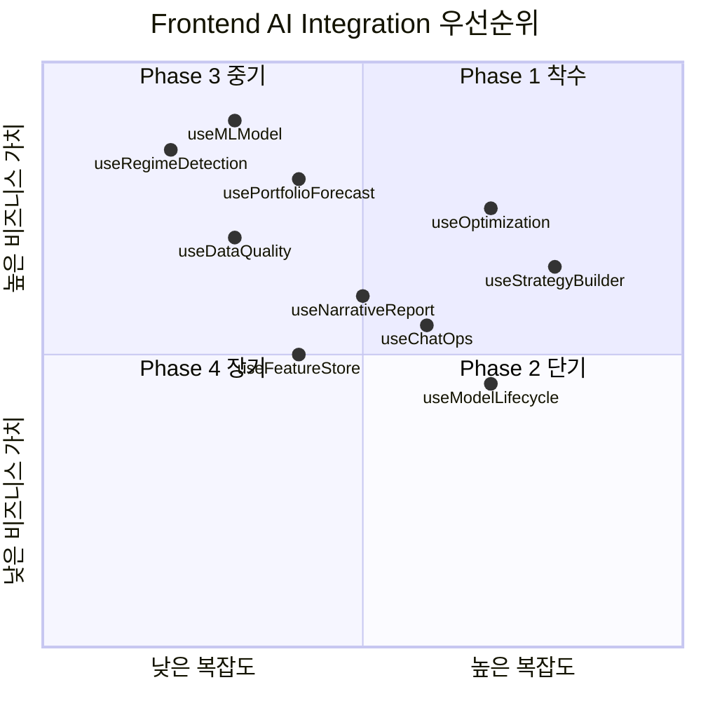
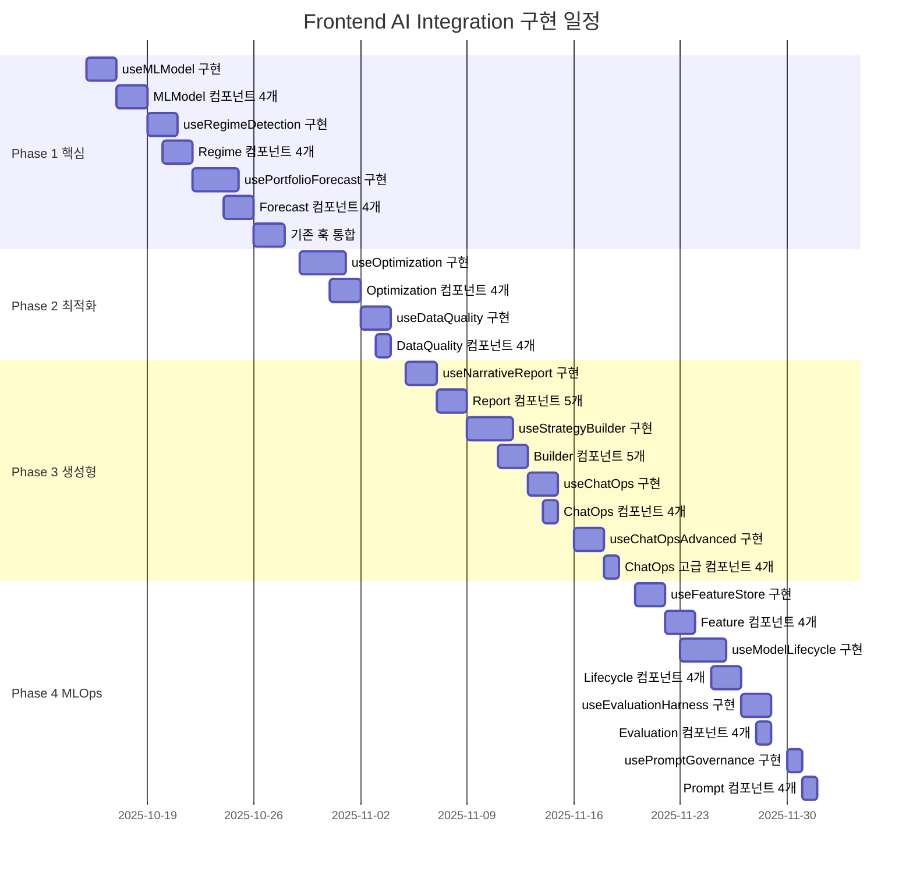

# Frontend AI Integration Master Plan

> **생성일**: 2025년 10월 14일  
> **프로그램 스폰서**: 퀀트 플랫폼 프론트엔드 리드  
> **범위**: Next.js 기반 프론트엔드에 AI Integration Backend 32개 API 연동  
> **현재 상태**: 착수 대기 (Backend 100% 완료)

---

## 📋 Executive Summary

### 프로그램 목표

백엔드에서 완료한 **AI Integration Phase 1-4** (32개 API 엔드포인트)를
프론트엔드와 연동하여, 사용자가 ML 기반 트레이딩 신호, 시장 국면 분석,
포트폴리오 예측, 자동 최적화, 데이터 품질 모니터링, AI 리포트 생성, 대화형 전략
빌더, MLOps 플랫폼을 직관적인 UI에서 사용할 수 있도록 합니다.

### 핵심 성과 지표 (KPI)

**기술 메트릭**:

- API 엔드포인트 연동: **32/32** (100%)
- Custom Hooks: **13/13** (신규 hooks)
- UI 컴포넌트: **60+/60+**
- TypeScript/ESLint 에러: **0개**
- 테스트 커버리지: **80%+**

**성능 메트릭**:

- ML 모델 목록 조회: **< 1초**
- 시장 국면 감지: **< 2초**
- 포트폴리오 예측 (90일): **< 3초**
- 최적화 진행률 폴링: **5초 간격**
- 내러티브 리포트 생성: **< 10초**

**비즈니스 메트릭**:

- ML 신호 기반 백테스트: **> 50건/월**
- 자동 최적화 실행: **> 20건/월**
- AI 리포트 생성: **> 30건/월**
- 대화형 전략 빌더 사용: **> 40건/월**

---

## 🗓️ Phase-Based Roadmap

### Phase 1: 핵심 AI 기능 (Week 1-2) 🔴 최우선

**목표**: ML 시그널, 시장 국면, 포트폴리오 예측 UI 구축

**Sprint 1 (Week 1)**:

- Day 1: OpenAPI 클라이언트 재생성 + 라이브러리 설치
- Day 2-3: `useMLModel` 훅 구현
- Day 4-5: MLModel 컴포넌트 4개 (List, Detail, Comparison, TrainingDialog)
- Day 6-7: `useRegimeDetection` 훅 + 컴포넌트 4개

**Sprint 2 (Week 2)**:

- Day 8-10: `usePortfolioForecast` 훅 + 컴포넌트 4개
- Day 11-12: 기존 훅 통합 (useBacktest ML 신호 연동)

**주요 산출물**:

- ✅ 3개 신규 Custom Hooks
- ✅ 12개 UI 컴포넌트
- ✅ 8개 API 엔드포인트 연동
- ✅ ML 시그널 페이지 (`/ml/models`)
- ✅ 시장 국면 페이지 (`/market/regime`)

---

### Phase 2: 최적화 & 모니터링 (Week 3) 🟠 높음

**목표**: 백테스트 자동 최적화 + 데이터 품질 대시보드

**Sprint 3 (Week 3)**:

- Day 13-15: `useOptimization` 훅 + 컴포넌트 4개
- Day 16-17: `useDataQuality` 훅 + 컴포넌트 4개

**주요 산출물**:

- ✅ 2개 신규 Custom Hooks
- ✅ 8개 UI 컴포넌트
- ✅ 5개 API 엔드포인트 연동
- ✅ 최적화 페이지 (`/backtests/optimize`)
- ✅ 데이터 품질 대시보드 (`/dashboard/data-quality`)

---

### Phase 3: 생성형 AI & ChatOps (Week 4-5) 🟡 중간

**목표**: 내러티브 리포트 + 대화형 전략 빌더 + ChatOps

**Sprint 4 (Week 4)**:

- Day 18-19: `useNarrativeReport` 훅 + 컴포넌트 5개
- Day 20-22: `useStrategyBuilder` 훅 + 컴포넌트 5개

**Sprint 5 (Week 5)**:

- Day 23-24: `useChatOps` 훅 + 컴포넌트 4개
- Day 25-26: `useChatOpsAdvanced` 훅 + 컴포넌트 4개

**주요 산출물**:

- ✅ 4개 신규 Custom Hooks
- ✅ 18개 UI 컴포넌트
- ✅ 7개 API 엔드포인트 연동
- ✅ AI 리포트 페이지 (`/backtests/{id}/report`)
- ✅ 전략 빌더 페이지 (`/strategy-builder`)
- ✅ ChatOps 인터페이스 (`/chatops`)

---

### Phase 4: MLOps 플랫폼 (Week 6-7) 🟢 장기

**목표**: 피처 스토어 + 모델 라이프사이클 + 평가 + 프롬프트 관리

**Sprint 6 (Week 6)**:

- Day 27-28: `useFeatureStore` 훅 + 컴포넌트 4개
- Day 29-31: `useModelLifecycle` 훅 + 컴포넌트 4개

**Sprint 7 (Week 7)**:

- Day 32-33: `useEvaluationHarness` 훅 + 컴포넌트 4개
- Day 34: `usePromptGovernance` 훅 + 컴포넌트 4개

**주요 산출물**:

- ✅ 4개 신규 Custom Hooks
- ✅ 16개 UI 컴포넌트
- ✅ 12개 API 엔드포인트 연동
- ✅ 피처 스토어 페이지 (`/features`)
- ✅ 모델 관리 페이지 (`/ml/lifecycle`)
- ✅ 평가 하니스 페이지 (`/ml/evaluation`)
- ✅ 프롬프트 관리 페이지 (`/prompts`)

---

## 📊 Backend API 준비 상태

| Phase    | 기능 영역            | API 엔드포인트 수   | Backend 상태   | Frontend 상태 | 문서                                                                                                                                     |
| -------- | -------------------- | ------------------- | -------------- | ------------- | ---------------------------------------------------------------------------------------------------------------------------------------- |
| 1        | ML 시그널 & 예측     | 8개                 | ✅ 완료 (100%) | ⏸️ 대기       | [ARCHITECTURE.md](../../backend/ai_integration/ARCHITECTURE.md)                                                                          |
| 2        | 최적화 & 데이터 품질 | 5개                 | ✅ 완료 (100%) | ⏸️ 대기       | [PHASE2_D1_IMPLEMENTATION_REPORT.md](../../backend/ai_integration/phase2_automation_and_optimization/PHASE2_D1_IMPLEMENTATION_REPORT.md) |
| 3        | 생성형 AI & ChatOps  | 7개                 | ✅ 완료 (100%) | ⏸️ 대기       | [PHASE3_D1/D2/D3_IMPLEMENTATION_REPORT.md](../../backend/ai_integration/phase3_generative_interfaces/)                                   |
| 4        | MLOps 플랫폼         | 12개                | ✅ 완료 (100%) | ⏸️ 대기       | [PHASE4_D1_IMPLEMENTATION_REPORT.md](../../backend/ai_integration/PHASE4_D1_IMPLEMENTATION_REPORT.md)                                    |
| **총계** | **4개 Phase**        | **32개 엔드포인트** | **100%**       | **0%**        | **프론트엔드 착수 대기**                                                                                                                 |

---

## 🛠️ 기술 스택 & 의존성

### 핵심 라이브러리

```bash
# 차트 & 데이터 시각화
pnpm add recharts d3

# 문서 & 리포트
pnpm add react-markdown jspdf

# 유틸리티
pnpm add lodash date-fns

# 실시간 통신 (ChatOps)
pnpm add socket.io-client

# 코드 에디터 (전략 빌더)
pnpm add @monaco-editor/react

# 폼 관리
pnpm add react-hook-form

# 상태 관리 (복잡한 UI용)
pnpm add zustand

# TypeScript 타입
pnpm add -D @types/lodash @types/d3
```

### 아키텍처 패턴

**1. Custom Hooks (필수)**:

```typescript
// ✅ CORRECT
import { useMLModel } from "@/hooks/useMLModel";
const { models, trainModel } = useMLModel();

// ❌ WRONG - 컴포넌트에서 직접 호출 금지
import { MLService } from "@/client";
const data = await MLService.getModels();
```

**2. TanStack Query v5**:

```typescript
const modelsQuery = useQuery({
  queryKey: ["ml-models", version],
  queryFn: async () => (await MLService.getModel({ version })).data,
  staleTime: 1000 * 60 * 5, // 5분
});

const trainMutation = useMutation({
  mutationFn: (config: MLTrainConfig) => MLService.trainModel({ body: config }),
  onSuccess: () => {
    queryClient.invalidateQueries({ queryKey: ["ml-models"] });
    showSuccess("모델 학습이 시작되었습니다");
  },
});
```

**3. Material-UI v7 Grid API**:

```typescript
import Grid from '@mui/material/Grid';

<Box sx={{ flexGrow: 1 }}>
  <Grid container spacing={2}>
    <Grid size={8}>메인 콘텐츠</Grid>
    <Grid size={4}>사이드바</Grid>
    <Grid size={{ xs: 12, md: 6 }}>반응형</Grid>
  </Grid>
</Box>
```

**4. Snackbar Context**:

```typescript
import { useSnackbar } from "@/contexts/SnackbarContext";
const { showSuccess, showError, showInfo } = useSnackbar();

showSuccess("백테스트가 생성되었습니다");
showError("API 호출 실패");
```

---

## 📈 리스크 관리

| 위험                            | 영향                     | 가능성 | 대응 전략                                                     |
| ------------------------------- | ------------------------ | ------ | ------------------------------------------------------------- |
| Backend API 스키마 변경         | API 연동 실패, 빌드 에러 | 중간   | `pnpm gen:client` 자동화, CI/CD에 통합, 주간 스키마 리뷰      |
| ML 모델 조회 성능 저하          | UX 지연 (> 1초)          | 낮음   | React Query staleTime 5분, DuckDB 캐시 활용, 페이지네이션     |
| WebSocket 연결 불안정 (ChatOps) | 실시간 채팅 끊김         | 중간   | 재연결 로직, 폴백 API (Long Polling), 에러 바운더리           |
| LLM 응답 지연 (리포트 생성)     | 사용자 대기 시간 증가    | 높음   | 로딩 스피너, 진행률 표시, 백그라운드 작업 큐, 타임아웃 10초   |
| 복잡한 상태 관리 (최적화 폴링)  | 메모리 누수, 상태 불일치 | 중간   | Zustand 스토어, useEffect cleanup, 폴링 중단 로직             |
| E2E 테스트 부족                 | 배포 후 버그 발견        | 높음   | Playwright 기반 critical path 테스트, 주요 유저 플로우 자동화 |

---

## 🎯 우선순위 매트릭스



---

## 📅 7주 타임라인 (Gantt Chart)



---

## 🚀 Next Actions (즉시 착수)

### Day 1: 환경 설정 (오늘)

```bash
cd /Users/donghakim/quant

# 1. OpenAPI 클라이언트 재생성
pnpm gen:client

# 2. 필수 라이브러리 설치
cd frontend
pnpm add recharts d3 react-markdown jspdf lodash date-fns
pnpm add socket.io-client @monaco-editor/react react-hook-form zustand
pnpm add -D @types/lodash @types/d3

# 3. useMLModel 훅 생성
cd src/hooks
touch useMLModel.ts

# 4. MLModel 컴포넌트 디렉토리 생성
cd ../components
mkdir -p ml-models
cd ml-models
touch MLModelList.tsx MLModelDetail.tsx MLModelComparison.tsx MLTrainingDialog.tsx
```

### Day 2-3: useMLModel 구현

```typescript
// frontend/src/hooks/useMLModel.ts
export const mlModelQueryKeys = {
  all: ["ml-models"] as const,
  lists: () => [...mlModelQueryKeys.all, "list"] as const,
  detail: (version: string) =>
    [...mlModelQueryKeys.all, "detail", version] as const,
  comparison: (metric: string) =>
    [...mlModelQueryKeys.all, "comparison", metric] as const,
};

export const useMLModel = (version?: string) => {
  const queryClient = useQueryClient();
  const { showSuccess, showError } = useSnackbar();

  // 모델 목록 조회
  const modelsQuery = useQuery({
    queryKey: mlModelQueryKeys.lists(),
    queryFn: async () => (await MLService.getModels()).data,
    staleTime: 1000 * 60 * 5,
  });

  // 모델 상세 조회
  const modelDetailQuery = useQuery({
    queryKey: mlModelQueryKeys.detail(version!),
    queryFn: async () => (await MLService.getModel({ version: version! })).data,
    enabled: !!version,
  });

  // 모델 학습
  const trainMutation = useMutation({
    mutationFn: (config: MLTrainConfig) =>
      MLService.trainModel({ body: config }),
    onSuccess: () => {
      queryClient.invalidateQueries({ queryKey: mlModelQueryKeys.lists() });
      showSuccess("모델 학습이 시작되었습니다");
    },
    onError: () => showError("모델 학습 실패"),
  });

  return {
    models: modelsQuery.data ?? [],
    modelDetail: modelDetailQuery.data,
    trainModel: trainMutation.mutate,
    isTraining: trainMutation.isPending,
    isLoading: modelsQuery.isLoading,
    error: modelsQuery.error,
  };
};
```

---

## 📚 관련 문서

- **유저 스토리**:
  [AI_INTEGRATION_USER_STORIES.md](./AI_INTEGRATION_USER_STORIES.md) (19개
  스토리)
- **구현 계획**: [IMPLEMENTATION_PLAN.md](./IMPLEMENTATION_PLAN.md) (7주 상세
  타임라인)
- **Backend 아키텍처**:
  [ARCHITECTURE.md](../../backend/ai_integration/ARCHITECTURE.md)
- **Backend 대시보드**:
  [PROJECT_DASHBOARD.md](../../backend/ai_integration/PROJECT_DASHBOARD.md)
- **Phase 1-4 구현 리포트**: [phase*\_*/](../../backend/ai_integration/)

---

## 🎉 성공 정의

### Phase 1 완료 기준

- ✅ 3개 신규 훅 (useMLModel, useRegimeDetection, usePortfolioForecast)
- ✅ 12개 UI 컴포넌트
- ✅ 8개 API 엔드포인트 연동
- ✅ ML 모델 조회 < 1초, 예측 < 3초
- ✅ TypeScript 에러 0개

### Phase 2 완료 기준

- ✅ 2개 신규 훅 (useOptimization, useDataQuality)
- ✅ 8개 UI 컴포넌트
- ✅ 5개 API 엔드포인트 연동
- ✅ 최적화 진행률 폴링 5초 간격

### Phase 3 완료 기준

- ✅ 4개 신규 훅 (useNarrativeReport, useStrategyBuilder, useChatOps,
  useChatOpsAdvanced)
- ✅ 18개 UI 컴포넌트
- ✅ 7개 API 엔드포인트 연동
- ✅ 리포트 생성 < 10초, WebSocket 안정성

### Phase 4 완료 기준

- ✅ 4개 신규 훅 (useFeatureStore, useModelLifecycle, useEvaluationHarness,
  usePromptGovernance)
- ✅ 16개 UI 컴포넌트
- ✅ 12개 API 엔드포인트 연동
- ✅ MLOps 페이지 완성

### 전체 프로그램 완료 기준

- ✅ **32/32 API 엔드포인트 연동**
- ✅ **13/13 Custom Hooks**
- ✅ **60+ UI 컴포넌트**
- ✅ **E2E 테스트 커버리지 80%+**
- ✅ **성능 KPI 달성** (ML < 1초, 예측 < 3초, 최적화 폴링 5초)
- ✅ **비즈니스 KPI 달성** (백테스트 > 50건/월, 최적화 > 20건/월)

---

**작성자**: Frontend Team  
**승인자**: 퀀트 플랫폼 프론트엔드 리드  
**다음 리뷰**: Phase 1 완료 후 (2주차 종료)
