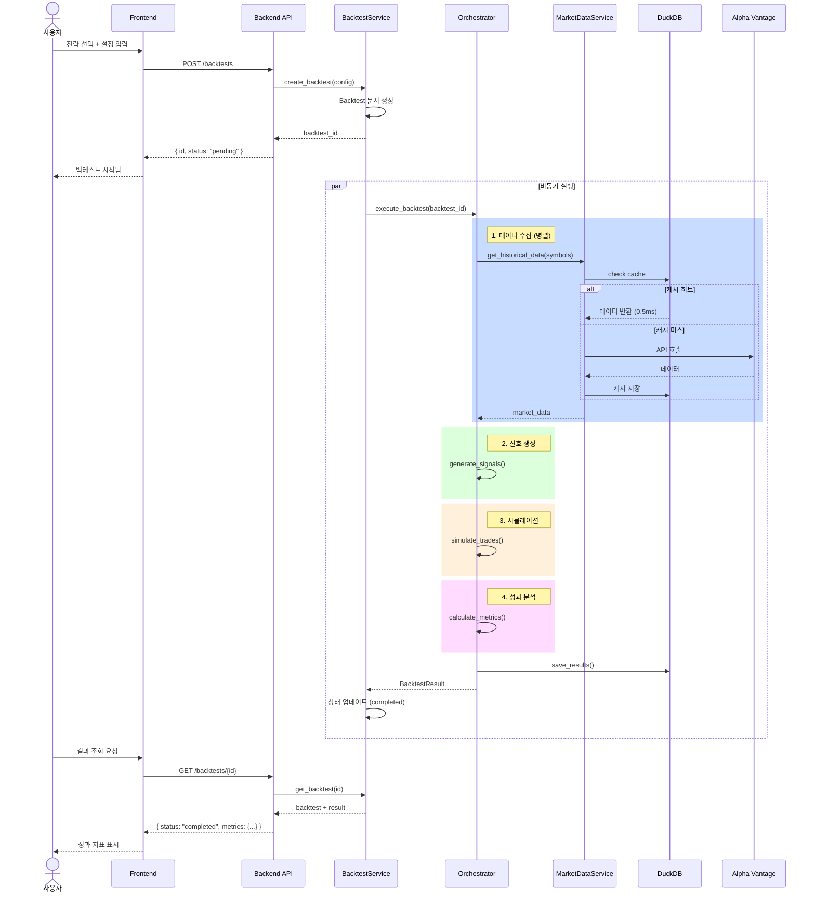
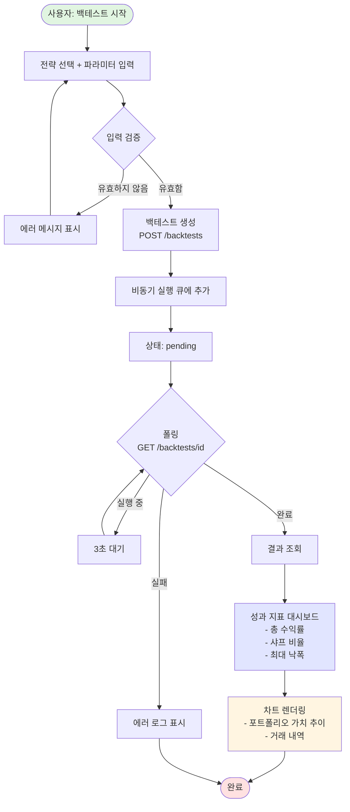
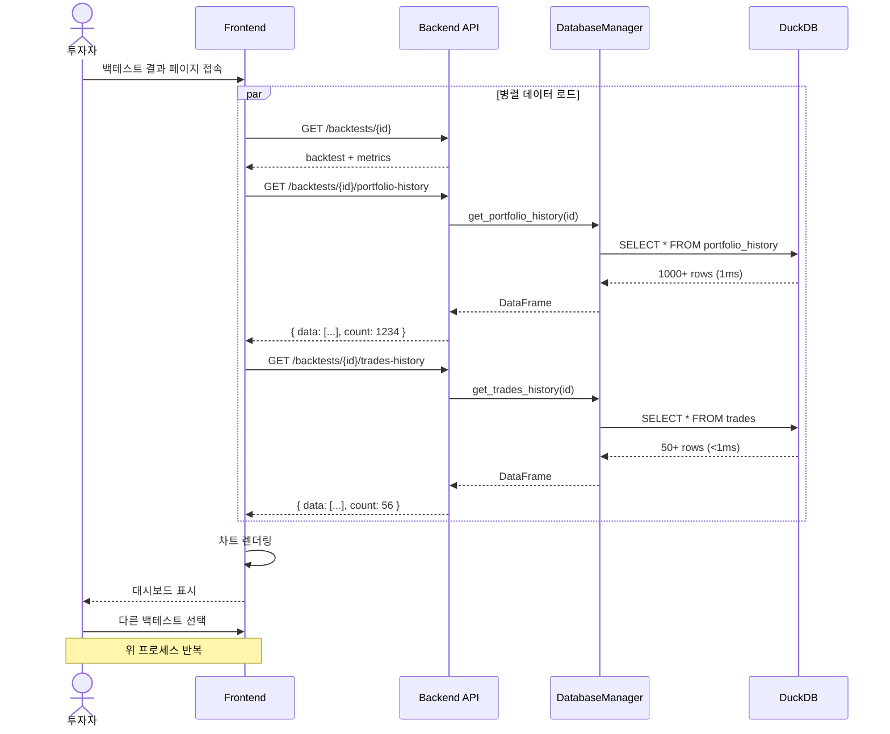
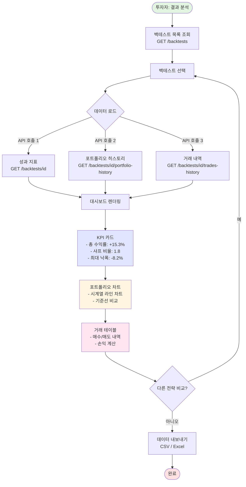
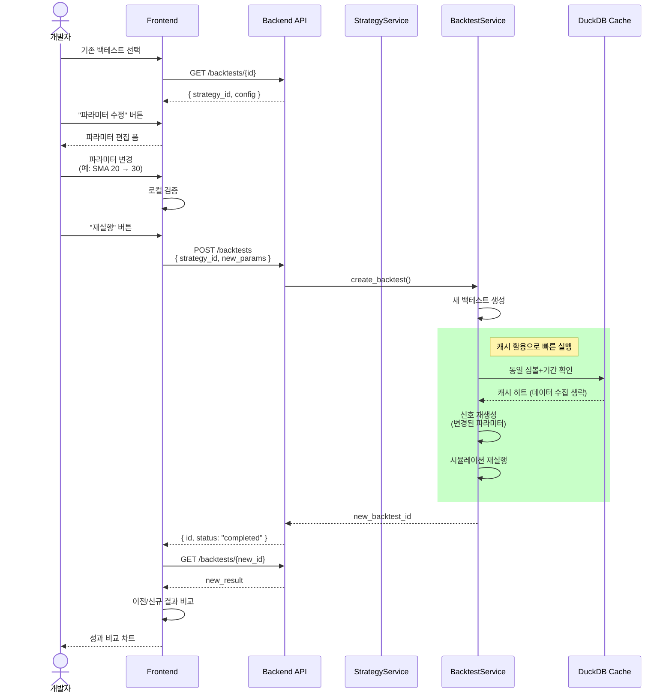
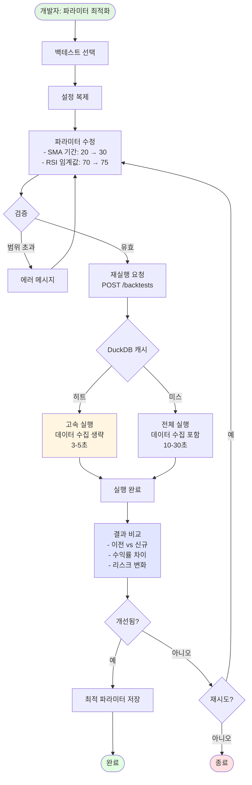
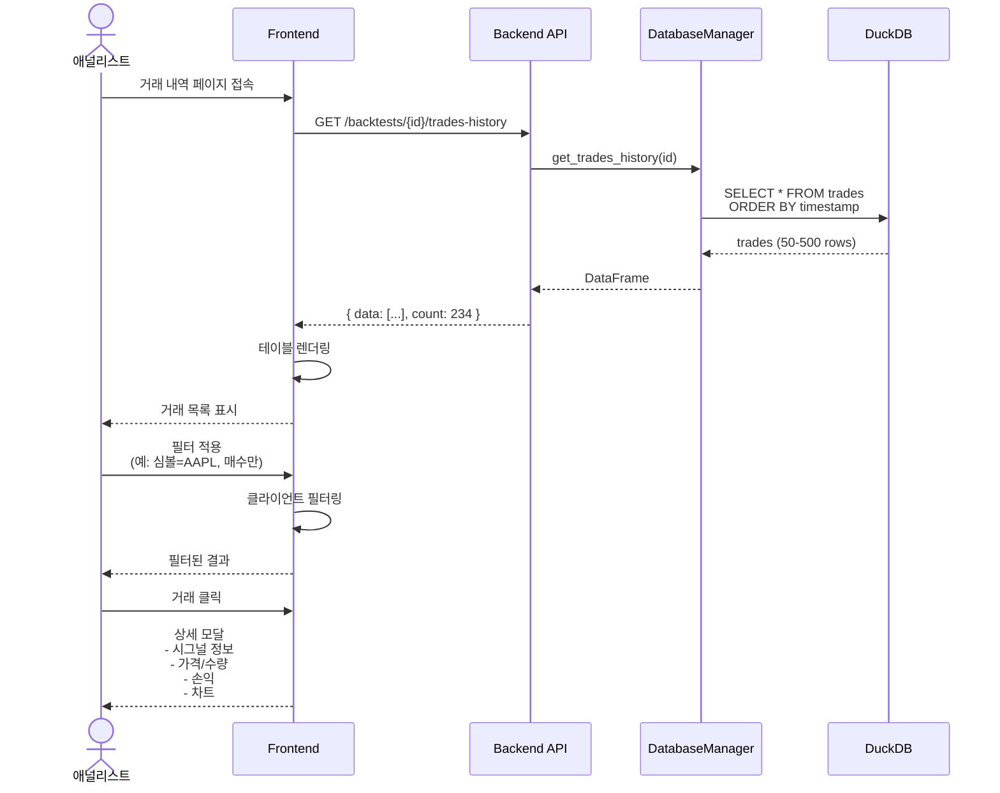
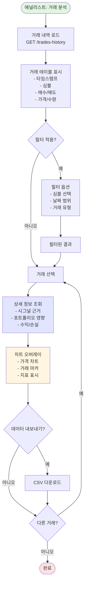

# User Stories - Strategy & Backtest System with AI Integration

> **최종 업데이트**: 2025년 10월 14일  
> **AI Integration 상태**: Phase 3 완료 (100%), Phase 4 완료 (100%)  
> **프론트엔드 구현 대상**: Phase 1-4 완료 기능

## 유저 스토리 목록

### 핵심 시나리오 (Phase 1-2 완료)

| ID   | 스토리          | 사용자        | 목표               | Phase | 우선순위 | 상태    |
| ---- | --------------- | ------------- | ------------------ | ----- | -------- | ------- |
| US-1 | 백테스트 실행   | 퀀트 트레이더 | 전략 성과 검증     | 1-2   | 높음     | ✅ 완료 |
| US-2 | 성과 분석       | 투자자        | 리스크/수익률 확인 | 1-2   | 높음     | ✅ 완료 |
| US-3 | 전략 수정       | 개발자        | 파라미터 최적화    | 1-2   | 중간     | ✅ 완료 |
| US-4 | 거래 내역 조회  | 애널리스트    | 의사결정 분석      | 1-2   | 중간     | ✅ 완료 |
| US-5 | 실시간 모니터링 | 운영자        | 시스템 상태 확인   | 1-2   | 낮음     | ✅ 완료 |

### AI Integration 시나리오 (Phase 1-4 완료)

| ID    | 스토리                 | 사용자        | 목표                        | Phase | 우선순위 | 상태    |
| ----- | ---------------------- | ------------- | --------------------------- | ----- | -------- | ------- |
| US-6  | ML 기반 신호 활용      | 퀀트 트레이더 | AI 신호로 수익률 개선       | 1     | 높음     | ✅ 완료 |
| US-7  | 시장 국면 분석         | 애널리스트    | 국면별 전략 적응            | 1     | 높음     | ✅ 완료 |
| US-8  | 포트폴리오 확률 예측   | 투자자        | 미래 수익률 분포 확인       | 1     | 높음     | ✅ 완료 |
| US-9  | 백테스트 자동 최적화   | 개발자        | 최적 파라미터 자동 탐색     | 2     | 높음     | ✅ 완료 |
| US-10 | 데이터 품질 모니터링   | 운영자        | 이상 데이터 조기 감지       | 2     | 높음     | ✅ 완료 |
| US-11 | 내러티브 리포트 생성   | 임원          | AI 기반 인사이트 요약       | 3     | 중간     | ✅ 완료 |
| US-12 | 대화형 전략 빌더       | 초보 트레이더 | 자연어로 전략 생성          | 3     | 중간     | ✅ 완료 |
| US-13 | ChatOps 시스템 점검    | 운영자        | 대화형 시스템 상태 조회     | 3     | 중간     | ✅ 완료 |
| US-14 | 멀티턴 대화 전략 상담  | 퀀트 트레이더 | 전략 비교 및 추천 받기      | 3     | 중간     | ✅ 완료 |
| US-15 | 자동 백테스트 트리거   | 개발자        | 대화 중 즉시 백테스트 실행  | 3     | 중간     | ✅ 완료 |
| US-16 | 피처 스토어 탐색       | 데이터 과학자 | ML 피처 버전 관리 및 조회   | 4     | 높음     | ✅ 완료 |
| US-17 | 모델 라이프사이클 관리 | ML 엔지니어   | 모델 실험 추적 및 배포      | 4     | 높음     | ✅ 완료 |
| US-18 | 모델 성능 평가         | ML 엔지니어   | 벤치마크 스위트로 모델 검증 | 4     | 중간     | ✅ 완료 |
| US-19 | 프롬프트 템플릿 관리   | AI 엔지니어   | LLM 프롬프트 버전 관리      | 4     | 중간     | ✅ 완료 |

---

## US-1: 백테스트 실행

### 스토리 개요

**As a** 퀀트 트레이더  
**I want to** 전략에 대한 백테스트를 실행  
**So that** 과거 데이터로 전략 성과를 검증할 수 있다

**수락 기준**:

- ✅ 전략 선택 및 설정 입력
- ✅ 백테스트 실행 시작
- ✅ 진행 상태 확인 가능
- ✅ 완료 후 결과 조회

**비즈니스 가치**: 전략 검증을 통한 투자 리스크 감소

### 시퀀스 다이어그램



### 플로우차트



---

## US-2: 성과 분석 및 비교

### 스토리 개요

**As a** 투자자  
**I want to** 여러 백테스트 결과를 비교 분석  
**So that** 최적의 전략을 선택할 수 있다

**수락 기준**:

- ✅ 포트폴리오 가치 시계열 조회
- ✅ 거래 내역 상세 조회
- ✅ 성과 지표 비교
- ✅ 차트 시각화

**비즈니스 가치**: 데이터 기반 의사결정

### 시퀀스 다이어그램



### 플로우차트



---

## US-3: 전략 파라미터 최적화

### 스토리 개요

**As a** 전략 개발자  
**I want to** 전략 파라미터를 조정하여 재실행  
**So that** 최적의 설정값을 찾을 수 있다

**수락 기준**:

- ✅ 기존 전략 복제
- ✅ 파라미터 수정
- ✅ 빠른 재실행
- ✅ 이전 결과와 비교

**비즈니스 가치**: 전략 성과 개선

### 시퀀스 다이어그램



### 플로우차트



---

## US-4: 거래 내역 상세 분석

### 스토리 개요

**As a** 애널리스트  
**I want to** 개별 거래 내역을 상세 조회  
**So that** 전략 의사결정 과정을 분석할 수 있다

**수락 기준**:

- ✅ 거래 타임라인 조회
- ✅ 매수/매도 근거 확인
- ✅ 손익 계산
- ✅ 필터링 및 정렬

**비즈니스 가치**: 전략 개선 인사이트

### 시퀀스 다이어그램



### 플로우차트



---

## 공통 기술 요소

### 프론트엔드 훅 사용 패턴

```typescript
// 백테스트 목록 조회
const { backtestList } = useBacktest();

// 백테스트 생성
const { createBacktest } = useBacktest();
await createBacktest(config);

// 백테스트 상세
const { backtest } = useBacktest(backtestId);

// 포트폴리오 히스토리
const { portfolioHistory } = useBacktest(backtestId);

// 거래 내역
const { tradesHistory } = useBacktest(backtestId);
```

### API 응답 형식

```json
{
  "status": "success",
  "data": {
    "id": "backtest_123",
    "status": "completed",
    "metrics": {
      "total_return": 0.153,
      "sharpe_ratio": 1.8,
      "max_drawdown": -0.082
    }
  },
  "source": "duckdb"
}
```

### 에러 처리

```json
{
  "status": "error",
  "error": {
    "code": "INVALID_PARAMETERS",
    "message": "SMA period must be between 1 and 200",
    "details": {
      "field": "sma_period",
      "value": 250
    }
  }
}
```
