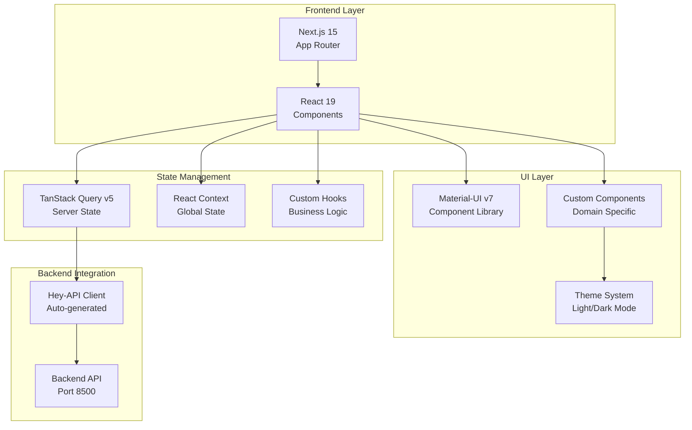
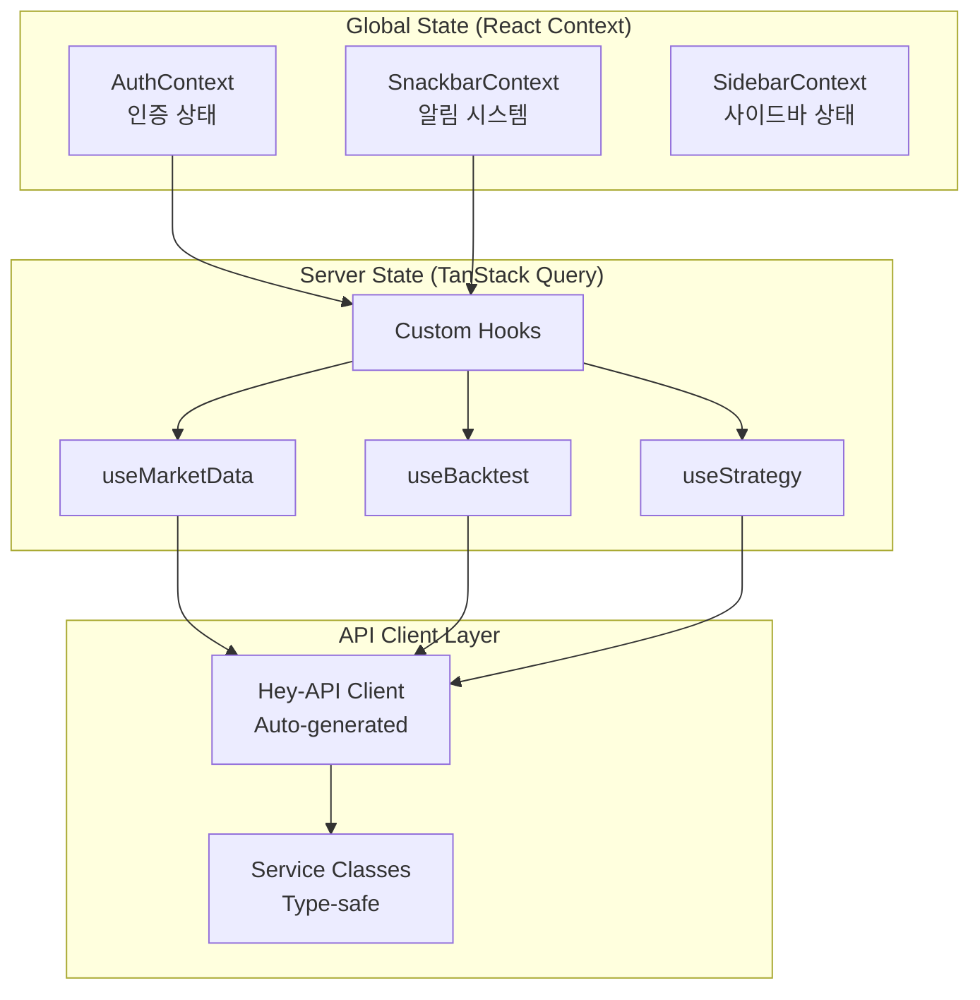
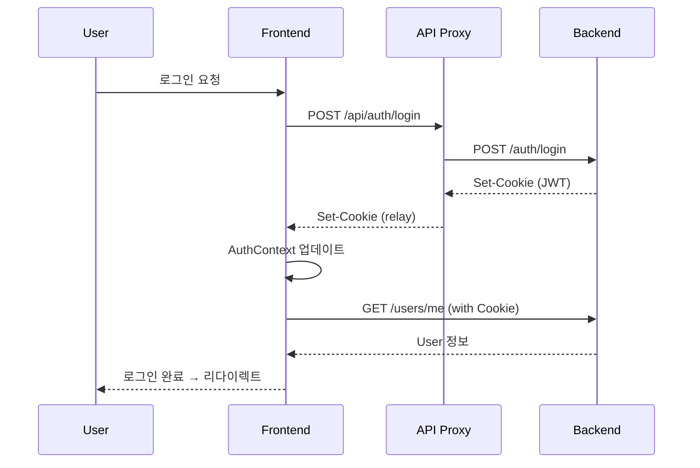

# Quant Backtest Platform - Frontend

퀀트 백테스트 플랫폼의 Next.js 15 기반 프론트엔드 애플리케이션입니다.

## 🏗️ 아키텍처 개요

### 전체 시스템 구조



### 애플리케이션 라우팅 구조

```mermaid
graph TB
    subgraph "App Router Structure"
        ROOT[/]
        AUTH["(auth)/<br/>로그인/회원가입"]
        MAIN["(main)/<br/>메인 레이아웃"]
    end

    subgraph "Main Routes"
        DASHBOARD["/dashboard<br/>대시보드"]
        MARKET["/market-data<br/>시장 데이터"]
        BACKTEST["/backtests<br/>백테스트"]
        STRATEGY["/strategies<br/>전략 관리"]
    end

    subgraph "Backtest Sub-routes"
        BT_LIST["/backtests<br/>목록"]
        BT_CREATE["/backtests/create<br/>생성"]
        BT_DETAIL["/backtests/[id]<br/>상세"]
        BT_MONITOR["/backtests/[id]/monitoring<br/>모니터링"]
    end

    ROOT --> AUTH
    ROOT --> MAIN
    MAIN --> DASHBOARD
    MAIN --> MARKET
    MAIN --> BACKTEST
    MAIN --> STRATEGY
    BACKTEST --> BT_LIST
    BACKTEST --> BT_CREATE
    BACKTEST --> BT_DETAIL
    BACKTEST --> BT_MONITOR
```

### 상태 관리 아키텍처



### 🔧 핵심 아키텍처 컴포넌트

#### TanStack Query v5

- **역할**: 서버 상태 관리 및 캐싱
- **특징**: 자동 리페칭, 낙관적 업데이트, 에러 핸들링
- **설정**: `QueryProvider`를 통한 전역 설정

#### Custom Hooks 패턴

- **역할**: 비즈니스 로직 캡슐화 및 재사용
- **패턴**: Domain별 hooks (useBacktest, useMarketData, useStrategy 등)
- **특징**: TanStack Query 통합, Snackbar 알림, 타입 안전성

#### Hey-API Client

- **역할**: Backend OpenAPI 스키마로부터 자동 생성된 타입 안전 클라이언트
- **생성 명령**: `pnpm gen:client` (scripts/generate-client.sh)
- **위치**: `src/client/` (자동 생성, 수정 금지)

#### Context API

- **AuthContext**: JWT 기반 인증, 로그인/로그아웃, 사용자 정보
- **SnackbarContext**: 전역 알림 시스템 (성공/에러/정보)
- **SidebarContext**: 사이드바 확장/축소 상태

## 📁 디렉토리 구조

```
frontend/
├── src/
│   ├── app/                        # Next.js 15 App Router
│   │   ├── (auth)/                # 인증 라우트 그룹
│   │   │   ├── sign-in/          # 로그인 페이지
│   │   │   └── sign-up/          # 회원가입 페이지
│   │   ├── (main)/                # 메인 라우트 그룹
│   │   │   ├── dashboard/        # 대시보드
│   │   │   ├── market-data/      # 시장 데이터
│   │   │   │   └── [symbol]/    # 심볼별 상세
│   │   │   ├── backtests/        # 백테스트
│   │   │   │   ├── create/      # 백테스트 생성
│   │   │   │   └── [id]/        # 백테스트 상세
│   │   │   │       └── monitoring/ # 실시간 모니터링
│   │   │   └── strategies/       # 전략 관리
│   │   ├── api/                   # API 라우트 (Auth Proxy)
│   │   │   └── auth/             # 인증 API 프록시
│   │   ├── layout.tsx            # 루트 레이아웃
│   │   └── page.tsx              # 홈페이지
│   ├── client/                    # Hey-API 자동 생성 클라이언트
│   │   ├── sdk.gen.ts            # Service 클래스들
│   │   ├── types.gen.ts          # TypeScript 타입 정의
│   │   └── client.ts             # HTTP 클라이언트 설정
│   ├── components/                # React 컴포넌트
│   │   ├── auth/                 # 인증 관련 컴포넌트
│   │   ├── backtests/            # 백테스트 컴포넌트
│   │   ├── common/               # 공통 컴포넌트
│   │   │   ├── logo.tsx         # 로고 컴포넌트
│   │   │   └── LoadingSpinner.tsx
│   │   ├── dashboard/            # 대시보드 컴포넌트
│   │   ├── layout/               # 레이아웃 컴포넌트
│   │   │   ├── Header.tsx       # 헤더
│   │   │   ├── sidebar/         # 사이드바
│   │   │   └── PageContainer.tsx
│   │   ├── market-data/          # 시장 데이터 컴포넌트
│   │   │   ├── LightWeightChart/ # 차트 라이브러리
│   │   │   └── ReactFinancialChart/
│   │   ├── providers/            # Context Providers
│   │   │   └── QueryProvider.tsx
│   │   ├── shared-theme/         # 테마 시스템
│   │   │   ├── AppTheme.tsx     # 테마 프로바이더
│   │   │   └── customizations/  # MUI 커스터마이징
│   │   └── strategies/           # 전략 컴포넌트
│   ├── contexts/                  # React Context
│   │   ├── AuthContext.tsx       # 인증 컨텍스트
│   │   ├── SnackbarContext.tsx   # 알림 컨텍스트
│   │   └── SidebarContext.ts     # 사이드바 컨텍스트
│   ├── hooks/                     # Custom React Hooks
│   │   ├── useAuth.ts            # 인증 훅
│   │   ├── useBacktest.ts        # 백테스트 훅
│   │   ├── useCrypto.ts          # 암호화폐 훅
│   │   ├── useDashboard.ts       # 대시보드 훅
│   │   ├── useDialogs/           # 다이얼로그 시스템
│   │   ├── useEconomic.ts        # 경제 지표 훅
│   │   ├── useFundamental.ts     # 재무 데이터 훅
│   │   ├── useIntelligence.ts    # 뉴스/감정 분석 훅
│   │   ├── useMarketData.ts      # 시장 데이터 훅
│   │   ├── useNotifications/     # 알림 시스템
│   │   ├── useStocks.ts          # 주식 데이터 훅
│   │   ├── useStrategy.ts        # 전략 훅
│   │   ├── useTechnicalIndicator.ts # 기술적 지표 훅
│   │   ├── useTemplates.ts       # 템플릿 훅
│   │   └── useWatchList.ts       # 관심종목 훅
│   ├── types/                     # TypeScript 타입 정의
│   ├── utils/                     # 유틸리티 함수
│   ├── middleware.ts              # Next.js 미들웨어 (Auth)
│   ├── runtimeConfig.ts           # API 클라이언트 설정
│   ├── theme.ts                   # MUI 테마 설정
│   └── openapi.json              # OpenAPI 스키마 (자동 다운로드)
├── public/                        # 정적 파일
│   └── images/                   # 이미지 리소스
├── openapi-ts.config.ts          # Hey-API 설정
├── next.config.mjs               # Next.js 설정
├── tsconfig.json                 # TypeScript 설정
├── biome.json                    # Biome 설정 (Linter/Formatter)
└── package.json                  # 패키지 설정
```

## 🚀 시작하기

### 환경 변수 설정

`.env.local` 파일 생성:

```bash
# Backend API URL
NEXT_PUBLIC_API_BASE_URL=http://localhost:8500

# 기타 환경 변수 (필요시)
# NEXT_PUBLIC_FEATURE_FLAG_XXX=true
```

### 개발 서버 실행

```bash
# 프론트엔드 개발 서버 실행 (포트 3000)
pnpm frontend

# 또는 직접 실행
cd frontend && pnpm dev

# 백엔드와 함께 실행 (권장)
pnpm run:dev  # 루트에서 실행 (frontend + backend 동시 실행)
```

### API 클라이언트 생성

**Backend OpenAPI 스키마 변경 시 반드시 실행:**

```bash
# 루트 디렉토리에서 실행
pnpm gen:client

# 또는 스크립트 직접 실행
./scripts/generate-client.sh

# 자동으로 수행되는 작업:
# 1. Backend에서 openapi.json 다운로드 (http://localhost:8500/openapi.json)
# 2. frontend/src/openapi.json 저장
# 3. Hey-API를 통한 TypeScript 클라이언트 생성
# 4. frontend/src/client/ 디렉토리에 파일 생성
```

## 📋 개발 가이드

### 1. 새로운 페이지 추가

```bash
# 1. 라우트 디렉토리 생성
mkdir -p src/app/(main)/new-page

# 2. page.tsx 생성
# src/app/(main)/new-page/page.tsx

# 3. 필요시 layout.tsx 생성 (공통 레이아웃)
# src/app/(main)/new-page/layout.tsx
```

### 2. Custom Hook 작성 패턴

```typescript
// src/hooks/useExample.ts
import { ExampleService } from "@/client";
import { useSnackbar } from "@/contexts/SnackbarContext";
import { useMutation, useQuery, useQueryClient } from "@tanstack/react-query";

export const exampleQueryKeys = {
  all: ["example"] as const,
  lists: () => [...exampleQueryKeys.all, "list"] as const,
  list: (filters: string) =>
    [...exampleQueryKeys.lists(), { filters }] as const,
  details: () => [...exampleQueryKeys.all, "detail"] as const,
  detail: (id: string) => [...exampleQueryKeys.details(), id] as const,
};

export function useExample() {
  const queryClient = useQueryClient();
  const { showSuccess, showError } = useSnackbar();

  // Query: 데이터 조회
  const exampleListQuery = useQuery({
    queryKey: exampleQueryKeys.lists(),
    queryFn: async () => {
      const response = await ExampleService.getExamples();
      return response.data;
    },
    staleTime: 1000 * 60 * 5, // 5분
    gcTime: 30 * 60 * 1000, // 30분
  });

  // Mutation: 데이터 생성
  const createMutation = useMutation({
    mutationFn: async (data: ExampleCreate) => {
      const response = await ExampleService.createExample({ body: data });
      return response.data;
    },
    onSuccess: () => {
      queryClient.invalidateQueries({ queryKey: exampleQueryKeys.lists() });
      showSuccess("생성되었습니다.");
    },
    onError: (error) => {
      showError(`생성 실패: ${error.message}`);
    },
  });

  return {
    // Queries
    exampleList: exampleListQuery.data,
    isLoading: exampleListQuery.isLoading,
    isError: exampleListQuery.isError,
    refetch: exampleListQuery.refetch,

    // Mutations
    createExample: createMutation.mutateAsync,
    isCreating: createMutation.isPending,
  };
}
```

### 3. Context 사용 패턴

```typescript
// Context 사용
import { useAuth } from '@/contexts/AuthContext';

function MyComponent() {
  const { user, login, logout, isAuthenticated } = useAuth();

  return (
    <div>
      {isAuthenticated ? (
        <p>Welcome, {user?.username}</p>
      ) : (
        <button onClick={() => login(credentials)}>Login</button>
      )}
    </div>
  );
}
```

### 4. Snackbar 알림 사용

```typescript
import { useSnackbar } from '@/contexts/SnackbarContext';

function MyComponent() {
  const { showSuccess, showError, showInfo, showWarning } = useSnackbar();

  const handleAction = async () => {
    try {
      await someApiCall();
      showSuccess("작업이 완료되었습니다.");
    } catch (error) {
      showError("작업 실패: " + error.message);
    }
  };

  return <button onClick={handleAction}>실행</button>;
}
```

### 5. Material-UI 테마 커스터마이징

```typescript
// src/components/shared-theme/customizations/inputs.tsx
// MUI 컴포넌트별 커스터마이징 파일 수정

export const inputsCustomizations = {
  MuiButton: {
    styleOverrides: {
      root: {
        // 버튼 스타일 커스터마이징
      },
    },
  },
  // 다른 컴포넌트들...
};
```

## 🎨 UI/UX 패턴

### 레이아웃 구조

- **RootLayout**: 전역 Provider (Query, Auth, Snackbar, Theme)
- **MainLayout**: 사이드바 + 헤더 레이아웃 (authenticated pages)
- **PageContainer**: 페이지별 공통 컨테이너 (패딩, 스크롤)

### 차트 컴포넌트

- **LightWeightChart**: 경량 차트 (실시간 데이터)
- **ReactFinancialChart**: 고급 금융 차트 (기술적 분석 도구 포함)

### 다이얼로그 시스템

- **useDialogs**: 전역 다이얼로그 관리 (Confirm, Alert, Custom)
- **CreateWatchlistDialog**: 관심종목 생성
- **WatchlistEditDialog**: 관심종목 편집 (심볼 검색 포함)

## 🛠️ 개발 도구

### 코드 품질

```bash
# Biome 린트 체크
pnpm lint

# Biome 자동 수정
pnpm lint:fix

# Biome 포맷팅
pnpm format
```

### 빌드 및 배포

```bash
# 프로덕션 빌드
pnpm build

# 프로덕션 서버 실행
pnpm start

# 타입 체크
pnpm type-check  # 또는 tsc --noEmit
```

## 🔐 인증 시스템

### 인증 플로우



### 미들웨어 보호

- `src/middleware.ts`: JWT 기반 라우트 보호
- 보호된 라우트: `/(main)/*` (인증 필요)
- 공개 라우트: `/(auth)/*`, `/api/*`

## 📊 상태 관리 전략

### Server State (TanStack Query)

- **목적**: Backend API 데이터 캐싱 및 동기화
- **Query**: 데이터 조회 (자동 리페칭, 캐싱)
- **Mutation**: 데이터 변경 (낙관적 업데이트)
- **캐시 전략**: staleTime 5분, gcTime 30분 (기본값)

### Client State (React Context)

- **AuthContext**: 인증 상태 (로그인, 사용자 정보)
- **SnackbarContext**: 전역 알림 (성공/에러 메시지)
- **SidebarContext**: UI 상태 (사이드바 확장/축소)

### Local State (useState/useReducer)

- **목적**: 컴포넌트 내부 상태 관리
- **사용 예**: 폼 입력, 모달 열기/닫기, 탭 선택 등

## 🧪 테스트 전략

### 테스트 레벨

- **Unit Tests**: 유틸리티 함수, Custom Hooks
- **Integration Tests**: API 통합, Context 동작
- **E2E Tests**: 주요 사용자 플로우

### 테스트 도구 (향후 추가 예정)

- **Vitest**: 단위 테스트
- **React Testing Library**: 컴포넌트 테스트
- **Playwright**: E2E 테스트

## 📦 주요 패키지

### Core Dependencies

- **next**: `^15.0.0` - Next.js 프레임워크 (App Router)
- **react**: `^19.0.0` - React 라이브러리
- **@tanstack/react-query**: `^5.90.2` - 서버 상태 관리
- **@mui/material**: `latest` - Material-UI 컴포넌트 라이브러리
- **@hey-api/openapi-ts**: API 클라이언트 자동 생성

### Chart Libraries

- **lightweight-charts**: `^5.0.8` - TradingView 차트
- **react-financial-charts**: `^2.0.1` - 고급 금융 차트
- **@mui/x-charts**: `^8.12.0` - MUI 차트 컴포넌트

### Dev Dependencies

- **@biomejs/biome**: `2.2.0` - Linter & Formatter
- **typescript**: `latest` - TypeScript 컴파일러

## 🔗 관련 문서

- [Backend README](../backend/README.md) - 백엔드 API 문서
- [Backend AGENTS.md](../backend/AGENTS.md) - AI Agent 백엔드 가이드
- [Frontend AGENTS.md](./AGENTS.md) - AI Agent 프론트엔드 가이드
- [AUTH_FLOW.md](../AUTH_FLOW.md) - 인증 시스템 상세 문서

## 🐛 디버깅 팁

### API 클라이언트 문제

```bash
# OpenAPI 스키마 확인
curl http://localhost:8500/openapi.json | jq

# 클라이언트 재생성
pnpm gen:client

# 생성된 파일 확인
ls -la src/client/
```

### TanStack Query DevTools

```typescript
// QueryProvider.tsx에 DevTools 추가 (개발 모드)
import { ReactQueryDevtools } from '@tanstack/react-query-devtools';

// ...
<ReactQueryDevtools initialIsOpen={false} />
```

### 인증 문제

```bash
# 쿠키 확인 (브라우저 개발자 도구)
# Application → Cookies → http://localhost:3000

# Backend 연결 확인
curl -i http://localhost:8500/health
```

## 🎯 베스트 프랙티스

### 1. Custom Hook 우선 사용

- ❌ **나쁜 예**: 컴포넌트에서 직접 API 호출
- ✅ **좋은 예**: Custom Hook을 통한 API 호출

```typescript
// ❌ 나쁜 예
import { BacktestService } from "@/client";
import { useQuery } from "@tanstack/react-query";

function MyComponent() {
  const { data } = useQuery({
    queryKey: ["backtests"],
    queryFn: () => BacktestService.getBacktests(),
  });
}

// ✅ 좋은 예
import { useBacktest } from "@/hooks/useBacktest";

function MyComponent() {
  const { backtestList, isLoading } = useBacktest();
}
```

### 2. Snackbar를 통한 사용자 피드백

- ❌ **나쁜 예**: console.log 또는 alert 사용
- ✅ **좋은 예**: useSnackbar Hook 사용

```typescript
// ❌ 나쁜 예
const handleDelete = async () => {
  try {
    await deleteBacktest(id);
    alert("삭제되었습니다.");
  } catch (error) {
    console.error(error);
  }
};

// ✅ 좋은 예
const handleDelete = async () => {
  try {
    await deleteBacktest(id);
    showSuccess("삭제되었습니다.");
  } catch (error) {
    showError(`삭제 실패: ${error.message}`);
  }
};
```

### 3. TypeScript 타입 안전성

- ❌ **나쁜 예**: `any` 타입 사용
- ✅ **좋은 예**: 자동 생성된 타입 또는 명시적 타입 정의

```typescript
// ❌ 나쁜 예
const handleSubmit = (data: any) => {
  // ...
};

// ✅ 좋은 예
import type { BacktestCreate } from "@/client";

const handleSubmit = (data: BacktestCreate) => {
  // ...
};
```

### 4. 컴포넌트 분리

- 단일 파일 500줄 이하 유지
- 재사용 가능한 로직은 Custom Hook으로 분리
- 공통 UI는 `components/common/`으로 분리

### 5. 에러 바운더리 사용 (향후 추가)

```typescript
// 컴포넌트 레벨 에러 처리
import { ErrorBoundary } from '@/components/common/ErrorBoundary';

<ErrorBoundary fallback={<ErrorFallback />}>
  <MyComponent />
</ErrorBoundary>
```

## 🚨 주의사항

### 1. API 클라이언트 수정 금지

- `src/client/` 디렉토리의 파일들은 자동 생성됨
- 수동으로 수정하지 말 것 (재생성 시 덮어쓰여짐)
- 커스터마이징이 필요하면 `runtimeConfig.ts` 또는 Wrapper Hook 생성

### 2. Backend 포트 변경 시

```bash
# .env.local 업데이트
NEXT_PUBLIC_API_BASE_URL=http://localhost:NEW_PORT

# runtimeConfig.ts 기본값 업데이트 (필요시)
```

### 3. React 19 변경 사항

- `React.FC` 사용 지양 (children prop 자동 제공 안됨)
- `use()` Hook 사용 (async context 처리)
- PropTypes 사용 지양 (TypeScript 사용 권장)

### 4. Next.js 15 변경 사항

- **params는 Promise**: `const params = await React.use(props.params);`
- **searchParams는 Promise**:
  `const searchParams = await React.use(props.searchParams);`
- **reactStrictMode=false**: react-financial-charts 호환성

### 5. Material-UI v7 주의사항

- `@mui/material-nextjs` 필수 (`AppRouterCacheProvider`)
- `InitColorSchemeScript` 필수 (SSR 테마 플리커 방지)

## 📈 성능 최적화

### 1. TanStack Query 캐싱

- **staleTime**: 데이터가 신선한 상태로 유지되는 시간 (기본 5분)
- **gcTime**: 캐시가 메모리에 유지되는 시간 (기본 30분)
- **refetchOnWindowFocus**: 윈도우 포커스 시 자동 리페칭 (기본 true)

### 2. Next.js 최적화

- **Dynamic Import**: 큰 컴포넌트는 지연 로딩
- **Image Optimization**: `next/image` 사용
- **Font Optimization**: `next/font` 사용

### 3. 번들 크기 최적화

- **Tree Shaking**: Hey-API `exportFromIndex: true` 설정
- **Code Splitting**: 라우트별 자동 분할
- **Lazy Loading**: 차트 라이브러리 등 지연 로딩

## 🔄 업데이트 로그

### Latest Changes

- **2025-01-XX**: Next.js 15 & React 19 마이그레이션
- **2025-01-XX**: TanStack Query v5 업그레이드
- **2025-01-XX**: Hey-API 기반 클라이언트 전환
- **2025-01-XX**: Material-UI v7 업그레이드
- **2025-01-XX**: Custom Hooks 리팩토링 (useBacktest, useMarketData 등)

## 📞 문의 및 지원

- **Issues**: GitHub Issues를 통한 버그 리포트
- **Discussions**: 기능 제안 및 논의
- **Documentation**: 루트 디렉토리 `docs/` 참조
