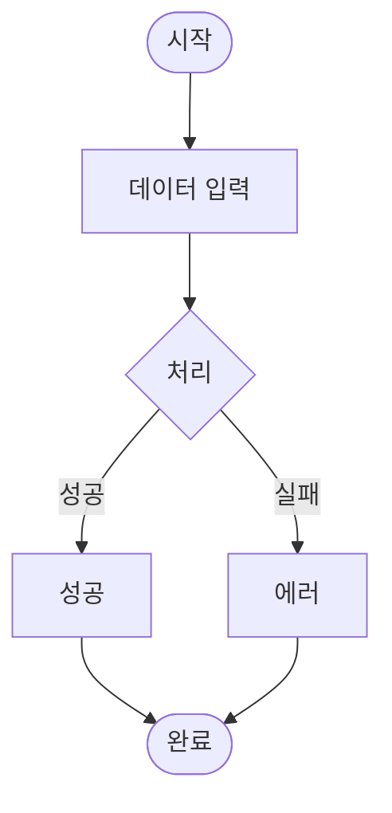
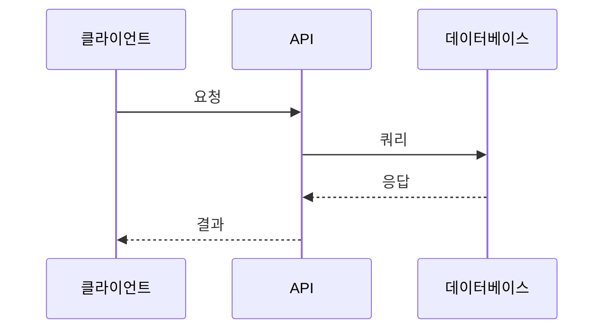

# Mermaid Test

## 간단한 다이어그램 테스트

```mermaid
graph LR
    A[시작] --> B[처리]
    B --> C[완료]
```

## 복잡한 다이어그램 테스트

```mermaid
flowchart TD
    Start([시작]) --> Input[데이터 입력]
    Input --> Process{처리}
    Process -->|성공| Success[성공]
    Process -->|실패| Error[에러]
    Success --> End([완료])
    Error --> End
```

## 시퀀스 다이어그램

```mermaid
sequenceDiagram
    participant A as 클라이언트
    participant B as API
    participant C as 데이터베이스

    A->>B: 요청
    B->>C: 쿼리
    C-->>B: 응답
    B-->>A: 결과
```
